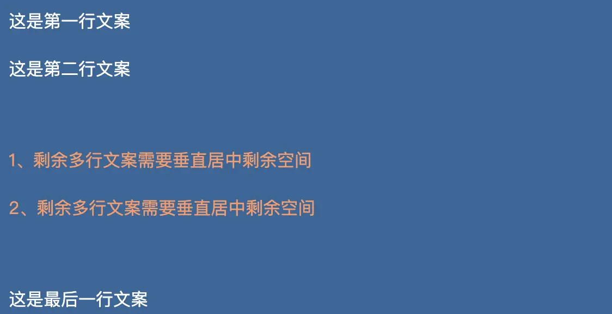
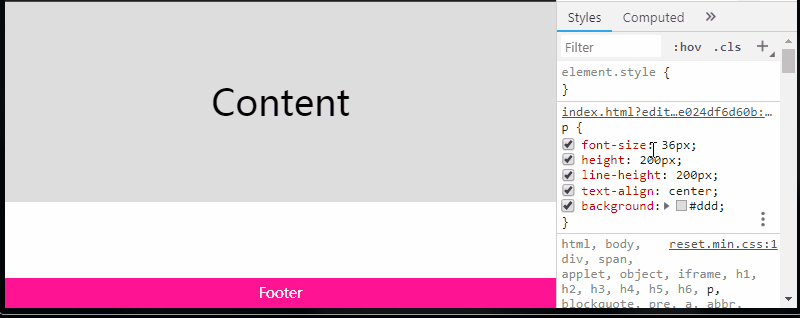

# 探秘 flex

## flex 上下文中神奇的自动 margin

为了引出本文的主题，先看看这个问题，最快水平垂直居中一个元素的方法是什么？

>水平垂直居中也算是 CSS 领域最为常见的一个问题了，不同场景下的方法也各不相同，各有优劣。嗯，下面这种应该算是最便捷的了：

```html
<div class="g-container">
    <div class="g-box"></div>
</div>
```

```css
.g-container {
    display: flex;
}

.g-box {
    margin: auto;
}
```

>上面的 display: flex 替换成 display: inline-flex | grid | inline-grid 也是可以的。

## 如何让 margin: auto 在垂直方向上居中元素

嗯。这里其实就涉及了一个问题，如何让 margin: auto 在垂直方向上生效？

换句话说，传统的 display: block  BFC（块格式化上下文）下，为什么 margin: auto 在水平方向可以居中元素在垂直方向却不行？

通常我们会使用这段代码：

```css
div {
    width: 200px;
    height: 200px;
    margin: 0 auto;
}
```

让元素相对父元素水平居中。但是如果我们想让元素相对父元素垂直居中的话，使用 margin: auto 0 是不生效的。

### BFC 下 margin: auto 垂直方向无法居中元素的原因

在块格式化上下文中，如果 margin-left 和 margin-right 都是 auto，则它们的表达值相等，从而导致元素的水平居中。( 这里的计算值为元素剩余可用剩余空间的一半)

而如果 margin-top 和 margin-bottom 都是 auto，则他们的值都为 0，当然也就无法造成垂直方向上的居中。

### 使用 FFC/GFC 使 margin: auto 在垂直方向上居中元素

OK，这里要使单个元素使用 margin: auto 在垂直方向上能够居中元素，需要让该元素处于 FFC(flex formatting context)，或者 GFC(grid formatting context) 上下文中，也就是这些取值中：

```css
{
    display: flex;
    display: inline-flex;
    display: grid;
    display: inline-grid;
}
```

### FFC 下 margin: auto 垂直方向可以居中元素的原因

本文暂且不谈 grid 布局，我们业务中需求中更多的可能是使用 flex 布局，下文将着重围绕 flex 上下文中自动 margin 的一些表现。

>嗯，也有很多前端被戏称为 flex 工程师，什么布局都 flex 一把梭。

flex 格式化上下文中，设置了 margin: auto 的元素，在通过 justify-content 和 align-self 进行对齐之前，任何正处于空闲的空间都会分配到该方向的自动 margin 中去

这里，很重要的一点是，margin auto 的生效不仅是水平方向，垂直方向也会自动去分配这个剩余空间。

## 使用自动 margin 实现 flex 布局下的 space-between | space-around

了解了上面最核心的这一句 : 

* <b>在通过 justify-content 和 align-self 进行对齐之前，任何正处于空闲的空间都会分配到该维度中的自动 margin 中去</b>

之后，我们就可以在 flex 布局下使用自动 margin 模拟实现 flex 布局下的 space-between 以及 space-around 了。

### 自动 margin 实现 space-around

对于这样一个 flex 布局：

```html
<ul class="g-flex">
    <li>liA</li>
    <li>liB</li>
    <li>liC</li>
    <li>liD</li>
    <li>liE</li>
</ul>
```

如果它的 CSS 代码是：

```css
.g-flex {
    display: flex;
    justify-content: space-around;
}

li { ... }
```

那么下面的 CSS 代码与上面的效果是完全等同的：

```css
.g-flex {
    display: flex;
    // justify-content: space-around;
}

li { 
    margin: auto;
}
```

### 自动 margin 实现 space-between

同理，使用自动 margin，也很容易实现 flex 下的 space-between，下面两份 CSS 代码的效果的一样的：

```css
.g-flex {
    display: flex;
    justify-content: space-between;
}

li {...}
```

```css
.g-flex {
    display: flex;
    // justify-content: space-between;
}

li {
    margin: auto;
}

li:first-child {
    margin-left: 0;
}

li:last-child {
    margin-right: 0;
}
```

当然，值得注意的是，很重要的一点：

如果任意方向上的可用空间分配给了该方向的自动 margin ，则对齐属性（justify-content/align-self）在该维度中不起作用，因为 margin 将在排布后窃取该纬度方向剩余的所有可用空间。

也就是使用了自动 margin 的 flex 子项目，它们父元素设置的 justify-content 已经它们本身的 align-self 将不再生效，也就是这里存在一个优先级的关系。

## 使用自动 margin 实现 flex 下的 align-self: flex-start | flex-end | center

自动 margin 能实现水平方向的控制，也能实现垂直方向的控制，原理是一样的。

用 margin: auto 模拟 flex 下的 align-self: flex-start | flex-end | center

```html
<ul class="g-flex">
    <li>liA</li>
    <li>liB</li>
    <li>liC</li>
    <li>liD</li>
    <li>liE</li>
</ul>
```

margin auto 实现 flex 下的 align-self: center
```css
.g-flex {
    height: 200px;
    box-sizing: border-box;
    background: #037d65;
    
    display: flex;
    // justify-content: space-around;
}

li {
    // align-self: center;
    width: 100px;
    text-align: center;
    font-size: 18px;
    color: #fff;
    
    margin: auto;
}

li:nth-child(1) {
    height: 100px;
    background: #336699;
}

li:nth-child(2) {
    height: 120px;
    background: #669933;
}

li:nth-child(3) {
    height: 140px;
    background: #996633;
}

li:nth-child(4) {
    height: 160px;
    background: #229955;
}

li:nth-child(5) {
    height: 180px;
    background: #199652;
}
```

margin auto 实现 flex 下的 align-self: flex-end
```css
.g-flex {
    height: 200px;
    box-sizing: border-box;
    background: #037d65;
    
    display: flex;
    // display: flex-inline;
    // justify-content: space-around;
}

li {
    // align-self: center;
    width: 100px;
    text-align: center;
    font-size: 18px;
    color: #fff;
    
    margin: auto;
    margin-bottom: 0;
    margin-top: auto;
}

li:nth-child(1) {
    height: 100px;
    background: #336699;
}

li:nth-child(2) {
    height: 120px;
    background: #669933;
}

li:nth-child(3) {
    height: 140px;
    background: #996633;
}

li:nth-child(4) {
    height: 160px;
    background: #229955;
}

li:nth-child(5) {
    height: 180px;
    background: #199652;
}
```

## 不同方向上的自动 margin

OK，看完上面的一大段铺垫之后，大概已经初步了解了 FFC 下，自动 margin 的神奇。

无论是多个方向的自动 margin，抑或是单方向的自动 margin，都是非常有用的。

再来看几个有意思的例子：

### 使用 margin-left: auto 实现不规则两端对齐布局


DOM 结构如下：

```html
<ul class="g-nav">
    <li>导航A</li>
    <li>导航B</li>
    <li>导航C</li>
    <li>导航D</li>
    <li class="g-login">登陆</li>
</ul>
```

对最后一个元素使用 margin-left: auto，可以很容易实现这个布局：

```css
.g-nav {
    display: flex;
}

.g-login {
    margin-left: auto;
}
```

此时， auto 的计算值就是水平方向上容器排列所有 li 之后的剩余空间。

当然，不一定是要运用在第一个或者最后一个元素之上，例如这样的布局，也是完全一样的实现：


```html
<ul class="g-nav">
    <li>导航A</li>
    <li>导航B</li>
    <li>导航C</li>
    <li>导航D</li>
    <li class="g-login">登陆</li>
    <li>注册</li>
</ul>
```

```css
.g-nav {
    display: flex;
}

.g-login {
    margin-left: auto;
}
```


### 垂直方向上的多行居中

OK，又或者，我们经常会有这样的需求，一大段复杂的布局中的某一块，高度或者宽度不固定，需要相对于它所在的剩余空间居中：



这里有 5 行文案，我们需要其中的第三、第四行相对于剩余空间进行垂直居中。

这里如果使用 flex 布局，简单的 align-self 或者 align-items 好像都没法快速解决问题。

而使用自动 margin，我们只需要在需要垂直居中的第一个元素上进行 margin-top: auto，最后一个元素上进行 margin-bottom: auto 即可，看看代码示意：

```html
<div class="g-container">
    <p>这是第一行文案</p>
    <p>这是第二行文案</p>
    <p class="s-thirf">1、剩余多行文案需要垂直居中剩余空间</p>
    <p class="s-forth">2、剩余多行文案需要垂直居中剩余空间</p>
    <p>这是最后一行文案</p>
</div>
```

```css
.g-container {
    display: flex;
    flex-wrap: wrap;
    flex-direction: column;
}

.s-thirf {
    margin-top: auto;
}

.s-forth {
    margin-bottom: auto;
}
```

## 使用 margin-top: auto 实现粘性 footer 布局

OK，最后再来看这样一个例子。

要求：页面存在一个 footer 页脚部分，如果整个页面的内容高度小于视窗的高度，则 footer 固定在视窗底部，如果整个页面的内容高度大于视窗的高度，则 footer 正常流排布（也就是需要滚动到底部才能看到 footer），算是粘性布局的一种。

看看效果:



嗯，这个需求如果能够使用 flex 的话，使用 justify-content: space-between 可以很好的解决，同理使用 margin-top: auto 也非常容易完成：


```html
<div class="g-container">
    <div class="g-real-box">
        ...
    </div>
    <div class="g-footer"></div>
</div>
```

```css
.g-container {
    height: 100vh;
    display: flex;
    flex-direction: column;
}

.g-footer {
    margin-top: auto;
    flex-shrink: 0;
    height: 30px;
    background: deeppink;
}
```

上面的例子旨在介绍更多自动 margin 的使用场景。当然，这里不使用 flex 布局也是可以实现的，下面再给出一种不借助 flex 布局的实现方式：

```html
<div class="g-container">
    <div class="g-real-box">
        <p>Sticky Footer</p>
    </div>
</div>
<div class="g-footer"></div>
```

```css
html,
body {
    width: 100%;
    height: 100%;
}

.g-container {
    width: 100%;
    min-height: 100%;
    margin-bottom: -30px;
}

.g-real-box {
    padding-bottom: 30px;
}

.g-footer {
    height: 30px;
    background: deeppink;
}

p {
    line-height: 200px;
    text-align: center;
    background: #ddd;
}
```

## 值得注意的点

自动 margin 还是很实用的，可以使用的场景也很多，有一些上面提到的点还需要再强调下：

* <b>块格式化上下文</b> 中margin-top 和 margin-bottom 的值如果是 auto，则他们的值都为 0

* <b>flex 格式化上下文</b>中，在通过 justify-content 和 align-self 进行对齐之前，任何正处于空闲的空间都会分配到该方向的自动 margin 中去

* 单个方向上的自动 margin 也非常有用，它的计算值为该方向上的剩余空间

* 使用了自动 margin 的 flex 子项目，它们父元素设置的 justify-content 以及它们本身的 align-self 将不再生效

