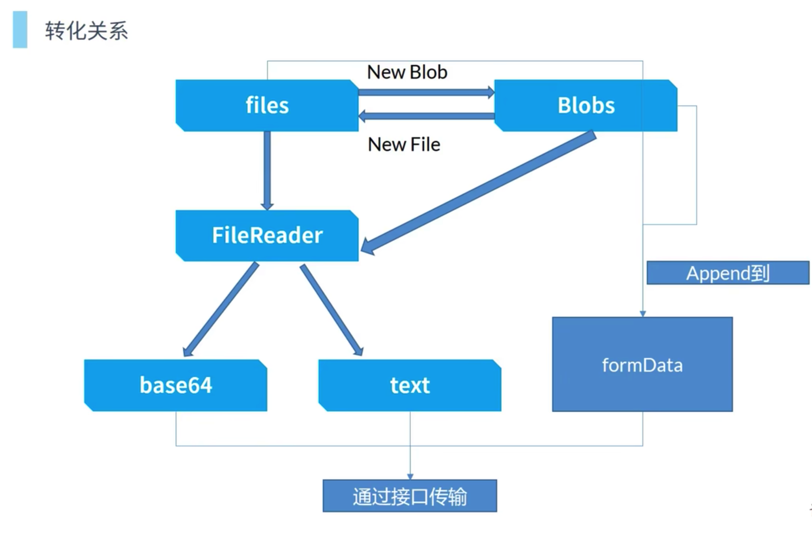
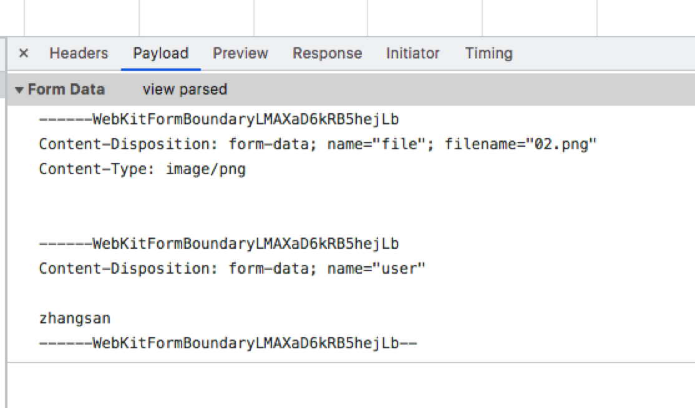

# 1.前端文件上传与文件相关操作

## 1.1.两种传输方式

### 1.1.1.二进制blob传输

formData 传输

### 1.1.2.base64传输

转为 base64 传输

## 1.2.相关对象

files 和 blob 是前端把一个文件读取成二进制的形式

### 1.2.1.fles

通过 input 标签读出的文件对象

files 是 blob 的一个子类（files有的方法blob都有）

files 是 File 的实例化

```js
// files 转化成 blob
const _blob = new Blob([file]);
```

### 1.2.2.blob

不可变的二进制内容，包含很多操作方法

```js
// blob 切割
const _blob = new Blob([file]);
const _sliceBlob = _blob.slice(0, 5000);
const _sliceFile = new File([_sliceBlob], 'test.png'); 
```

### 1.2.3.formData

用于和后端传输的对象

### 1.2.4.fileReader

多用与把文件读取为某种形式，如base64，text文本

做文件预览，缩略图（图片预览）

```js
const fr = new FileReader()
// 读成 text
fr.readAsText()
// 读成 base64
fr.readAsDataURL()
```

### 1.2.5.这几个api的转换关系



## 1.2.文件截取

```js
const fileChange = (e) => {
  console.log('e', e.target.files[0]);
  const file = e.target.files[0];
  if (e.size > 10 * 24 * 24) {
    ElMessage.warn('文件不能大于10M');
    return
  }
  // if (e.type !== 'video/mp4') {
  //   ElMessage.warn('文件只能是mp4');
  //   return
  // }
  const _blob = new Blob([file]);
  const _sliceBlob = _blob.slice(0, 5000);
  const _sliceFile = new File([_sliceBlob], 'test.png'); 
  const fr = new FileReader();
  fr.readAsDataURL(_sliceFile);
  fr.onload = function () {
    console.log(fr.result);
  }
}
```

## 1.3.文件上传

```vue
<script setup>
import {
  ref,
} from 'vue';
import axios from 'axios';
import { ElMessage } from 'element-plus';

let base64 = ref('');
let fileobj = {};

const fileChange = (e) => {
  console.log('e', e.target.files[0]);
  const file = e.target.files[0];
 
  if (e.size > 10 * 24 * 24) {
    ElMessage.warn('文件不能大于10M');
    return
  }
  // if (e.type !== 'video/mp4') {
  //   ElMessage.warn('文件只能是mp4');
  //   return
  // }
  fileobj = file;
}

const submit = (e) => {
  console.log('e', e);
  const fd = new FormData();
  fd.append('file', fileobj);
  fd.append('user', 'zhangsan');
  axios.post('**', fd);
}

</script>

<template>
<div>
  <!-- 默认参数是 query， 可以指定为 formdata -->
  <!-- <form action="" method="post" enctype="multipart/form-data"></form> -->
  <input type="file" name="file" @change="fileChange($event)">
  <button @click="submit">提交</button>

</div>
</template>
```

```js
Content-Type: multipart/form-data; boundary=----WebKitFormBoundaryoDAypvjde1oEHRNJ
```

boundary 告诉文件的分割线是啥



## 1.4.多文件上传

```js
const fileChange = (e) => {
  多文件上传
  console.log('e', e.target.files);
  const files = e.target.files;
  for (const val of files) {
     imgsList.push(val);
  }
}

const submit = async (e) => {
  console.log('e', e);
  const fd = new FormData();
  // 多文件上传是循环上传？？？
  imgsList.forEach(file => {
     // fd.append('files', file);
     fd.append(file.name, file)
     await axios.post('**', fd);
  });

  // imgsList.forEach(file => {
  //    fd.append('files', file);
  // });
  // axios.post('**', fd);
}
```

## 1.2.切片上传

```js
const submit = async (e) => {
  // 切片上传
  const size = 2 * 1024 * 1024; // 2M
  const fileSize = fileobj.size;
  let current = 0;
  while (current < fileSize) {
    const fd = new FormData();
    fd.append('file', fileobj.slice(current, current + size));
    await axios.post('http:localhost:4000/upload', fd)
    pre.value = Math.min(Math.ceil(current / fileSize * 100), 100) + '%' ;
    current += size;
  }
}
```

* 前片上传的文档
https://blog.csdn.net/weixin_43805705/article/details/128282914

## 1.3.断点续传

  前端记住上传的位置

* https://zhuanlan.zhihu.com/p/97768916
