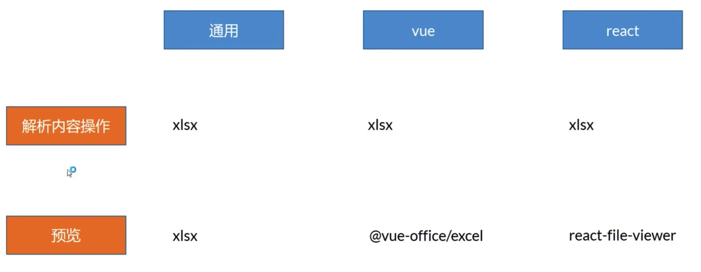
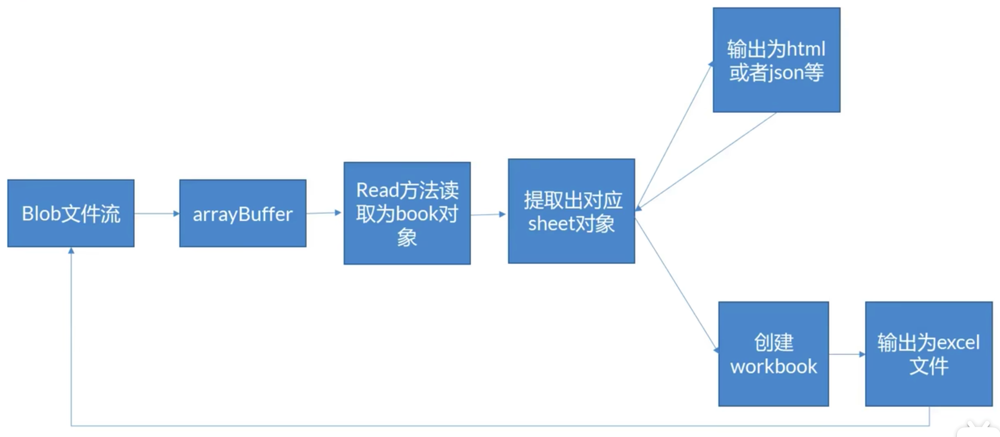
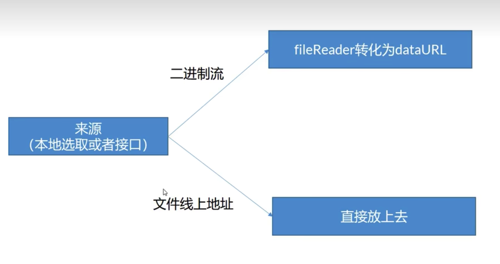
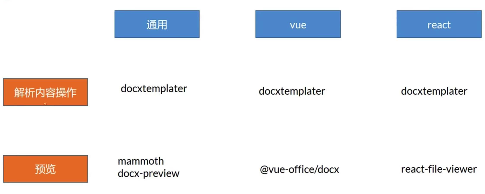
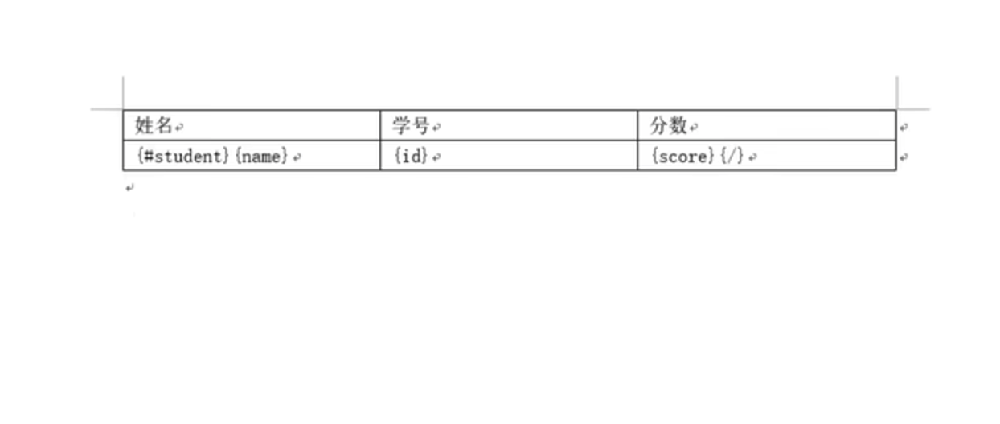

# 3.前端玩转excel,word操作指南

## 3.1.excel



## 3.1.1.xlsx

## 3.1.1.xlsx产物转化示意



## 3.1.1.xlsx使用

```js
import { read, writeFile, utils } from 'xlsx';
// 获取本地文件
const change = e => {
  const file = e.target.files[0];
  file.arrayBuffer().then(res => {
    const wb = read(res); // workbook
    const sheet1 = wb.Sheets.sheet1;
    // 获取数据
    const _data = utils.sheet_to_json(sheet1);
    // console.log('_data', _data);
    // 预览  获得 html string
    excelHtml.value = utils.sheet_to_html(sheet1);
    console.log('excelHtml', excelHtml);
  })

  // 转化为 base64 预览
  const fr = new FileReader()
  fr.readAsDataURL(file);
  fr.onload = function() {
    excelSrc.value = fr.result;
  }
}
```

```js
// 从接口获取数据
const getStudentSourceRequest = async () => {
  const data = await getStudentSource();
  data.arrayBuffer().then(res => {
    console.log('res', res);
    const wb = read(res); // workbook
    const sheet1 = wb.Sheets.sheet1;
    // utils.sheet_to_html
    const _data = utils.sheet_to_json(sheet1);
    console.log('_data', _data);
    excelHtml.value = utils.sheet_to_html(sheet1);
    console.log('excelHtml', excelHtml);
  })
}
```

* table dom 和 数据转化为 excel

```js
// 生成excel并下载
const createExcel = () => {
  const data = [
    {
      name: 'zs', id: 100, score: 99,
    },
    {
      name: 'ls', id: 200, score: 99,
    },
    {
      name: 'ww', id: 300, score: 99,
    }
  ];
  // 转化 data 数组
  const ws = utils.json_to_sheet(data);
  const wb = utils.book_new();
  utils.book_append_sheet(wb, ws, 'sheet1');
  writeFile(wb, 'test.xlsx');

  // 转化 table dom
  // 直接转换
  // const tableWb = utils.table_to_book(tableExcel.value);
  const tableWs = utils.table_to_sheet(tableExcel.value);
  const wb2 = utils.book_new(tableExcel.value);
  utils.book_append_sheet(wb2, tableWs, 'sheet1');
  writeFile(wb2, 'test2.xlsx');
}
```

## 3.1.2.@vue-office/excel预览



```jsx
import vueOfficeExcel from '@vue-office/excel';
import '@vue-office/excel/lib/index.css';
const change = (e) => {
  const file = e.target.files[0];
  // 转化为 base64 预览
  const fr = new FileReader()
  fr.readAsDataURL(file);
  fr.onload = function() {
    excelSrc.value = fr.result;
  }
}
<vue-office-excel :src="excelSrc" style="height: 500px;width: 90%;"></vue-office-excel>

```

## 3.2.word



### 3.2.1.使用的包

* 预览
  @vue-office/docx 和 docx-preview
* 保存文件
  file-saver
* 压缩
  pizzip
* 渲染 docx 模板
  Docxtemplater

### 3.2.2.docxtemplater



```jsx
<script setup>
import {
  reactive,
  ref,
  onMounted,
  onUpdated,
  watch,
  watchEffect,
  computed,
  defineProps,
  provide,
} from 'vue';
import VueOfficeDocx from '@vue-office/docx';
import Docxtemplater from 'docxtemplater';
import { renderAsync } from 'docx-preview';
import { saveAs } from 'file-saver';
import Pizzip from 'pizzip';

const wordPath = ref(null);
const docxPreview = ref(null);

const change = e => {
  const file = e.target.files[0];

  /**
   * 预览
   */
  // 预览第一种
  // 转化为 base64 预览
  const fr = new FileReader()
  fr.readAsDataURL(file);
  fr.onload = function() {
    wordPath.value = fr.result;
  }

  // 预览第二种
  // blob arrayBuffer
  renderAsync(file, docxPreview.value);
}

const templateRenderChange = (e) => {
  const file = e.target.files[0];
  const data = [
    {
      name: 'zs', id: 100, score: 99,
    },
    {
      name: 'ls', id: 200, score: 99,
    },
    {
      name: 'ww', id: 300, score: 99,
    }
  ];
  file.arrayBuffer().then(res => {
    const zip = new Pizzip(res);
    const doc = new Docxtemplater(zip);
    doc.setData(data);
    doc.render();
    const out = doc.getZip().generate({
      type: 'blob',
      // 二进制文档的类型
      mimeType: 'application/vnd.openxmlformats-officedocument.wordprocessingml.document',
    })
    saveAs(out, 'test.docx')
  })
}

</script>
<template>
  <div>上传 docx</div>
  <input type="file" @change="change($event)">
  <VueOfficeDocx :src="wordPath" />
  <div ref="docxPreview"></div>

  <div>点击上传模板渲染展示数据</div>
  <input type="file" @click="templateRenderChange($event)" name="" id="">
</template>
```


* 使用js实现纯前端读取和导出文件参考文件

https://www.cnblogs.com/liuxianan/p/js-excel.html#%E8%87%AA%E5%B7%B1%E6%89%8B%E5%86%99%E4%BB%A3%E7%A0%81%E7%94%9F%E6%88%90
