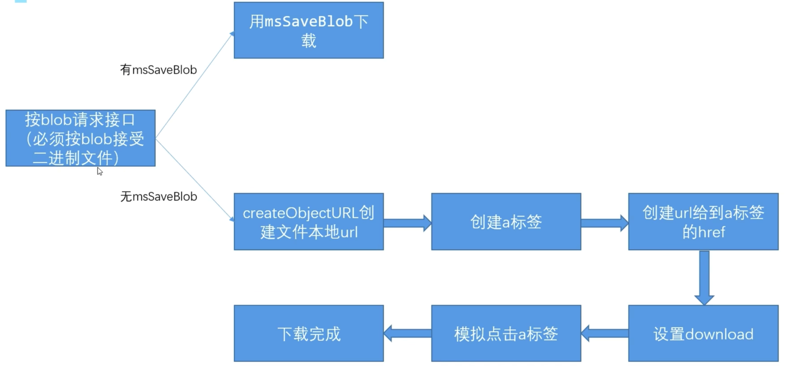

# 4.前端接收后端文件指南

## 4.1.下载文件的三种方式

### 4.1.1.直接打开下载地址

无法命名，只适合 get 直接返回 blob 的接口

```js
const express = require('express');
const app = express();
app.use((req, res, next) => {
    res.header({
	ctx.set('Access-Control-Allow-Origin', '*');
    	ctx.set('Access-Control-Allow-Methods', 'POST, GET, PUT, DELETE, OPTIONS');
    	ctx.set('Access-Control-Allow-Headers', 'Content-Type');
    });
    next();
});

app.get('/download', (req, res) => {
    res.sendFile(__dirname + '.iframe.pptx');
});

app.listen(3003, () => {
    consloe.log('running');
})


```

### 4.1.2.利用a标签download

比较合适的方案

```js
// 不指定 responseType 为 blob 打印就是 二进制文件
const  download = async () => {
  return new Promise(reslove => {
    $http.post('/downloadExecl', {}, {responseType: 'blob'}).then(res => {
      console.log(res);
      if (window.navigator.msSaveBlob) {
        // 兼容 ie type 太长了 ie 想看 ie 里打印看一下，没ie浏览器
        window.navigator.msSaveBlob(res.data, 
          {type: ''},
          'test.xlsx',
        )
      } else {
        const blobUrl = window.URL.createObjectURL(res.data);
        console.log(blobUrl);
        const link = document.createElement('a');
        link.href = blobUrl;
        link.download = 'test.xlsx';
        link.style.display = 'none';
        link.click();
        window.URL.revokeObjectURL(blobUrl);
        // link.remove();
      }
      // reslove(res);
    })
  })
}
```

### 4.1.3.filefile-saver

现成的库，方便简单

## 4.2.几个重要的概念

1. createObjectURL — 把 blob 对象的内存地址，以 url 形式给出
2. msSaveBlob — IE不支持 a 标签下载，用的 msSaveBlob 方案
3. a 标签的 download 属性 — 表面该 a 标签的行为是下载，并说明文件名

## 4.3.流程总结


