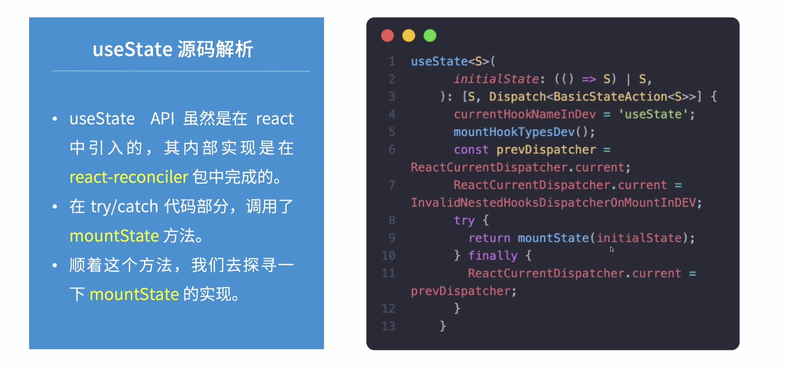
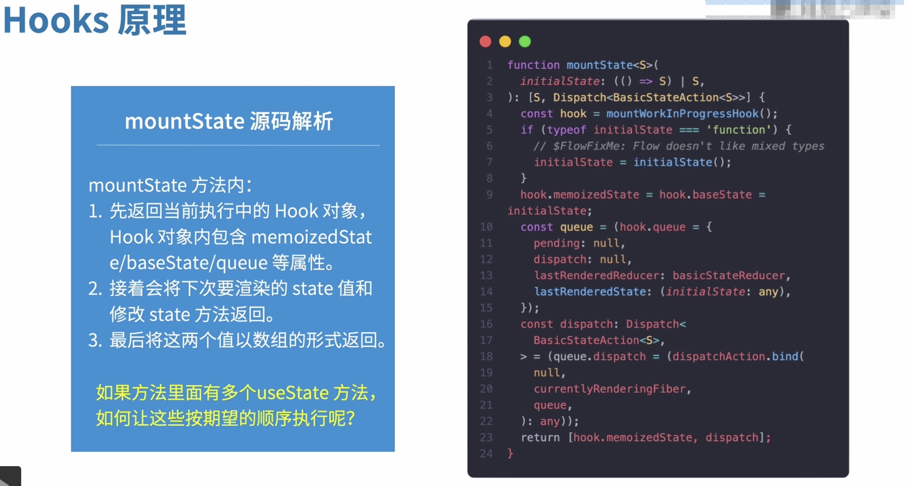
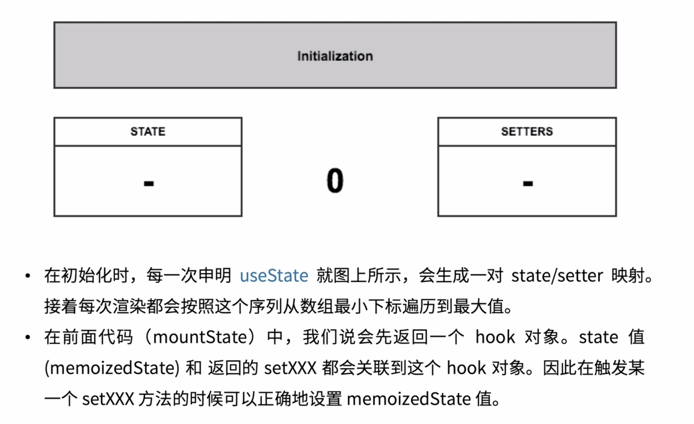
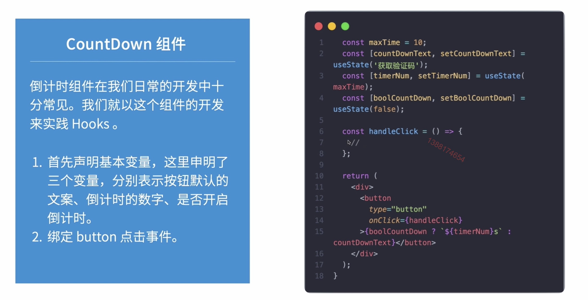
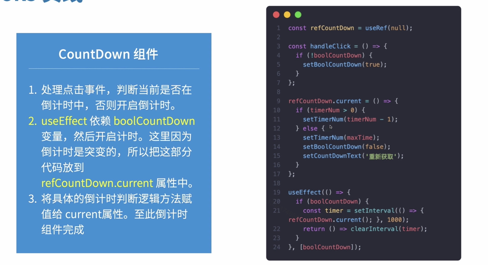

# 6.4-React Hooks

## Hooks 使命

### 逻辑组件的复用

1. 逻辑和 UI 分离

react 官方推荐在开发中将逻辑部分与视图部分解耦，便于定位问题和职责清晰

2. 函数组件拥有 state

在函数组件中如果要实现类似拥有 state 的状态，必须要将组件转换成 class 组件

3. 逻辑组件复用

社区一直致力于逻辑层面的复用，像 render props / HOC， 都有对应的问题。 Hooks 是目前相对完美的解决方式

### Hooks 解决什么问题

1. render props

* 通过渲染props来实现逻辑组件复用
* Avator 组件是一个渲染头像的组件，里面包含其中一些业务逻辑，User 组件是纯 UI 组件展示用户名称
* render props 通过嵌套组件实现，在真实业务中，会出现嵌套多层，以及梳理 props 不清的问题

```js
export default function App() {
  return (
    <div className="App">
      <Avator name="11">
        {name => <User name={name} />}
      </Avator>
    </div>
  )
}
```

2. HOC 高阶组件

通过对现有组件进行扩展，增强的方式来实现组件的复用，通常采用包裹的方式来实现。

高阶组件的实现会额外的增加元素层级，是的页面元素的数量更加臃肿。

```js
class Avator extends Component {
  render() {
    return <div>{this.props.name}</div>
  }
}
function HocAvator(Component) {
  return () => <Component name="zs" />
}
export default HocAvator(Avator);
```

3. Hooks 解决了什么功能

Hooks

* React 16.8 引入的Hooks，使得实现相同功能而代码量更少成为现实
* 通过使用 Hooks， 不仅在硬编码层面减少代码的数量，同样在编译之后代码量更少

```js
import React, { useState } from 'react';

export function HooksAvator() {
  const [name, setName] = useState('zs');
  return <>{name}</>
}
```


## Hooks 原理

No magic, just arrays

### Hooks demo

这是一个非常简单的展示 Hooks 的 API的使用，创建了 name 和 setName。 在页面上展示 name， 按钮的点击事件修改 name

```js
import React, { useState } from 'react';
improt { render } from 'react-dom';

function App() {
  const [name, getName] = useState('zs');
  return (
    <div>
      <div>{name}</div>
      <button type="button"
              onClick={() => setName('hooks 原理')}>
        修改
      </button>
    </div>
  )
}
```

### useState源码解析







## Hooks 应用

### Hooks 官方常用 API

* useState 

函数组件中的 state 方法

* useEffect

函数组件处理副作用的方法，比如发送异步的请求，订阅原生的事件，setinterval...

和 componentDidMount 相似，但是 componentDidMount 只执行一遍

useEffect 依赖的数据变化还会执行

* useReducer

另一种 useState, 跟 redux 有点类似

* useRef

todo ???

返回突变的 ref 对象，对象在组件的生命周期内一直存在

* useCustom

自定义 Hooks 组件

## Hooks 实践





倒计时 timer 怎么清除的； useRef 是干啥的
