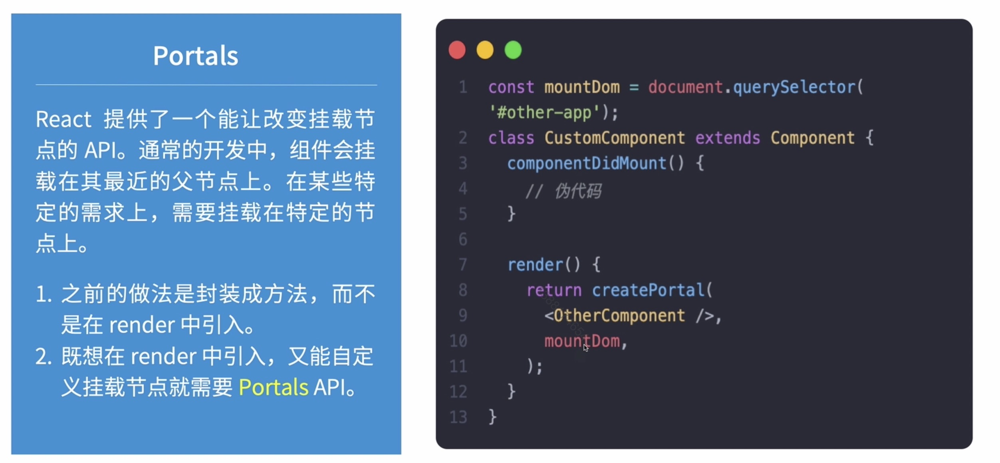
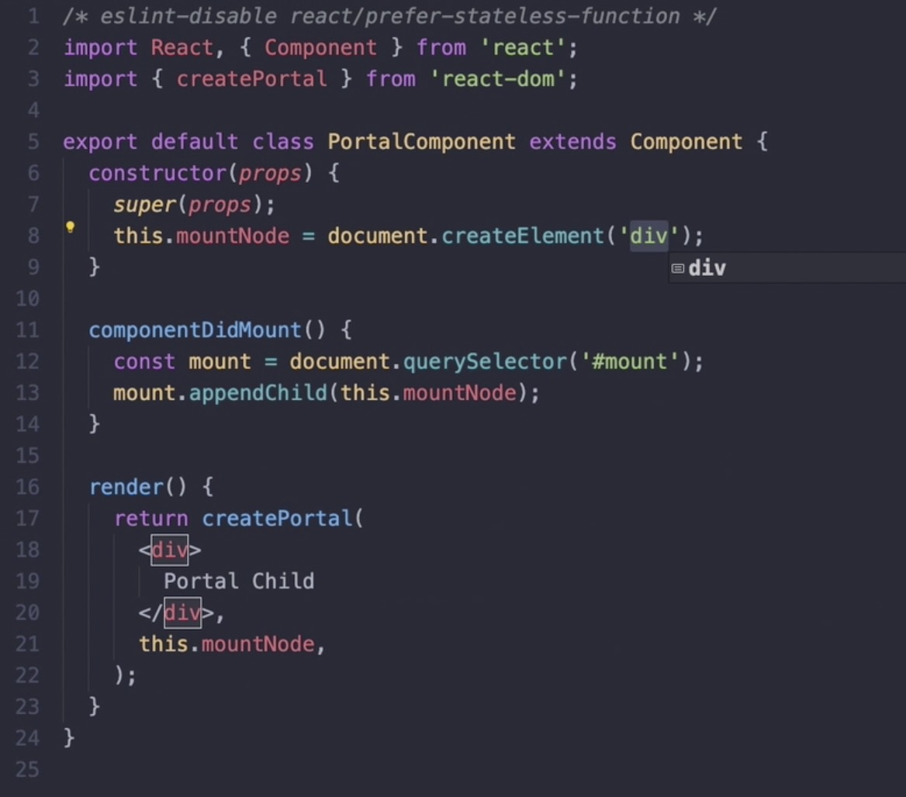
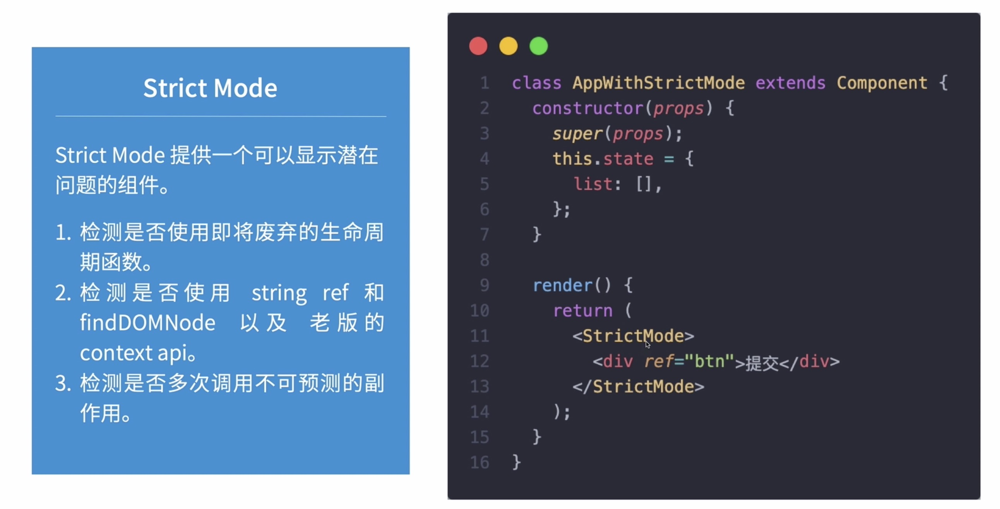
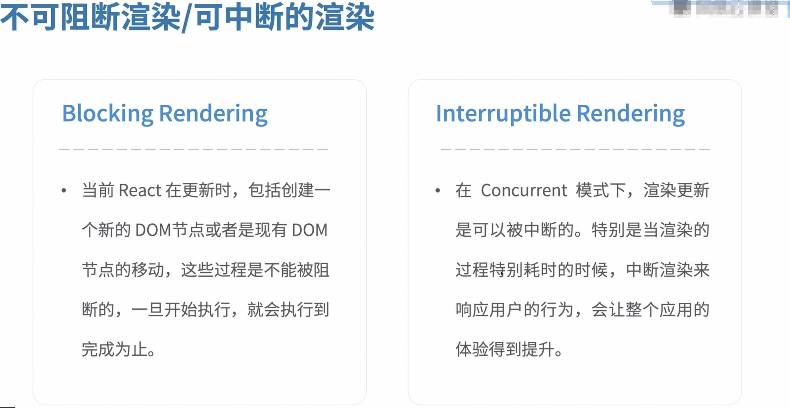

# 6.5-React New Feature

## Fragments / Portals / Strict Mode

### Fragments

Fragments 不会渲染

```js
import react, { Component } from 'react';

class App extends Component {
  render() {
    return (
      <Fragments>
        <div>1</div>
        <div>2</div>
        <div>3</div>
      </Fragments>
    )
  }
}
```
或者
```js
import react, { Component } from 'react';

class App extends Component {
  render() {
    return (
      <Fragments>
        [
          <div>1</div>,
          <div>2</div>,
          <div>3</div>
        ]
      </Fragments>
    )
  }
}
```

### Portals





### Strict Mode

> strict mode 会触发两次 render



## React Concurrent Mode

> 一个还在试验阶段的特性

目的: 让 React 应用能够更好的响应交互，并且还能根据用户设备的硬件性能和网络条件进行对应的调节

> 如果说 Fiber 是让应用更好的更新，那 Concurrent 就是让应用在体验上在上一个台阶



### Concurrent Mode API

1. 开启 Concurrent 模式

* createRoot
* createBlockingRoot

2. Suspense

* Suspense
* SuspenseList
* useTransition
* useDeferredValue

