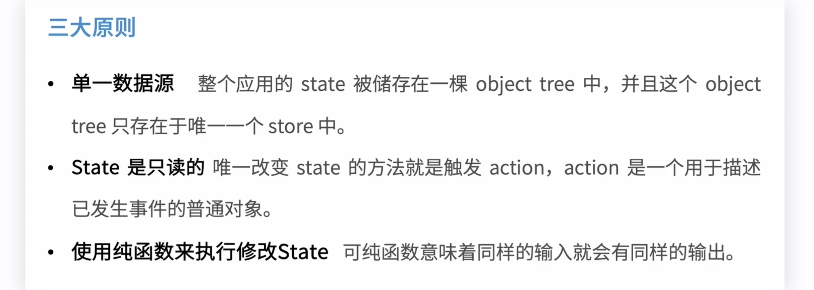
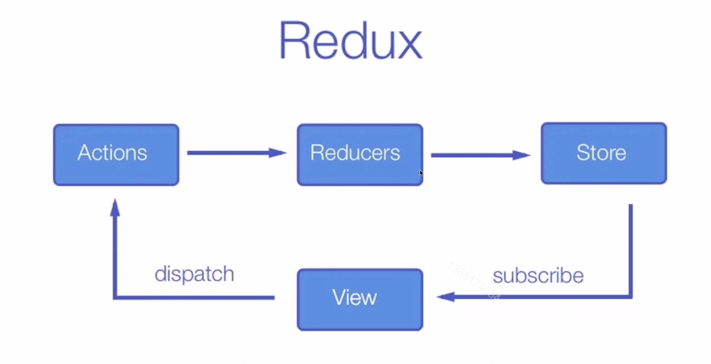
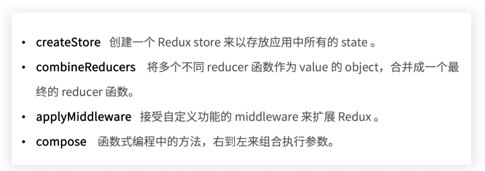

# 7.1-Redux 入门

## Redux 基础

### Redux 的核心概念

1. state

应用全局的数据来源，数据驱动视图的核心

2. action

数据发生改变动作的描述

3. reducer

结合 state 和 action， 返回一个新的 state

> reducer 是纯函数，不能有数据突变的行为， 不能直接修改state， 而是返回一个新的 state

例子见 Redux 进阶 Reselect

### Redux 的三大原则

### Redux 的运转图

### Redux 的 API

> redux 不提供异步的方法，可以使用 applyMiddleware 来扩展

### 连接 Redux 和 React

1. connect

将 React组件和 Redux 链接起来

2. Provider

提供被 connect 链接起来的组件能够访问到 Store

