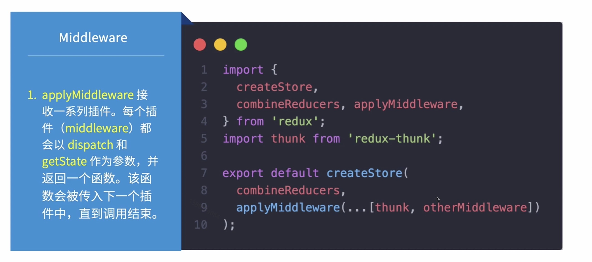
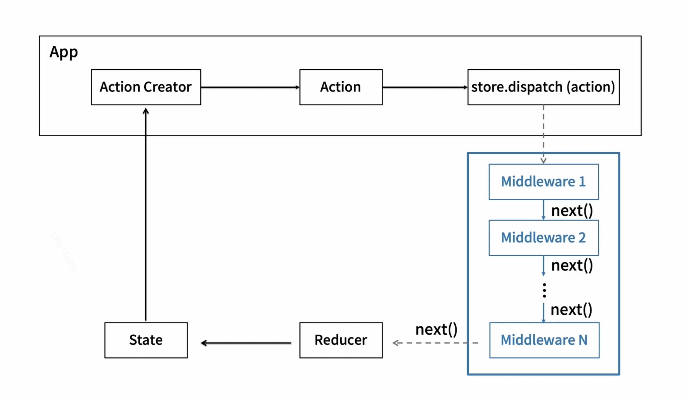
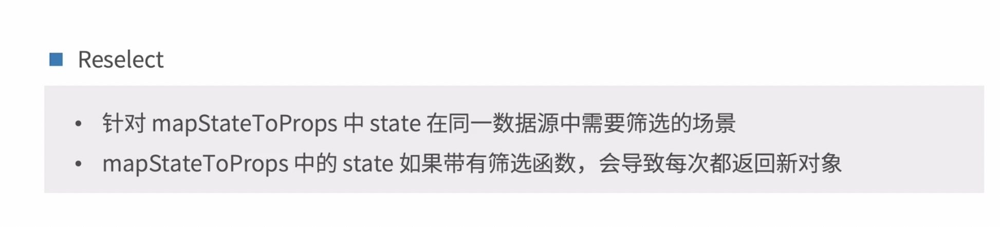
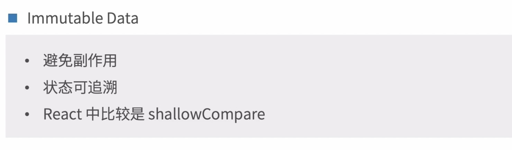
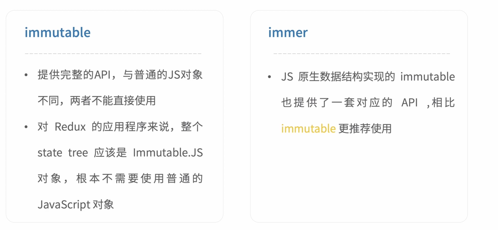
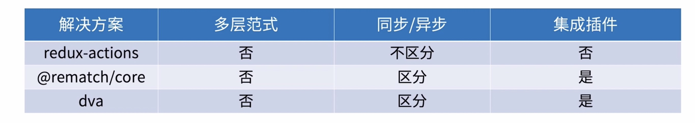

# 7.2-Redux 进阶

## Redux 异步

### Redux Middleware

Redux 的插件机制，使得 Redux 默认的同步 Action 扩展支持异步 Action





### redux-trunk

作用： 在 store 中可以做异步请求

```js
// 1. cnpm i redux-trunk
// 2. 在 store 中 引入 
  import { createStore, applyMiddleware } from 'redux';
  import trunk from 'redux-thunk';
// 3. 使用
//   createStore 接收三个参数
//   第一个参数 是 reducers， 第二个参数接收服务端全局store， 接收 applyMiddleware 扩展的方法
  createStore(
    reducers,
    applyMiddleware(trunk)
  )
```

## Reselect & Immutable Data

### Reselect

* 



### Immutable Data




### Immutable 方案



## redux-actions @rematch / core & dva


 
todo 多层范式？？？
