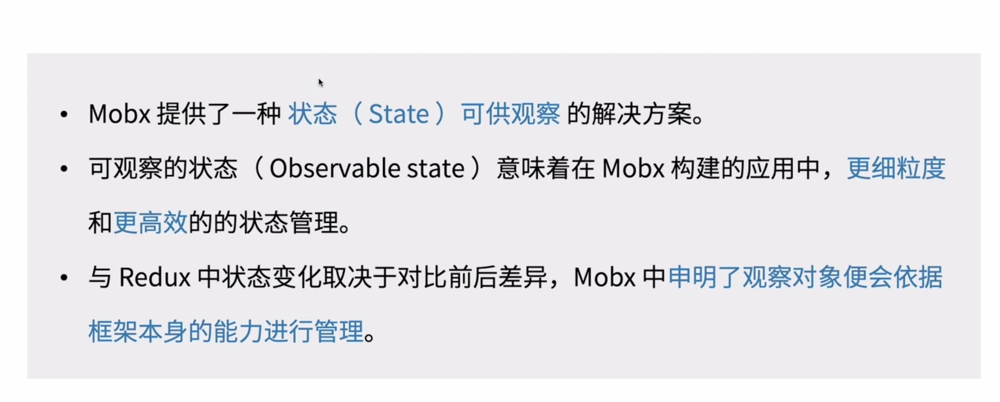
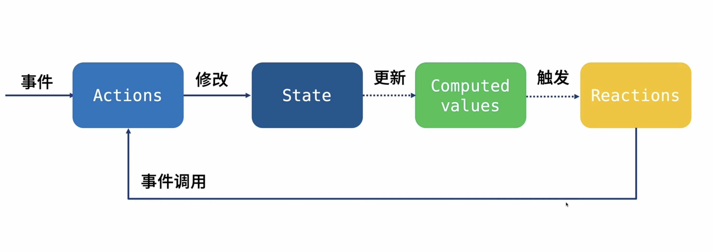
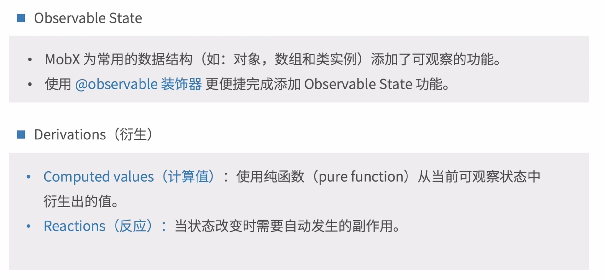
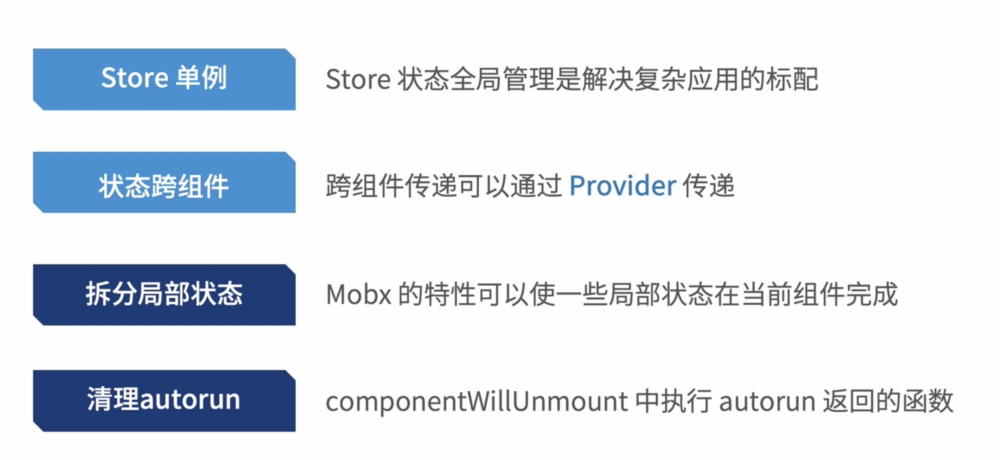
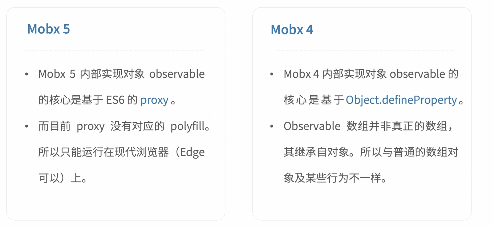
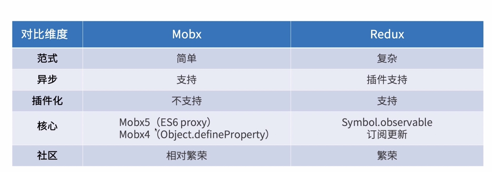

# 7.4-Mobx 入门

响应式状态管理工具

## Mobx 核心概念

## Mobx 使用

### Mobx 复杂应用

* Store单例: Store 状态全局管理是解决复杂应用的标配
* 状态跨组件: 跨组件传递可以通过 Provider 传递
* 拆分局部状态: Mobx 的特性可以使一些局部状态在当前组件完成
* 清理autorun: componentWillUnmount中执行 autorun 返回函数

### Mobx5 和 Mobx4

demo 中 为什么在外面写定义的类型导致页面白页，没有数据 ？？？