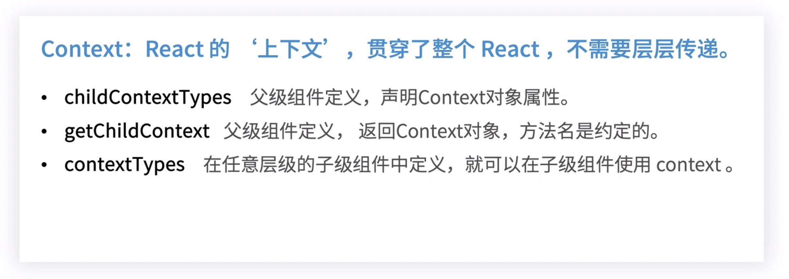
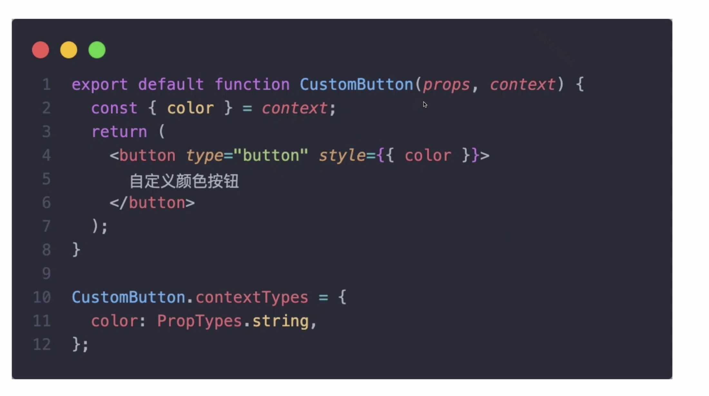
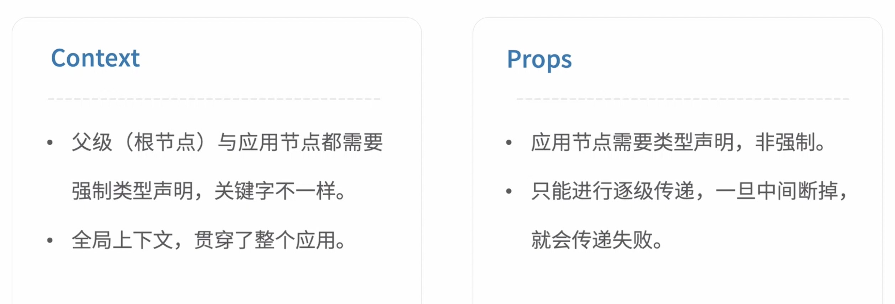
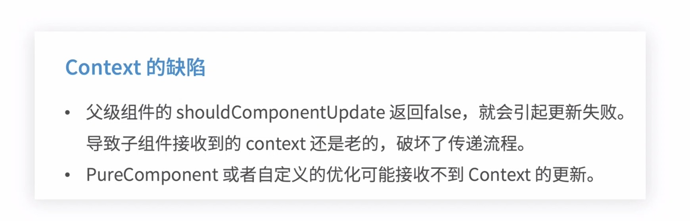
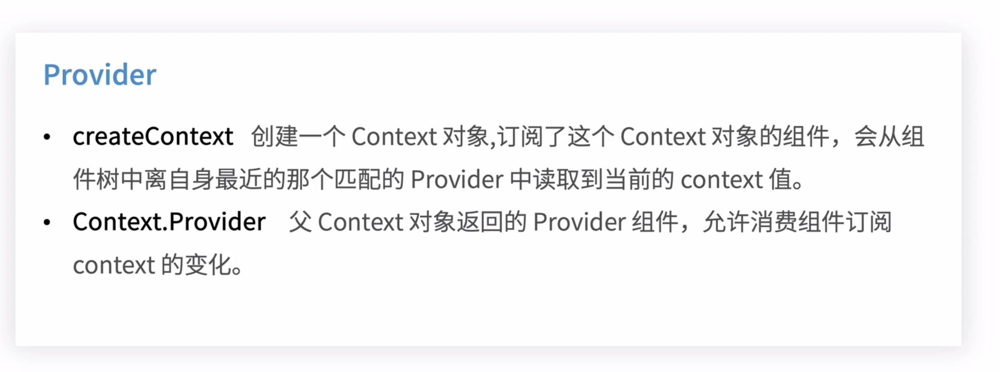
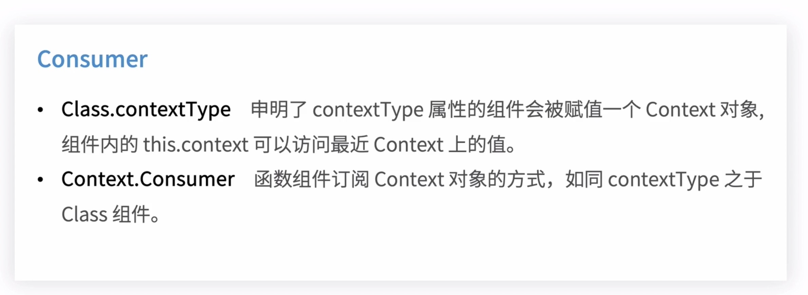
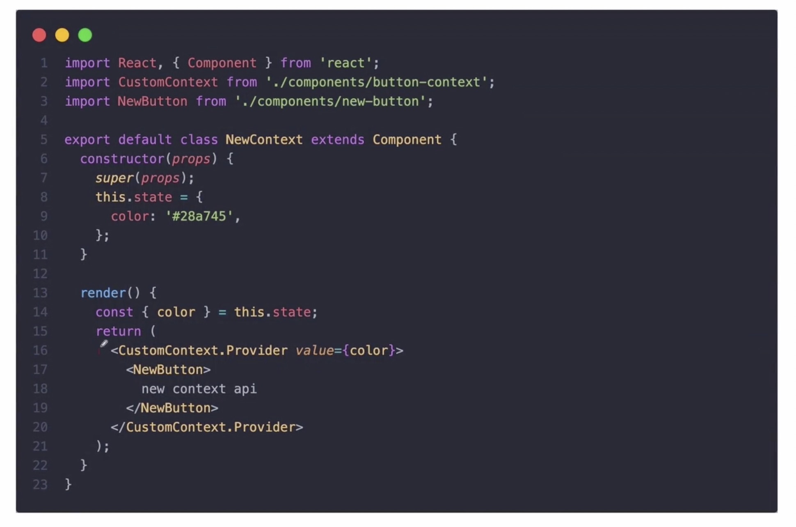
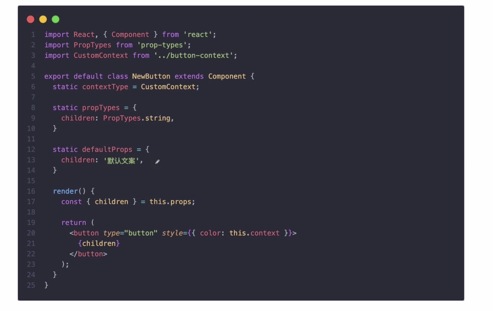
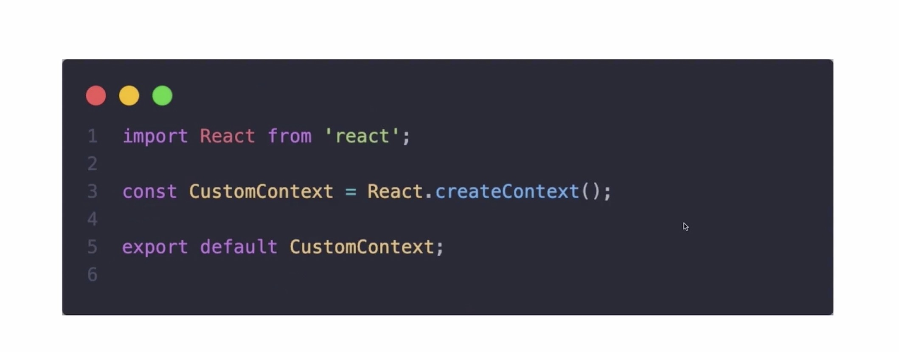
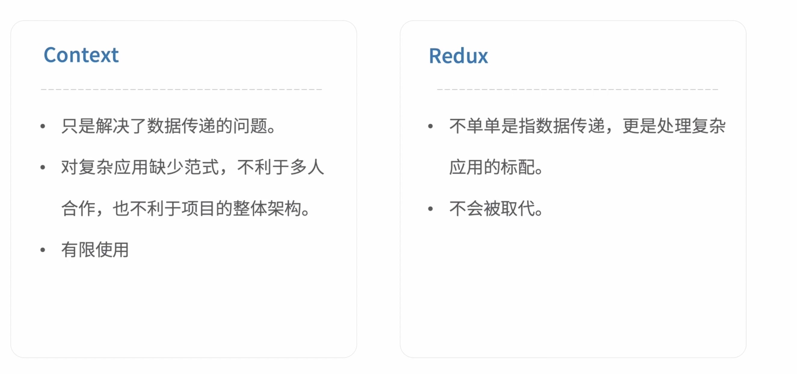

# 7.5-Context API 前世今生

## Context api before React v16.3

React 的 ‘上下文’， 贯穿了整个 React， 不需要层层传递

### api

1. child



### 实战使用-Context

```js
export default class Home extends Component {
  static childContextTypes = {
    color: PropTypes.string
  }
  constructor(props) {
    super(props);
    this.state = {
      color: '#28a745'
    }
  }
  getChildContext() {
    const { color } = this.state;
    return {
      color
    }
  }
}
```



todo ？？？ 组件标签包裹的值的使用

### Context vs Props



### Context 的缺陷

getChildContext

当组件的 setState 被调用了或者是 props 发生了变化都会引起 getChildContext 的触发



## New context api

### Provider 



### Consumer



### Context 使用

> provider 赋值的时候要写变量，写字符串或者实际代码， 那每次 value 就相当于新的值，会引起消费者多次渲染

todo ？？？ 那每次指的是什么







### Context Vs Redux

