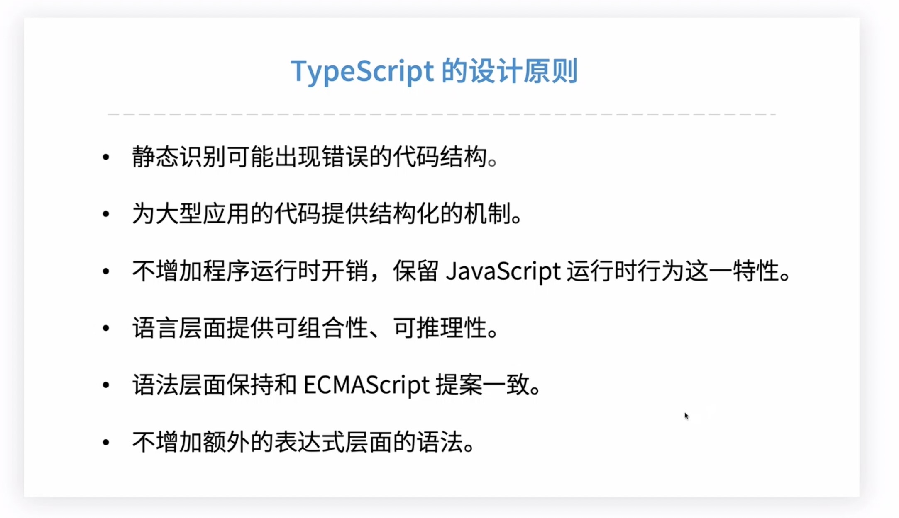
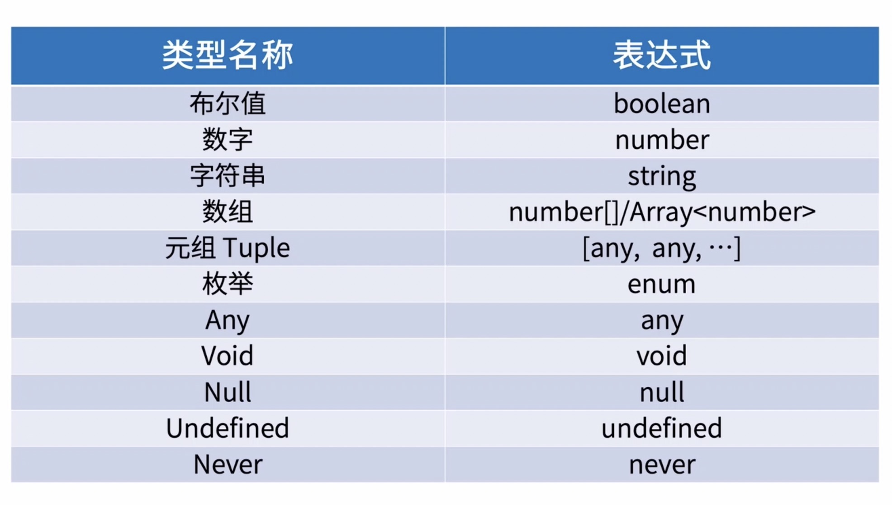
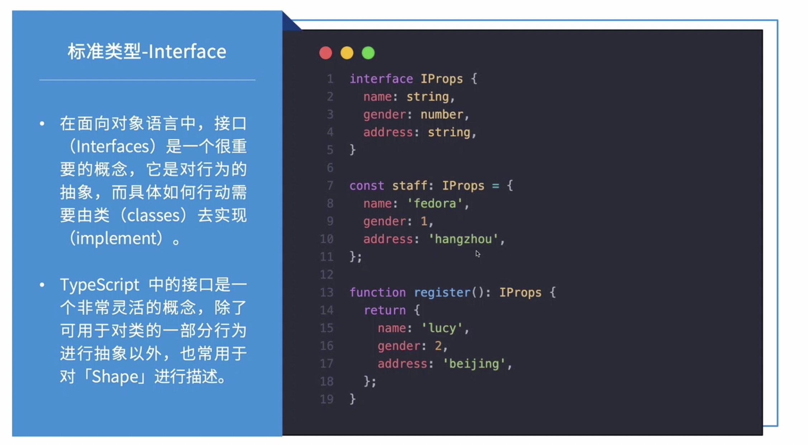
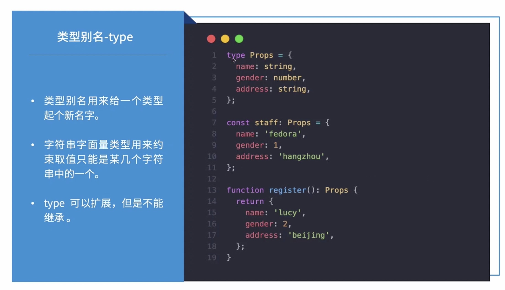
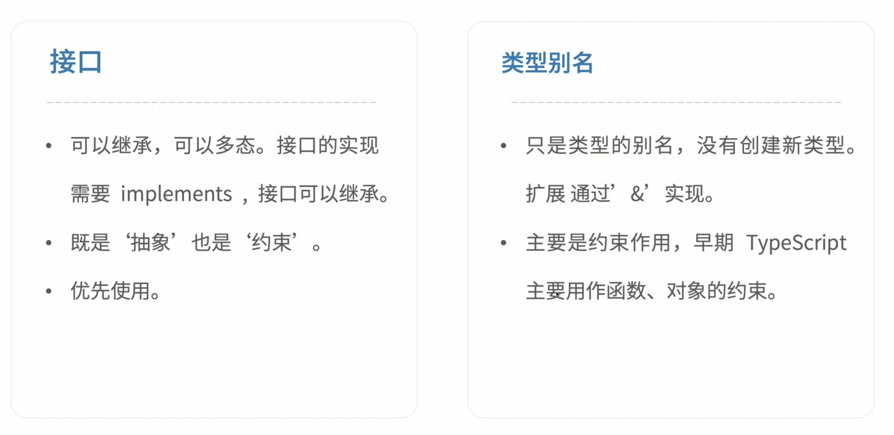
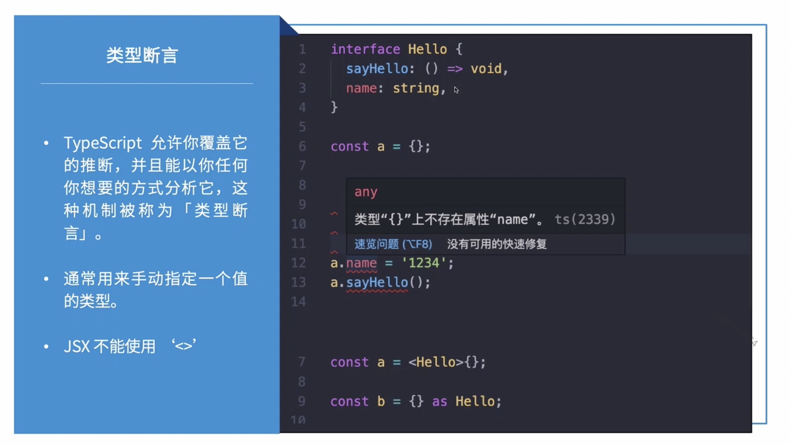
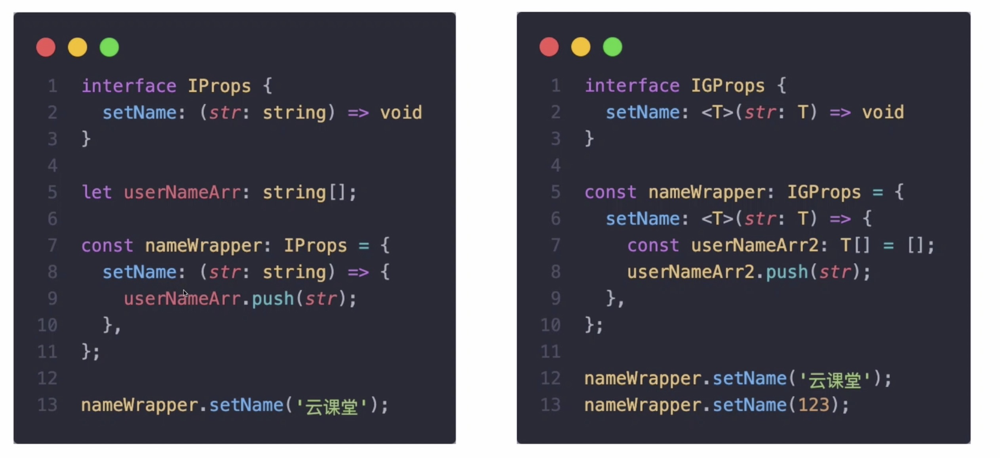

# 8.1-TypeScript

更严格的 JavaScript

## JavaScript 的设计原则



即时编译的特性

## TypeScript 的基础

### 变量声明


```js
// Javasctip 声明变量
var name = '';
var money = 120;
var boo = true;

// TypeScript 声明变量
var name: string = '';
var money: number = 120;
var boo: boolean = true;
```

### TypeScript 变量声明

```ts
let list: number[] = [1, 2, 3];

let list2: Array<number> = [1, 2, 3];

// 元组类型 第一个只能是数字，第二个只能是字符串，不能颠倒
let comlexVar: [number, string] = [1, '课堂']

// 枚举 默认是从零开始， 不动态修改的时候，Money 是 0 ， Tuesday 是 1
enum dataEnum {
  Money, Tuesday,
}

// 空类型 函数没有返回值的时候使用 箭头函数的定义
let setVaule : () => void => () => {
  list2 = [2, 3];
}

// 空类型 函数没有返回值的时候使用 普通函数的定义
let setVaule = function otherSetValue(): void {
  comlexVar = [2, '字符串']
}

// 数字类型不确定， 后期可能会改变数据类型
let simpleVar: any;
simpleVar = 3
simpleVar = '11111'
```



### 接口



### 类型别名



### 接口 VS 类型别名 



### 类型断言



是我们手动指定变量或者方法类型，它相当于欺骗，可以欺骗ts监测机制

### 泛型



## TypeScript & React

TypeScript： 3.9.5  React 16.13.1 Node 8.17.0

环境搭建： 正确搭建一个通用的 TypeScript 开发环境


### 差异文件

tsconfig   babel   eslint 
