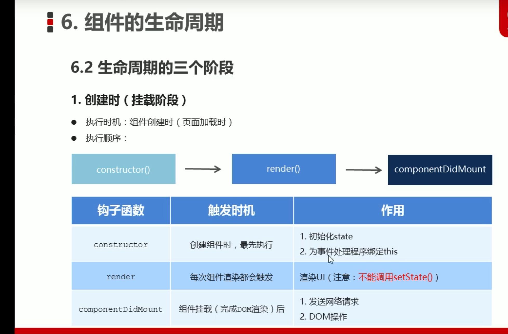
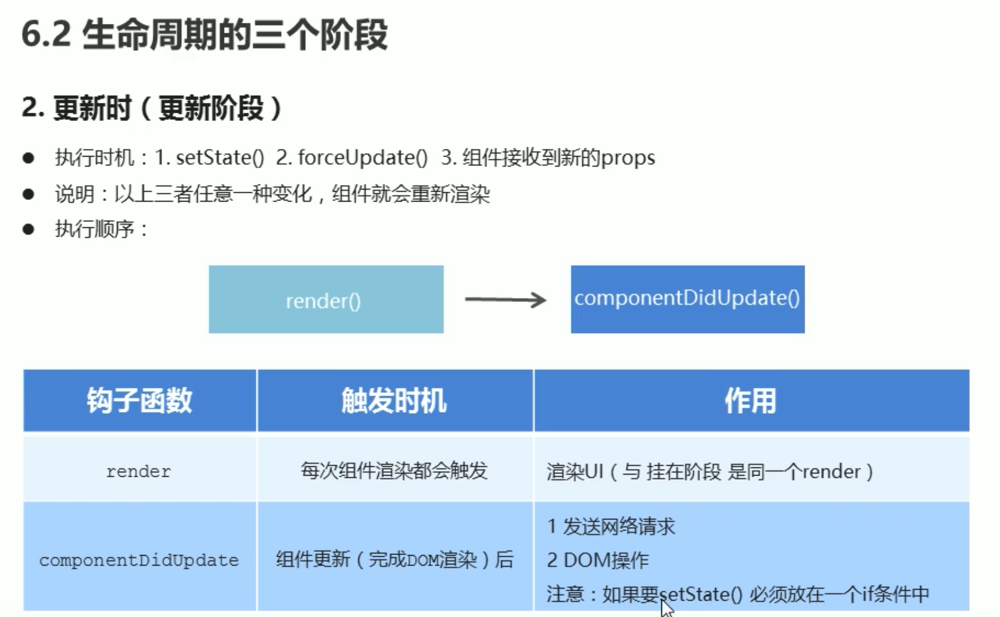
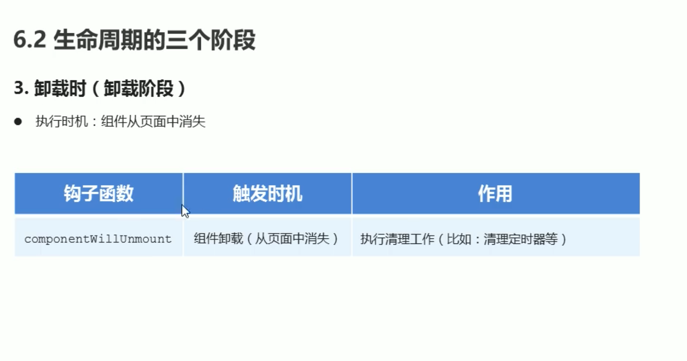
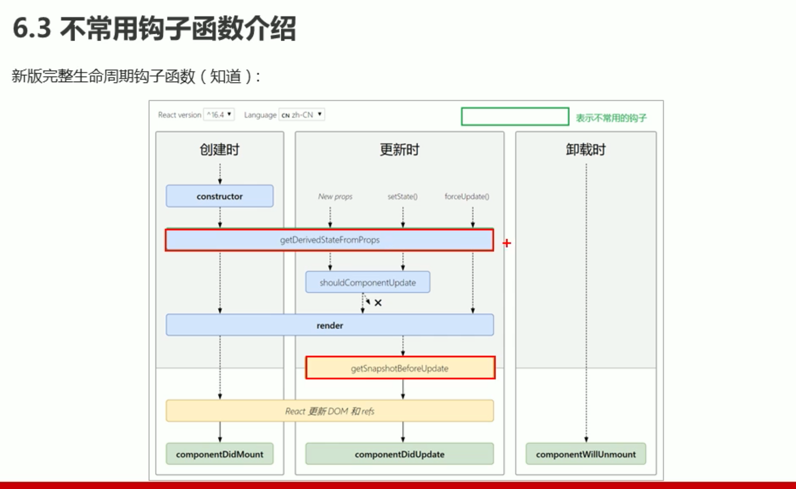

# 2.React生命周期

生命周期的三个阶段

## 2.1.创建时(挂载阶段)

* 执行时机： 组件创建时（页面加载时）

* 执行顺序

> constructor() => render() => componentDidMount

;

## 2.2.更新时(更新阶段)

* 更新时机： 
  1. setState() 
  2. forceUpdate()
  3. 组件接收到新的 props

* 说明：以上三种任意一种变化， 组件就会重新渲染

* 执行顺序

> render() => componentDidUpdate()

> componentDidUpdate 中更新数据要加判断

;

## 2.3.卸载时（卸载阶段）

* 执行时机：组件从页面中消失

componentWillUnmount

;

## 2.4.不常用的钩子函数

;

