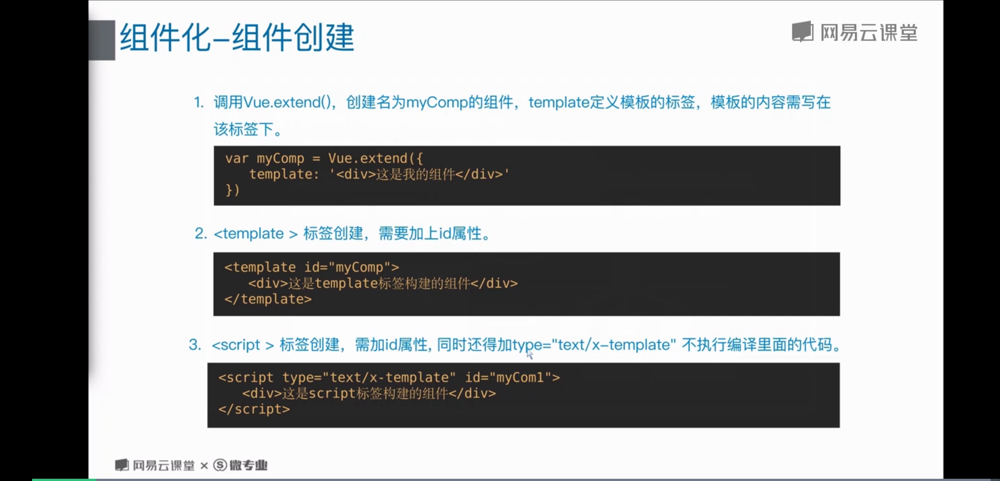
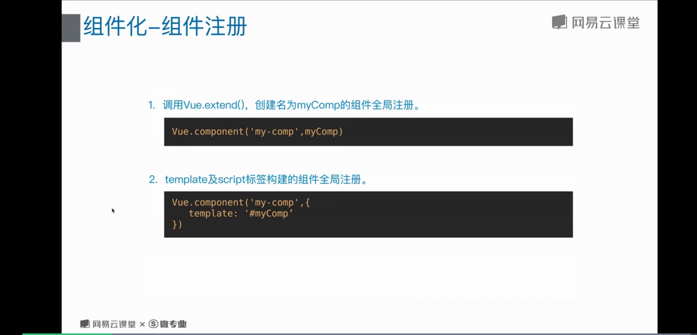
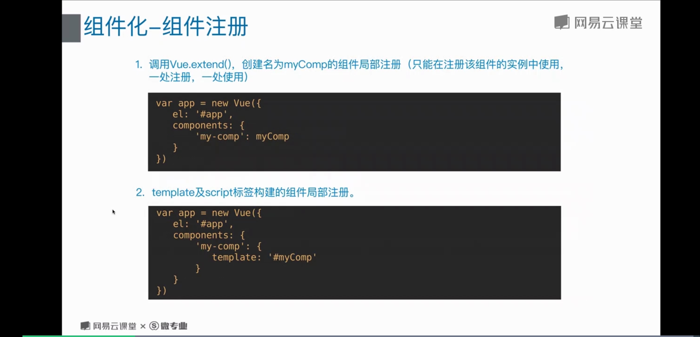
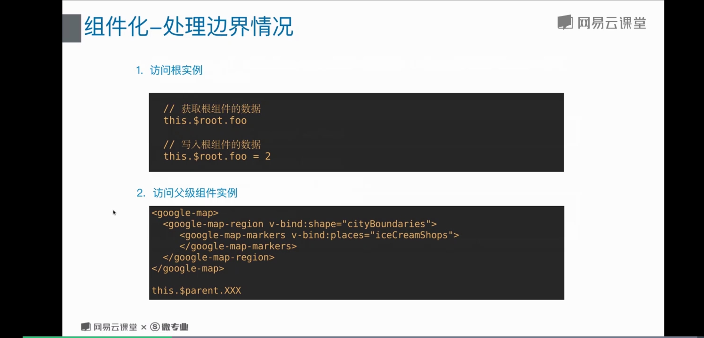
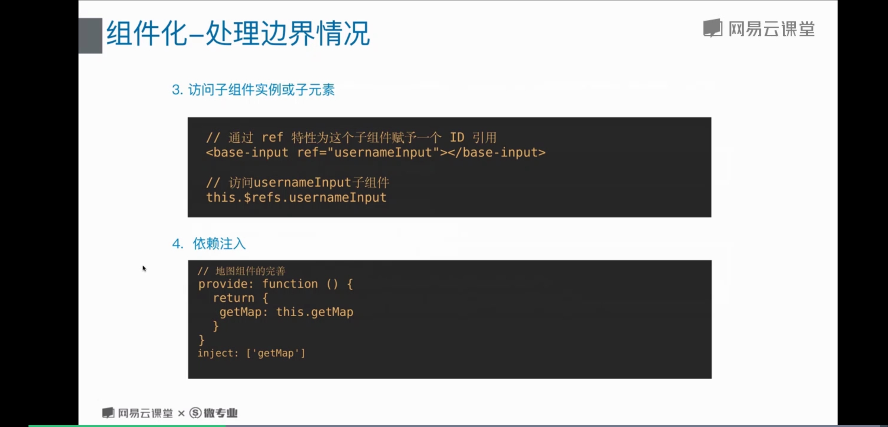
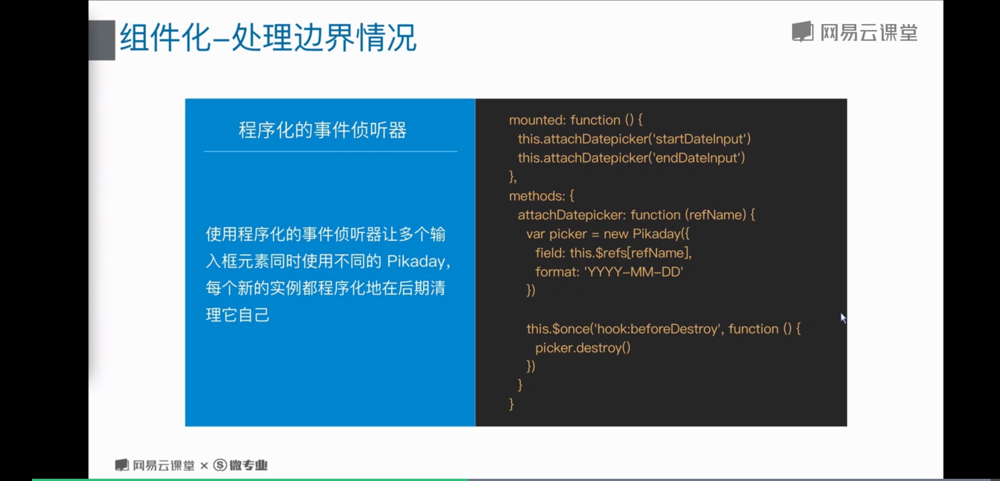

# 12 组件化的深入

## 组件的创建
;

## 组件的注册
;
;


## 处理边界情况
### 访问跟实例 和 访问父组件实例
;

### 访问子组件的实例或子元素 和 依赖注入
;
依赖注入
provide 和 inject
```js
{
	// 父组件提供
	provide: function () {
		return {
			getMap: this.getMap
		}
	}

	// 注入
	inject: ['getMap]
}
```
与 this.$parent 相比， 可以在任意组件中通过 inject 来使用， 而不是需要暴露整个 父实例

> refs 不是响应式的， 避免在 computed 和 组件 中进行操作

### 程序化的事件侦听器
现在，你已经知道了 $emit 的用法，它可以被 v-on 侦听，但是 Vue 实例同时在其事件接口中提供了其它的方法。我们可以：
* 通过 $on(eventName, eventHandler) 侦听一个事件
* 通过 $once(eventName, eventHandler) 一次性侦听一个事件
* 通过 $off(eventName, eventHandler) 停止侦听一个事件

你通常不会用到这些，但是当你需要在一个组件实例上手动侦听事件时，它们是派得上用场的。它们也可以用于代码组织工具。例如，你可能经常看到这种集成一个第三方库的模式：

这里有两个潜在的问题：
* 它需要在这个组件实例中保存这个 picker，如果可以的话最好只有生命周期钩子可以访问到它。这并不算严重的问题，但是它可以被视为杂物。
* 我们的建立代码独立于我们的清理代码，这使得我们比较难于程序化地清理我们建立的所有东西。

使用了这个策略，我甚至可以让多个输入框元素同时使用不同的 Pikaday，每个新的实例都程序化地在后期清理它自己：
```js
{
  mounted: function () {
    this.attachDatepicker('startDateInput')
    this.attachDatepicker('endDateInput')
  },
  methods: {
    attachDatepicker: function (refName) {
      var picker = new Pikaday({
        field: this.$refs[refName],
        format: 'YYYY-MM-DD'
      })

      this.$once('hook:beforeDestroy', function () {
        picker.destroy()
      })
    }
  }
}
```

```js
// 一次性将这个日期选择器附加到一个输入框上
// 它会被挂载到 DOM 上。
mounted: function () {
  // Pikaday 是一个第三方日期选择器的库
  this.picker = new Pikaday({
    field: this.$refs.input,
    format: 'YYYY-MM-DD'
  })
},
// 在组件被销毁之前，
// 也销毁这个日期选择器。
beforeDestroy: function () {
  this.picker.destroy()
}
```

;

### 循环引用
* 递归组件
使用 Vue.component 全局注册一个组件时， 这个全局的 ID 会自动设置为该组件的name 选项。 确保的递归调用时条件性的(例如使用一个最终会得到false的v-if)
```js
{
	name: 'stack-overflow',
	template: `<div>
							<stack-overflow>
							<stack-overflow>
						</div>`
}
```
* 组件之间循环引用 
假设你需要构建一个文件目录树
```html
<!-- <tree-folder> -->
<p>
  <span>{{ folder.name }}</span>
  <tree-folder-contents :children="folder.children"/>
</p>
```
```html
<!-- <tree-folder-contents> -->
<ul>
  <li v-for="child in children">
    <tree-folder v-if="child.children" :folder="child"/>
    <span v-else>{{ child.name }}</span>
  </li>
</ul>
```

### 模板定义的替代品

* 内联模板
当 inline-template 这个特殊的特性出现在一个子组件上时，这个组件将会使用其里面的内容作为模板，而不是将其作为被分发的内容。这使得模板的撰写工作更加灵活。
```html
<my-component inline-template>
  <div>
    <p>These are compiled as the component's own template.</p>
    <p>Not parent's transclusion content.</p>
  </div>
</my-component>
```

内联模板需要定义在 Vue 所属的 DOM 元素内。

> 不过，inline-template 会让模板的作用域变得更加难以理解。所以作为最佳实践，请在组件内优先选择 template 选项或 .vue 文件里的一个 /<template/> 元素来定义模板。

* X-Template
另一个定义模板的方式是在一个 /<script/> 元素中，并为其带上 text/x-template 的类型，然后通过一个 id 将模板引用过去

```html
<script type="text/x-template" id="hello-world-template">
  <p>Hello hello hello</p>
</script>
```

```js
Vue.component('hello-world', {
  template: '#hello-world-template'
})
```

### 控制更新
* 强制更新
可以通过 $foceUpdate

在需要强制更新的组件的某个函数或是事件上添加 this.$forceUpdate() 进行强制渲染，实现效果

* 控制更新
通过 v-once 创建低开销的静态组件

渲染普通的 HTML 元素在 Vue 中是非常快速的，但有的时候你可能有一个组件，这个组件包含了大量静态内容。在这种情况下，你可以在根元素上添加 v-once 特性以确保这些内容只计算一次然后缓存起来，就像这样：

```js
Vue.component('terms-of-service', {
  template: `
    <div v-once>
      <h1>Terms of Service</h1>
      ... a lot of static content ...
    </div>
  `
})
```

## 混入 (mixin)

### 混入的 基本用法
混入 (mixin) 提供了一种非常灵活的方式，来分发 Vue 组件中的可复用功能。一个混入对象可以包含任意组件选项。当组件使用混入对象时，所有混入对象的选项将被“混合”进入该组件本身的选项。

```js
// 定义一个混入对象
var myMixin = {
  created: function () {
    this.hello()
  },
  methods: {
    hello: function () {
      console.log('hello from mixin!')
    }
  }
}

// 定义一个使用混入对象的组件
var Component = Vue.extend({
  mixins: [myMixin]
})

var component = new Component() // => "hello from mixin!"
```

### 全局混入

混入也可以进行全局注册。使用时格外小心！一旦使用全局混入，它将影响每一个之后创建的 Vue 实例。使用恰当时，这可以用来为自定义选项注入处理逻辑。

```js
// 为自定义的选项 'myOption' 注入一个处理器。
Vue.mixin({
  created: function () {
    var myOption = this.$options.myOption
    if (myOption) {
      console.log(myOption)
    }
  }
})

new Vue({
  myOption: 'hello!'
})
// => "hello!"
```

### 选项合并

当组件和混入对象含有同名选项时，这些选项将以恰当的方式进行“合并”。

```js
var mixin = {
  data: function () {
    return {
      message: 'hello',
      foo: 'abc'
    }
  }
}

new Vue({
  mixins: [mixin],
  data: function () {
    return {
      message: 'goodbye',
      bar: 'def'
    }
  },
  created: function () {
    console.log(this.$data)
    // => { message: "goodbye", foo: "abc", bar: "def" }
  }
})
```