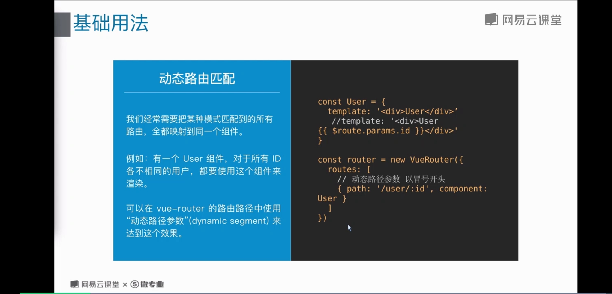
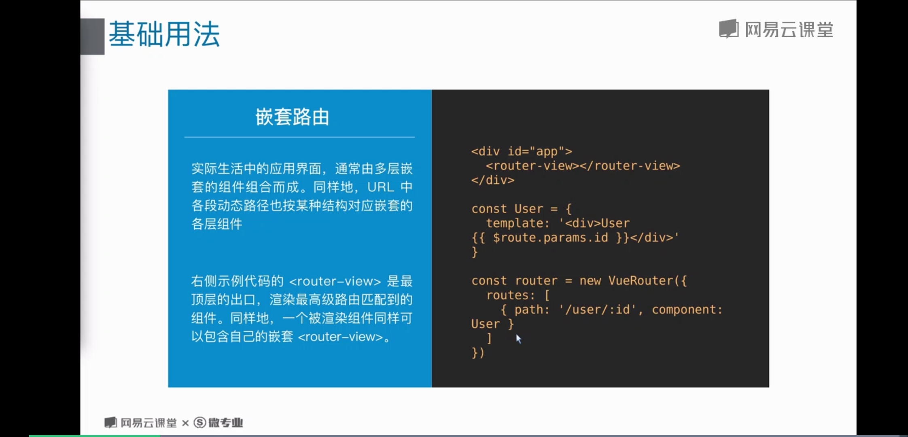
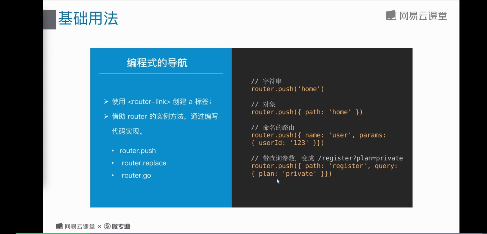
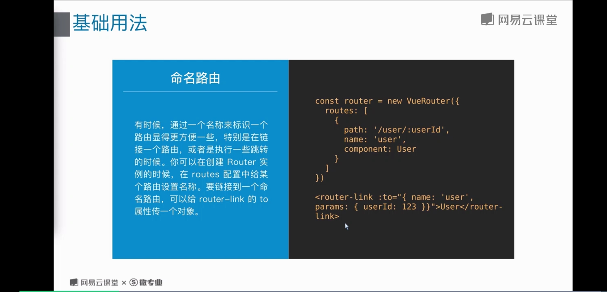
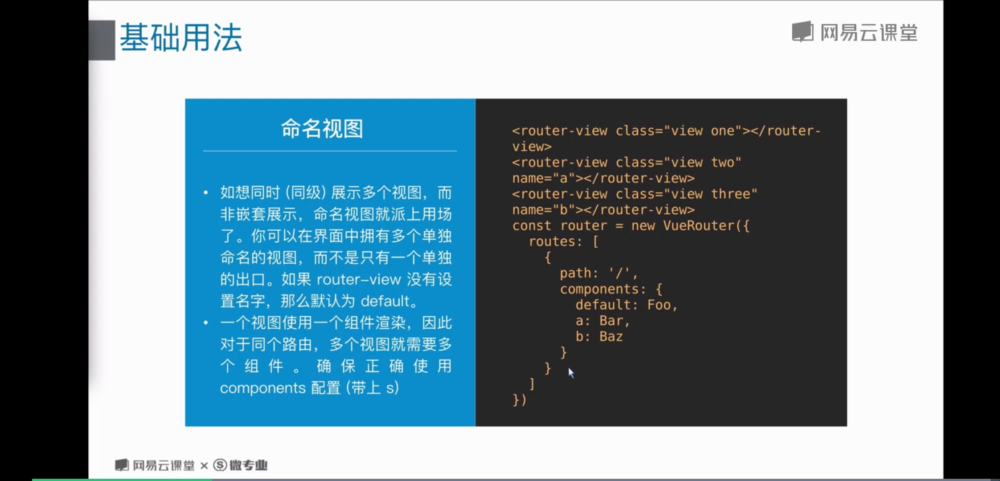
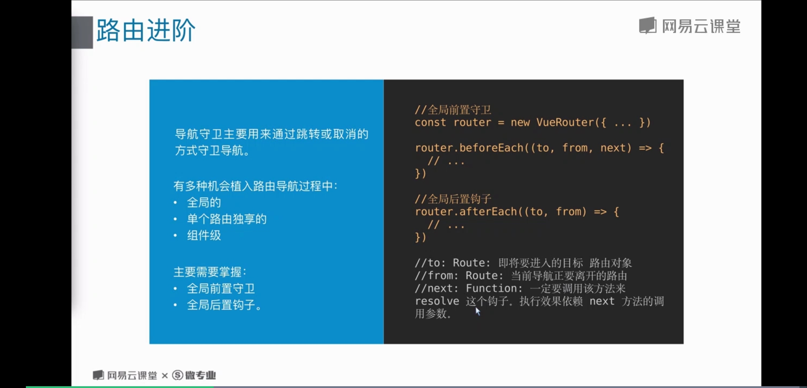
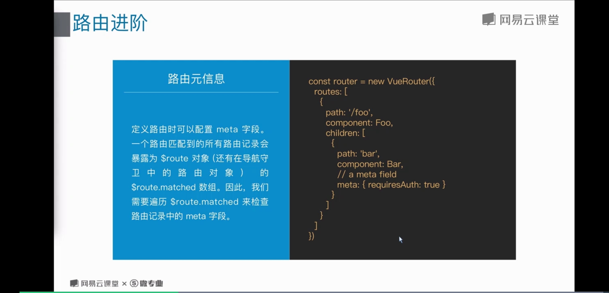

# 14 Vue-router

## 路由
* 路由， 其实就是指向得意思， 通俗的讲，就是网址
* Home按钮 =》 home 内容， about按钮 =》 about 内容， 也可以说是一种映射。
所以在页面上又两个部分， 一个是点击部分，一个是点击后显示内容得部分

### 三个基本概念
* route：是一条路由， Home按钮 => home内容
* routes: 是一组路由，把上面得 route 组合起来， 形成一个数组
* router： 是一个机制， 相当于一个管理者， 他来管理路由

### vue-router 的使用

* 安装或引入vue-router
```js
npm install vue-router --save // 或者 直接引用 js
```

* 引用vue-router
```js
import Vue from 'vue';
import VueRouter from 'vue-router';
Vue.use(VueRouter);
```

* 创建路由表
```js
var router = new VueRouter({
	routes: [
		{
			path: '/home',
			componetn: Home
		}
	]
})
```

## 动态路由匹配
;

## 嵌套路由
;

## 编程式的路由
;

## 命名路由
;

## 命名视图
;

> 一个视图使用 一个组件渲染， 多个视图需要多个组件

## 重定向和别名
;

## 路由传参
* 使用router-link 进行路由导航，传递参数
* 直接调用 $router.push 实现携带参数的跳转
* 通过路由属性中的name来确定匹配的路由， 通过params来传递参数

## 路由进阶

### 导航守卫
;

* 每个组件都有自己的路由守卫
```js
const router = new VueRouter({
  routes: [
		{
			path: '/',
			name: 'home',
			component: home,
			beforeEnter: (to, from, next) => {
				next()
			},
			beforEach () {

			}
		}
	]
})
```
在组件中的写法
```js
export defalut {
	beforeRouteEnter(to, from, next) {
		
	},
	beforeRouteUpdate(to, from, next) {

	},
	beforeRouteLeave(to, from, next) {

	}
}
```

### 路由元信息
;

> 可以用来判断此页面是否需要登录之后才能进入

### 其他特性
* 过渡效果	使用 /<transition/> 组件添加过渡效果
* 数据获取	导航完成前后获取服务器数据
* 滚动行为	scrollBehavior 方法定定位
* 路由懒加载	结合Vue的异步组件和 webpack 的代码分割功能 

> router 可以设置模式，是 history 还是 hash
```js
const router = new VueRouter({
	mode: 'history',
  routes: []
})
```

## 404页面设置
````js
const router = new VueRouter({
  routes: [],
	[
		{
			path: '*',
			name: '404',
			components: () => import(路径)
		}
	]
})
```


