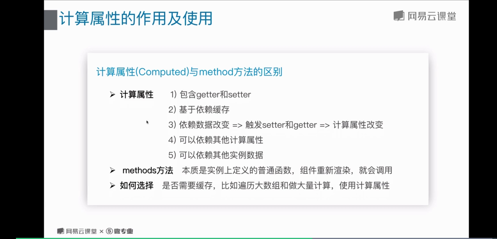

# 3 计算属性及watch

## 计算属性

### 用法
```javascript
computed {
	totalPrice () {
		let {price, number} = this;
		return price * number;
	}
}
```
### 计算属性与method方法的区别

;

> 一个数据受多个数据影响使用computed

## watch

### 使用

```javascript
watch: {
	prices(newVal, oldVal) {
		console.log(newVal, oldVal);
	},
	info {
		handler (newVal, oldVal) {
			console.log(newVal, oldVal);
		},
		deep: true, // 深度监听
		imnediate: true // 是否以当前的初始值执行handler函数
	}
}
```

使用场景： 一个数据影响多个数据

