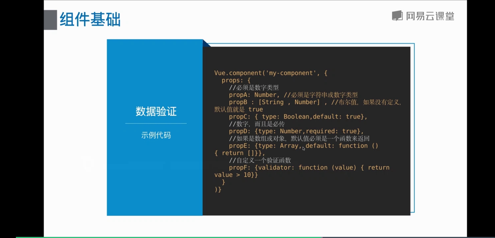

# 6 组件-组件基础

## 组件基础

### 组件的作用
提高复用性

### 组件的使用

* 组件的命名 两种方式 <br>
1. 使用 kebab-case (短横线分割命名) 
```html
<my-component></my-component>
```
2. 使用 PascalCase (首字母大写命名) 
```html
<MyComponent></MyComponent>
```

* 组件复用 <br>
可以将组件进行任意次数的复用，每个组件都会独立维护它的实例数据

* 组件注册 <br>
1. 全局注册
2. 局部注册

### 组件注册
* 全局注册
```javascript
Vue.component('my-component', {
	data: function () {
		return {
			title: '全局组件'
		}
	},
	template: '<div>{{title}}</div>' // 必须有元素包裹
})
```

### 局部组件
```javascript
var ComponentA = {
	template: '<div>我是局部组件</div>',
	data: function () {
		return {

		}
	}
};
new Vue({
	el: '#app',
	components: {
		'my-conponent': ComponentA
	}
})
```

> data 是一个函数的原因： <br>
> 组件复用时，返回新的 data， 私有的作用空间。

## 使用 prop 向 子组件传递数据

### prop 书写规则 <br>
使用 DOM 中 的模板时， 驼峰命名的 prop 名 需要使用其等价的短横线分割命名

### prop 基本用法 <br>
传递静态或动态 prop

### 传递特性 <br>
所有的 prop 都使得其父子 prop 之间形成一个单向下行绑定(单项数据流)

* 组件 prop 的数据验证
1. 当组件需要提供给别人使用时， 推荐都进行数据验证
2. 验证的 type 类型可以是： String, Number, Boolean, Object, Array, Function, Symbol, Date。 <br>
	type 也可以是一个自定义构造器，使用 instanceof 检测

> 开发版本当验证失败抛出错误

3. 数据验证


> 当想改变 prop 的初始值可以在 data 中重新定义一个值

## 自定义事件

### 使用场景 
当子组件向父组件传递数据时， 就要用到自定义事件

### 基本用法
子组件用 $emit() 来触发事件，父组件用 $on() 来监听子组件的事件

### 自定义组件的 v-model 
一个组件上的 v-model 默认会利用名为 value 的 prop 和 名为 input 的事件

TODO 加示例 ， 这节课没有讲完吧

### 将原生事件绑定到组件
使用 v-on 的 .native 修饰符监听原生事件

### .sync 修饰符
父组件监听自定义事件按需更新数据

## slot 分发内容

### slot 定义

* 插槽(slot) <br>
Vue 提出的一个概念， 插槽用于决定将所携带的内容，插入到指定的某个位置，从而使模块分块，据有模块化的特质和更大的重用性

* 当需要让组件组合使用， 混合父组件的内容与子组件的模板时，就会用得到 slot

### 单个slot

* 在子组件内使用特殊的 slot 元素， 就可以为这个子组件开启一个 slot
* 在父组件的模板里， 插入 在子组件标签内的所有内容将替代子组件的 slot 标签及它的内容

```html
<div id='app'>
	<child-component>
		<p>slot分发的内容</p>
		<p>slot分发的内容</p>
	</child-component>
</div>
```
> 两个 p 标签作用域属于 父组件
```javascript
Vue.component('child-component', {
	template: '<div><slot><p>如果父组件没有插入内容，该内容会默认显示</p></slot></div>'
})
```

### 具名slot

* 给 slot 元素指定一个name后， 可以分发多个内容
* 具名 slot 可以与单个 slot 共存

```html
<div id='app'>
	<child-component>
		<h1 slot='header'>顶部header</h1>
		<p>slot分发的内容</p>
		<p>slot分发的内容</p>
		<div slot='footer'>底部footer</div>
	</child-component>
</div>
```

```javascript
Vue.component('child-component', {
	template: `<div>
							<div>
								<slot name='header'><slot>
							</div>
							<div>
								<slot><slot>
							</div>
							<div>
								<slot name='footer'><slot>
							</div>
						</div>`																																
})
```

### 作用域slot

* 作用域slot是一种特殊的slot， 使用一个可以复用的模板替换已渲染元素
```html
<div id='app'>
	<child-component>
		<template scope='props'>
			<p>来自父组件的内容</p>
			<p> {{props.msg}} </p>  // 子组件中传递的数据
		</template>
	</child-component>
</div>
```
```javascript
Vue.component('child-component', {
	template: '<div><slot msg="子组件的内容传递"></slot></div>'
})
```

> 通过 scope='props' 来获取子组件中传递的值。

## 单文件和自定义组件

### 单文件组件

* 一个后缀名为.vue 的文件，使用.vue文件需要先安装 vue-loader ，vue-style-loader 等加载器并做 webpack 配置。因为要使用es6 语法， 还需要安装配置 babel 和 babel-loader 等编译器。

> 每个 .vue 文件包含三种类型的顶级语言块 template, script, style, <i><b>还允许添加可选的自定义块</b></i>

```vue
<template></template>
<script></script>
<style></style>
<myComponent>
	自定义组件的内容
</myComponent>
```

### 自定义组件

* 类似 element-ui 这类组件库， 都是为了完成一些自定义或者特定的业务的， 这一类组件都可以称为 自定义组件

## 单文件组件及自定义组件和动态组件及异步组件

### 使用webpack构建

npm init -y
cnpm i webpack webpack-cli vue-loader label-core babel-loader -D

> babel 到七以上，就有和很多东西分离

### 单文件和自定义组件

* 单文件组件简单写法
1. 创建一个文件夹， 里面创建myComponent 和 myComponent.js 文件
2. 在vue项目中的入口文件main.js 中或者需要使用的文件中，进行导入，使用 Vue.use()

myComponent.vue
```vue
<template>
	<div>
		<div> 实现自定义组件</div>
	</div>
</template>
<script>
	export defalut {
		name: 'myComponent',
		data () {
			return {msg: 'hello vue'}
		}
	}
</script>
<style>
</style>
```
myComponent.js
```javascript
import MyComponent from './myComponent.vue';
const myComponent = {
	install (Vue) {
		Vue.component(MyComponent.name, MyComponent)
	}
}
export defalut myComponent
```
需要使用的文件
```
<template>
	<div class='hello'>
		<myComponent></myComponent>
	</div>
</template>
import myComponent from './myComponent';
Vue.use(myComponent);
```

### 动态组件和异步组件

* 动态组件
 Vue.js 提供了一个特殊的元素 \<component\> 用来动态的挂载不同的组件，使用js特性选择要挂载的组件， 这样的组件叫动态组件。另外可以使用 \<keep-alive\> 标签来使组件进行缓存。

```
<div id='app'>
	<component :is='currentView'></component>
	<button @click="changeView('A')">切换到A</button>
	<button @click="changeView('B')">切换到B</button>
	<button @click="changeView('C')">切换到C</button>
</div>
<script>
new Vue({
	el: '#app',
	components: {
		comA: {template: '<div>我是A</div>'},
		comB: {template: '<div>我是B</div>'},
		comC: {template: '<div>我是C</div>'}
	},
	data: {
		currentView: 'comA'
	},
	methods: {
		changeView (com) {
			this.currentView = 'com' + com;
		}
	}
})
</script>
```

> 动态改变currentView的值，就可以动态挂载组件

* 异步组件
	Vue.js 允许将组件定义为一个工厂函数，动态地解析组件。Vue只在组件需要渲染时触发工厂函数，并且把结果缓存起来，用于后面的再次渲染。我们把这类组件称之为异步组件

```
<div id='app'>
	<my-component></my-component>
</div>
<script>
Vue.component('my-component', function (reslove, reject) {
	setTimeout (() => {
		resolve({
			template: '<div>我是异步组件</div>'
		})
	}, 2000)
})
</script>
```

> 工厂函数接收一个reslove回调， 在收到从一个服务器下载的组件定义时调用。 也可以调用 reject(reason) 指示加载失败
