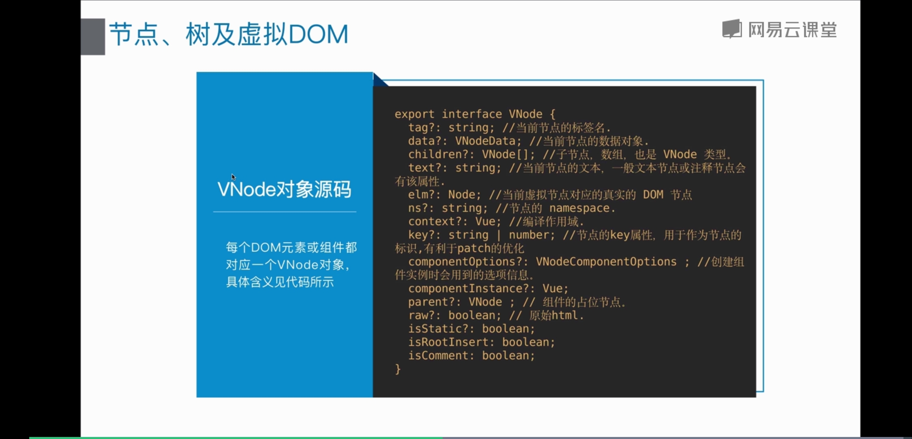
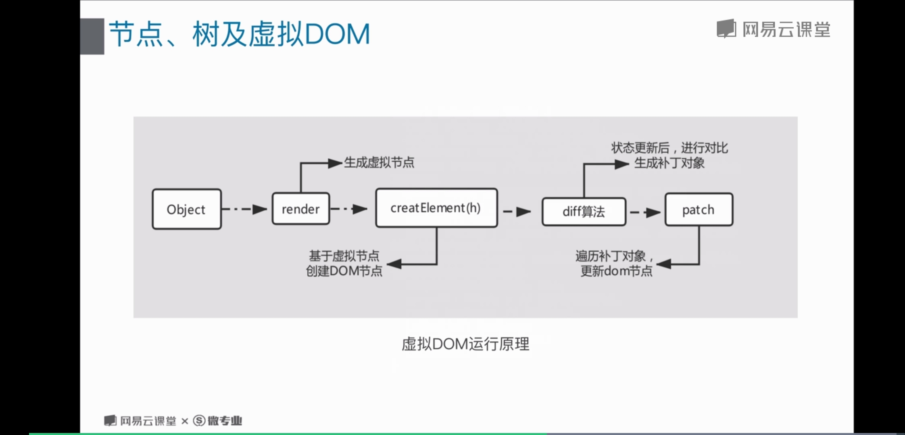

# 7 渲染函数及jsx语法

## 渲染函数 (render函数)

### 渲染函数介绍
* 通过 createElment 函数来创建虚拟DOM (VirtualDom) , 这个虚拟DOM包含的信息会告诉你 Vue 页面上需要渲染出什么函数
* 可以解决有些场景中用template实现起来代码冗长繁琐，而且有大量重复的代码

### 渲染函数解析
* render 函数的返回值 VNode (即： 虚拟节点)， 也就是我们要渲染的节点
* render 函数的参数  createElement 是render 函数的参数， 它本身也是个函数， 并且有三个参数。 createElement 函数的返回值也是 VNode 虚拟节点。

### 渲染函数写法
* 第一个参数必选， 可以是 一个 HTML 标签， 也可以是一个组件或者函数
* 第二个是可选参数， 数据对象， 在template中使用
* 第三个是子节点，也是可选参数， 用法一致
```javascript
Vue.component('anchored-heading', {
  render: function (createElement) {
    return createElement(
      'h' + this.level,   // 标签名称 -- 必填
      this.$slots.default // 子节点数组 -- 第三个参数
    )
  },
  props: {
    level: {
      type: Number,
      required: true
    }
  }
})
```

## 节点 树及虚拟DOM

### 概念
* 当浏览器读到一些DOM结构时， 会建立一个 'DOM 节点' 树来保持追踪所有内容， 如同你会画一张家谱树来追踪家庭成员的发展一样。
* 虚拟 DOM(VirtualDom) 就是通过一种 VNode (节点) 类表达的， 每个DOM元素或组件都对应一个 VNode 对象
* 使用javascript对象模拟 DOM 结构的树形结构， 这个树结构包含整个 DOM 结构的信息

### VNode 对象源码
每个DOM元素或组件都对应一个VNode对象， 具体含义见图
;

### 虚拟DOM运行原理
;

## JSX 语法及函数式组件

### JSX 语法
* javascript 和 xml 结合的一种格式。 最早react 发明了 jsx， 利用html语法来创建 dom。jsx执行更快，因为他在编译为js代码后进行优化。他是类型安全，在编译过程中就能发现错误。使用jsx编写模板更加简单快速。

* jsx 需要babel插件转义为普通的HTML

```javascript
import List from './list.vue';
new Vue({
	el: '#app',
	render: function (h) {
		return (
			<List level={1}>
				<span>Hello</span> world!
			</List>
		)
	}
})
```

### 函数式组件
* 可以把函数式组件相像成组件里的一个函数， 入参式渲染上下文(render, context), 返回值式渲染号的html
* 特性： 
1. stateless (无状态) ： 组件自身是没有状态。
2. instanceless (无实例) ： 组件自身没有实例，也就是没有this
* 函数式组件没有this， 参数就是靠context来传递的，context完整属性可参照官方文档查询
```javascript
export defalut {
	name: 'functional-button',
	functional: true,
	render(h, context) {
		return h('button', 'click me');
	}
}
```
* content 对象
1. props：提供所有 prop 的对象
2. children: VNode 子节点的数组
3. slots: 一个函数，返回了包含所有插槽的对象
4. scopedSlots: (2.6.0+) 一个暴露传入的作用域插槽的对象。也以函数形式暴露普通插槽。
5. data：传递给组件的整个数据对象，作为 createElement 的第二个参数传入组件
6. parent：对父组件的引用
7. listeners: (2.3.0+) 一个包含了所有父组件为当前组件注册的事件监听器的对象。这是 data.on 的一个别名。
8. injections: (2.3.0+) 如果使用了 inject 选项，则该对象包含了应当被注入的属性

* 向子元素或子组件传递特性和事件
1. 普通函数式组件
在普通组件中，没有被定义为 prop 的特性会自动添加到组件的根元素上，将已有的同名特性进行替换或与其进行智能合并。
```javascript
Vue.component('my-functional-button', {
  functional: true,
  render: function (createElement, context) {
    // 完全透传任何特性、事件监听器、子节点等。
    return createElement('button', context.data, context.children)
  }
})
```
2. 模板函数式组件
需要手动添加特性和监听器
```javascript
<template functional>
  <button
    class="btn btn-primary"
    v-bind="data.attrs"
    v-on="listeners"
  >
    <slot/>
  </button>
</template>
```

3. slots() 和 children 对比
对于这个组件， children 会给你两个段落标签， 而slots().defalut只会传递第二个匿名段落， slots().foo 会传递第一个具名段落标签。同时拥有 children 和 slots(), 因此你可以选择让组件感知某个从插槽机制， 还是简单地传递移交children， 移交给组件去处理
```html
<my-functional-component>
  <p v-slot:foo>
    first
  </p>
  <p> second </p>
</my-functional-component>
```