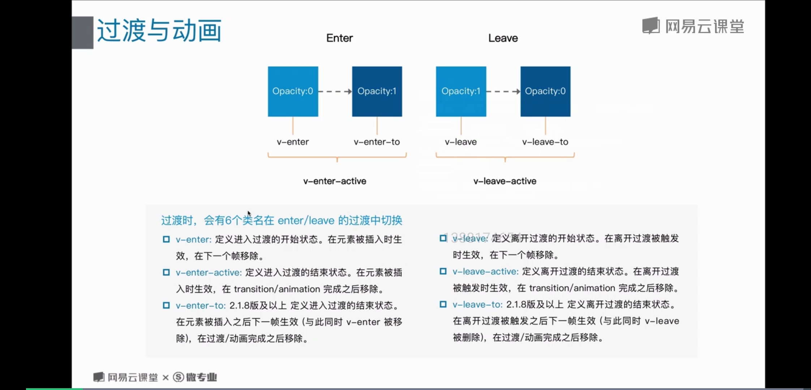

# 8 过渡与动画

## Vue 过渡与动画
* Vue 在插入，更新或者移除 Dom 时，提供多种不同方式地应过渡效果
* Vue 提供了内置地过渡封装组件，该组件用于包裹要实现过渡效果地组件
```html
<div id="demo">
  <button v-on:click="show = !show">
    Toggle
  </button>
  <transition name="fade">
    <p v-if="show">hello</p>
  </transition>
</div>
```
```javascript
new Vue({
  el: '#demo',
  data: {
    show: true
  }
})
```
```css
.fade-enter-active, .fade-leave-active {
  transition: opacity .5s;
}
.fade-enter, .fade-leave-to /* .fade-leave-active below version 2.1.8 */ {
  opacity: 0;
}
```
;

### 钩子函数
* 钩子函数可以结合 css tanstions / animations 使用，也可以单独使用
* 当只用 js 过渡时， 在enter 和 leave 中必须使用 done 进行回调。 否则， 他们将被同步调用，过渡会立即完成

> 推荐对于仅使用 JavaScript 过渡的元素添加 v-bind:css="false"，Vue 会跳过 CSS 的检测。这也可以避免过渡过程中 CSS 的影响。

```html
<button :click='show = !show'> </button>
<transition
  v-on:before-enter="beforeEnter"
  v-on:enter="enter"
  v-on:after-enter="afterEnter"
  v-on:enter-cancelled="enterCancelled"

  v-on:before-leave="beforeLeave"
  v-on:leave="leave"
  v-on:after-leave="afterLeave"
  v-on:leave-cancelled="leaveCancelled"
>
 <p v-if='show'> vue 动画 js 钩子 </p>
</transition>
```
```javascript
methods: {
  // --------
  // 进入中
  // --------

  beforeEnter: function (el) {
    // ...
  },
  // 当与 CSS 结合使用时
  // 回调函数 done 是可选的
  enter: function (el, done) {
    // ...
    done()
  },
  afterEnter: function (el) {
    // ...
  },
  enterCancelled: function (el) {
    // ...
  },

  // --------
  // 离开时
  // --------

  beforeLeave: function (el) {
    // ...
  },
  // 当与 CSS 结合使用时
  // 回调函数 done 是可选的
  leave: function (el, done) {
    // ...
    done()
  },
  afterLeave: function (el) {
    // ...
  },
  // leaveCancelled 只用于 v-show 中
  leaveCancelled: function (el) {
    // ...
  }
}
```

### 初始渲染地过渡
* 可以通过 appear 特性设置节点在初始渲染地过渡
* 右侧代码默认和进入/离开过渡一样，同样可以自定义css类名。
* 无论时appear特性还是v-on：appear钩子都会生成初始渲染过渡
```html
<transition
  appear
  appear-class="custom-appear-class"
  appear-to-class="custom-appear-to-class" (2.1.8+)
  appear-active-class="custom-appear-active-class"
>
  <!-- ... -->
</transition>
```

### 多个元素地过渡
* 当有相同标签名的元素切换时，需要通过 key 特性设置唯一的值来标记以让 Vue 区分它们，否则 Vue 为了效率只会替换相同标签内部的内容。即使在技术上没有必要，给在 /<transition/> 组件中的多个元素设置 key 是一个更好的实践。

```html
<transition>
  <button v-if="isEditing" key="save">
    Save
  </button>
  <button v-else key="edit">
    Edit
  </button>
</transition>
```

### 多个组件的过渡

* 多个组件的过渡简单很多 - 我们不需要使用 key 特性。相反，我们只需要使用动态组件：

```html
<transition name="component-fade" mode="out-in">
  <component v-bind:is="view"></component>
</transition>
```

### 列表组件

* 同时渲染整个组件

```html
<div id="list-demo" class="demo">
  <button v-on:click="add">Add</button>
  <button v-on:click="remove">Remove</button>
  <transition-group name="list" tag="p">
    <span v-for="item in items" v-bind:key="item" class="list-item">
      {{ item }}
    </span>
  </transition-group>
</div>
```

### 可复用的过渡

* 过渡可以通过 Vue 的组件系统实现复用。要创建一个可复用过渡组件，你需要做的就是将 /<transition/> 或者 /<transition-group/> 作为根组件，然后将任何子组件放置在其中就可以了。

```javascript
Vue.component('my-special-transition', {
  functional: true,
  render: function (createElement, context) {
    var data = {
      props: {
        name: 'very-special-transition',
        mode: 'out-in'
      },
      on: {
        beforeEnter: function (el) {
          // ...
        },
        afterEnter: function (el) {
          // ...
        }
      }
    }
    return createElement('transition', data, context.children)
  }
})
```

### 动态过渡

* 在 Vue 中即使是过渡也是数据驱动的！动态过渡最基本的例子是通过 name 特性来绑定动态值。
* 所有过渡特性都可以动态绑定，但我们不仅仅只有特性可以利用，还可以通过事件钩子获取上下文中的所有数据，因为事件钩子都是方法。这意味着，根据组件的状态不同，你的 JavaScript 过渡会有不同的表现。

```html
<transition v-bind:name="transitionName">
  <!-- ... -->
</transition>

<transition
  v-bind:css="false"
  v-on:before-enter="beforeEnter"
  v-on:enter="enter"
  v-on:leave="leave"
>
  <p v-if="show">hello</p>
</transition>
```

### 状态过渡

* 对于数据元素本身的特效， 这么数据要么就以竖直形式存储，要么可以转换为数值。有了这么数值后，我们就可以结合 Vue 的响应式和组件系统， 使用第三方库来实现切换元素的过渡状态

> TweenMax.min.js

```html
<div id="animated-number-demo">
  <input v-model.number="number" type="number" step="20">
  <p>{{ animatedNumber }}</p>
</div>
```