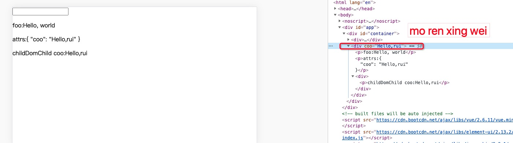

# $attrs,$listerners，inheritAttrs的使用

demo vue-demo

A 组件中 有 B 组件，B 组件中有 C 组件， C 组件获取 A 组件 中值 ，调用 A 组件中方法

为了解决该需求，引入了$attrs 和$listeners ， 新增了inheritAttrs 选项。 在版本2.4以前，默认情况下父作用域的不被认作props的属性属性百年孤独，将会“回退”且作为普通的HTML特性应用在子组件的根元素上。如下列的例子

父组件demo代码如下

```vue
<template>
   <div>
     <child-dom
      :foo="foo"
      :coo="foo"
     >
     </child-dom>
   </div>
</template>
<script>
   import childDom from "./ChildDom.vue";
   export default {
     data() {
        return {
          foo:"Hello, world",
          coo:"Hello,rui"
        }
     },
     components:{childDom},
   }
</script>
```

子组件child-dom代码如下

```vue
<template>
   <div>
      <p>foo:{{foo}}</p>
   </div>
</template>
<script>
export default {
  name:'child-dom'
  props:["foo"]
}
</script>
```

在2.4中新增选项inheritAttrs  inheritAttrs的默认值为true, 将inheritAttrs的值设为false, 这些默认的行为会禁止掉。但是通过实例属性$attrs ,可以将这些特性生效，且可以通过v-bind 绑定到子组件的非根元素上。

默认的行为展示

;

修改子组件代码如下

```vue
<template>
   <div>
      <p>foo:{{foo}}</p>
      <p>attrs:{{$attrs}}</p>
      <childDomChild v-bind="$attrs"></childDomChild>
   </div>
</template>
<script>
import childDomChild from './childDomChild';
export default {
  name:'child-dom'
  props:["foo"],
  inheritAttrs:false,  // 新加这个属性 根元素 不会有 coo 属性
}
</script>
```

新增子组件 childDomChild

```vue
<template>
  <div>
    <p @click="startUpRocket">childDomChild coo:{{coo}}</p>
  </div>
</template>
<script>
export default {
  name: 'childDomChild',
  props: ["coo"],
  inheritAttrs: false,
  methods: {
    startUpRocket() {
      this.$emit('upRocket');
    }
  }
}
</script>
```

<!-- 输出的结果如下 -->

c组件的信息，怎么同步给a组件呢？ 

vue2.4版本新增了$listeners 属性，我们在b组件上 绑定 v-on=”$listeners”, 在a组件中，监听c组件触发的事件。就能把c组件发出的数据，传递给a组件。

A 组件

```vue
<template>
  <div id="container">
    <!-- 这是 userList  {{user}} -->
    <div>
      <my-input v-model="data"></my-input>
    </div>
    <child-dom v-on:upRocket="reciveRocket" :foo="foo" :coo="coo"></child-dom>
  </div>
</template>

<script>
// import app from '../../plugin/test'
// console.log(app);
import myInput from '@/components/myInput'
import childDom from '@/components/childDom'

export default {
  name: 'App',
  components: {
    myInput,
    childDom
  },
  data() {
    return {
      user: '',
      data: '',
      foo: "Hello, world",
      coo: "Hello,rui"
    }
  },
  // asyncData({isDev, route, store, env, params, query, req, res, redirect, error}) {
  asyncData(obj) {
    console.log('obj', obj);
  },
  watch: {
    data() {
      console.log(this.data)
    }
  },
  beforeRouteEnter(to, from, next) {
    next(vm => {
      // console.log(vm);
    })
  },
  mounted() {
    this.getUserList();
    console.log('this', this);
    // asyncData();
  },
  methods: {
    getUserList() {
      this.$api.get('/static/common/user').then(res => {
        console.log('res', res);
        this.user = res;
      })
    },
    reciveRocket() {
      console.log('reciveRocket');
    }
  },
}
</script>

<style>
</style>
```

B 组件 
 
```vue
<template>
  <div>
    <p>foo:{{foo}}</p>
    <p>attrs:{{$attrs}}</p>
    <childDomChild v-bind="$attrs" v-on="$listeners"></childDomChild>
  </div>
</template>
<script>
import childDomChild from './childDomChild';
export default {
  name: 'child-dom',
  components: {
    childDomChild
  },
  props: ["foo"],
  inheritAttrs: false,
  methods: {
    findSum(arr, value) {

      // 
      currentTargetIndex = 0;
      let message = {
        backmessage: { isHide: [] },
        operate: {
          isRight: false,
          currentEleIndex: 0
        }
      }

      // if (this.isC) {
      let isC = true; // true 同端 false 异端
      this.showOperate(isC)
      this.allOperate.push(message.operate);
      // } else {

      // }

      let s = new Set(arr);
      for (let i = 0; i < arr; i++) {


      }
    },
    showOperate(isC) {


    },
    fn() {
      const findSum = (arr, sum) =>
        arr.some((set => n => set.has(n) || !set.add(sum - n))(new Set));

    },
    fn1() {
      const findSum = function(arr, sum) {
        arr.some((set => n => set.has(n) || !set.add(sum - n))(new Set));
      }

    }
  },
}
</script>
```

C 组件

```vue
<template>
  <div> 
    <p @click="startUpRocket">childDomChild coo:{{coo}}</p>
  </div>
</template>
<script>
export default {
  name: 'childDomChild',
  props: ["coo"],
  inheritAttrs: false,
  methods: {
    startUpRocket() {
      // 点击触发 A 组件中的方法
      this.$emit('upRocket');
    }
  }
}
</script>
```