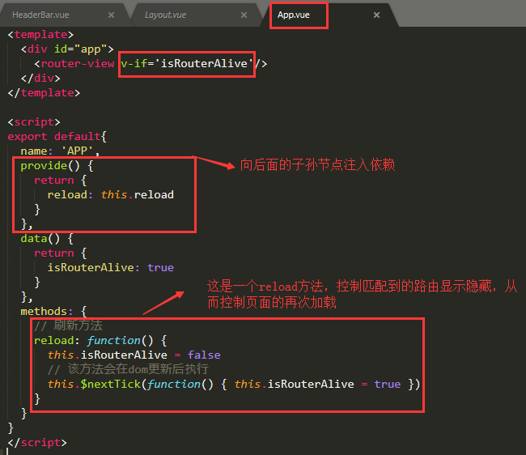
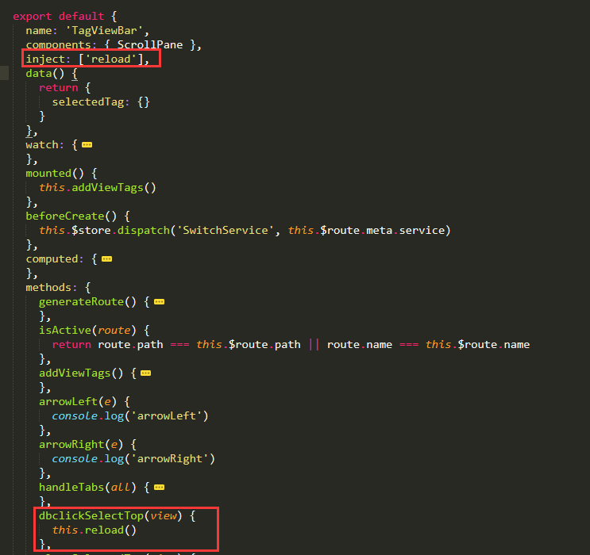
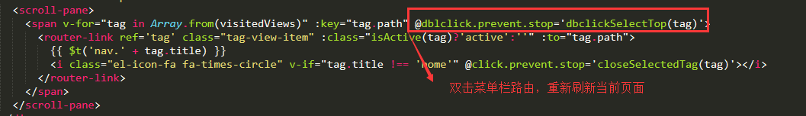
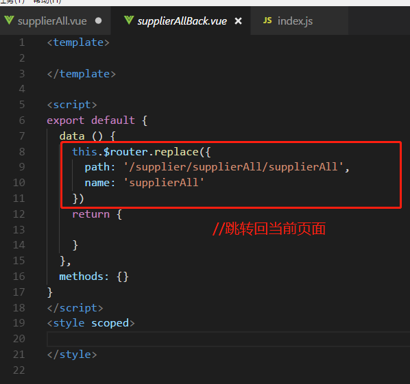
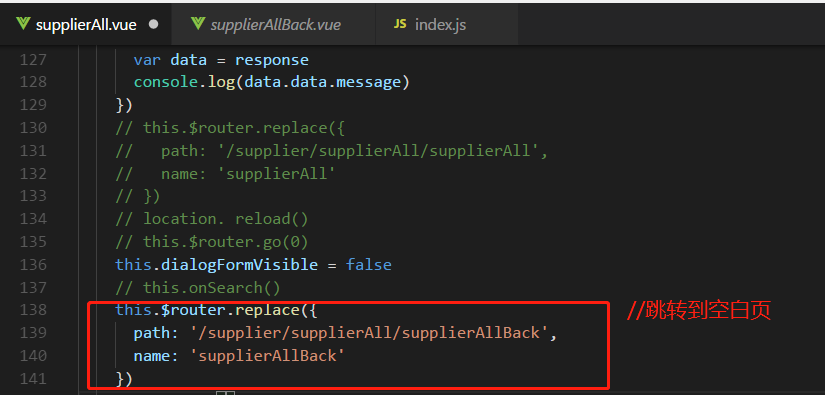

# provide和inject刷新当前路由（页面）

## provide 和 inject 使用场景
刷新当前页面， 比如在处理列表时，常常有删除一条数据或者新增数据之后需要重新刷新当前页面的需求。

## 遇到的问题
* 用vue-router重新路由到当前页面，页面是不进行刷新的
* 采用window.reload()，或者router.go(0)刷新时，整个浏览器进行了重新加载，闪烁，体验不好

## 解决方法 provide / inject 组合

* 作用：允许一个祖先组件向其所有子孙后代注入一个依赖，不论组件层次有多深，并在起上下游关系成立的时间里始终生效。

App.vue

;

TagViewBar.vue

;
;

还有一种方式 就是 新建一个空白页面 supplierAllBack.vue , 点击确定的时候先跳转到这个空白页，然后再立马跳转回来

;

空白页supplierAllBack.vue里面的内容：

;

这个方式，相比第一种不会出现一瞬间的空白页，只是地址栏有个快速的切换的过程，可采用
