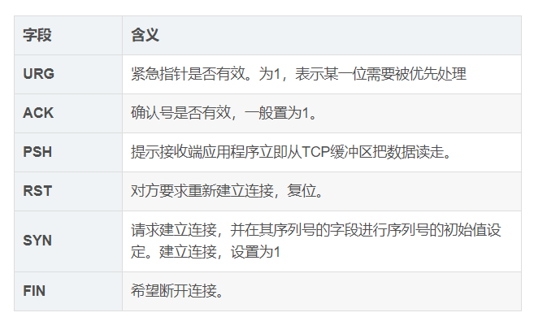

# 1.TCP ISN、三次握手、四次挥手

## 1.1 其中比较重要的字段有

* 序列号seq：占4个字节，用来标记数据段的顺序，TCP把连接中发送的所有数据字节都编上一个序号，第一个字节的编号由本地随机产生；给字节编上序号后，就给每一个报文段指派一个序号；序列号seq就是这个报文段中的第一个字节的数据编号。

* 确认号ack：占4个字节，ack序号。表示期待收到对方下一个报文段的第一个数据字节的序号（seq）只有ACK=1时，确认序号字段才有效，ack=Seq+1。

* 确认ACK：占1位，仅当ACK=1时，确认号ack字段才有效。ACK=0时，确认号ack无效

* 同步SYN：连接建立时用于同步序号。当SYN=1，ACK=0时表示：这是一个连接请求报文段。

* 若同意连接，则在响应报文段中使得SYN=1，ACK=1。

> 因此，SYN=1表示这是一个连接请求，或连接接受报文。

> SYN这个标志位只有在TCP建产连接时才会被置1，握手完成后SYN标志位被置0。

* 终止FIN：用来释放一个连接。FIN=1表示：此报文段的发送方的数据已经发送完毕，并要求释放运输连接

> 注意：ACK、SYN和FIN这些大写的单词表示标志位，其值要么是1，要么是0；ack、seq小写的单词表示序号。

标志位（Flags）：共6个，即URG、ACK、PSH、RST、SYN、FIN等。

## 1.2 ISN

* Initial Sequence Number，简称ISN。

* **就是上文的seq的初始化。**

随机生成的方式

## 1.3 三次握手

三次握手（Three-way Handshake）其实就是指建立一个TCP连接时，需要客户端和服务器总共发送3个包。进行三次握手的主要作用就是为了确认双方的接收能力和发送能力是否正常、指定自己的初始化序列号为后面的可靠性传送做准备。实质上其实就是连接服务器指定端口，建立TCP连接，并同步连接双方的序列号和确认号，交换TCP窗口大小信息。

刚开始客户端处于 Closed 的状态，服务端处于 Listen 状态。 进行三次握手：

* 第一次握手：

客户端给服务端发一个 SYN 报文，并指明客户端的初始化序列号 ISN(c)。此时客户端处于 SYN_SEND 状态。

首部的同步位SYN=1，初始序号seq=x，SYN=1的报文段不能携带数据，但要消耗掉一个序号。

* 第二次握手：
服务器收到客户端的 SYN 报文之后，会以自己的 SYN 报文作为应答，并且也是指定了自己的初始化序列号 ISN(s)。同时会把客户端的 ISN + 1 作为ACK 的值，表示自己已经收到了客户端的 SYN，此时服务器处于 SYN_RCVD 的状态。

在确认报文段中SYN=1，ACK=1，确认号ack=x+1，初始序号seq=y。

* 第三次握手：

客户端收到 SYN 报文之后，会发送一个 ACK 报文，当然，也是一样把服务器的 ISN + 1 作为 ACK 的值，表示已经收到了服务端的 SYN 报文，此时客户端处于 ESTABLISHED 状态。服务器收到 ACK 报文之后，也处于 ESTABLISHED 状态，此时，双方已建立起了连接。

确认报文段ACK=1，确认号ack=y+1，序号seq=x+1（初始为seq=x，第二个报文段所以要+1），ACK报文段可以携带数据，不携带数据则不消耗序号。

### 1.3.1 为什么需要三次握手，两次不行吗？

弄清这个问题，我们需要先弄明白三次握手的目的是什么，能不能只用两次握手来达到同样的目的。

* 第一次握手：

客户端发送网络包，服务端收到了。

这样服务端就能得出结论：客户端的发送能力、服务端的接收能力是正常的。

* 第二次握手：

服务端发包，客户端收到了。

这样客户端就能得出结论：服务端的接收、发送能力，客户端的接收、发送能力是正常的。不过此时服务器并不能确认客户端的接收能力是否正常。

* 第三次握手：

客户端发包，服务端收到了。

这样服务端就能得出结论：客户端的接收、发送能力正常，服务器自己的发送、接收能力也正常。

因此，需要三次握手才能确认双方的接收与发送能力是否正常。

### 1.3.2  什么是半连接队列？

服务器第一次收到客户端的 SYN 之后，就会处于 SYN_RCVD 状态，此时双方还没有完全建立其连接，服务器会把此种状态下请求连接放在一个队列里，我们把这种队列称之为半连接队列。

当然还有一个全连接队列，就是已经完成三次握手，建立起连接的就会放在全连接队列中。如果队列满了就有可能会出现丢包现象。

这里在补充一点关于SYN-ACK 重传次数的问题：

服务器发送完SYN-ACK包，如果未收到客户确认包，服务器进行首次重传，等待一段时间仍未收到客户确认包，进行第二次重传。如果重传次数超过系统规定的最大重传次数，系统将该连接信息从半连接队列中删除。注意，每次重传等待的时间不一定相同，一般会是指数增长，例如间隔时间为 1s，2s，4s，8s...

### 1.3.3 ISN(Initial Sequence Number)是固定的吗？

当一端为建立连接而发送它的SYN时，它为连接选择一个初始序号。ISN随时间而变化，因此每个连接都将具有不同的ISN。ISN可以看作是一个32比特的计数器，每4ms加1 。这样选择序号的目的在于防止在网络中被延迟的分组在以后又被传送，而导致某个连接的一方对它做错误的解释。

三次握手的其中一个重要功能是客户端和服务端交换 ISN(Initial Sequence Number)，以便让对方知道接下来接收数据的时候如何按序列号组装数据。如果 ISN 是固定的，攻击者很容易猜出后续的确认号，因此 ISN 是动态生成的。

### 1.3.4 三次握手过程中可以携带数据吗？

其实第三次握手的时候，是可以携带数据的。但是，第一次、第二次握手不可以携带数据

为什么这样呢?大家可以想一个问题，假如第一次握手可以携带数据的话，如果有人要恶意攻击服务器，那他每次都在第一次握手中的 SYN 报文中放入大量的数据。因为攻击者根本就不理服务器的接收、发送能力是否正常，然后疯狂着重复发 SYN 报文的话，这会让服务器花费很多时间、内存空间来接收这些报文。

也就是说，第一次握手不可以放数据，其中一个简单的原因就是会让服务器更加容易受到攻击了。而对于第三次的话，此时客户端已经处于 ESTABLISHED 状态。对于客户端来说，他已经建立起连接了，并且也已经知道服务器的接收、发送能力是正常的了，所以能携带数据也没啥毛病。

## 1.4 四次挥手

建立一个连接需要三次握手，而终止一个连接要经过四次挥手（也有将四次挥手叫做四次握手的）。这由TCP的半关闭（half-close）造成的。所谓的半关闭，其实就是TCP提供了连接的一端在结束它的发送后还能接收来自另一端数据的能力。

TCP 的连接的拆除需要发送四个包，因此称为四次挥手(Four-way handshake)，客户端或服务器均可主动发起挥手动作。
刚开始双方都处于 ESTABLISHED 状态，假如是客户端先发起关闭请求。四次挥手的过程如下：

* 第一次挥手：

客户端发送一个 FIN 报文，报文中会指定一个序列号。此时客户端处于 FIN_WAIT1 状态。
即发出连接释放报文段（FIN=1，序号seq=u），并停止再发送数据，主动关闭TCP连接，进入FIN_WAIT1（终止等待1）状态，等待服务端的确认。

* 第二次挥手：

服务端收到 FIN 之后，会发送 ACK 报文，且把客户端的序列号值 +1 作为 ACK 报文的序列号值，表明已经收到客户端的报文了，此时服务端处于 CLOSE_WAIT 状态。

即服务端收到连接释放报文段后即发出确认报文段（ACK=1，确认号ack=u+1，序号seq=v），服务端进入CLOSE_WAIT（关闭等待）状态，此时的TCP处于半关闭状态，客户端到服务端的连接释放。客户端收到服务端的确认后，进入FIN_WAIT2（终止等待2）状态，等待服务端发出的连接释放报文段。

* 第三次挥手：

如果服务端也想断开连接了，和客户端的第一次挥手一样，发给 FIN 报文，且指定一个序列号。此时服务端处于 LAST_ACK 的状态。
即服务端没有要向客户端发出的数据，服务端发出连接释放报文段（FIN=1，ACK=1，序号seq=w，确认号ack=u+1），服务端进入LAST_ACK（最后确认）状态，等待客户端的确认。

* 第四次挥手：

客户端收到 FIN 之后，一样发送一个 ACK 报文作为应答，且把服务端的序列号值 +1 作为自己 ACK 报文的序列号值，此时客户端处于 TIME_WAIT 状态。需要过一阵子以确保服务端收到自己的 ACK 报文之后才会进入 CLOSED 状态，服务端收到 ACK 报文之后，就处于关闭连接了，处于 CLOSED 状态。
即客户端收到服务端的连接释放报文段后，对此发出确认报文段（ACK=1，seq=u+1，ack=w+1），客户端进入TIME_WAIT（时间等待）状态。此时TCP未释放掉，需要经过时间等待计时器设置的时间2MSL后，客户端才进入CLOSED状态。

收到一个FIN只意味着在这一方向上没有数据流动。客户端执行主动关闭并进入TIME_WAIT是正常的，服务端通常执行被动关闭，不会进入TIME_WAIT状态。

参考：
链接：https://juejin.cn/post/6844903958624878606
原文链接：https://blog.csdn.net/jy02268879/article/details/107664035