# 1.maven

Maven 是 apache 旗下的一个开源项目, 是一款用于管理和构建 java 项目的工具.

## 1.2.maven 介绍

### 1.2.1.maven 作用

* 方便快捷的管理项目依赖的资源(jar包), 避免版本冲突的问题
* 统一项目结构: 提供标准统一的项目结构
* 跨平台 (清理、测试、编译、打包、发布)

### 1.2.2.maven 的项目结构

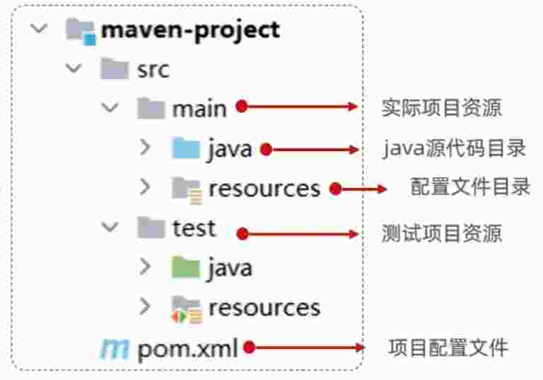

## 1.2.3.配置 jar 包

pom.xml

```xml
<dependencies>
  <dependency>
    <groupId>ch.qos.logback</groupId>
    <artifactId>logback-classic</artifactId>
    <version>1.2.11</version>
  </dependency>
</dependencies>
```

### 1.2.4.maven编译和打包

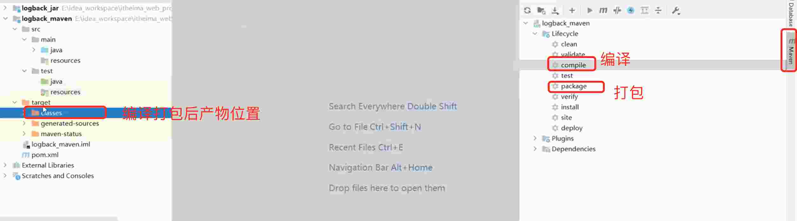

> 编译打包后的产物  ***是放在 target 的目录下***

### 1.2.5.maven 模型

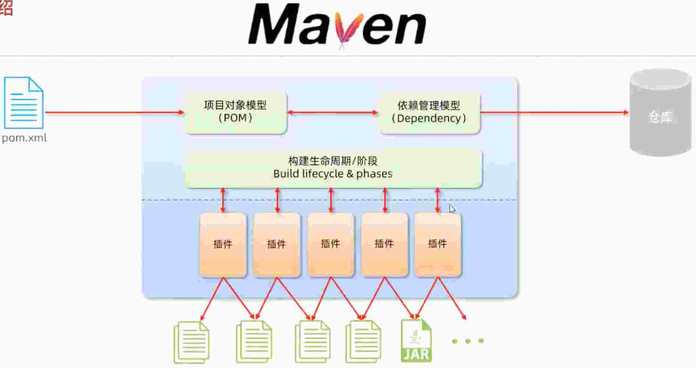

### 1.2.6.maven 安装

1. 解压下载的安装包
2. 配置本地仓库: 修改 conf/setting.xml 中 < localRepository > 为一个指定目录 (这是连接中央仓库下载的地址)
3. 修改阿里云私服 

```
http://maven.aliyun.com/nexus/content/groups/public
```

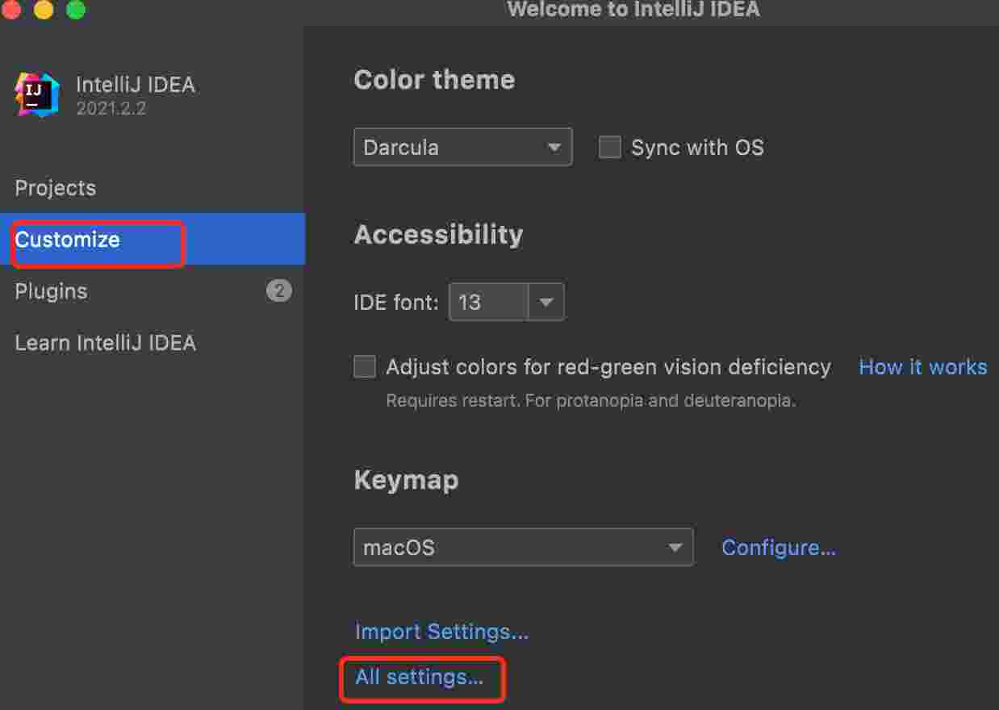
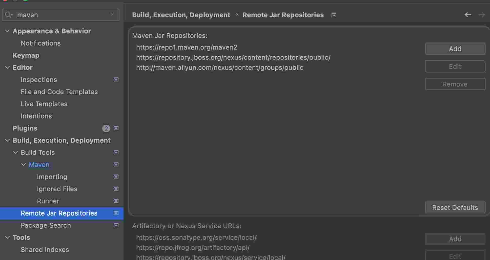

4. 配置环境变量

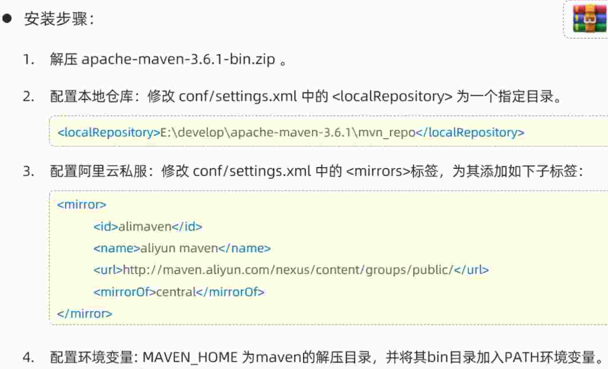

> 本次课程是在 jdk 11 版本, 编辑器有问题后边再说

* 全局配置
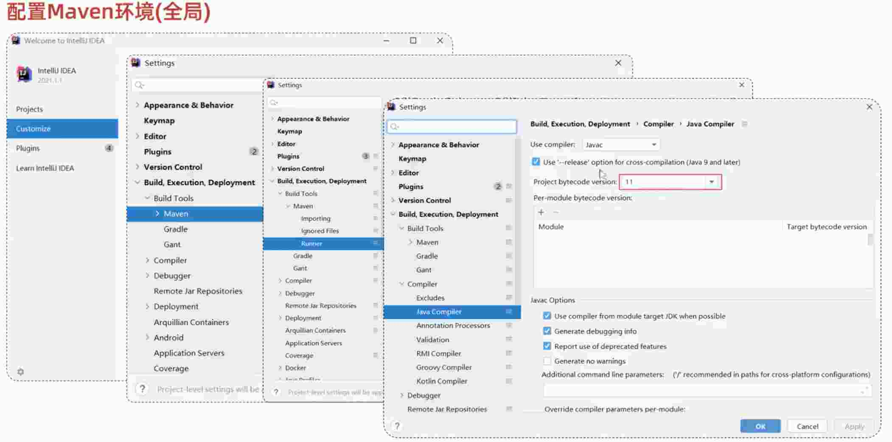


### 1.2.7.maven 创建项目


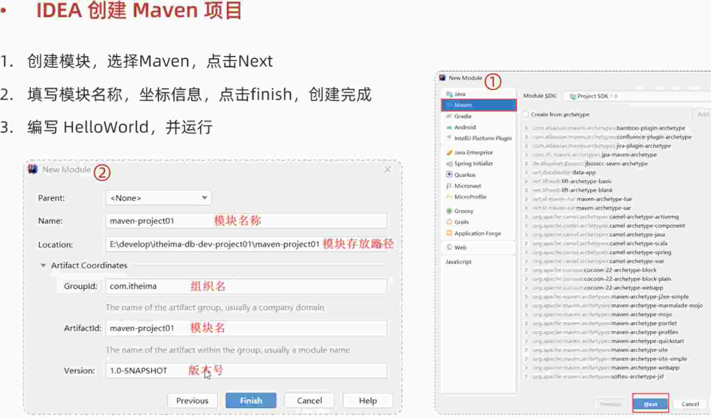


## 1.3.仓库

用于存储资源，管理各种 jar 包

* 本地仓库: 自己计算机上的一个目录
* 中央仓库: 有 Maven 团队维护全球唯一的。 仓库地址: https://repol.maven.org/maven2/
* 远程私服: 一般有团队构建的私有仓库

### 1.3.1.访问仓库的顺序

本地仓库 -> 中央仓库 -> 远程私服

## 1.4.maven 的坐标

### 1.4.1.什么是坐标

Maven 中的坐标是资源的唯一标识符, 通过该坐标可以唯一定位资源位置

使用坐标来定义项目或引入项目中需要的依赖

### 1.4.2.Maven 坐标主要组成

* groupId: 定义当前 Maven 项目隶属组织名称 (通常是域的反写, 例如: com.itheima)
* artifactId: 定义当前 Maven 项目名称 (通常是模块名称, 例如: order-service, goods-service)
* version: 定义当前项目版本号

```xml
<groupId>com.itheima</groupId>
<artifactId>maven-project1</artifactId>
<version>1.0-SNAPSHOT</version>

<dependency>
  <groupId>com.itheima</groupId>
  <artifactId>maven-project1</artifactId>
  <version>1.0-SNAPSHOT</version>
</dependency>
```

## 1.5.maven 导入项目

### 1.5.1.方式一

点击maven中 + 号 选择 .xml 文件进行导入

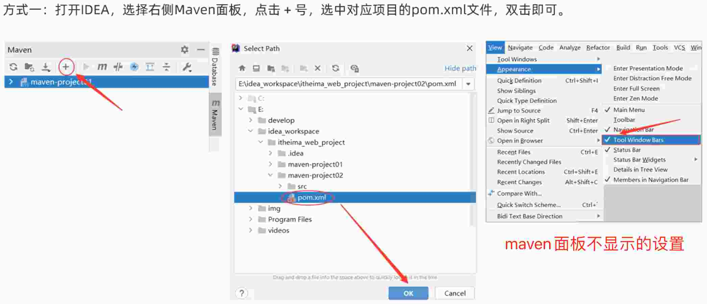
### 1.5.2.方式二

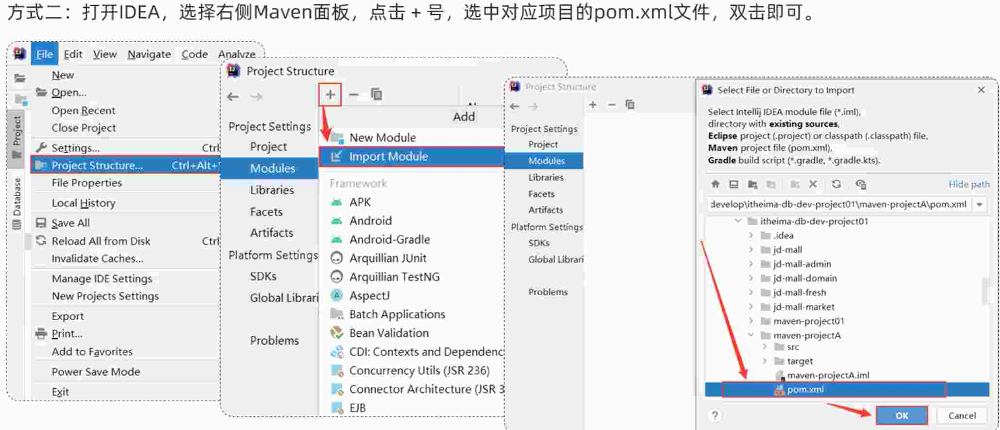

## 1.6.依赖管理

### 1.6.1.依赖配置

* 依赖: 指当前项目运行所需要的 jar 包, 一个项目中可以引入多个依赖

* 配置: 
  - 在 pom.xml 中编写 < dependencies > 标签
  - 在 < dependencies > 标签 中使用 < dependency > 引入坐标
  - 定义坐标的 groupId、 artifactId、 version
  - 点击刷新按钮, 引入最新加入的坐标

```xml
<dependencies>
  <dependency>
    <groupId>com.itheima</groupId>
    <artifactId>maven-project1</artifactId>
    <version>1.0-SNAPSHOT</version>
  </dependency>
</dependencies>
```

> 如果进入的依赖本地仓库不存在, 将直接连接远程/中央仓库, 然后下载依赖. (比较耗时, 耐心等待)
> 如果不知道依赖坐标信息, 可以到 https://mvnrepository.com 中搜索

### 1.6.2.依赖传递

* 依赖具有传递性
  - 直接依赖: 在当前项目中通过依赖配置建立的依赖关系
  - 间接依赖: 被依赖的资源如果依赖其他资源, 当前项目间接依赖其他项目

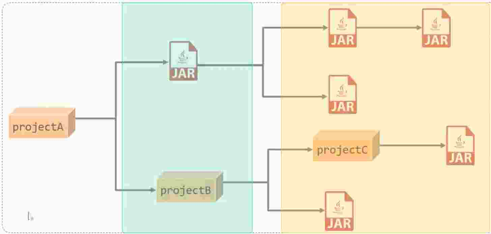

* 排除依赖

是指主动断开依赖的资源, 被排除的资源无需指定版本

```xml
<dependency>
  <groupId>com.itheima<groupId>
  <artifactId>maven-projectB</artifactId>
  <version>1.0-SNAPSHOT</version>
  <exclusions>
    <exclusion>
      <groupId>junit<groupId>
      <artifactId>junit</artifactId>
    </exclusion>
  </exclusions>
</dependency>
```

### 1.6.1.依赖范围

依赖的 jar 包, 默认情况下, 可以在任何地方使用. 可以通过 < scope >...</ scope > 设置其作用范围

* 作用范围
  - 主程序范围有效 (main 文件夹范围内)
  - 测试程序范围有效 (test 文件夹范围内)
  - 是否参与打包运行 (package 指令范围内)


```xml
<dependency>
  <groupId>junit<groupId>
  <artifactId>junit</artifactId>
  <version>4.0</version>
  <scope>test</scope>
</dependency>
```

scope 值 | 主程序 | 测试程序 | 打包(运行) | 范例
-- | -- | -- | -- | -- 
compile(默认) | Y | Y | Y | log4j 
test | - | Y | - | junit
provided | Y | Y | - | servlet-api 
runtime | - | Y | Y | jdbc驱动 

### 1.6.1.生命周期

Maven 生命周期就是为了对所有的 maven 项目构建过程进行抽象和统一

* Maven 中有 3 套相互独立的生命周期
  - clean: 清理工作
  - default: 核心工作, 如: 编译、 测试、 打包、 安装、 部署等
  - site: 生成报告、 发布站点等

* 每一套生命周期包含一些阶段 phase, 阶段是有顺序的, 后面的阶段依赖于前面的阶段

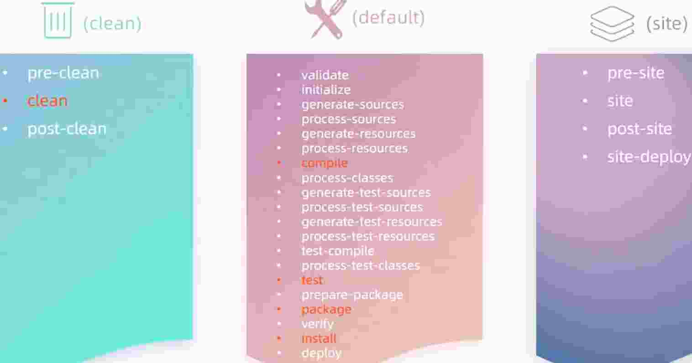

> 常用的生命周期标记为红色

* 生命周期阶段
  - clean: 移除上一次构建生成的文件
  - compile: 编译项目源代码
  - test: 使用合适的单元测试框架运行测试(junit)
  - package: 将编译后的文件打包, 如: jar、 war 等
  - install: 安装项目到本地仓库

> 在 ***同一套生命周期*** 里, 当运行后面的阶段

* 生命的周期执行方式
  - 在idea中, 右侧 maven 工具栏, 选中对应的生命周期, 双击执行
  - 在命令行通过命令执行, 如: mvn compile


## 1.7.maven 使用的总结

1. 下载 maven 

存放在百度网盘里了, 3.8.4版本

2. 解压

3. 放到一个目录下边

我使用的时候 放在了  /Users/j/ 下

4. 配置 settings 

* 存放位置 apache-maven-3.8.4/settings.xml
* 配置本地仓库位置
```xml
<localRepository>/Users/j/apache-maven-3.8.4/maven-repository</localRepository>
```
* 配置阿里云镜像仓库
```xml
<mirror>
  <id>alimaven</id>
  <name>aliyun maven</name>
  <url>http://maven.aliyun.com/nexus/content/groups/public/</url>
  <mirrorOf>central</mirrorOf>
</mirror>
```
* 设置 idea 的 maven 配置
  - IntelliJ IDEA 选择 Preferences 选项中 搜索 maven 进行配置

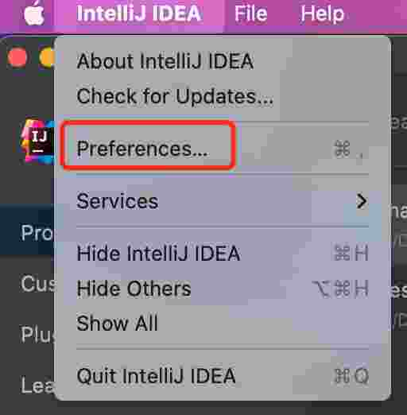  

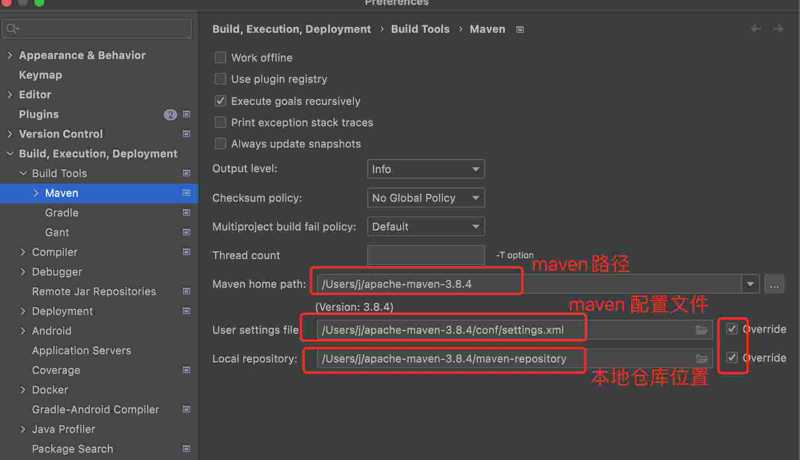  


