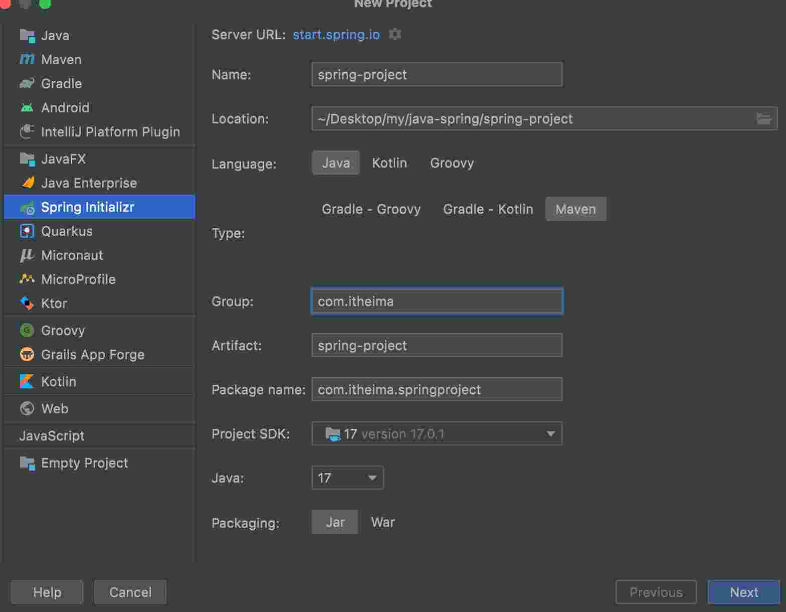

# 2.web入门

## 2.1.SpringBootWeb 入门

* 官网: spring.io
* Spring 发展到现在已经形成了一种开发生态圈, Spring 提供了若干子项目, 每个项目用于完成特定的功能
* Spring Boot 可以帮助我们非常快速的构建应用程序, 简化开发、提高效率

### 2.1.1.新建 SpringBoot 项目创建




> 填写 Artifact 会将 Name 和 Location后边的名字修改
> Package Name 后边的 springproject 可以删除

### 2.1.2.创建接口

```java
package com.itheima.springproject.controller;

import org.springframework.web.bind.annotation.RequestMapping;
import org.springframework.web.bind.annotation.RestController;

@RestController
public class HelloController {
    @RequestMapping("/hello")
    public String hello() {
        System.out.println("hello");
        return "hello world";
    }
}
```

### 2.1.2.springBoot 启动

运行 SpringProjectApplication 文件, springBoot 启动, 默认端口 8080

浏览器中请求: http://localhost:8080/hello 接口

## 2.2.http 协议

### 2.2.1.概念

Hyper Text Transfer Protocol , 超文本传输协议, 规定了浏览器和服务器之间的数据传输的规则

### 2.2.2.特点

1. 基于 TCP 协议: 面向连接, 安全
2. 基于请求-响应模型的: 一次请求对应一次响应
3. HTTP 协议是无状态的协议: 对于事务处理没有记忆能力. 每次请求-响应都是独立的
  - 缺点: 多次请求之间不能共享数据
  - 优点: 速度快

### 2.2.3.http 请求的数据格式


> 请求方式-GET: 请求参数在请求行中, 没有请求体, 如: /brand/findAll?name=OPPO&status=1. get 请求大小是有限制的 
> 请求方式-POST: 请求参数的请求体中, POST 请求大小是没有限制的


### 2.2.4.http 响应 格式


* http 响应的状态码


* 常见的响应状态吗


* 常见的响应头


## 2.3.Tomcat 介绍

web 服务器

web 服务器试一个软件程序, 对 HTTP 协议的操作进行封装, 使得程序员不必直接对协议进行操作, 让 Web 开发更加便捷. 主要功能是 “提供网上信息浏览服务”

### 2.3.1.Web 服务器

* 对 HTTP 协议操作进行封装, 简化web程序开发
* 部署 web 项目, 对外提供网上信息浏览服务

### 2.3.2.Tomcat

* 一个轻量级的 web 服务器, 支持 servlet、 jsp 等少量 javaEE 规范
* 也被称为 web 容器、 servlet 容器

### 2.3.3.Tomcat 目录介绍

```S
bin 可执行文件
conf 配置文件
lib Tomcat依赖的jar包
logs 日志文件
temp 临时文件
webapps 应用发布目录
work 工作目录
```

### 2.3.3.控制台中文乱码

修改 conf/logging.properties

```
java.util.loggging.ConsoleHandler.encoding = GBK  // UTF-8 改为 GBK
```

### 2.3.4.配置 Tomcat 端口号

conf/server.xml 修改 port

```
<Connector port="8080" protocol="HTTP/1.1" connnectionTimeout="20000" redirectPort="8443" />
```

> http 协议默认端口是 80 , 如果将 Tomcat 端口改为 80, 则将来访问 Tomcat 时, 将不用输入端口号

### 2.3.5.部署位置

应用放到 webapps 目录下

## 2.4.SpringBootWeb-入门程序解析

### 2.4.1.起步依赖

* spring-boot-starter-web: 包含了 web 应用开发所需要的常见依赖
* spring-boot-starter-test: 包含了单元测试所需要的常见依赖
* 官网提供的 starter: https://docs.spring.io/spring-boot/docs/2.7.4/reference/htmlsingle/#using.build-systems.starters

> 起步依赖应用了依赖传递

* 父工程确定版本, 包含的包就已经确定
```xml
<!-- 父工程 -->
<parent>
    <groupId>org.springframework.boot</groupId>
    <artifactId>spring-boot-starter-parent</artifactId>
    <version>3.1.5</version>
    <relativePath/> <!-- lookup parent from repository -->
</parent>
```

### 2.4.2.内嵌 Tomcat 服务器

* 基于Springboot 开发的 web 应用程序, 内置了 tomcat 服务器, 当启动类运行时, 会自动启动内嵌的 tomcat 服务器

## 2.5.请求响应 - 概述


* 请求 (HttpServletRequest): 获取请求数据
* 响应 (HttpServletResponse): 设置响应数据
* BS架构: Browser/Server, 浏览器/服务器架构模式. 客户端只需要浏览器, 应用程序的逻辑和数据都存储在服务端
* CS架构: Client/Server, 客户端/服务端架构模式

## 2.6.请求

### 2.6.1.原始方式

在原始的 web 程序中, 获取请求参数, 需要通过 HttpServletRequest 对象手动获取

```java
@RestController
public class HelloController {
  @RequestMapping("/simpleParam")
  public String simpleParam(HttpServletRequest request) {
      String name = request.getParameter("name");
      String age = request.getParameter("age");
      System.out.println(name + "," + age);
      return "ok";
  }
}
```

### 2.6.2.springboot 方式

> 这是不区分 get 还是 post 请求的。。。。

* 写法

```java
package com.itheima.springproject.controller;

import jakarta.servlet.http.HttpServletRequest;
import org.springframework.web.bind.annotation.RequestMapping;
import org.springframework.web.bind.annotation.RestController;

@RestController
public class HelloController {
  @RequestMapping("/simpleParam2")
  public String simpleParam2(String name, Integer age) {
      System.out.println(name + "," + age);
      return "ok";
  }
}
```

### 2.6.3.参数映射

简单参数: 如果方法形参名称与请求参数名称不匹配, 可以使用 RequestParam 完成映射

```java
@RequestMapping("/simpleParam3")
public String simpleParam3(@RequestParam(name="name")String username, Integer age) {
    System.out.println(username + "," + age);
    return "ok";
}
```

> @RequestParam 中的 required 属性默认为 true, 代表该请求参数必须传递, 如果不传递将报错. 如果该参数是可选的, 可以将 required 属性 设置为 false

```java
@RequestMapping("/simpleParam3")
public String simpleParam3(@RequestParam(name="name", required = false )String username, Integer age) {
    System.out.println(username + "," + age);
    return "ok";
}
```

## 2.7.实体参数

### 2.7.1.简单实体参数

简单实体参数: 请求参数名与形参对象属性名相同, 定义 POJO 接收即可

```java
@RequestMapping("/simplePojo")
public String simplePojo(User user) {
    System.out.println(user);
    System.out.println(user.getName() + "," + user.getAge());
    return "ok";
}
```

```java
package com.itheima.springproject.pojo;

public class User {
  private String name;
  private Integer age;

  public String getName() {
      return name;
  }

  public void setName(String name) {
      this.name = name;
  }

  public Integer getAge() {
      return age;
  }

  public void setAge(Integer age) {
      this.age = age;
  }

  @Override
  public String toString() {
      return "User{" +
              "name='" + name + '\'' +
              ", age=" + age +
              '}';
  }
}
```

### 2.7.2.复杂实体对象

请求参数名与形参对象属性名相同, 按照对象层次结构关系即可接收嵌套 POJO 属性参数

* 实体对象参数
  - 请求参数名与形参对象属性名相同, 即可直接通过 POJO 接收


```java
@RequestMapping("/complexPojo")
public String complexPojo(User user) {
    System.out.println(user);
    System.out.println(user.getAddress());
    return "ok";
}
```

```java
package com.itheima.springproject.pojo;

public class User {
    private String name;
    private Integer age;
    private Address address;

    public String getName() {
        return name;
    }

    public void setName(String name) {
        this.name = name;
    }

    public Integer getAge() {
        return age;
    }

    public void setAge(Integer age) {
        this.age = age;
    }

    public Address getAddress() {
        return address;
    }

    public void setAddress(Address address) {
        this.address = address;
    }

    @Override
    public String toString() {
        return "User{" +
                "name='" + name + '\'' +
                ", age=" + age +
                ", address=" + address +
                '}';
    }
}
```

```java
package com.itheima.springproject.pojo;

public class Address {
    private String province;
    private String city;

    public String getProvince() {
        return province;
    }

    public void setProvince(String province) {
        this.province = province;
    }

    public String getCity() {
        return city;
    }

    public void setCity(String city) {
        this.city = city;
    }

    @Override
    public String toString() {
        return "Address{" +
                "province='" + province + '\'' +
                ", city='" + city + '\'' +
                '}';
    }
}
```

### 2.7.3.数组集合参数

* 数组集合: 请求参数名与形参数组名称相同且请求参数为多个, 定义数组类型形参即可接收参数

* 数组集合参数
  - 数组: 请求参数名与形参中数组变量名相同, 可以直接使用数组封装
  - 集合: 请求参数名与形参中集合变量名相同, 通过 @RequestParam 绑定参数关系


* 数组方式

```java
@RequestMapping("/arrayParam")
public String arrayParam(String[] hobby) {
    System.out.println(Arrays.toString(hobby));
    return "ok";
}
```

* 集合方式

postman 传参方式和数组方式一样

```java
@RequestMapping("/listParam")
public String listParam(@RequestParam List<String> hobby) {
    System.out.println(hobby);
    System.out.println("listParam");
    return "ok";
}
```

### 2.7.4.日期参数

使用 @DateTimeFormat 注解完成日期参数格式转换

```java
@RequestMapping("/dateParam")
public String dateParam(@DateTimeFormat(pattern = "yyyy-MM-dd HH:mm:ss") LocalDateTime time) {
  System.out.println(time);
  System.out.println("dateParam");
  return "ok";
}
```

### 2.7.5.Json 参数

JSON 参数: JSON 数据键名与形参对象属性名相同, 定义 POJO 类型形参即可接收参数, 需要使用 @RequestBody 标识

```java
@RequestMapping("/jsonParam")
public String jsonParam(@RequestBody User user) {
  System.out.println(user);
  System.out.println("user");
  return "ok";
}
```

### 2.7.6.路径参数

通过请求 URL 直接传递参数, 使用 {...} 来标识该路径参数, 需要 @PathVariable 获取路径参数

```java
// @RequestMapping("/path/{id}/${name}") 多个路径参数
@RequestMapping("/path/{id}")
public String pathParam(@PathVariable String id) {
// public String pathParam(@PathVariable String id, @PathVariable String name) {
  System.out.println(id);
  System.out.println("path");
  return "ok";
}
```

## 2.8.响应数据

### 2.8.1.@ResponseBody

* 类型: 方法注释、 类注释
* 位置: Controller 方法上/类上
* 作用: 将方法返回值直接响应, 如果返回值类型是 实体对象/集合, 将会转换为 JSON 格式响应
* 说明: @RestController = @Controller + @ResponseBody

```java
package com.itheima.springproject.controller;

import com.itheima.springproject.pojo.Address;
import org.springframework.web.bind.annotation.RequestMapping;
import org.springframework.web.bind.annotation.RestController;

import java.util.ArrayList;
import java.util.Collections;
import java.util.List;

@RestController
public class responseController {
    @RequestMapping("getAddr")
    public Address getAddr() {
        Address addr = new Address();
        addr.setCity("北京市");
        addr.setProvince("北京");
        return addr;
    }
    @RequestMapping("getAddrList")
    public List<Address> getAddrList() {
        List<Address> list = new ArrayList<>();
        Address addr1 = new Address();
        addr1.setCity("北京市");
        addr1.setProvince("北京");

        Address addr2 = new Address();
        addr2.setCity("辽宁");
        addr2.setProvince("丹东");

        Address addr3 = new Address();
        addr3.setCity("辽宁");
        addr3.setProvince("阜新");

        Collections.addAll(list, addr1, addr2, addr3);
        return list;
    }
}
```

### 2.8.2.统一响应结果

```java
package com.itheima.springproject.controller;

import com.itheima.springproject.pojo.Address;
import com.itheima.springproject.pojo.Result;
import org.springframework.web.bind.annotation.RequestMapping;
import org.springframework.web.bind.annotation.RestController;

import java.util.ArrayList;
import java.util.Collections;
import java.util.List;

@RestController
public class responseController {
    @RequestMapping("resultHello")
    public Result resultHello() {
        return Result.success("hello world");
    }
    @RequestMapping("getResultAddr")
    public Result getResultAddr() {
        Address addr = new Address();
        addr.setCity("北京市");
        addr.setProvince("北京");
        return Result.success(addr);
    }
    @RequestMapping("getResultAddrList")
    public Result getResultAddrList() {
        List<Address> list = new ArrayList<>();
        Address addr1 = new Address();
        addr1.setCity("北京市");
        addr1.setProvince("北京");

        Address addr2 = new Address();
        addr2.setCity("辽宁");
        addr2.setProvince("丹东");

        Address addr3 = new Address();
        addr3.setCity("辽宁");
        addr3.setProvince("阜新");

        Collections.addAll(list, addr1, addr2, addr3);
        return Result.success(list);
    }
}
```

```java
package com.itheima.springproject.pojo;

public class Result {
    private Integer code;
    private String msg;
    private Object data;

    public Result(Integer code, String msg, Object data) {
        this.code = code;
        this.msg = msg;
        this.data = data;
    }
    public Result() {

    }

    public static Result success(Object data) {
        return new Result(1, "成功", data);
    }

    public static Result error(Object data) {
        return new Result(0, "失败", data);
    }

    public Integer getCode() {
        return code;
    }

    public void setCode(Integer code) {
        this.code = code;
    }

    public String getMsg() {
        return msg;
    }

    public void setMsg(String msg) {
        this.msg = msg;
    }

    public Object getData() {
        return data;
    }

    public void setData(Object data) {
        this.data = data;
    }

    @Override
    public String toString() {
        return "Result{" +
                "code=" + code +
                ", msg='" + msg + '\'' +
                ", data=" + data +
                '}';
    }
}
```

> Springboot 项目的静态资源 (html, css, js等前端依赖), 默认存放目录为: classpath:/static、 classpath:/public、 classpath:/resources

## 2.9.分层解耦

### 2.9.1.三层架构

* 三层架构
  - controller: 控制层, 接收前端发送的请求, 对请求进行处理, 并响应数据
  - service: 业务逻辑层, 处理具体的业务逻辑
  - dao: 数据访问层(Data Access Object) (持久层), 负责数据访问操作, 包括数据的增删改查.


> 问题: 为啥要写接口???

* controller

```java
package com.itheima.springproject.controller;

import com.itheima.springproject.pojo.Emp;
import com.itheima.springproject.service.impl.EmpServiceA;
import org.springframework.web.bind.annotation.RequestMapping;
import org.springframework.web.bind.annotation.RestController;

import java.util.List;

@RestController
public class EmpController {
    private EmpServiceA empService = new EmpServiceA();

    @RequestMapping("getEmp")
    public List<Emp> getEmp() {
        return empService.listEmp();
    }
}
```

* dao 

```java
package com.itheima.springproject.dao.impl;

import com.itheima.springproject.dao.EmpDao;
import com.itheima.springproject.pojo.Emp;

import java.util.ArrayList;
import java.util.List;

public class EmpDaoA implements EmpDao {
    @Override
    public List<Emp> listEmp() {
        List<Emp> list = new ArrayList<>();
        list.add(new Emp("zs", 18));
        return list;
    }
}
```

* service

```java
package com.itheima.springproject.service.impl;

import com.itheima.springproject.dao.impl.EmpDaoA;
import com.itheima.springproject.pojo.Emp;
import com.itheima.springproject.service.EmpService;

import java.util.List;
import java.util.function.Function;
import java.util.stream.Collectors;

public class EmpServiceA implements EmpService {
    private EmpDaoA empDaoA = new EmpDaoA();
    @Override
    public List<Emp> listEmp() {
        List<Emp> listEmp = empDaoA.listEmp().stream().map(new Function<Emp, Emp>() {
            @Override
            public Emp apply(Emp emp) {
                emp.setAge(emp.getAge() + 1);
                return emp;
            }
        }).collect(Collectors.toList());
        System.out.println(listEmp);
        return listEmp;
    }
}
```

### 2.9.2.分层解耦

1. 设计思想
* 内聚: 软件中各个功能模块内部的功能联系
* 耦合: 衡量软件中各个层/模块之间的依赖、 关联的程度
* 软件设计原理: 高内聚低耦合

2. 解耦实现
* 控制反转: Inversion Of Control, 简称 IOC. 对象的创建控制权由程序自身转移到外部(容器), 这种思想称为控制反转.
* 依赖注入: Dependency Injection, 简称 DI. 容器为应用程序提供运行时, 所依赖的资源, 称之为注入依赖.
* Bean 对象: IOC 容器中创建、 管理的对象, 称之为 bean.

### 2.9.1.IOC & DI入门

1. 步骤
  * Service 层及 Dao 层的实现类, 交给 IOC 容器管理
  * 为 Controller 及 Service 注入运行时, 依赖的对象
  * 运行测试

2. @Component 和 @Autowired
  * @Component 将当前类交给 IOC 容器管理, 成为 IOC 容器中的 bean
  * @Autowired 运行时, IOC 容器会提供该类型的 bean 对象, 并赋值给该变量 - 依赖注入

> 通过 @Component @Autowired 实现

### 2.9.1.IOC 详解

1. Bean 的声明

要把某个对象交给 IOC 容器管理, 需要在对应的类上加上如下注释之一:

注释 | 说明 | 位置
-- | -- | --
@Component | 生命 bean 基础注解 | 不属于以下三类, 用此注解
@Controller | @Component 的衍生注解 | 标注在控制器类上
@Service | @Component 的衍生注解  | 标注在业务类上
@Repository | @Component 的衍生注解  | 标注在数据(dao)访问类上 (由于与mybatis整合, 用的少)

2. 注意事项

* 生命 bean 的时候, 可以通过 value 属性指定 bean 的名字, 如果没有指定, 默认为类名的首字母小写
* 使用以上四个注解都可以声明 bean, 但在 springboot 集成 web 开发中, 声明控制器 bean 只能用 @Controller

3. bean 组件扫描

* 前面声明 bean 的四大注解, 要想生效, 还需要被组件扫描注释 @ComponentScan 扫描
* @ComponentScan 注释虽然没有显示配置, 但是实际上已经包含在了启动类声明注释 @SpringBootApplication 中, 默认扫描的范围是启动类所在包及其子包 (可以通过 @ComponentScan 声明包外路径但是不推荐 , @ComponentScan({"dao", "com.itheima"}), ComponentScan 声明了就会覆盖默认的, 所以当前包也需要声明)

### 2.9.1.DI 详解

1. bean 注入

@Autowired 注解, 默认是按照类型进行, 如果存在多个相同类型的 bean, 将会报错误

2. 解决方法

* @Primary

使当前类生效

```java
package com.itheima.springproject.dao.impl;

import com.itheima.springproject.dao.EmpDao;
import com.itheima.springproject.pojo.Emp;
//import org.springframework.stereotype.Component;
import org.springframework.context.annotation.Primary;
import org.springframework.stereotype.Repository;

import java.util.ArrayList;
import java.util.List;

@Primary
@Repository
public class EmpDaoA implements EmpDao {
    @Override
    public List<Emp> listEmp() {
        List<Emp> list = new ArrayList<>();
        list.add(new Emp("zs", 18));
        return list;
    }
}
```

* @Autowired + @Qualifier("bean的名字")

直接写入要自动注入 bean 的名字

```java
@Service
public class EmpServiceA implements EmpService {
  @Autowired
  @Qualifier("empDaoA")
  private EmpDao empDao;
}
```

* @Resource(name = "bean的名字")

```java
package com.itheima.springproject.service.impl;

import jakarta.annotation.Resource;
import org.springframework.stereotype.Service;


@Service
public class EmpServiceA implements EmpService {
//    @Autowired
//    @Qualifier("empDaoA")
//    private EmpDao empDao;
    @Resource(name = "empDaoB")
    private EmpDao empDao;
}

```

3. @Resource 与 @Autowired 的区别

* @Autowired 是 spring 框架提供的注解, 而 @Resource 是 JDK 提供的注释
* @Autowired 默认是按照类型注入的, 而 @Resource 默认是按照名称注入的