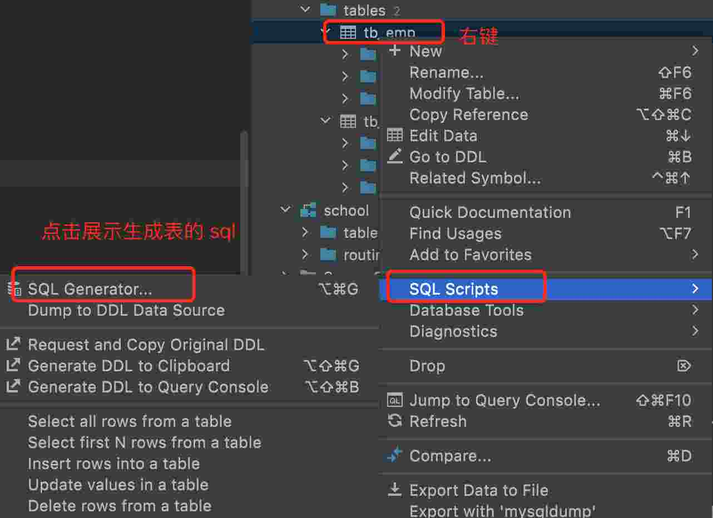
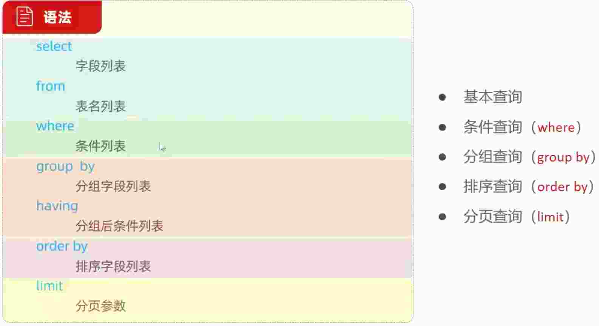
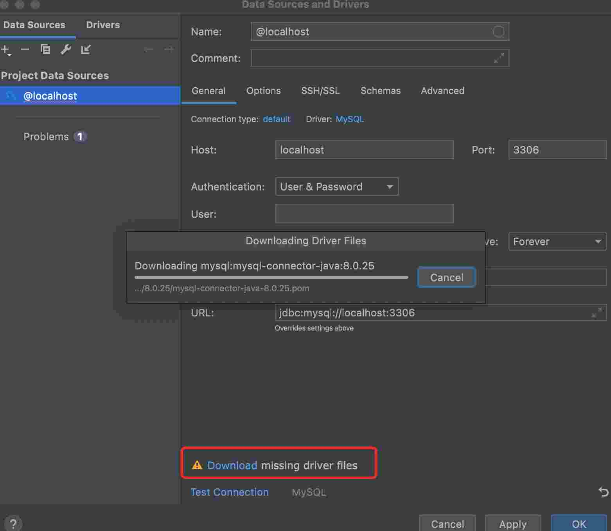
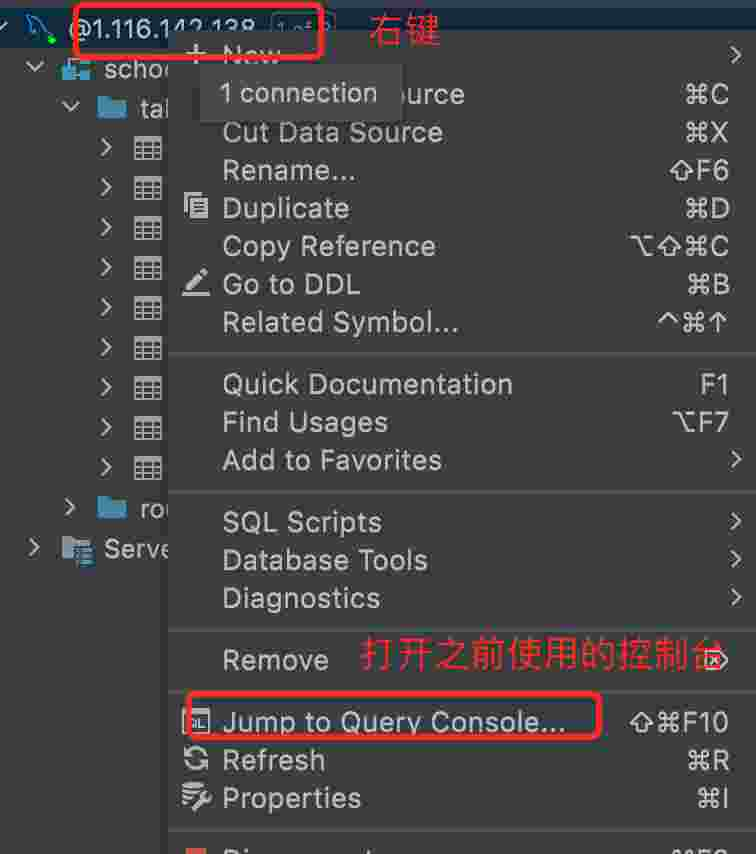
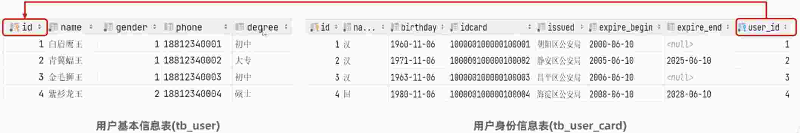
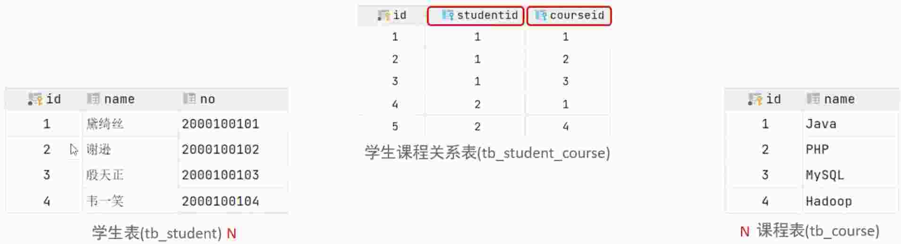
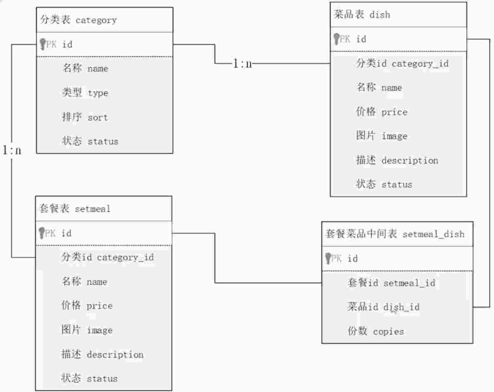
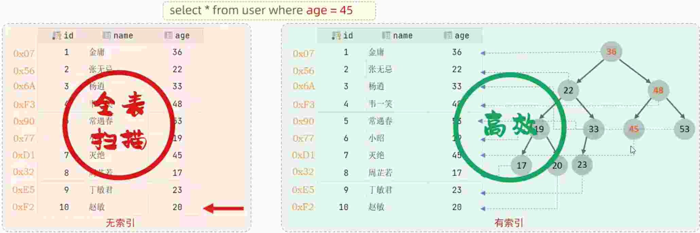
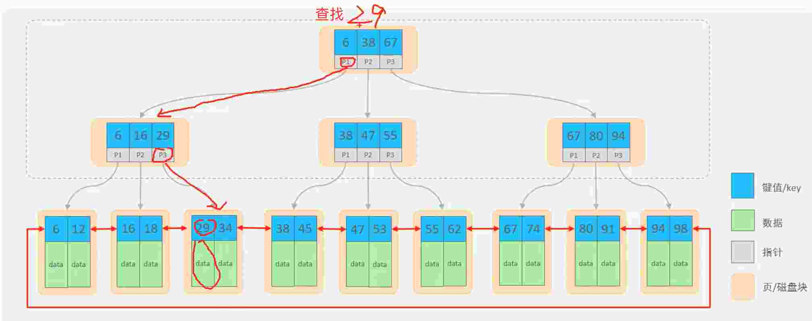

# 3.MySQL

数据库: DataBase, 是存储和管理数据的仓库

MySQL: 一门操作关系型数据库的编程语言, 定义操作所有关系型数据库的统一标准

## 3.1.关系型数据库

建立在关系模型基础上, 由多张相互联系的二维表组成的数据库

## 3.2.通用语法

* SQL 语句可以单行或者多行书写, 以分号结尾
* SQL 语句可以使用 空格/缩进 来增强语句的可读性
* MySQL 数据库的 SQL 语句不区分大小写
* 注释
  - 单行注释: -- 注释内容 或 # 注释内容 (MySQL 特有)
  - 多行注释: /* 注释内容 */

## 3.3.SQL 分类

SQL 语句通常被分为四大类

分类 | 名称 | 说明
-- | -- | --
DDL | Data Definition Language | 数据定义语言, 用来定义数据库对象(数据库, 表, 字段)
DML | Data Manipulation Language | 数据操作语言, 用来对数据库表中的数据进行增删改
DQL | Data Query Language | 数据查询语言, 用来查询数据库中表的记录
DCL | Data Control Language | 数据控制语言, 用来创建数据库用户、 控制数据库的访问权限

## 3.4.数据类型

MySQL 中的数据类型有很多, 主要分为三类: 数值类型、字符串类型、日期时间类型

### 3.4.1.数值类型

类型 | 大小(byte) | 有符号(SIGNED) 范围 | 无符号(UNSIGNED) 范围 | 描述 | 备注
-- | -- | -- | -- | -- | --
tinyint | 1 | (-128, 127) | (0, 255) | 小整数值 |  tinyint signed / tinyint unsigned ***常用***
smallint | 2 | (-32768, 32767) | (0, 65535) | 大整数值 | 
mediumint | 3 | (-8388608, 8388607) | (0, 16777215) | 大整数值 | 
int | 4 | (-2147483648, 2147483647) | (0, 4294967295) | 大整数值 | ***常用***
bigint | 8 | (-2^63, 2^63) | (0, 2^64-1) | 极大整数值 | ***常用***
float | 4 | (-3.402823466E + 38, 3.402823466351E + 38) | 0 和 (1.175494351E - 38, 3.402823466E + 38) | 单精度浮点数值 | float(5,2): 5 表示整个数字长度, 2 表示小数位个数
double | 8 | (-1.7976931348623175E + 308, 1.7976931348623175E + 308) | (2.2250738585072014E - 308, 1.7976931348623175E + 308) | 双精度浮点数值 | double(5,2): 5 表示整个数字长度, 2 表示小数位个数 ***常用***
decimal | | | | | decimal(5,2): 5 表示整个数字长度, 2 表示小数位个数 (金额计算, 不允许出现精度损失的情况)

> 整个数字长度表示: 整数位 + 小数位

```s
age tinyint unsigned
score double(4,1)  # 满分100 分, 允许有一个小数
```

### 3.4.2.字符串类型

类型 | 大小 | 描述 | 备注
-- | -- | -- | --
char | 0-255 bytes | 定长字符串 | char(10): 最多只能存10个字符, 不足十个字符, 也占10个字符空间 (超过十个字符会报错)  ***常用***
varchar | 0-65535 bytes | 变长字符串 | varchar(10): 最多只能存10个字符, 不足十个字符, 按照实际长度存储 (超过十个字符会报错) ***常用***
tinyblob | 0-255 bytes | 不超过255个字符的二进制数据 | 
tinytext | 0-255 bytes | 短文字符串 | 
blob | 0-65535 bytes | 二进制形式的长文本数据 | 
text | 0-65535 bytes | 长文本数据 | 
mediumblob | 0-16777215 bytes | 二进制形式的中等长度文本数据 | 
mediumtext | 0-16777215 bytes | 中等长度文本数据 | 
longblob | 0-4294967295 bytes | 二进制形式的极大文本数据 | 
longtext | 0-4294967295 bytes | 极大文本数据 | 

> char 比 varchar 性能高, 因为 char 不需要判断字符串长度, 但是 varchar 会更节省空间

```
phone char(11)
username varchar(20)
```

> 这里说的字符长度不需要考虑 字符集 中一个汉字占用几个字节的情况 ??? (算是总结, 算是疑问)

### 3.4.3.日期类型

类型 | 大小(byte) | 范围 | 格式 | 描述
-- | -- | -- | -- | --
date | 3 | 1000-01-01 至 9999-12-31 | YYYY-MM-DD | 日期值 ***常用***
time | 3 | -838:59:59 至 838:59:59 | HH:MM:SS | 时间值或持续时间
year | 1 | 1901 至 2155 | YYYY | 年份值
datetime | 8 | 1000-01-01 00:00:00 至 9999-12-31 23:59:59 | YYYY-MM-DD HH:MM:SS | 混合日期和时间值 ***常用***
timestamp | 4 | 1970-01-01 00:00:01 至 2038-01-19 23:59:59 | YYYY-MM-DD HH:MM:SS | 混合日期和时间值, 时间戳

```s
birthday date
update_time datetime
```

## 3.5.DDL(数据库操作)


```s
# 查询所有数据库
show databases;

# 查询当前使用的数据库
select database();

# 使用数据库
use 数据库名;

# 创建数据库
create database [if not exists] 数据库名;

# 删除数据库
drop database [if exists] 数据库名;

# 表操作
create table 表名(
  字段一 字段类型 [约束] [comment 字段1注释],
  ...
  字段n 字段类型 [约束] [comment 字段n注释],
)[comment 表注释];
```

> 以上语法中的 database, 也可以替换成 schema, 如: create schema db01; show schemas;

### 3.5.1.约束

* 概念: 约束是作用于表中字段的规则, 用于限制存储在表中的数据.
* 目的: 保证数据库中的数据的正确性、 有效性 和 完整性.

约束 | 描述 | 关键字
-- | -- | --
非空约束 | 限制该字段不能为 null | not null
唯一约束 | 保证字段的所有数据都是唯一, 不重复的 | unique
主键约束 | 主键是一行数据的唯一标识, 要求非空且唯一 | primary key (auto_increment 自增)
默认约束 | 保存数据时, 如果未指定该字段值, 则采用默认值 | default
外键约束 | 让两张表的数据建立连接, 保证数据的一致性和完整性 | foreign key


> 实践: 表中要有 主键、 创建时间、 更新时间

## 3.6.DDL (表操作)

```s
# 查询当前数据库所有的表
show tables;

# 查询表结构
desc 表名;

# 查询建表语句
show create table 表名;
```

* 修改表

```s
# 添加字段
alter table 表名 add 字段名 类型(长度) [commit 注释] [约束];

# 修改表字段类型
alter table 表名 modify 字段名 新数据类型(长度);

# 修改字段名 和 字段类型
alter table 表名 change 旧字段名 新字段名 类型(长度) [commit 注释] [约束];

# 删除字段
alter table 表名 drop column 字段名;

# 修改表名
rename table 表名 to 新表名;
```

* 删除

```s
# 删除表
drop table [if exists] 表名;
```

> 删除表时, 表中的数据也会被全部删除

* 2021 版 idea 生成表的 sql



## 3.7.DML

DML 英文全称是 Data Manipulation Language(数据操作语言), 用来对数据库中的表的数据记录进行增、删、改操作

* 添加数据 INSERT
* 修改数据 UPDATE
* 删除数据 DELETE

### 3.7.1.insert 语法

```s
# 指定字段添加数据
insert into 表名(字段名1, 字段名2, ...) values(值1, 值2, ...);

# 全部字段添加数据
insert into 表名 values(值1, 值2, ...);

# 批量添加数据 (指定字段)

insert into 表名(字段名1, 字段名2, ...) values(值1, 值2, ...) (值1, 值2, ...);
# 批量添加数据 (全部字段)
insert into 表名 values(值1, 值2, ...) (值1, 值2, ...);
```

* 示例

```s
insert into tb_emp(username, name, job, create_time, update_time)
values ('齐天大圣', '孙悟空', 1, now(), now());

insert into  tb_emp(id, username, name, password, gender, image, job, entrydate, create_time, update_time)
values(null, '平天大圣', '牛魔王', '123', 1, null, 1, '2023-1-1', now(), now());
```

* 注意事项
  - 插入数据时, 指定的字段顺序需要与值的顺序是一一对应的
  - 字符串和日期类型数据应该包含在引号中
  - 插入的数据大小, 应该在字段改定的范围内

### 3.7.2.update 语法

```s
# 修改数据
update 表名 set 字段名1 = 值1, 字段名 = 值2, ... [where 条件];
```

* 示例

```s
update tb_emp set password='12345678', update_time=now() where id = 1;
```

* 注意事项
  - 修改语句的条件可以有, 也可以没有, 如果没有则会修改整个表的所有数据

### 3.7.3.delete 语法

```s
# 删除数据
delete from 表名 [where 条件];
```

* 示例

```s
delete from tb_emp where name = '关羽';
```

* 注意事项
  - DELETE 语句的条件可以有, 也可以没有, 如果没有条件, 则会删除整张表的所有数据
  - DELETE 语句不能删除某一个字段的值 (如果要操作, 可以使用 UPDATE, 将该字段的置为 null)


## 3.8.DQL

用来查询数据库表中的记录

关键字: select

### 3.8.1.select 语法

```s
select 字段列表 
from 表名列表 
where 条件列表
group by 分组字段列表
having 分组后条件列表
order by 排序字段列表
limit 分页参数
```



### 3.8.2.基本查询

```s
# 查询多个字段
select 字段1, 字段2, ... from 表名; 

# 查询所有字段 (通配符)
select * from 表名; 

# 设置别名
select 字段1 [as 别名1], 字段2 [as 别名2], ... from 表名;

# 去除重复记录
select distinct 字段列表 from 表名;
```

* 基本查询示例

```s
# 别名查询
select name as 姓名, gender as 性别 from tb_emp;
select name 姓名, gender 性别 from tb_emp;
select name as '姓 名', gender as 性别 from tb_emp;

# 去重查询
select distinct job  from tb_emp;
```

> * 号代表查询所有字段, 在实际开发中尽量少使用 (不直观、 影响效率)

### 3.8.3.条件查询

```s
select 字段列表 from 表名 where 条件列表;
```

比较运算符 | 功能
-- | --
> | 大于
>= | 大于等于
<= | 小于等于
= | 等于
<> 或 != | 不等于
between ... and ... | 在某个范围之内(含最小、 最大值)
in(...) | 在 in 之后的列表中的值, 多选一
like 占位符 | 模糊匹配(_ 匹配单个字符, % 匹配任意个字符)
is null | 是 null
is not null | 不是 null

<table>
  <tr>
    <th>逻辑运算符</th>
    <th>功能</th>
  </tr>
  <tr>
    <td>and 或 &&</td>
    <td>并且 (多个条件同时成立)</td>
  </tr>
  <tr>
    <td>or 或 ||</td>
    <td>或者 (多个条件任意一个成立)</td>
  </tr>
  <tr>
    <td>not 或 !</td>
    <td>非 , 不是</td>
  </tr>
</table>

* 示例

```s
select * from tb_emp where name = '孙悟空';
select * from tb_emp where id > 1;
# 为空筛选
select * from tb_emp where tb_emp.entrydate is null;
# 时间筛选、 between 使用、 && 和 between 替换使用
select * from tb_emp where create_time >= '2023-10-23 00:00:00' && create_time <= '2023-11-2 00:00:00';
select * from tb_emp where entrydate >= '2022-1-23' && entrydate <= '2023-11-2';
select * from tb_emp where entrydate between '2022-1-23' and '2023-11-2';
select * from tb_emp where entrydate between '2022-1-23' and '2023-11-2' and gender = 2;
select * from tb_emp where entrydate between '2022-1-23' and '2023-11-2' && gender = 1;
# in 和 or 替换使用
select  * from tb_emp where  job = 1 or job = 2 or job = 4;
select  * from tb_emp where job in (1, 2);
# like 使用 查询名字是两个字
select * from tb_emp where name like '__';
# 查姓孙的
select * from tb_emp where name like '孙%';
# 模糊匹配
select * from tb_emp where username like '%大圣%';
```

### 3.8.4.DQL-聚合函数

将一列数据作为整体, 进行纵向运算

> 不对 null 值进行运算统计, 所以统计总数之类的要找 ***非空*** 字段

* 语法

```s
select 聚合函数(字段列表) from 表名;
```

函数 | 功能
-- | --
count | 统计数量
max | 最大值
min | 最小值
avg | 平均值
sum | 求和

* 示例

```s
# count(字段) 统计字段非空的个数, 所以注意统计数量要找非空字段
select count(id) from tb_emp;
# count(常量) 只要 count 不为 null 的常量都可以
select count('') from tb_emp;
# count(*) 推荐, mysql 底层做了优化
select count(*) from tb_emp;
# 统计员工最迟入职的时间
select max(entrydate) from tb_emp;
# 统计平均值
select avg(id) from tb_emp;
# 求和
select sum(id) from tb_emp;
```

> null 值不参与所有聚合函数运算
> 统计数量可以使用: count(字段), count(常量), count(*), 推荐使用 count(*)
> where 中不能使用 count

### 3.8.5.DQL-分组查询

```s
select 字段列表 from 表名 [where 条件] group by 分组字段名 [having 分组后过滤条件];
```

> 分组查询 字段列表 是为了查询结果之后 展示出来的表格的表头

* 示例

```s
# 根据性别进行分组
select gender, count(*) from tb_emp group by gender;
select job, count(*) from tb_emp where entrydate >= '2023-11-1' group by job;
# 筛选出 2023-11-1 以后入职的, 并且对职位进行分组, 获取员工职位大于等于2的
select job, count(*) from tb_emp where entrydate >= '2023-11-1' group by job having job >= 2;
# 筛选出 2023-11-1 以后入职的, 并且对职位进行分组, 获取员工数量大于等于2的职位
select job, count(*) from tb_emp where entrydate >= '2023-11-1' group by job having count(*) >= 2;
```

* where 和 having 区别
  - 执行时机不同: where 是分组之前进行过滤, 不满足 where 条件, 不参与分组; 而 having 是分组之后对结果进行过滤
  - 判断条件不同: where 不能使用聚合函数进行判断, 而 having 可以

* 注意事项

> ***分组之后, 查询的字段一般为聚合函数和分组字段, 查询其他字段无任何意义***
> 执行顺序: where > 聚合函数 > having

### 3.8.6.DQL-排序查询

* 语法

```s
select 字段列表 from 表名 [where 条件列表] [group by 分组字段] order by 字段1 排序方式, 字段1 排序方式, ...;
```

* 排序方式
  - ASC: 升序 (默认值)
  - DESC: 降序 

* 示例

```s
# 升降序排序
select * from tb_emp order by entrydate asc;
select * from tb_emp order by entrydate desc;
# 根据入职时间进行 升序排序, 入职时间相同, 再按照 更新时间 进行降序排序
select * from tb_emp order by entrydate, update_time desc;
```

* 注意事项

> 如果是多字段排序, 当第一个字段值相同时, 才会根据第二个字段进行排序

### 3.8.7.DQL-分页查询

* 语法

```s
select 字段列表 from 表名 limit 起始索引, 查询记录数;
```

* 示例

```s
# 查询第一页数据, 每页展示2条
select * from tb_emp order by entrydate desc limit 0,2;
# 查询第二页数据, 每页展示 2 条
select * from tb_emp limit 2,2;
```

* 注意事项

> 起始索引从 0 开始, 起始索引 = (查询页码 - 1) * 每页显示条数
> 分页查询是数据库的方言, 不同的数据库实现不同, MySQL 是 limit
> 如果查询的是第一页的数据, 其实索引可以忽略, 直接简写 limit 2

### 3.8.8.案例

```s
# 查询男性和女性员工数量
select if(gender = 1, '男性员工', '女性员工') as 性别, count(*) as 员工数量
from tb_emp group by gender;

# 职工信息统计
select job , count(*) from tb_emp group by job;
select (case job when 1 then '班主任' when 2 then '讲师' when 3 then '学工主管' when 4 then '教研主管' else '未分配职位' end) as 职位名称,
count(*) from tb_emp group by job;
```

* 函数

```s
if(表达式, tvalue, fvalue): 当表达式为 true 时, 取值 tvalue, 为 false 取值 fvalue
case expr when value1 then result1 [when value2 then result2...] [else result] end
```

## 3.9.idea自带的图形化工具使用

* 第一次使用需要下载



* 打开之前的控制台



* 右键 console 文件改名

打开的图形化工具 console 这个文件可以改名, 右键 -> Rename file

## 3.10.多表设计

项目开发中, 在进行数据库表结构设计时, 会根据业务需求及业务模块之间的关系, 分析并设计表结构, 由于业务之间项目关联, 所以各个表结构之间也存在着各种联系, 基本上分三种

* 一对多(多对一)
* 多对多
* 一对一

### 3.10.1.一对多

* 案例

部门及员工模块的表结构设计

```s
create  table tb_dept (
    id int unsigned primary key auto_increment comment '主键id',
    name varchar(10) not null unique comment '部门名称',
    create_time datetime  not null comment '创建日期',
    update_time datetime  not null comment '更新日期'
) charset = utf8 comment '部门表';

insert into tb_dept (id, name, create_time, update_time)
values
       (null, '学工部', now(), now()),
       (null, '教研部', now(), now()),
       (null, '咨询部', now(), now()),
       (null, '就业部', now(), now()),
       (null, '人事部', now(), now());
```

### 3.10.2.多表问题分析

* 现象

部门数据可以直接删除, 然而还有部门员工归属于该部门下, 此时就出现数据的不完整、不一致的问题

* 问题分析

目前上述的两张表, 在数据库层面, 并未建立关联, 所以是无法保证数据的一致性和完整性的

### 3.10.3.外键约束

使用 foreign key 定义外键关联另一张表

```s
# 创建表的时候
create table 表名 (
  字段名 数据类型,
  ...
  [constraint] [外键名称] foreign key(外键字段名) references 主表(字段名)
);

# 建完表后, 添加外键
alter table 表名 add constraint 外键名称 foreign key(外键字段名) references 主表(字段名);
```

> 不推荐 物理外键, 也就是 foreign key, 一般使用 逻辑外键

* 物理外键缺点
  - 影像增删改的效率 (需要检查外键关系)
  - 仅用于单节点数据库, 不适用分布式, 集群场景
  - 容易引发数据库的锁死问题, 消耗性能

### 3.10.4.一对一

* 案例

用户 与 身份证信息

关系: 一对一关系, 用于单表拆分, 用一张表的基础字段放在一张表中, 其他字段放在另一张表中, 以提高效率

实现: 在任意一方加入外键, 关联另外一方主键, 并且设置外键唯一的(unique)



### 3.10.5.多对多

* 案例

学生与课程的关系

一个学生可以有多个课程, 一门课程也可以有多个学生选择

* 实现: 建立第三张表, 中间表至少包含两个外键, 分别关联两方主键



## 3.11.多表查询

指从多张表中查询数据

* 笛卡尔积

笛卡尔积是指数学中, 两个集合(A集合和B集合)的所有组合情况 (在多表查询中, 需要消除无效的笛卡尔积)

```s
select * from tb_dept, tb_emp;
select * from tb_emp, tb_dept where tb_emp.dept_id = tb_dept.id;
```

### 3.11.1.多表查询分类

* 连接查询
  - 内连接: 相当于查询 A, B ***交集部分数据***
  - 外连接
    - 左外连接: 查询左表所有数据(包括两张表交集部分数据)
    - 右外连接: 查询右表所有数据(包括两张表交集部分数据)
* 子查询

### 3.11.2.内连接

* 语法

```s
# 隐式内连接
select 字段列表 from 表1, 表2 where 条件...;

# 显示内连接
select 字段列表 from 表1 [inner] join 表2 on 连接条件...;
```

* 内连接示例

```s
# 查询员工名字和所属部门 (隐式内连接实现)
select tb_emp.name, tb_dept.name from tb_emp, tb_dept where tb_emp.dept_id = tb_dept.id;
# 起别名 (as 可以隐藏)
select e.name, d.name  from tb_emp as e, tb_dept as d where e.dept_id = d.id;
# 查询员工名字和所属部门 (显式内连接实现)
select tb_emp.name, tb_dept.name from tb_dept inner join tb_emp on tb_emp.dept_id = tb_dept.id;
# 起别名 as 和 inner 简写
select e.name, d.name from tb_dept d join tb_emp e on e.dept_id = d.id;
```

### 3.11.3.外连接

* 语法

```s
# 左外连接, 会完全包含左表和公共的数据
select 字段列表 from 表1 left [outer] join 表2 on 连接条件...;
# 右外连接, 会完全包含右表和公共的数据
select 字段列表 from 表1 right [outer] join 表2 on 连接条件...;
```

* 示例

```s
# 查询员工表所有员工信息, 和对应的部门名称 (左外连接)
select e.name, d.name from tb_emp e left join tb_dept d on e.dept_id = d.id;
# 查询部门表所有部门名称, 和对应的员工名称 (左外连接)
select e.name, d.name from tb_dept d left join tb_emp e on e.dept_id = d.id;
# 查询部门表所有部门名称, 和对应的员工名称 (右外连接)
select e.name, d.name from tb_dept d right join tb_emp e on e.dept_id = d.id;
```

> 以 join 划分左右

### 3.11.4.子查询

SQL 语句中嵌套 select 语句, 称为嵌套查询, 又称子查询

* 语句

```s
select * from t1 where column1 = (select column1 from t2);
```

* 子查询外部语句可以是 insert、 update、delete、 select 的任意一个, 最常见的是 select 

* 分类
  - 标量子查询: 子查询返回的结果是单个值
  - 列子查询: 子查询返回的结果是一列
  - 行子查询: 子查询返回的结果是一行
  - 表子查询: 子查询返回的结果是多行多列

* 标量子查询

子查询返回的结果是单个值(数字、字符串、日期等), 最简单的形式

常用操作符

```
= > < >= <= <>
```

```s
# 查询教研部所有员工
select id from tb_dept where name = '教研部';
# 标量子查询
select * from tb_emp where dept_id = (select id from tb_dept where name = '教研部');
```

* 列子查询

子查询返会的结果是一列(可以是多行)

常见的操作符

```
in、 not in 等
```

```s
# 查询教研部和咨询部所有员工信息
select  id from tb_dept where name in ('教研部', '咨询部');
select * from tb_emp where dept_id in (select  id from tb_dept where name in ('教研部', '咨询部'));
```

* 行子查询

子查询返回的结果是一行 (可以是多列)

常用的操作符

```
=、 <>、 in、 not in
```

```s
# 查询与 嫦娥 入职日期 和 职位 相同的员工信息
select entrydate, job from tb_emp where name = '嫦娥';
select * from tb_emp where entrydate = (select entrydate from tb_emp where name = '嫦娥') && job = (select job from tb_emp where name = '嫦娥');
# 换种优化写法
select * from tb_emp where (entrydate, job) = (select entrydate, job from tb_emp where name = '嫦娥');
```

> 查询到多列的结果也是可以拆开来用的, 一条一条匹配


* 表子查询

子查询返回的结果是多行多列, 常作为 ***临时表***

常用操作符

```
in
```

```s
# 查询入职日期是 2023-11-1 之后员工的信息和部门信息
select * from tb_emp where entrydate > '2023-11-1';

select * from (select * from tb_emp where entrydate > '2023-11-1') e, tb_dept d where d.id = e.dept_id;
# 筛选具体列字段
select e.*, d.name from (select * from tb_emp where entrydate > '2023-11-1') e, tb_dept d where d.id = e.dept_id;

# 利用内连接查询
select e.name, d.name from tb_emp e
     join tb_dept d
        on e.entrydate >= '2023-11-1' && e.dept_id = d.id;
```


## 3.12.多表查询案例



p60 - p61 (多表查询案例1和2)

## 3.13.事务

事务是一组操作的集合, 他是一个不可分割的工作单位. 事务会把所有操作作为一个整体一起向系统提交或撤销请求操作, 即这些操作 ***要么同时成功, 要么同时失败***

* 注意事项 

> 默认 MySQL 的事务是自动提交的, 也就是说, 当执行一条 DML 语句, MySQL 会立即隐式的提交事务


### 3.13.1.操作

* 事务控制

```
开启事务: start transaction; 或 begin;
提交事务: commit;
回滚事务: rollback;
```

### 3.13.2.四大特性

* 原子性

事务是不可分割的最小单位, 要么全部成功, 要么全部失败

* 一致性

事务完成(回滚或提交)时, 必须使所有数据都保持一致状态

* 隔离性

数据库系统提供的隔离机制, 保证事务在不受外部并发操作影响的独立环境下运行

* 持久性

事务一旦回滚或提交, 他对数据库中的数据的改变是永久的

## 3.14.索引

是帮助数据库 高效获取数据 的 数据结构

* 数据库有无索引查找


> 这里的二叉树只是示例, 并不是真实的 mysql 底层数据结构

### 3.14.1.索引的优缺点

* 优点
  - 提高数据查询的效率, 降低数据库的io成本
  - 通过索引列对数据进行排序, 降低数据排序的成本, 降低 CPU 消耗

* 缺点
  - 索引会占用存储内存
  - 索引大大提高了查询效率, 同时也降低了 insert、update、delete 的效率

### 3.14.2.索引的结构

MySQL 数据库支持的索引结构有很多, 如: Hash 索引, B+Tree 索引, Full-Text 索引等. 我们平常所说的索引, 如果没有特别指明, 都是指默认的 B+Tree 结构组织的索引

* B+Tree (多路平衡搜索树)



* 特点
  - 每一个节点可以存储多个 key (有 n 个key, 就有 n 个指针)
  - 所有的数据都存储在叶子节点, 非叶子节点仅用于索引数据
  - 叶子节点形成一颗双向链表, 便于数据的排序及区间范围查找

### 3.14.3.索引的语法

```s
# 创建索引
create [ unique ] index 索引名 on 表名 (字段名1, ...);

# 查看索引
show index from 表名;

# 删除索引
drop index 索引名 on 表名;
```

* 注意事项

> 主键字段, 在建表时, 会自动创建主键索引
> 添加唯一约束时, 数据库实际上会添加唯一索引

```s
# 创建: 为 tb_emp 表的 name 字段建立一个索引
create index idx_emp_name on tb_emp(name);
# 查询: tb_emp 表的索引信息
show index from tb_emp;
# 删除: 删除 tb_emp 表中 name 字段索引
drop index idx_emp_name on tb_emp;
```


