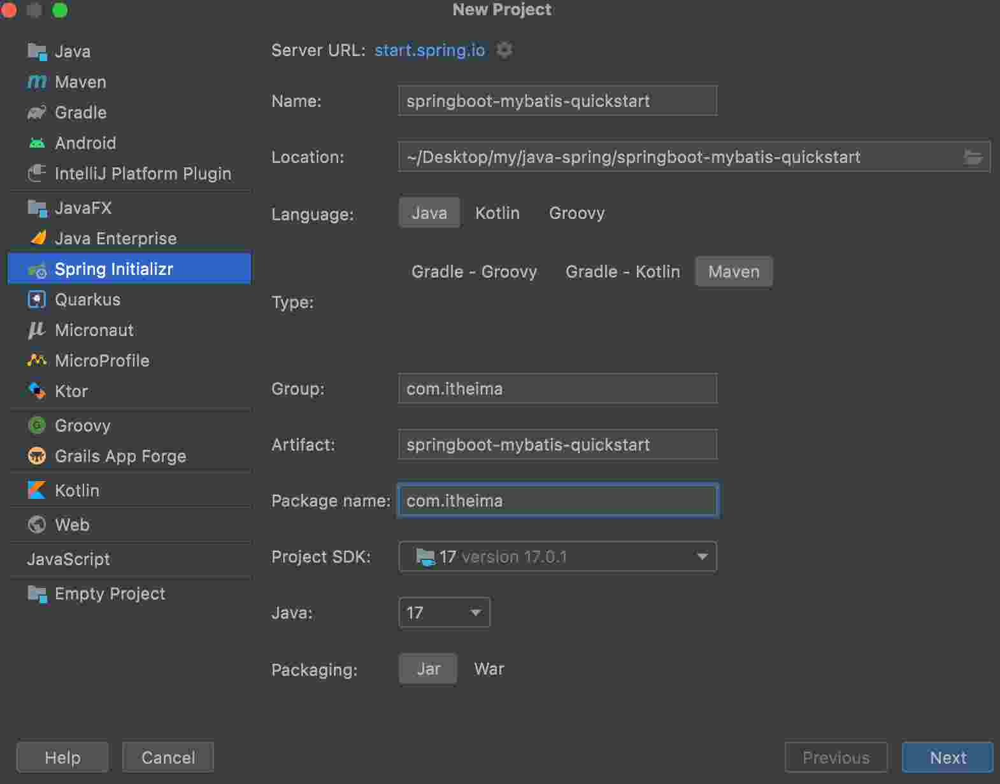
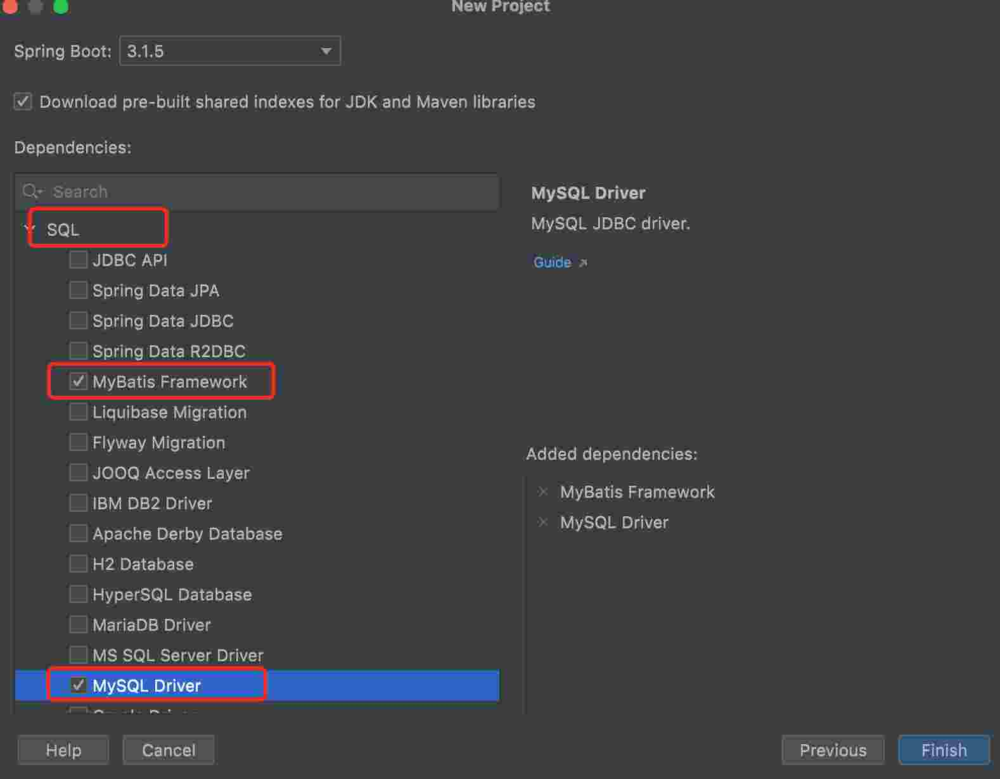
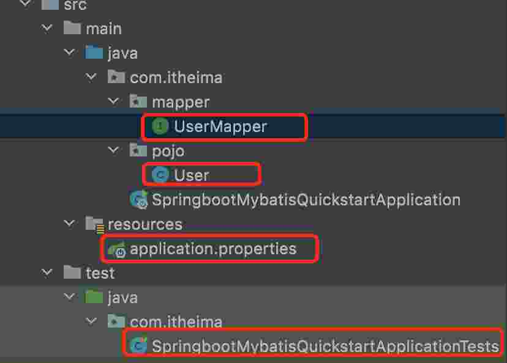
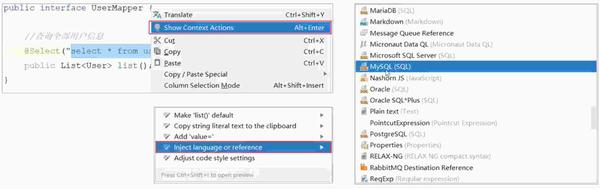
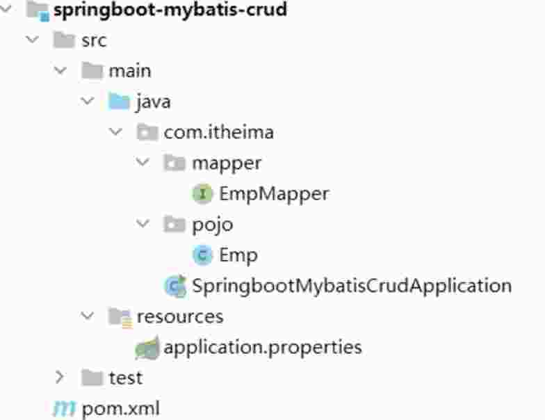
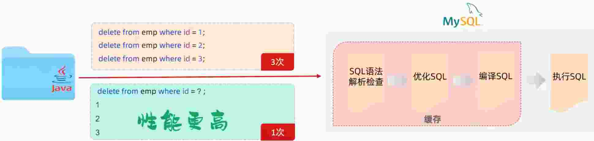
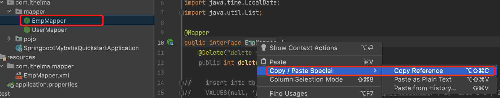

# 4.Mybatis

mybatis 是一款优秀的 持久层 框架, 用于简化 JDBC 开发

dao持久层使用 mybatis

## 4.1.Mybatis 入门

### 4.1.1.Mybatis 项目创建




### 4.1.2.配置数据库连接信息 - 四要素

> 在 springboot 默认 application.properties 文件中进行配置

```s
# 配置数据的连接信息 - 四要素
# 驱动类名称
spring.datasource.driver-class-name=com.mysql.cj.jdbc.Driver
# 数据库连接的url  mybatis是数据库的名字
spring.datasource.url=jdbc:mysql://localhost:3306/mybatis
# 连接数据库的用户名
spring.datasource.username=root
# 连接数据库的密码
spring.datasource.password=123
```

> 如果文件中文备注显示 ???? (乱码), 需要在 Editor -> File Encoding 中设置, 将 三个 编码改为 utf-8

### 4.1.3.代码编写

* 定义承接查询数据库类
```java
package com.itheima.pojo;

public class User {
    private Integer id;
    private String name;
    private Short age;
    private Short gender;
    private String phone;

    public User() {
    }

    public User(Integer id, String name, Short age, Short gender, String phone) {
        this.id = id;
        this.name = name;
        this.age = age;
        this.gender = gender;
        this.phone = phone;
    }

    public Integer getId() {
        return id;
    }

    public void setId(Integer id) {
        this.id = id;
    }

    public String getName() {
        return name;
    }

    public void setName(String name) {
        this.name = name;
    }

    public Short getAge() {
        return age;
    }

    public void setAge(Short age) {
        this.age = age;
    }

    public Short getGender() {
        return gender;
    }

    public void setGender(Short gender) {
        this.gender = gender;
    }

    public String getPhone() {
        return phone;
    }

    public void setPhone(String phone) {
        this.phone = phone;
    }

    @Override
    public String toString() {
        return "User{" +
                "id=" + id +
                ", name='" + name + '\'' +
                ", age=" + age +
                ", gender=" + gender +
                ", phone='" + phone + '\'' +
                '}';
    }
}
```

* 定义接口运行 sql 语句

```java
package com.itheima.mapper;

import com.itheima.pojo.User;
import org.apache.ibatis.annotations.Mapper;
import org.apache.ibatis.annotations.Select;

import java.util.List;

@Mapper // 在运行时, 会自动生成该接口的实现类对象(代理对象), 并且将该对象交给IOC容器管理
public interface UserMapper {
    // 查询用户全部信息
    @Select("select * from tb_user")
    public List<User> list();

}
```

* 单元测试

```java
package com.itheima;

import com.itheima.mapper.UserMapper;
import com.itheima.pojo.User;
import org.junit.jupiter.api.Test;
import org.springframework.beans.factory.annotation.Autowired;
import org.springframework.boot.test.context.SpringBootTest;

import java.util.List;

@SpringBootTest // springboot 整个单元测试的注解
class SpringbootMybatisQuickstartApplicationTests {

    @Autowired
    private UserMapper userMapper;

    @Test
    public void testListUser() {
        List<User> userlist = userMapper.list();
        userlist.stream().forEach(val -> {
            System.out.println(val);
        });
    }
}
```

* 以上代码位置



### 4.1.4.配置 SQL 提示

* 默认在 mybatis 中编写 SQL 语句是不能识别的. 可以做如下配置



> 选中 mysql 语句 右键

* 配置 SQL 提示可能的问题

idea 和 数据库没有建立连接， 不识别表信息

解决方式: 在 idea 中配置 MySQL 数据库连接

### 4.1.5.JCBC 介绍

就是会用 Java 语言操作关系型数据库的一套 API

sun 公司提供的一套操作关系型数据库的 API (规范)

> 已经用不到了, 公司都会用 Mybatis 的框架来简化数据库的查询

### 4.1.6.数据库连接池

* 数据库连接池是个容器, 负责分配、 管理数据库连接 (Connection)
* 它允许应用程序重复使用一个现有的数据库连接, 而不是再重新建立一个
* 释放空间时间超过最大空闲时间的连接, 来避免因为没有释放连接而引起的数据库连接遗漏

1. 优势
  * 资源重复利用
  * 提高系统的响应速度
  * 避免数据库连接遗漏

2. 标准接口: DataSource
  * 官方 (sun) 提供的数据库连接池接口, 由第三方组织实现此接口
  * 功能: 获取连接  Connection getConnection() throws SQLException;

3. 常见产品 (第三方组织实现此接口的产品)
  * C3PO
  * DBCP
  * Druid (德鲁伊, 阿里巴巴产品) (常用)
  * Hikari (追光者) (springboot 默认) (常用)

  > mybatis 框架用这些第三方的产品来实现书库的持久化连接 ？？？

4. 切换数据库连接池

官方地址: https://github.com/alibaba/druid/tree/master/druid-spring-boot-starter

更换引入

```xml
<!--    切换数据库连接池    -->
<dependency>
    <groupId>com.alibaba</groupId>
    <artifactId>druid-spring-boot-starter</artifactId>
    <version>1.2.8</version>
</dependency>
```

## 4.2.lombok (注解自动生成构造器)

lombok 是一个实用的Java类库, 能通过注解的形式自动生成构造器、 getter/setter、equals、hashcode、toString 等方法, 并可以自动化生成日志变量, 简化 java 开发、 提高效率.

注解 | 作用 | 备注
-- | -- | 
@Getter/@Setter | 为所有的属性提供 get/set 方法 | 
@ToString | 会给类自动生成易阅读的 toString 方法 | 
@EqualAndHashCode | 根据类拥有的非静态字段自动重写 equals 方法 和 hashcode 方法 | 
@Data | 提供了更综合的生成代码的功能 (@Getter, @Setter, @ToString, @EqualAndHashCode) | 常用
@NoArgsConstructor | 为实体类生成无参的构造器方法 | 常用
@AllArgsConstructor | 为实体类生成除了 static 修饰字段之外带有各参数的构造方法 | 常用

* 引入资源

```xml
<dependency>
    <groupId>org.projectlombok</groupId>
    <artifactId>lombok</artifactId>
</dependency>
```

* 示例

```java
package com.itheima.pojo;

import lombok.AllArgsConstructor;
import lombok.Data;
import lombok.NoArgsConstructor;

@Data
@NoArgsConstructor // 无参构造
@AllArgsConstructor // 全参构造
public class User {
    private Integer id;
    private String name;
    private Short age;
    private Short gender;
    private String phone;
}
```

> Lombok 会编译时, 自动生成对应的 java 代码. 我们使用 lombok 时, 还需要安装一个 lombok 的插件 (idea 自带)

## 4.3.Mybatis 基础增删改查

* 日志输出

可以在 appliction.properties 中, 打开 mybatis 的日志, 并指定输出控制台

```s
# 指定 mybatis 输出日志的位置, 输出控制台
mybatis.configuration.log-impl=org.apache.ibatis.logging.stdout.StdOutImpl
```

### 4.3.1.准备工作

* 准备数据表 emp
* 创建一个新的 springboot 工程, 选择引入对应的起步依赖(mybatis, mysql驱动, lombok)
* appliction.properties 中如引入数据库连接信息
* 创建对应的实体类 Emp (实体类属性采用驼峰命名)
* 准备 Mapper 接口 EmpMapper




### 4.3.2.删除

```java
package com.itheima.mapper;

import org.apache.ibatis.annotations.Delete;
import org.apache.ibatis.annotations.Mapper;

@Mapper
public interface EmpMapper {
    @Delete("delete from tb_emp where id = #{id}")
    public int deleteEmp(Integer id);
}
```

```java
package com.itheima;

import com.itheima.mapper.EmpMapper;
import com.itheima.mapper.UserMapper;
import com.itheima.pojo.Emp;
import com.itheima.pojo.User;
import org.junit.jupiter.api.Test;
import org.springframework.beans.factory.annotation.Autowired;
import org.springframework.boot.test.context.SpringBootTest;

import java.time.LocalDate;
import java.time.LocalDateTime;
import java.util.List;

@SpringBootTest // springboot 整个单元测试的注解
class SpringbootMybatisQuickstartApplicationTests {
    @Autowired
    private EmpMapper empMapper;

    @Test
    public void testDeleteEmp() {
        int d = empMapper.deleteEmp(8);
        System.out.println(d);
    }
}
```
> 如果 mapper 接口方法形参只有一个普通类型的参数, #{...} 里面的属性名可以随便写, 如 #{id}, #{value}

### 4.3.3.新增

```java
package com.itheima.mapper;

import com.itheima.pojo.Emp;
import org.apache.ibatis.annotations.Delete;
import org.apache.ibatis.annotations.Insert;
import org.apache.ibatis.annotations.Mapper;

@Mapper
public interface EmpMapper {
    @Delete("delete from tb_emp where id = #{id}")
    public int deleteEmp(Integer id);

//    insert into tb_emp (username, name, gender, image, job, entrydate, dept_id, create_time, update_time)
//    VALUES(null, 'ceshishuju', 'ceshi', '123', 1, 'http://localhost:', 1, '2023-1-1', 2, now(), now());
    @Insert("insert into tb_emp (username, name, gender, image, job, entrydate, dept_id, create_time, update_time)" +
            "values (#{username}, #{name}, #{gender}, #{image}, #{job}, #{entrydate}, #{deptId}, #{createTime}, #{updateTime})")
    public int InsertEmp(Emp emp);
}
```

```java
package com.itheima;

import com.itheima.mapper.EmpMapper;
import com.itheima.mapper.UserMapper;
import com.itheima.pojo.Emp;
import com.itheima.pojo.User;
import org.junit.jupiter.api.Test;
import org.springframework.beans.factory.annotation.Autowired;
import org.springframework.boot.test.context.SpringBootTest;

import java.time.LocalDate;
import java.time.LocalDateTime;
import java.util.List;

@SpringBootTest // springboot 整个单元测试的注解
class SpringbootMybatisQuickstartApplicationTests {
    @Autowired
    private EmpMapper empMapper;

    @Test
    public void testInsertEmp() {
        Emp emp = new Emp();
        emp.setUsername("testInsert");
        emp.setName("测试插入");
        emp.setCreateTime(LocalDateTime.now());
        emp.setUpdateTime(LocalDateTime.now());
        emp.setEntrydate(LocalDate.of(2023, 1, 1));
        emp.setGender((short) 1);
        emp.setJob((short) 1);
        emp.setDeptId(1);
        emp.setImage("1.jpg");
        Integer i = empMapper.InsertEmp(emp);
        System.out.println(i);
    }
}
```

* 主键返回

再添加数据成功后, 需要获取插入数据库数据的主键. 如: 添加套餐数据时, 还需要维护套餐菜品关系表数据

```java
@Options(keyProperty = "id", useGeneratedKeys = true) // 会自动将生成的主键值赋值给 emp 对象的 id 属性
@Insert("insert into tb_emp (username, name, gender, image, job, entrydate, dept_id, create_time, update_time)" +
        "values (#{username}, #{name}, #{gender}, #{image}, #{job}, #{entrydate}, #{deptId}, #{createTime}, #{updateTime})")
public int InsertEmp(Emp emp);
```

### 4.3.4.更新

```java
package com.itheima.mapper;

import com.itheima.pojo.Emp;
import org.apache.ibatis.annotations.*;

@Mapper
public interface EmpMapper {
    @Update("update tb_emp set " +
            "username=#{username}, name=#{name}, gender=#{gender}, image=#{image}, job=#{job}, entrydate=#{entrydate}, update_time=#{updateTime} where id = #{id}")
    public  int updateEmp(Emp emp);
}
```

```java
@Test
public void testUpdateEmp() {
    Emp emp = new Emp();
    emp.setId(10);
    emp.setUsername("testInsert3");
    emp.setName("测试插入3");
//  emp.setCreateTime(LocalDateTime.now());
    emp.setUpdateTime(LocalDateTime.now());
    emp.setEntrydate(LocalDate.of(2023, 1, 1));
    emp.setGender((short) 1);
    emp.setJob((short) 1);
    emp.setDeptId(1);
    emp.setImage("1.jpg");
    Integer i = empMapper.updateEmp(emp);
    System.out.println(i);
    System.out.println(emp.getId());
}
```

### 4.3.5.查询

```java
@Select("select * from tb_emp where id = #{id}")
public Emp selectEmp(Integer id);
```

```java
@Test
public void selectEmp() {
    Emp emp = empMapper.selectEmp(10);
    System.out.println(emp);
}
```

* 以上查询字段不一致到导致得到结果为 null

```
Emp(id=10, username=testInsert5, name=测试插入5, password=123456, gender=1, image=1.jpg, job=1, entrydate=2023-01-01, deptId=null, createTime=null, updateTime=null)
```

* 解决方案
  - 方案一: 给字段起别名, 让别名与实体类属性一致
  - 方案二: 通过 @Results, @Result 注解手动映射封装
  - 方案三: 开启 mybatis 的驼峰命名自动映射开关 (推荐)

```java
// 起别名
@Select("select id, username, name, password, gender, image, job, entrydate, create_time createTime, update_time updateTime, dept_id deptId from tb_emp where id = #{id}")
public Emp selectEmp(Integer id);

// 手动映射封装
@Results({
        @Result(column = "dept_id", property = "deptId"),
        @Result(column = "create_time", property = "createTime"),
        @Result(column = "update_time", property = "updateTime"),
})
@Select("select * from tb_emp where id = #{id}")
public Emp selectEmp(Integer id);
```

```
# application.properties 文件
mybatis.configuration.map-underscore-to-camel-case=true
```

* 根据页面查询条件进行查询

```java
@Test
public void selectConEmp() {
    List<Emp> empList = empMapper.selectConEmp("测试", (short) 1, LocalDate.of(2023, 1, 1), LocalDate.of(2023, 11, 11));
    System.out.println(empList.size());
    empList.stream().forEach(emp -> System.out.println(emp));
}
```

```java
// 根据条件查询
// @Select("select * from tb_emp where name like '%${name}%' and gender = #{gender} and entrydate between #{startDate} and #{endDate} order by update_time desc")
@Select("select * from tb_emp where name like concat('%', #{name}, '%') and gender = #{gender} and entrydate between #{startDate} and #{endDate} order by update_time desc")
public List<Emp> selectConEmp(String name, Short gender, LocalDate startDate, LocalDate endDate);
```

> '%${name}%' 这种写法会导致 SQL 注入 的安全问题, 所以需要使用 concat
> Springboot 1.x 版本会用 @Param 注解解决 sql 中 多个参数的问题

## 4.4.预编译 SQL

### 4.4.1.优势
  - 性能更高
  - 更安全 (防止 SQL 注入)

### 4.4.2.SQL 注入

是通过操作的数据来修改事先定义好的 SQL 语句, 以达到执行代码对服务器进行攻击的方法

### 4.4.3.参数占位符

* #{...}
  - 执行 SQL 时, 会将 #{...} 替换为 ? , 生成预编译 SQL, 会自动设置参数值.
  - 使用时机: 参数传递, 都使用 #{...}

* ${...}
  - 拼接 SQL, 直接将 参数 拼接在 SQL 语句中, 存在 SQL 注入问题.
  - 使用时机: 如果对表名、列表进行动态设置时使用.



## 4.5.XML 映射文件

### 4.5.1.规范

* XML 映射的名称与 Mapper 接口名称一致, 并且将 XML 映射文件和 Mapper 接口放置在相同下 (同包同名)
* XML 映射文件的 namespace 属性为 Mapper 接口全限定名一致
* XML 映射文件中 sql 语句的 id 与 Mapper 接口中的方法名一致, 并返回类型一致

> java 目录下只能放 java 的源代码,  配置文件只能放在 resources 文件夹下

### 4.5.2.写法

```java
package com.itheima.mapper;

import com.itheima.pojo.Emp;
import org.apache.ibatis.annotations.*;

import java.time.LocalDate;
import java.util.List;

@Mapper
public interface EmpMapper {
  public List<Emp> selectConEmp(String name, Short gender, LocalDate startDate, LocalDate endDate);
}
```

```xml
<?xml version="1.0" encoding="UTF-8" ?>
<!DOCTYPE mapper
        PUBLIC "-//mybatis.org//DTD Mapper 3.0//EN"
        "http://mybatis.org/dtd/mybatis-3-mapper.dtd">
<mapper namespace="com.itheima.mapper.EmpMapper">
    <!-- resultType: 单条记录所封装的类型  com.itheima.pojo.Emp 表示全类名 类上右键 copy reference  -->
    <select id="selectConEmp" resultType="com.itheima.pojo.Emp">
        select * from tb_emp where name like concat('%', #{name}, '%') and gender = #{gender} and entrydate between #{startDate} and #{endDate} order by update_time desc
    </select>
</mapper>
```

> resultType: 单条记录所封装的类型  com.itheima.pojo.Emp 表示全类名 类上右键 copy reference

> namespace 字段 可以在 类上右键复制


### 4.5.3.mybatisX 插件自动生成

MybatisX 是一款基于 IDEA 的快速开发 Mybatis 的插件, 为效率而生

> 使用 Mybatis 的注解, 主要是通过来完成一些简单的增删改查功能, 如要要实现复杂的 SQL 功能, 建议使用 XML 配置映射语句


## 4.6.Mybatis 动态 SQL

随着用户的输入或外部条件的变化而变化的 SQL 语句, 我们成为 动态 SQL.

### 4.6.1.动态 sql 标签

1. < if > < where > < set >

* if: 用于条件判断是否成立. 使用 test 属性进行条件判断, 如果为 true, 则拼接 SQL
* where: where 元素只会在子元素有内容的情况下才插入 where 字句. 而且会自动去除句的开头的 AND 或 OR
* set: 动态地在首行插入 set 字段, 并会删除掉额外的逗号. (用在 update 语句中)

```xml
<?xml version="1.0" encoding="UTF-8" ?>
<!DOCTYPE mapper
        PUBLIC "-//mybatis.org//DTD Mapper 3.0//EN"
        "http://mybatis.org/dtd/mybatis-3-mapper.dtd">
<mapper namespace="com.itheima.mapper.EmpMapper">
    <update id="updateEmp">
      update tb_emp
      <set>
          <if test="username != null">username=#{username},</if>
          <if test="gender != null">gender=#{gender},</if>
          <if test="username != null">image=#{image},</if>
          <if test="image != null">job=#{job},</if>
          <if test="entrydate != null">entrydate=#{entrydate},</if>
          <if test="updateTime != null">update_time=#{updateTime}</if>
      </set>
      where id = #{id}
    </update>
    <!-- resultType: 单条记录所封装的类型  com.itheima.pojo.Emp 表示全类名 类上右键 copy reference  -->
    <select id="selectConEmp" resultType="com.itheima.pojo.Emp">
        select * from tb_emp
            <where>
                <if test="name != null">
                    name like concat('%', #{name}, '%')
                </if>

                <if test="gender != null">
                    and gender = #{gender}
                </if>

                <if test="startDate != null and endDate != null">
                    and entrydate between #{startDate} and #{endDate}
                </if>
            </where>
            order by update_time desc;
    </select>
</mapper>
```

2. < foreach >

循环遍历生成 sql 代码

* foreach 标签上的属性
  - collection: 遍历的集合
  - item: 遍历出来的元素
  - separator: 分隔符
  - open: 遍历开始前拼接的 SQL 片段
  - close: 遍历结束后拼接的 SQL 片段

```xml
<delete id="deleteEmp">
    delete from tb_emp where id in
    <foreach collection="empIdList" item="id" separator="," open="(" close=")" >
        #{id}
    </foreach>
</delete>
```

```java
@Test
public void deleteEmp() {
    List<Integer> empIdList = Arrays.asList(15, 16);
    empMapper.deleteXmlEmp(empIdList);
}
```

3. < sql > < include >

* sql: 公共的 sql 语句的抽取
* include: sql 片段的引用

```xml
<?xml version="1.0" encoding="UTF-8" ?>
<!DOCTYPE mapper
        PUBLIC "-//mybatis.org//DTD Mapper 3.0//EN"
        "http://mybatis.org/dtd/mybatis-3-mapper.dtd">
<mapper namespace="com.itheima.mapper.EmpMapper">

    <sql id="commonSelect">
        select id, username, name, password, gender, image, job, entrydate, create_time, update_time, dept_id from tb_emp
    </sql>
    <!-- resultType: 单条记录所封装的类型  com.itheima.pojo.Emp 表示全类名 类上右键 copy reference  -->
    <select id="selectConEmp" resultType="com.itheima.pojo.Emp">
        <include refid="commonSelect"></include>
        <where>
            <if test="name != null">
                name like concat('%', #{name}, '%')
            </if>

            <if test="gender != null">
                and gender = #{gender}
            </if>

            <if test="startDate != null and endDate != null">
                and entrydate between #{startDate} and #{endDate}
            </if>
        </where>
        order by update_time desc;
    </select>
</mapper>
```