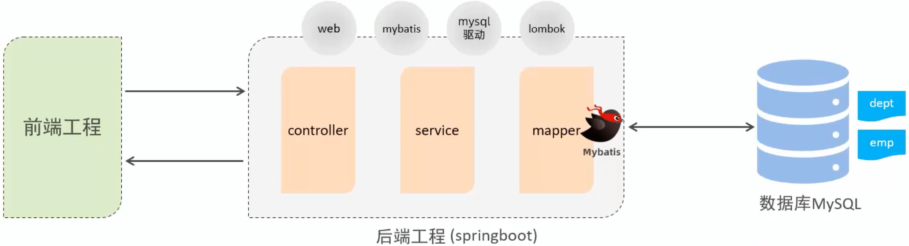
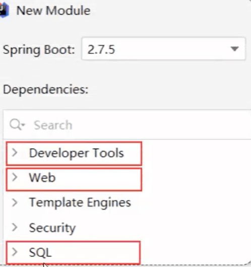
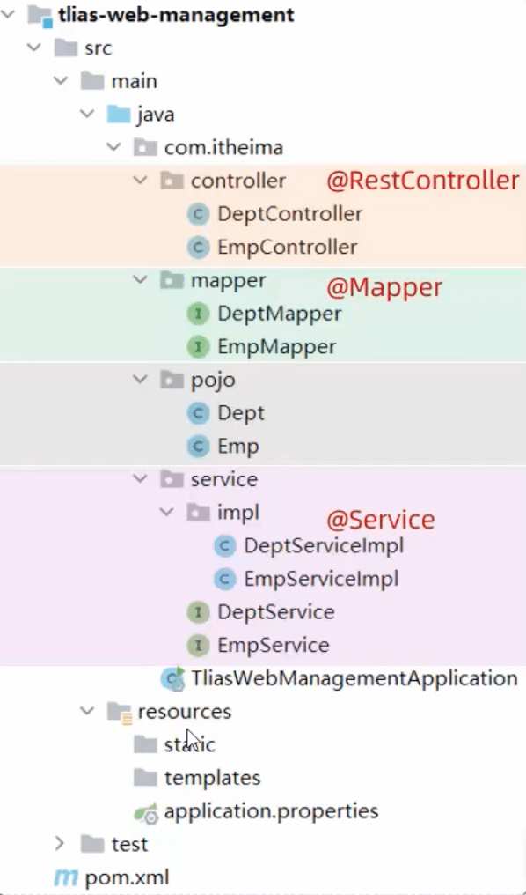

# 5.项目练习

## 5.1.环境搭建

1. 准备数据库表 (dept, emp)
2. 创建 springboot 工程, 引入对应的起步依赖 (web、mybatis、mysql 驱动、lombok) (创建)
3. 配置文件 application.properties 中引入 mybatis 的配置信息, 准备对应的实体类 (导入)
4. 准备对应的 Mapper、 Service (接口、 实现类)、Controller 基础结构 (创建)





## 5.2.开发规范 - restful

* REST: 表述性状态转换, 他是一种软件风格

### 5.2.1.传统风格

```
http://localhost:8080/users/getById?id=1  get: 查询id为1的用户
http://localhost:8080/users/saveUser  post: 新增用户
http://localhost:8080/users/updateUser  post: 更新用户
http://localhost:8080/users/deleteUser?id=1  get: 删除用户
```

### 5.2.1.rest 风格

URL 定位资源, HTTP 动词描述操作

```
http://localhost:8080/users/1  get: 查询id为1的用户
http://localhost:8080/users  post: 新增用户
http://localhost:8080/users  put: 更新用户
http://localhost:8080/users/1  delete: 删除用户
```

* 注意事项

> REST 是风格, 是约定方式, 约定不是规定, 可以打破
> 描述模块功能通常使用复数, 就是加 s 的格式来描述, 表示此类应用, 而非单个资源. 如: users, emps, books...
