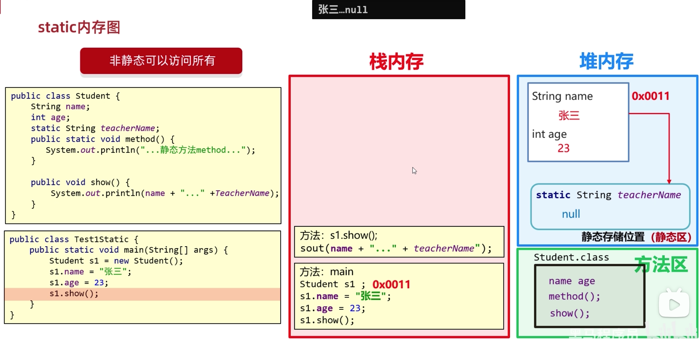
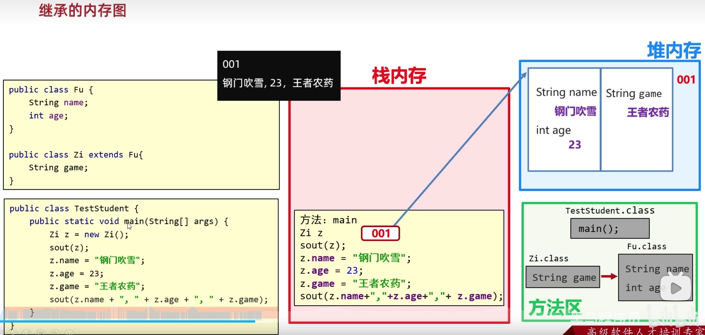
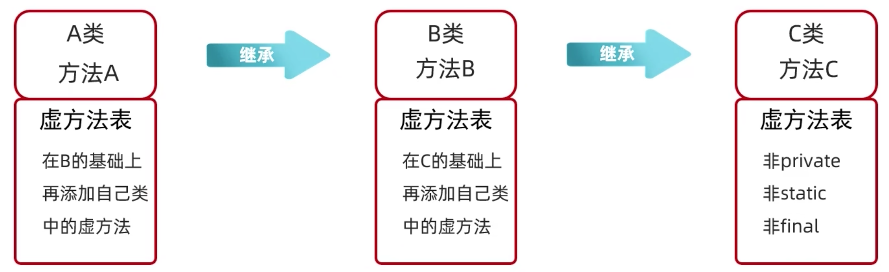
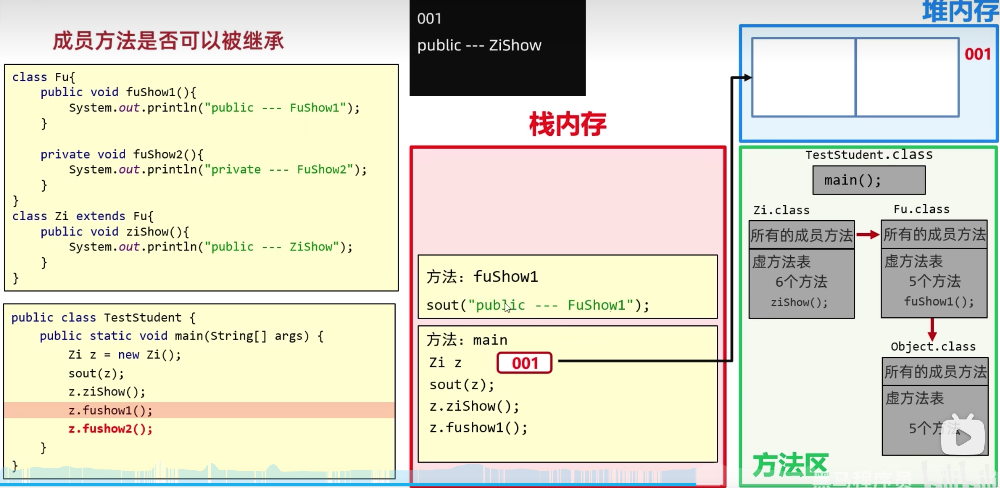
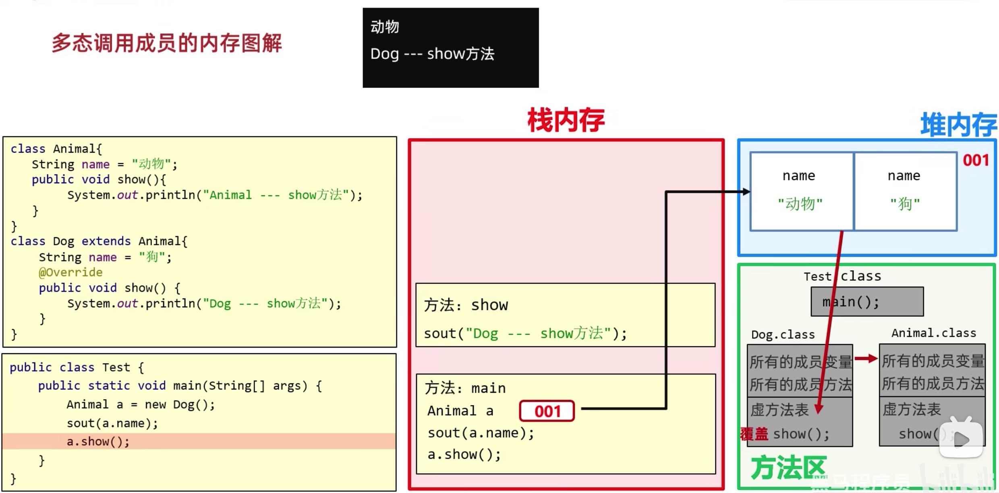
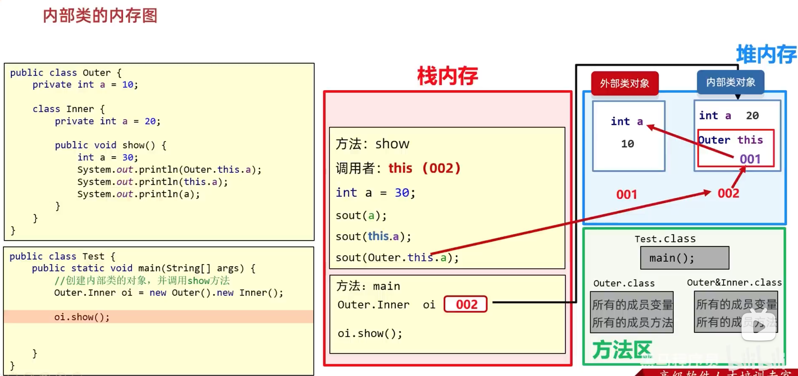

# 10.面向对象进阶

## 10.1.static

表示静态，是一个 java 中的一个修饰符，可以修饰成员方法，成员变量



```java
package src.people;

public class Student {
  String name;
  int age;
  static String  teacher;
  public Student() {
    System.out.println("空参构造");
  }
  public Student(String name, int age) {
    this.name = name;
    this.age = age;
  }
  public String getName() {
    return name;
  }
  public void setName(String name) {
    this.name = name;
  }
  public int getAge() {
    return age;
  }
  public void setAge(int age) {
    this.age = age;
  }
}
```

```java
package src.people;

public class StudentTest {
  public static void main(String[] args) {
    Student.teacher = "wanglaoshi";
    Student s1 = new Student("zs", 18);
    Student s2 = new Student("ls", 19);

    System.out.println(s1.teacher);
    System.out.println(s2.teacher);
    System.out.println(Student.teacher);
  }
}
```

### 10.1.1.静态变量

被 static 修饰的成员变量，叫做静态变量

放在堆内存的静态存储位置(静态区)

* 特点

1. 被该类所有对象共享
2. 不属于对象，属于类
3. 静态变量是随着类的加载而加载的，优先于对象的出现

* 调用方式
1. 类名调用 (推荐)
2. 对象名调用

### 10.1.2.静态方法

被 static 修饰的成员方法，叫做静态方法

* 特点
1. 多用在测试类和工具类中
2. javabean 类中很少用

* 调用方式
1. 类名调用(推荐)
2. 对象名调用

### 10.1.3.static的注意事项

1. 静态方法只能访问静态变量和静态方法 (静态方法中只能访问静态)
2. 非静态方法可以静态访问静态变量或者静态方法，也可以访问非静态的成员变量和非静态的成员方法 (非静态方法可以访问所有)
3. 静态方法中没有 this 关键字

### 10.1.4.类

类是在方法区中的，类的字节码加载方法区才能被使用

* 三种类
1. javabean 类
用来描述一类事务的类。比如： Student， Teacher， Dog， Cat

类的成员存在三种： 构造方法、 成员变量、 成员方法

2. 测试类
用来检查其他类是否书写正确， 带有 main 方法的类， 是程序的入口

3. 工具类
不是用来描述一类事务的， 而是帮我们做一些事情的类

* 工具类
1. 类名见名知意
2. 私有化构造方法 (为了不让外界创建他的对象)
3. 方法定义为静态

```java
public class ArrUtil {
  // 私有化构造方法
  private ArrUtil() {}
  public static int getMax(...) {...}
  public static int getMin(...) {...}
  public static int getSum(...) {...}
  public static int getAvg(...) {...}
}
```

## 10.2.main方法

> 测试类中其他方法是静态的，因为main调用时，只能调用静态的

```java
public class ArrUtilTest {
  public static void main(String[] args) {
  }
}
```

* public 被 JVM 调用， 访问权限足够大
* static 被 JVM 调用， 不用创建对象，直接类名访问 (因为 mian 方法是静态的，所以测试类中的其他方法也需要是静态的)
* void 被 JVM 调用， 不要给 JVM 返回值
* main 一个通用的名字，虽然不是关键字，但是会被 JVM 识别
* String[] args  以前用于键盘接收的数据，现在没用


## 10.2.继承

继承是面向对象三大特征之一， 可以让类与类之间产生父子关系

可以把子类中重复的代码提取到父类中，子类可以直接使用，减少代码冗余，提供复用性

> 先加载父类在加载子类

### 10.2.1.extends

Java 提供而一个关键字 extends， 用这个关键字就可以让一个类和另一类建立继承关系

```java
// Student 成为 子类(派生类), Person 成为 父类(基类或超类)
public class Student extends Person {}
```

### 10.2.2.继承的特点

Java 只支持单继承， 不支持多继承， 但支持多层继承

* 小结
1. Java 只能单继承，一个类只能继承一个直接父类
2. Java 不支持多继承， 但是支持多层继承
3. Java 所有类间接或直接继承 Object 类
4. 子类只能访问父类非私有的成员

### 10.2.3.子类继承了父类哪些内容

类的成员 | 非私有 | 私有(private)
-- | -- | -- 
构造方法 | 不能 | 不能
成员变量 | 能 | 能
成员方法 | 能 | 不能

### 10.2.4.继承内存图



* 虚方法

不能被 private static final 修饰

* 虚方法表

父类统计一个虚方法表为了子类好查找





### 10.2.5.继承中：成员变量的访问特点

就近原则，谁离我近就用谁

先在局部位置找，本类成员位置找，父类成员位置找，逐级往上


* 重名成员变量查找

this super

> super 调用父类的


```java
public class Fu {
  String name = "Fu"
}

public class Zi extends Fu {
  String name = "Zi"
  
  public void ziShow() {
    String name = "ziShow";
    System.out.println(name);
    System.out.println(this.name);
    System.out.println(super.name);
  }
}
```

### 10.2.6.继承中：成员方法的访问特点

查找使用原则同上

就近原则，谁离我近就用谁

* 方法的重写

当父类的方法不能满足子类的使用，需要进行方法的重写

在继承体系中，子类出现和父类一模一样的方法声明，我们就称子类这个方法是重写的方法

* 书写格式

@Override 重写注解

@Override 放在重写后的方法上，校验子类重写时语法是否正确

* 重写的注意事项

1. 重写的方法名称，形参列表必须与父类中一致
2. 子类重写父类方法时，访问权限子类必须大于父类 (private < 空着不写 < protected < public)
3. 子类重写父类方法时，返回值类型必须小于等于父类 (比如子类继承父类，父类方法返回父类，子类重写方法可以返回子类)
4. 建议： 重写方法尽量和父类保持一致
5. 只有被添加到虚方法表的方法才能被重写 (私有方法不能被重新; 子类不能重写父类的静态方法，重写会报错)

### 10.2.7.继承中：构造方法的访问特点

* 特点

1. 父类中的构造方法不会被子类继承
2. 子类中所有构造方法默认先访问父类中的无参构造，在执行自己
3. 子类构造方法第一行默认都是 super() , 不写也存在，且必须是第一行
4. 如果想调用父类的有参构造，必须手动写 super 调用

## 10.3.this 

### 10.3.1.this 说明

this 理解为一个变量，表示当前方法调用者的地址值

> this() 访问本类的其他构造方法

## 10.4.super

### 10.4.1.super 说明

代表父类的存储空间

## 10.5.多态

面向对象三大特征之一。 封装和继承

* 创建方式

```java
Fu f = new Zi();
```

### 10.5.1.什么是静态

对象的多种形态

### 10.5.2.多态的前提

* 有继承实现关系
* 有父类引用指向子类对象
* 有方法的重写

### 10.5.3.多态的好处

使用父类型作为参数， 可以接收所有的子类对象， 体现多态的扩展性和便利性

### 10.5.4.多态调用成员的特点

* 变量调用

编译看左边，运行也看左边

javac 编译代码的时候， 会看左边父类中有没有这个变量，如果有编译成功，如果没有编译失败。

* 方法调用

编译看左边，运行看右边

javac 编译代码的时候， 会看左边父类中有没有这个方法，如果有编译成功，如果没有编译失败。

```
成员变量： 在子类的对象中，会把父类成员变量也继承下来。 父： name  子： name 
成员方法： 如果子类对方法进行重写， 那么在虚方法表中会把父类方法进行覆盖的

我的理解： 会根据 对象的 类型进行，查找变量和方法，但是方法有重写，所以覆盖了虚方法表，所以变量读当前类型，方法读虚方法表
```

```java
package src.animal;

public class Animal {
  static String category;
  private String name;
  String appetite = "good";

  public void show() {
    System.out.println("Animal show");
  }
}
```

```java
package src.animal;

public class Dog extends Animal {
  String appetite = "bad";

  @Override
  public void show() {
    System.out.println("Dog show");
  }
}
```

```java
package src.animal;

public class DogTest {
  public static void main(String[] args) {
    Dog d1 = new Dog("wangcai");
    // d1.category = ""; // 也可以
    Animal.category = "Animal";

    Animal a1 = new Dog();
    System.out.println(a1.appetite); // 打印的是 Animal 的，如果 Animal 没有这个变量就会报错
    a1.show(); // Dog show
  }
}
```

> 先加载父类在加载子类, 这里没有展示 Object



### 10.5.4.多态的优势

* 在多态形式下， 右边对象可以实现解耦合， 便于利用和维护

```java
Person p = new Student(); // 逻辑方法变化时，  Student 可以修改，后边代码不必修改
p.work();
```

* 定义方法的时候， 使用父类型作为参数， 可以接收所有子类对象， 提现多态的扩展性和便利性

### 10.5.5.多态的弊端

* 子类独有的方法，父类没有，编译时会报错

解决方式： 类型转换, 可以使用 instanceof 判断是否属于该类， 是否可以转换

```java
Animal a = new Dog();
Dog d = (Dog) a;

if(a instanceof Dog) {
  Dog d = (Dog) a;
} else if (a instanceof Cat) {
  Cat c = (Cat) a;
} else {
  System.out.println("不能进行类型转换");
}

// 简写
// 先判断 a 是否是 Dog 类型， 如果是则强转为 Dog 类型， 转换之后变量名为 d， 如果不是，则不强转， 结果直接是 false
if(a instanceof Dog d) {
  // Dog d = (Dog) a;
} else if (a instanceof Cat c) {
  // Cat c = (Cat) a;
} else {
  System.out.println("不能进行类型转换");
}
```

## 10.6.包

包就是文件夹，用来管理各种不同功能的 Java 类， 方便后期代码维护

### 10.6.1.包名规则

公司域名反写 + 包的作用， 需要全部英文小写，见名知意。 com.itheima.domain

### 10.6.2.使用其他类的规则

* 使用同一个包中类时， 不需要导包
* 使用 java.lang 包中类时， 不需要导包
* 其他情况都需要导包
* 如果同时使用两个包中的同名类， 需要用全类名

```java
// 方式一 使用其他类时，需要使用全类名
public class Test {
  public static void main(String[] args) {
    com.itheima.domain.Student s = new com.itheima.domain.Student();
  }
}

// 方式二 导包
import com.itheima.domain.Student;
public class Test {
  public static void main(String[] args) {
    Student s = new Student();
  }
}
```

## 10.7.final

最终的，不可被改变

```
方法： 表明该方法是最终方法， 不能被重写
类： 表明该类是最终类， 不能被继承
变量： 叫做常量， 只能被赋值一次
```

## 10.8.常量

实际开发中，常量一般作为系统的配置信息，方便维护， 提高可读性

### 10.8.1.常量的命名规范

* 单个单词： 全部大写
* 多个单词： 全部大写，单词之间用下滑线分割

### 10.8.2.final 注意事项

* final 修饰的基本数据类型，那么变量无法修改
* final 修饰的引用数据类型，那么变量的存储的地址值不能发生修改，地址值存储的变量可以修改

## 10.9.权限修饰符

用来控制一个成员能够被访问的范围

可以修饰成员变量， 方法， 构造方法， 内部类

### 10.9.1.权限修饰符分类

有四种范围由大到小: private < 空着不写 (缺省/默认) < protected < public

是否代表是否可用

修饰符 | 同一个类中 | 同一个包中其他类 | 不同包下的子类 | 不同包下的的无关类
-- | -- | -- | -- | --
private | 是 | 否 | 否 | 否
空着不写(默认) | 是 | 是 | 否 | 否
protected | 是 | 是 | 是 | 否
public | 是 | 是 | 是 | 是

private 私房钱，只能自己用。默认，只能本包使用。protected 受保护的。public 公共的

> 包 是指某一个文件夹
> 方法和变量都适用

### 10.9.2.权限修饰符的使用规则

实际开发，一般只有 private 和 public

* 成员变量私有
* 方法公开
* 特例： 如果方法中代码是抽取其他方法中共性代码， 这个方法一般私有

## 10.10.代码块

### 10.10.1.三种代码块

* 局部代码块

已淘汰

```java
public class Hello {
  public static void main(String[] args) {
    {
      int a = 1;
    }
  }
}
```
* 构造代码块

不常用了， 不够灵活

写在成员位置的代码块

作用： 可以把多个构造方法中重复的代码收取出来

执行时机： 我们在创建本类对象的时候会先执行构造代码块，再执行构造方法

```java
package src.people;

public class Student {
  String name;
  int age;
  static String  teacher;
  {
    System.out.println("构造函数");
  }
  public Student() {
    // System.out.println("构造函数");
  }
  public Student(String name, int age) {
    // System.out.println("构造函数");
    this.name = name;
    this.age = age;
  }
  public String getName() {
    return name;
  }
  public void setName(String name) {
    this.name = name;
  }
  public int getAge() {
    return age;
  }
  public void setAge(int age) {
    this.age = age;
  }
}
```

* 静态代码块

重点

1. 格式

```
static{}
```

2. 特点

需要通过 static 关键词修饰， 随着类的加载而加载， 并且自动触发， 只执行一次

3. 使用场景

在类加载的时候，做一些数据初始化时候使用

## 10.11.抽象类和抽象方法

### 10.11.1.抽象方法

将共性的行为(方法)抽取到父类之后，由于每个子类执行的内容是不一样的，所以父类不能确定具体的方法体， 该方法就定义为抽象方法

强势让子类按照某种格式进行重写

* 抽象方法的定义格式

```
public abstract 返回值类型 方法名(参数列表)
```

### 10.11.2.抽象类

如果一个类中存在抽象方法， 那么该类就必须声明为抽象类

* 抽象类的定义格式

```
public abstract class 类名{}
```

```java 
public abstract class Person {
  public abstract void work();
}
```

## 10.11.3.抽象类和抽象方法注意事项

* 抽象类不能实例化
* 抽象类中不一定有抽象方法， 有抽象方法的类一定是抽象类
* 可以有构造方法 (当创建子类的时候， 给属性进行赋值的)
* 抽象类的子类
  * 要么重新抽象类中所有的抽象方法
  * 要么是抽象类

## 10.12.接口

接口就是一种规则， 是对行为的抽象

### 10.12.1.接口定义和使用

* 接口用关键字 interface 进行定义

```java
public interface 接口名 {}
```

* 接口不能实例化

* 接口和类之间是实现关系， 通过 implements 关键字表示

```java
public class 类名 implements 接口名 {}
```

* 接口的子类 (实现类)

要么重写接口中所有的抽象方法，要么是抽象类

* 接口和类的实现可以是单实现也可以是多实现

```java
public class 类名 implements 接口1, 接口2 {}
```

* 实现类可以在继承一个类的同时实现多个接口

```java
public class 类名 extends 父类 implements 接口1, 接口2 {}
```

```java
package src.abstractdemo1;

public abstract class Animal {
  private String name;
  private int age;
  public abstract void eat();
  
  public Animal() {
  }
  public Animal(String name, int age) {
    this.name = name;
    this.age = age;
  }

  public String getName() {
    return name;
  }
  public void setName(String name) {
    this.name = name;
  }
  public int getAge() {
    return age;
  }
  public void setAge(int age) {
    this.age = age;
  }
}
```

```java
package src.abstractdemo1;

public class Dog extends Animal implements Swim {
  public Dog() {
   
  }

  public Dog(String name, int age) {
    super(name, age);
  }

  @Override
  public void swim() {
    System.out.println("在狗刨");
  }

  @Override
  public void eat() {
    System.out.println("在吃骨头");
  }
  
}
```

```java
package src.abstractdemo1;

public class Frog extends Animal implements Swim {

  public Frog() {
  }

  public Frog(String name, int age) {
    super(name, age);
  }

  @Override
  public void swim() {
    System.out.println("在蛙泳");
  }

  @Override
  public void eat() {
    System.out.println("在吃虫子");
  }
  
}
```

```java
package src.abstractdemo1;

public class Rabbit extends Animal {
  public Rabbit() {
  }

  public Rabbit(String name, int age) {
    super(name, age);
  }

  @Override
  public void eat() {
    System.out.println("在吃草");
  }
}
```

```java
package src.abstractdemo1;

public interface Swim {
  public abstract void swim();
}
```

```java
package src.abstractdemo1;

public class Test {
  public static void main(String[] args) {
    Frog f = new Frog("小青蛙", 1);

    System.out.println(f.getName() + " " + f.getAge());
    f.eat();
    f.swim();

    Rabbit r = new Rabbit("小兔子", 2);
    System.out.println(r.getName() + " " + r.getAge());
    r.eat();
    // r.swim();
  }
}
```


### 10.12.2.接口中成员的特点

* 成员变量

只能是常量

默认修饰符： public static final

* 构造方法

没有

* 成员方法

只能是抽象方法

默认修饰符： public abstract

> JDK7 以前， 只能定义抽象方法

### 10.12.3.接口和类之间的关系

* 类和类的关系

继承关系，只能单继承，不能多继承，但是可以多层继承

* 类和接口的关系

实现关系，可以单实现，也可以多实现， 还可以在继承一个类的同时实现多接口

多实现有重名，只需要重写一次

* 接口和接口的关系

继承关系，可以单继承，也可以多继承

```java
package src.abstractdemo1;

public interface Swim {
  public abstract void swim();
}
```

```java
package src.abstractdemo1;

public interface Run extends Swim {
  public abstract void run();
}
```

```java
package src.abstractdemo1;

public interface Inter extends Swim, Run {
  public abstract void method();
}
```

## 10.13.JDk8开始接口中新增的方法

* JDk7之前： 接口只能定义抽象方法
* JDk8的新特性： 接口中可以定义有方法体的方法 (默认和静态)
* JDk8的新特性： 接口中可以定义私有方法

### 10.13.1.JDk8以后接口中新增的默认方法

* 允许在接口中定义默认方法， 需要使用关键字 default 修饰

作用： 解决接口升级的问题

* 接口中默认方法的定义格式

```java
public default 返回值类型 方法名(参数列表) {}

public default void show() {}
```

* 接口中默认方法的注意事项

1. 默认方法不是抽象方法， 所以不强制被重写， 但是如果被重写， 重写的时候去掉 default 关键字
2. public 可以省略， default 不能省略
3. 如果实现多个接口， 多个接口中存在相同名字的默认方法， 子类就必须对该类进行重写

### 10.13.2.JDk8以后接口中新增的静态方法

* 允许在接口中定义静态方法， 需要使用关键字 static 修饰

* 接口中默认方法的定义格式

```java
public static 返回值类型 方法名(参数列表) {}

public static void show() {}
```

* 接口中静态方法的注意事项

1. 静态方法只能通过接口名调用， 不能通过实现类名或者对象名调用
2. public 可以省略， static 不能省略

### 10.13.3.JDk9新增的方法

接口中私有方法定义格式

```java
// 第一种
private 返回值类型 方法名(参数列表) {};
private void method() {};

// 第二种
private static 返回值类型 方法名(参数列表) {};
private static void method() {};
```

## 10.14.接口的应用

* 接口代表规则， 是行为的抽象。 想让哪个类拥有一个行为， 就让这个类实现对应的接口就行可以了
* 当一个方法的参数是接口时， 可以传递接口所有实现类的对象， 这种方式称之为接口多态

## 10.15.适配器模式

1. 当一个接口抽象方法过多， 但是我只要使用其中一部分， 就可以使用适配器模式 (中间实现一个类，重写方法， 然后再继承这个类)

## 10.16.内部类

### 10.16.1.类的五大成员

属性、 方法、 构造方法、 代码块、 内部类

### 10.16.2.内部类

在一个类的里面在定义一个类

```java
// 在 A 类的内部定义 B 类， B类就被成为内部类
public class Outer {
  public class Inner {

  }
}
```

内部类表示的事务是外部类的一部分； 内部类单独出现没有任何意义

* 内部类的访问特点
  1. 内部类可以直接访问外部类的成员， 包括私有
  2. 外部类要访问内部类的成员， 必须创建对象

### 10.16.3.内部类的分类

前三种了解，匿名内部类掌握

#### 10.16.3.1.成员内部类

* 特点
1. 写在成员位置的， 属于外部类的成员
2. 成员内部类可以被一些修饰符所修饰， 比如： private, 默认,  protected, public, static 等
3. 在成员内部类里面， JDK16 之前不能定义静态变量， JDK16开始才可以定义静态变量

```java
public class Car { // 外部类
  String carName;
  class Engine { // 成员内部类
    String engineName;
  }
}
```

* 获取成员内部类

&nbsp;&nbsp;  1. 方式一

在外部类中编写方法， 对外部类提供内部类的对象

```java
public class Outer { // 外部类
  String outerName;
  class Inner { // 成员内部类
    String innerName;
  }
  public Inner getInstance() {
    return new Inner();
  }
}

public class Test {
  public static void main(String[] args) {
    Outer o = new Outer();
    // i 的类型用 Object 来表示； 或者直接使用 o.getInstance()
    Object i = o.getInstance();
  }
}
```

&nbsp;&nbsp; 2. 方式二

直接创建格式： 

```
外部类名.内部类名 对象名 = 外部类对象.内部类对象
```

```java
Outer.Inner o = new Outer().new Inner();
```

* 获取成员内部类变量获取

```java
public class Outer { // 外部类
  private int a = 30;
  class Inner { // 成员内部类
    private int a = 20;

    public void show() {
      int a = 10;
      System.out.println(a);
      System.out.println(this.a);
      System.out.println(Outer.this.a);
    }
  }
  public Inner getInstance() {
    return new Inner();
  }
}
```

> Outer.this 获取外部类对象的地址值

* 内部类内存图

> Outer this 是隐藏的变量 指向 外部类对象的地址值



#### 10.16.3.2.静态内部类

静态内部类属于成员内部类的一种

静态内部类只能访问外部类的静态变量和静态方法， 如果想要访问非静态的需要创建对象

* 创建静态内部类对象的格式

```java
外部类名.内部类名 对象名 = new 外部类名.内部类名();
```

```java
public class Car { // 外部类
  String carName;
  static class Engine { // 成员内部类
    String engineName;
  }
}
```

* 调用非静态方法的格式

先创建对象， 用对象调用

* 调用静态方法格式

外部类名.内部类名.方法名()

#### 10.16.3.3.局部内部类

将内部类定义在方法里面就叫做局部内部类， 类似方法里面的局部变量

外界是无法直接使用的， 需要在方法里面创建对象并使用

该类可以直接访问外部类的成员， 也可以访问方法内的局部变量

```java
public class Outer {
  public void show() {
    int a = 1;
    // 局部内部类
    class Inner {

    }
  }
}
```

#### 10.16.3.4.匿名内部类

匿名内部类的本质上就是隐藏名字的内部类

* 什么时匿名内部类

隐藏了名字的内部类， 可以写在成员位置， 可以写在局部位置

* 格式

包含了继承实现， 方法重写， 创建对象。

整体就是一个类的子类对象或者接口的实现类对象

```java
new 类名或者接口名() {
  重写方法
}
```

> 大括号中才是没有名字那个类

> 可以查看编译后的文件，也可以用 javap 反编译， 在 面向对象进阶23 课时

```java
package src.abstractdemo1;

public class Test {
  Animal an = new Animal() {
    @Override
    public void eat() {
      System.out.println("成员匿名内部类");
    }
  };
  public static void main(String[] args) {
    eat(
      new Animal() { // 局部匿名内部类
        @Override
        public void eat() {
          System.out.println("狗吃骨头");
        }
      }
    );

    // 接口多态
    Swim swim = new Swim() {
      @Override
      public void swim() {
        System.out.println("狗在狗刨");
      }
    };
    swim.swim();
  }

  public static void eat(Animal a) { // 多态 Animal a = 子对象
    a.eat();
  }
}
```

* 使用场景

当方法的参数是接口或者类时

以接口为例， 可以传递这个接口的实现类对象

如果实现类只要实现一次， 就可以用匿名内部类简化代码


