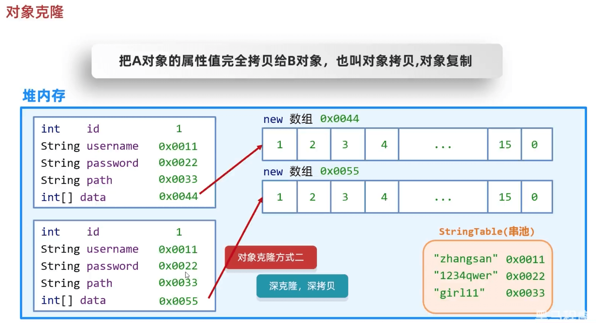
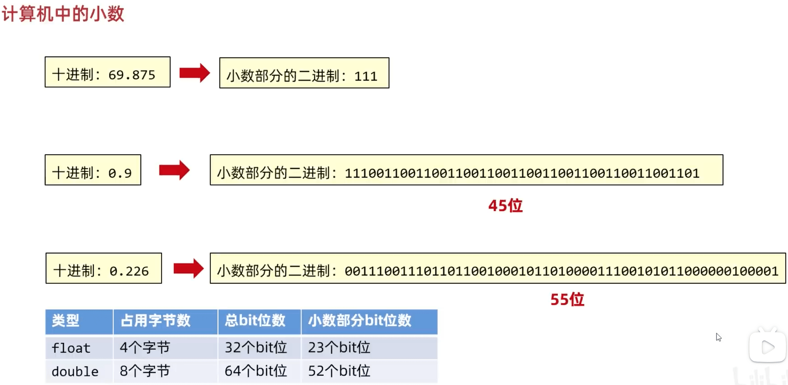
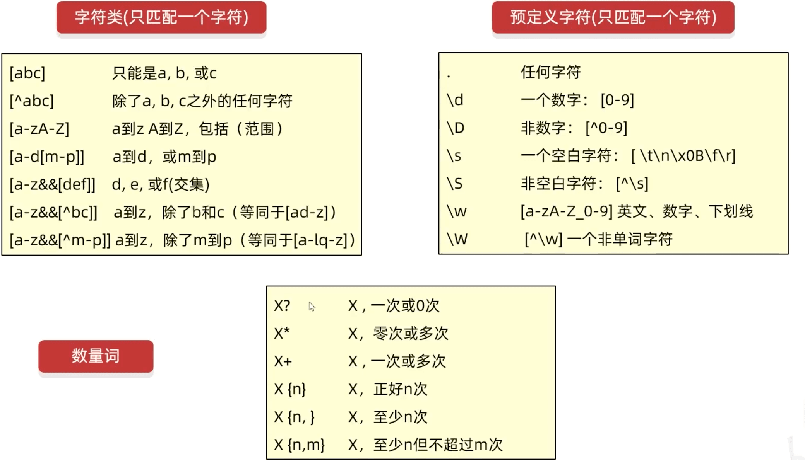
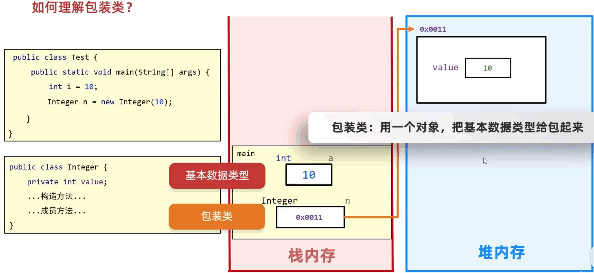

# 11.常用类

## 11.1.Math

帮助我们用于数学计算的工具类

### 11.1.1.Math类常用的方法

方法名 | 说明
-- | --
public static int abs(int a) | 获得参数的绝对值
public static int ceil(double a) | 向上取整
public static int floor(double a) | 向下取整
public static double pow(double a, double b) | 返回a的b次幂的值
public static double random() | 返回值为double的随机值，范围 [0.0, 1.0)
public static int round(float a) | 四舍五入
public static int max(int a, int b) | 获取较大值
public static int min(int a, int b) | 获取较小值
public static double sqrt(double a) | 开根号
public static double cbrt(double a) | 开立方

* abs 

abs 有个bug

```java
Math.abs(-2147483648) // -2147483648 不能转成正的
// 使用 absExact 会报错不能转换
Math.absExact(-2147483648)
```

> 判断是否是质数，边界条件开平方根

## 11.2.System

System 也是工具类， 提供了一些与系统相关的方法

方法名 | 说明
-- | -- 
public static void exit(int status) | 终止当前运行的 Java 虚拟机
public static long currentTimeMillis() | 返回当前系统时间的毫秒值形式
public static void arraycopy(数据源数组, 起始索引, 目的地, 起始索引, 拷贝个数) | 拷贝数组


### 11.2.1.exit

0 表示当前虚拟机正常退出；非 0 表示当前虚拟机异常停止

### 11.2.2.arraycopy

1. 如果数据源数组和目的地数组都是基本数据类型，那两者的类型必须保持一致，否则会报错
2. 在拷贝的时候需要考虑数组长度， 超出会报错
3. 如果数据源数组和目的地数组都是引用数据类型， 那么子类型可以赋值给父类类型

```java
Student s1 = new Student('zs', 18);
Student s2 = new Student('ls', 18);
Student s3 = new Student('ww', 18);
Student[] arr = {s1, s2, s3};
People[] arr2 = new People[3];
System.arraycopy(arr1, 0, arr2, 0, 3);
for(i = 0; i < arr2.length; i++) {
  Student u = (Student) arr2[i]; // 强制转换
}
```

## 11.2.Runtime

当前虚拟机的运行环境

> Runtime 是不能new的

方法名 | 说明
-- | --
public static Runtime getRuntime() | 当前系统运行环境对象
public void exit(int status) | 停止虚拟机
public int availableProcessors() | 获取 CPU 线程数
public long maxMemory() | JVM能从系统中获取总内存大小 (单位： byte)
public long totalMemory() | JVM已经从系统中获取总内存大小 (单位： byte)
public long freeMemory() | JVM剩余内存大小 (单位： byte)
public Process exec(String command) | 运行 cmd 命令

> 158 写一个自动关机包，之后可以尝试一下

```java
package src.runtime;

import java.io.IOException;

public class Test {
  public static void main(String[] args) {
    Runtime r = Runtime.getRuntime();
    // r.exit(0);
    System.out.println(r.availableProcessors());
    System.out.println(r.maxMemory() / 1024 / 1024);
    System.out.println(r.totalMemory() / 1024 / 1024);

    // 运行 cmd 命令
    // shutdown 关机
    // 加上参数才能执行
    // -s 默认是在 1min 之后关机
    // -s -t 指定时间 : 指定关机时间
    // -a : 取消关机操作
    // -r: 关机并重启
    try {
      // r.exec("shutdown -s -t 3600");
      r.exec("shutdown -a");
    } catch (IOException e) {
      // TODO Auto-generated catch block
      e.printStackTrace();
    }

  }
}
```

## 11.3.Object

Object 是 Java 中的顶级父类， 所有的类都直接或间接继承于 Object 类

Object 类中的方法可以被所有子类访问

方法名 | 说明
-- | --
public String toString() | 返回对象字符串表示形式
public boolean equals(Object obj) | 比较两个对象是否相等
public Object clone() | 对象克隆

### 11.3.1.toString

* System.out打印对象

当我们在打印一个对象的时候， 会调用对象的 toString 方法， 把对象变成字符串，然后打印在控制台， 打印完毕换行处理

* toString 方法结论

如果我们打印一个对象，想要看到属性值的话，就重写 toString 方法就可以， 在重写方法中，把对象的属性值进行拼接

> idea 可以进行生成

```java
@Override
public String toString() {
  return "Animal [name=" + name + ", appetite=" + appetite + "]";
}
```

### 11.3.2.equals

* 结论
  - 1. 如果没有重写的 equals 方法， 那么会默认使用 Object 中的方法进行比较， 比较的是地址值是否相等
  - 2. 一般来说比较地址值意义不大， 所以会重写， 重写之后比较对象内部的属性值
  - 3. 字符串中的 equals 方法， 先判断参数是否为字符串，如果是字符串，在比较内部的属性， 但是如果不是字符串， 直接返回 false
  - 4. StringBuilder 没有重写 equels 方法， 使用 Object 的， 在 Object 默认使用 == 号比较两个对象的地址值

```java
@Override
public boolean equals(Object obj) {
  if (this == obj)
    return true;
  if (obj == null)
    return false;
  if (getClass() != obj.getClass())
    return false;
  Animal other = (Animal) obj;
  if (name == null) {
    if (other.name != null)
      return false;
  } else if (!name.equals(other.name))
    return false;
  if (appetite == null) {
    if (other.appetite != null)
      return false;
  } else if (!appetite.equals(other.appetite))
    return false;
  return true;
}
```

### 11.3.3.clone

把 A 对象的属性值完全拷贝给 B 对象， 也叫对象拷贝， 对象复制

* Cloneable

如果一个接口里面没有抽象方法， 表示当前接口是一个标记性接口， 现在 Cloneable 表示一旦实现， 那么当前类的对象就可以被克隆。 如果没有被实现，当前类的就不能被克隆

* 细节

方法在底层会帮我们创建一个对象， 并把原对象中的数据拷贝进去

* 书写细节
  - 1. 重写 Object 中的 clone 方法
  - 2. 让 javabean 类实现 Cloneable 接口
  - 3. 创建原对象并调用 clone 就可以

```java
package src.clonedemo1;

import java.util.Arrays;

public class User implements Cloneable { // 开启克隆
  private String name;
  private int age;
  private String password;
  private int[] gameProgress;
  
  public User() {
  }
  
  public User(String name, int age, String password, int[] gameProgress) {
    this.name = name;
    this.age = age;
    this.password = password;
    this.gameProgress = gameProgress;
  }

  public String getName() {
    return name;
  }
  public void setName(String name) {
    this.name = name;
  }
  public int getAge() {
    return age;
  }
  public void setAge(int age) {
    this.age = age;
  }
  public String getPassword() {
    return password;
  }
  public void setPassword(String password) {
    this.password = password;
  }
  public int[] getGameProgress() {
    return gameProgress;
  }
  public void setGameProgress(int[] gameProgress) {
    this.gameProgress = gameProgress;
  }
  
  @Override
  public String toString() {
    return "User [name=" + name + ", age=" + age + ", password=" + password + ", gameProgress="
        + Arrays.toString(gameProgress) + "]";
  }

  // 浅拷贝
  @Override
  protected Object clone() throws CloneNotSupportedException {
    // 调用父类中的 clone 方法
    // 相当于让 Java 帮我们克隆一个对象， 并把克隆之后的对象返回
    return super.clone(); // 重写克隆
  }
  
  // 深拷贝
  @Override
  protected Object clone() throws CloneNotSupportedException {
    // 调用父类中的 clone 方法
    // 相当于让 Java 帮我们克隆一个对象， 并把克隆之后的对象返回
    // return super.clone();

    int[] _gameProgress = this.gameProgress;
    int[] newGameProgress = new int[_gameProgress.length];
    for (int i = 0; i < _gameProgress.length; i++) {
      newGameProgress[i] = _gameProgress[i];
    }

    User u = (User) super.clone();
    u.gameProgress = newGameProgress;

    return u;
  }
}
```

```java
package src.clonedemo1;

public class UserTest {
  public static void main(String[] args) throws CloneNotSupportedException {
    int[] arr = {1,2,3,4,5,6,7,8};
    User u1 = new User("zs", 13, "123456", arr);
    User u2 = (User) u1.clone();

    System.out.println(u1);
    System.out.println(u2);
  }
}
```

* 内存图



* 对象克隆
  - 1. 浅克隆: 不管内部属性时基本还是引用， 都完全拷贝过来
  - 2. 深克隆: 基本数据类型拷过来， 字符串复用， 引用数据类型会重新创建新的

## 11.4.Objects

Objects类是对象工具类，它里面的的方法都是用来操作对象的。

方法名 | 说明
-- | --
public static boolean equals(Object a, Object b) | 先做非空判断， 比较两个对象
public static boolean isNull(Object obj) | 判断是否为null， 为null返回true
public static boolean nonNull(Object obj) | 判断是否为null， 跟 isNull 结果相反

### 11.4.1.equals

```java
Objects.equals(s1, s2);
```

* 细节
  - 1. 方法的底层会判断s1是否为null， 如果为 null， 返回false
  - 2. s1 不为null， 就利用 s1 再次调用 equals 方法
  - 3. 此时s1 为 Student 类型， 最终还是会调用 Student 中的 equals 方法。如果没有重写比较地址值，重写比较属性值


## 11.5.BigInteger

在 Java 中， 整数有四种类型： byte, short, int, long

在底层占用字节个数, byte 1个字节, short 2个字节, int 4个字节, long 8个字节

### 11.5.1.BigInteger 构造方法

方法名 | 说明
-- | --
public BigInteger(int num, Random rnd) | 获取随机大整数，范围: [0~2的num次方-1]
public BigInteger(String val) | 获取指定的大整数 (val 必须是整数， 否则报错)
public BigInteger(String val, int radix) | 获取指定进制的大整数 (radix 代表传入数据的进制)
public static BigInteger valueof(long val) | 静态方法获取 BigInteger 的对象， 内部有优化

> String val 是 字符串形式的数字

```java
package src.bigIntegerdemo1;

import java.math.BigInteger;
import java.util.Random;

public class BigIntegerTest {
  public static void main(String[] args) {
    Random r = new Random();
    BigInteger b1 = new BigInteger(4, r);
    System.out.println(b1); // 0~2 ^4 -1 的范围

    BigInteger b2 = new BigInteger("999999999");
    System.out.println(b2); 

    BigInteger b3 = new BigInteger("100",2);
    System.out.println(b3); 

    BigInteger b4 = BigInteger.valueOf(100);
    System.out.println(b4); 

    BigInteger b5 = BigInteger.valueOf(6);
    BigInteger b6 = BigInteger.valueOf(6);
    System.out.println(b5 == b6);  // true 比较的是地址值，说明是同一个地址
  }
}
```

* valueof

  - 1. 能表示范围比较小， 在 long 的取值范围之内， 如果超出 long 的范围就报错
  - 2. 在内部常用数字 [-16, 16] 进行优化。提前把 -16~16 先创建好 BigInteger 的对象， 如果多次获取不会被创建

* 细节

  - 1. 如果 BigInteger 表示的数字没有超出long的范围， 可以用静态方法获取
  - 2. 如果 BigInteger 表示的数字超出long的范围， 可以用构造方法获取
  - 3. 对象一旦被创建， BigInteger 内部的值不能发生改变
  - 4. 只要进行计算都会产生一个新的 BigInteger 对象

* 常用方法

方法名 | 说明
-- | --
public BigInteger add(BigInteger val) | 加法
public BigInteger subtract(BigInteger val) | 减法
public BigInteger multiply(BigInteger val) | 乘法
public BigInteger divide(BigInteger val) | 除法， 获取商
public BigInteger[] divideAndRemainder(BigInteger val) | 除法， 获取商和余数
public boolean equals(Object x) | 比较是否相同
public BigInteger pow(int exponent) | 次幂
public BigInteger max/min(BigInteger val) | 返回较 大/小 值
public int intValue(BigInteger val) | 转为int整数类型， 超出范围数据有误

```java
BigInteger b7 = BigInteger.valueOf(99);
BigInteger b8 = BigInteger.valueOf(99);
System.out.println(b7.equals(b8));  // true

b7.doubleValue(); // 返回 double 类型
b7.longValue(); // 返回 long 类型
```


## 11.6.BigDecimal

表示较大的小数和解决小数运算精度丢失的问题

<!-- ### 11.6.1.BigDecimal 构造方法

方法名 | 说明
-- | --
public BigDecimal -->



方法名 | 说明
-- | --
public static BigDecimal valueOf(double val) | 获取对象
public BigDecimal add(BigDecimal val) | 加法
public BigDecimal subtract(BigDecimal val) | 减法
public BigDecimal multiply(BigDecimal val) | 乘法
public BigDecimal divide(BigDecimal val) | 除法 (除不尽会报错)
public BigDecimal[] divide(BigDecimal val, 精确几位,  舍入模式) | 除法


```java
package src.bigdecimaldemo1;

import java.math.BigDecimal;

public class BigDecimalTest {
  public static void main(String[] args) {
    BigDecimal b1 = new BigDecimal(1.111);
    System.out.println(b1);

    BigDecimal b2 = new BigDecimal("1.111");
    BigDecimal b3 = new BigDecimal("1.111");
    System.out.println(b2);
    System.out.println(b2.add(b3));

    BigDecimal b4 = BigDecimal.valueOf(1.111);
    System.out.println(b4);

    b4.divide(b2, 2, RoundingMode.HALF_UP); // 保存两位，四舍五入
  }
}
```

* 细节
  - 1. 不建议使用 new BigDecimal(1.111)， 计算不精确
  - 2. 建议使用 new BigDecimal("1.111") 和 valueof
  - 3. 如果表示数字不大， 没有超出 double 取值范围， 建议使用静态方法
  - 4. 如果表示数字较大， 超出 double 取值范围， 建议使用构造方法
  - 5. 如果传递的是 [0-10] 的整数， 那么就会返回创建好的对象，不会重新 new

## 11.7.正则表达式



### 11.7.1.转义符

```
\ 转义符 改变后边那个字符原本的含义
```

```java
System.out.println("a".matches("[abc]")); // true
System.out.println("aa".matches("[abc][abc]")); // true 第一个 [abc] 匹配 第一个 a ， 第一个 a 被消耗掉了， 第二个 [abc] 匹配 第二个 a

System.out.println("a".matches("[a-d[m-p]]")); // true a-d 或者 m-p 之间

System.out.println("d".matches("[a-d&&[def]]")); // true a-d 和 def 的交集

System.out.println("d".matches("[a-d&&[^def]]")); // false a-d 和 非def 的交集
System.out.println("d".matches("[a-d&&[^d-z]]")); // false a-d 和 非d-z 的交集

System.out.println("\""));
// \\ 前面的 \ 是转义字符， 改变后边 \ 的原本含义， 变成一个普普通通的 \
System.out.println("C:\\Users\\moon"));

System.out.println("3".matches("\\d")); // true 匹配一个字符
```

### 11.7.2.正则表达式在方法中的使用

Pattern: 表示正则表达式

Matcher: 文本匹配器，作用按照正则表达式的规则去读取字符串，从头开始读取。 在大串中去找符合匹配规则的子串

方法名 | 说明
-- | --
public boolean matches(String regex) | 判断字符串是否满足正则表达式的规则
public String replaceAll(String regex, Str newStr) | 按照正则表达式的规则进行替换
public String[] split(String regex) | 按照正则表达式的规则进行切割字符串

### 11.7.3.捕获分组和非捕获分组

每组有组号，也就是序号

* 规则
 - 1. 从 1 开始， 连续不间断
 - 2. 以左括号为基准，最左边是第一组， 其次是第二组， 以此类推

* 捕获分组 (后续还好继续使用本组数据)
  - 1. 正则内部使用: \\组号
  - 2. 正则外部使用: $组号

* 非捕获分组

分组之后不需要在使用本组数据， 仅仅把数据括起来

符号 | 含义 | 举例
-- | -- | --
(?:正则) | 获取所有 | Java(?:8|11|17)
(?=正则) | 获取前面部分 | Java(?=8|11|17)
(?!正则) | 不能是指定内容的前面所有 | Java(?!8|11|17)

```java
package src.regdemo1;

import java.util.regex.Matcher;
import java.util.regex.Pattern;

public class RegDemoTest {
  public static void main(String[] args) {
    String str = "Java自从95年问世， 经历了很多版本，目前企业中最多使用的是Java8和Java11，因为这两个是长期支持的版本，下一个长期支持的版本是Java17，相信在未来不就Java17也逐渐登上历史舞台";
    // method1(str);
    // method2(str);
    // method3(str);
    // method4();
    method5();
  }
  private static void method5() {
    // 字符串： 我要学编编编编编编程程程程程程程程 => 我要学编程
    String str = "我要学编编编编编编程程程程程程程程";
    String newStr = str.replaceAll("(.)\\1+", "$1");
    System.out.println(newStr);
  }
  // 分组
  private static void method4() {
    String str = "aaasdflkadaaa";
    // 判断一个字符串的开始字符和结束字符是否一致
    // Pattern p = Pattern.compile("(.).+\\1");
    String s1 = "(.).+\\1";
    // 判断一个字符串的开始部分和结束部分是否一致
    // Pattern p2 = Pattern.compile("(.+).+\\1");
    String s2 = "(.+).+\\1";
    // 判断一个字符串的开始部分和结束部分是否一致， 开始部分也需要一致
    // Pattern p3 = Pattern.compile("((.)\\2*).+\\1");
    String s3 = "((.)\\2*).+\\1";

    System.out.println(str.matches(s1));
    System.out.println(str.matches(s2));
    System.out.println(str.matches(s3));
  }
  private static void method3(String str) {
    // ?i 忽略大小写 ((?i)Java) 忽略 Java 的大小写
    // Pattern p = Pattern.compile("((?i)Java)(?=8|11|17)");
    // Pattern p = Pattern.compile("((?i)Java)(8|11|17)");
    // Pattern p = Pattern.compile("((?i)Java)(?:8|11|17)");
    // Pattern p = Pattern.compile("((?i)Java)(?!8|11|17)");
    Pattern p = Pattern.compile("((?i)Java)(?!11)(\\d{1,2})");
    Matcher m = p.matcher(str);
    StringBuilder sb = new StringBuilder();

    while (m.find()) {
      String s = m.group();
      sb.append(s);
      sb.append(" ");
      // System.out.println(s);
    }

    System.out.println(sb);
  }

  private static void method2(String str) {
    Pattern p = Pattern.compile("Java\\d{0,2}");
    Matcher m = p.matcher(str);
    StringBuilder sb = new StringBuilder();

    while (m.find()) {
      String s = m.group();
      sb.append(s);
      sb.append(" ");
      // System.out.println(s);
    }

    // System.out.println(sb);
  }

  private static void method1(String str) {
    // 获取正则表达式的对象
    Pattern p = Pattern.compile("Java\\d{0,2}");
    // 获取文本匹配器的对象
    // m: 文本匹配器的对象
    // p: 规则
    // m 要在 str 中找符合 p 规则的小串
    Matcher m = p.matcher(str);

    // 拿着文本匹配器从头开始读取， 寻找是否有满足规则的子串
    // 如果没有，方法返回 false
    // 如果有， 返回true。 在底层记录子串的起始索引和结束索引+1
    // 0, 4
    boolean b = m.find();

    // 方法底层会根据 find 方法记录的索引进行字符串截取
    // subString(i, j) 包头不包尾
    // 0, 4 不包括 4， 会把截取的小串返回
    String s1 = m.group();
    // System.out.println(s1);

    // 第二次在调用 find 的时候， 会继续读取后边的内容
    // 读取第二个满足的子串，方法会继续返回true
    // 并把第二个满足子串的起始索引进行记录(结束索引+1)
    b = m.find();

    // 截取第二个
    String s2 = m.group();
    // System.out.println(s2);
  }
}
```

## 11.8.JDK7前时间相关类

类 | 名称
-- | --
Date | 时间
SimpleDateFormat | 格式化时间
Calendar | 日历


### 11.8.1.Date

Date 是 JDK 写好的 javabean 时间， 用来描述时间， 精确到毫秒

利用空参构造创建的对象， 默认表示系统当前时间

利用有参构造创建的对象， 表示指定时间

方法 | 说明
-- | --
getTime | 获取当前时间毫秒值

```java
package src.datedemo01;

import java.util.Date;
import java.util.Random;

public class DateTest {
  public static void main(String[] args) {
    // new SimpleDateFormat()
    // new Calendar();

    // 创建一个时间
    Date d1 = new Date();
    System.out.println(d1);

    // 创建一个指定的时间
    Date d2 = new Date(0l);
    System.out.println(d2);

    // setTime 修改时间
    d2.setTime(1000l);
    System.out.println(d2);

    // getTime 获取当前时间毫秒值
    long t1 = d1.getTime();
    System.out.println(t1);

    // 打印原始点开始一年之后的时间
    Date d3 = new Date(0l);
    long time = d3.getTime();
    time = time + 1000l * 60 * 60 * 24 * 365;
    d3.setTime(time);
    System.out.println(d3);

    method1();

  }

  private static void method1() {
    // 任意两个时间对象, 比较哪个在前，哪个在后
    Random r = new Random();
    Date d1 = new Date(Math.abs(r.nextInt())); // int 隐式转换 long
    Date d2 = new Date(Math.abs(r.nextInt()));

    System.out.println(d1.getTime());;
    System.out.println(d2.getTime());;
  }
}
```

### 11.8.2.SimpleDateFormat

格式化: 格式化时间 (2023年10月1日 2023-10-1 2023/10/1)

解析: 把字符串表示的时间变成 Date 对象

构造方法 | 说明
-- | --
public SimpleDateFormat() | 构造一个 SimpleDateFormat， 使用默认格式
public SimpleDateFormat(String pattern) | 构造一个 SimpleDateFormat， 使用指定格式

常用方法 | 说明
-- | --
public final String format() | 格式化 (日期对象 -> 字符串)
public Date parse(String source) | 解析 (字符串 -> 日期对象)

* 格式化时间模式对应

```
y 年
M 月
d 日
H 时
m 分
s 秒
yyyy-MM-dd HH-mm-ss
yyyy年MM月dd HH-mm-ss
yyyy年MM月dd HH:mm:ss
```

* parse

创建对象的格式要跟字符串的格式一致

```java
package src.datedemo01;

import java.text.ParseException;
import java.text.SimpleDateFormat;
import java.util.Date;

public class SimpleDateFormatTest {
  public static void main(String[] args) {
    method1();
  }
  private static void method1() {
    // 默认格式
    SimpleDateFormat s = new SimpleDateFormat();
    Date d = new Date(0l);
    System.out.println(s.format(d));

    // 指定格式
    SimpleDateFormat s2 = new SimpleDateFormat("yyyy年MM月dd HH:mm:ss");
    Date d2 = new Date(0l);
    System.out.println(s2.format(d2));

    /**
     * parse
     */
    // String str = "2023-11-11 11:11:11";
    String str = "2023-11-11 0:0:0";
    SimpleDateFormat s3 = new SimpleDateFormat("yyyy-MM-dd HH:mm:ss");
    try {
      Date d3 = s3.parse(str);
      System.out.println(d3);
      System.out.println(d3.getTime()); // 获取时间戳
    } catch (ParseException e) {
      // TODO Auto-generated catch block
      // e.printStackTrace();
    }
  }
}
```


### 11.8.3.Calendar

代表系统当前时间的日历对象，可以单独修改， 获取时间中的年月日

> Calendar 时间是一个抽象类，不能直接 new, 而是通过一个静态方法获取子类对象

* 获取 Calendar 日历类对象的方法

方法名 | 说明
-- | --
public static Calendar getInstance() | 获取当前时间的日历对象

> 底层原理， 会根据不同时区获取不同的日历对象, 默认表示当前时间
> 月份的范围是 0-11
> 星期 1-7  1是星期日 7是星期六 范围 1 - 7

会把时间中的纪元、年、月、日、时、分、秒、日期等等， 都放到一个数组

* Calendar 常用方法

方法名 | 说明
-- | -- 
public final Date getTime() | 获取日期对象
public final setTime(Date date) | 给日历设置日期对象
public long getTimeInMillis() | 拿到时间毫秒值
public void setTimeInMillis(long millis) | 拿到时间毫秒值
public int get(int field) | 取日历中的某个字段信息
public void set(int field, int value) | 修改日历的某个字段信息
public void add(int field, int amount) | 为某个字段增加/减少指定的值

* get 方法参数

一共有 17 种参数 0-16

java 在 Calendar类中， 把索引对应的数字都定义为常量

参数（int） | 说明
0 | 纪元
1 | 年
2 | 月
3 | 一年中第几周
4 | 一个月中第几周
5 | 一个月中第几天 (日期)

```java
package src.calenderdemo01;

import java.text.ParseException;
import java.text.SimpleDateFormat;
import java.util.Calendar;
import java.util.Date;

public class CalenderTest {
  public static void main(String[] args) throws ParseException {
    // 获取日历对象 当前时间
    Calendar c = Calendar.getInstance();

    System.out.println(c);

    // 修改日历代表时间
    Date d = new Date(0l);
    c.setTime(d);
    System.out.println(c);

    // 获取具体时间
    System.out.println(c.get(Calendar.YEAR));
    System.out.println(c.get(Calendar.MONDAY));
    System.out.println(c.get(Calendar.DAY_OF_MONTH));
    System.out.println(c.get(Calendar.DAY_OF_WEEK));
    System.out.println(getWeek(c.get(Calendar.DAY_OF_WEEK)));

    testWeekStartIndex();

    c.set(Calendar.YEAR, 2000);
    // 最后一个月应该是 11， 写 12 不会报错， 是会到下一年
    c.set(Calendar.MONTH, 11);
    c.set(Calendar.DAY_OF_MONTH, 10);
    System.out.println(c);

    c.add(Calendar.YEAR, 1);
    System.out.println(c);
  }

  private static String getWeek(int i) {
    String[] arr = {"", "星期日", "星期一", "星期二", "星期三", "星期四", "星期五", "星期六"};
    return arr[i];
  } 

  private static void testWeekStartIndex() throws ParseException {
    SimpleDateFormat sdf = new SimpleDateFormat("yyyy-MM-dd");
    Date d = sdf.parse("2023-6-25");
    Calendar c = Calendar.getInstance();
    c.setTime(d);
    System.out.println(c.get(Calendar.DAY_OF_WEEK));
  } 
}
```

* Calendar转换成Date

```java
Calendar cal = Calendar.getInstance();
Date date = cal.getTime;
```

* Date转换成Calendar

```java
Date date = new Date();
Calendar cal = Calendar.getInstance();
Cal.setTime(date);
```

* 当前时间加减小时（年，月，日，小时，分钟）

```java
String oneHoursAgoTime="";
Date dt = new Date();
SimpleDateFormat sdf=new SimpleDateFormat("yyyy-MM-dd-HH");
Calendar rightNow = Calendar.getInstance();
rightNow.setTime(dt);
//rightNow.add(Calendar.DATE, -1);
rightNow.add(Calendar.HOUR, -1);
Date dt1=rightNow.getTime();
oneHoursAgoTime = sdf.format(dt1);
return oneHoursAgoTime;
```

## 11.9.JDK8 时间类

更方便，多线程环境下更安全

JDK8 新增的对象是不可变的。如果我们修改、增加、减少时间，那么会产生新的时间

> 月份范围 1 - 12
> JDK7 和 JDK8 月份还不一样，需要注意

### 11.9.1.Date 相关

类 | 说明
-- | --
ZoneId | 时区
Instant | 时间戳 (标准时间)
ZoneDateTime | 带时区的时间

* ZoneId

方法名 | 说明
-- | --
static Set\<String> getAvailableZoneIds() | 获取 Java 中支持的所有时区
static ZoneId systemDefault() | 获取系统默认时区
static ZoneId of(String zoneId) | 获取一个指定时区

```java
System.out.println(ZoneId.getAvailableZoneIds());
System.out.println(ZoneId.systemDefault());
System.out.println(ZoneId.of("Asia/Shanghai"));
```

* Instant

方法名 | 说明
-- | --
static Instant now() | 获取当前时间的 Instant 对象 (标准时间)
static Instant ofXXX(long epochMilli) | 根据 (秒/毫秒/纳秒) 获取 Instant 对象
ZonedDateTime atZone(ZoneId zone) | 指定时区
boolean isXXX(Instant otherInstant) | 判断系列的方法
Instant minusXXX(long millisToSubtract) | 减少时间系列的方法
Instant plusXXX(long millisToSubtract) | 增加时间系列的方法

```java
package src.datedemo01;

import java.time.Instant;
import java.time.ZoneId;
import java.time.ZonedDateTime;

public class Date8Test {
  public static void main(String[] args) {
    System.out.println(ZoneId.getAvailableZoneIds());
    System.out.println(ZoneId.systemDefault());
    System.out.println(ZoneId.of("Asia/Shanghai"));

    // 根据 (秒 / 毫秒 / 纳秒) 获取 Instant 对象
    Instant i1 = Instant.ofEpochMilli(0l); 
    System.out.println(i1);
    Instant i2 = Instant.ofEpochSecond(1l); // 秒
    System.out.println(i2);
    Instant i3 = Instant.ofEpochSecond(1l, 1000000000l); // 纳秒
    System.out.println(i3);

    // 指定时区
    ZonedDateTime time = Instant.now().atZone(ZoneId.of("Asia/Shanghai"));
    System.out.println(time);

    // isXXX 判断
    Instant i4 = Instant.ofEpochMilli(0l);
    Instant i5 = Instant.ofEpochMilli(1000l);
    boolean res = i4.isBefore(i5);
    System.out.println(res);
    boolean res2 = i4.isAfter(i5);
    System.out.println(res2);

    Instant i6 = Instant.ofEpochMilli(1000l);
    Instant i7 = i6.minusSeconds(2);
    System.out.println(i7);
  }
}
```

* ZonedDateTime 带时区的时间

方法名 | 说明
-- | --
static ZonedDateTime now() | 获取当前时间的 ZonedDateTime 对象
static ZonedDateTime ofXxx() | 获取指定时间的 ZonedDateTime 对象
ZonedDateTime withXxx(时间) | 修改时间系列的方法
ZonedDateTime minusXxx(时间) | 减少时间系列的方法
ZonedDateTime plusXxx(时间) | 增加时间系列的方法

```java
package src.datedemo01;

import java.time.Instant;
import java.time.ZoneId;
import java.time.ZonedDateTime;

public class Date8Test {
  public static void main(String[] args) {
    System.out.println(ZoneId.getAvailableZoneIds());
    System.out.println(ZoneId.systemDefault());
    System.out.println(ZoneId.of("Asia/Shanghai"));

    // 根据 (秒 / 毫秒 / 纳秒) 获取 Instant 对象
    Instant i1 = Instant.ofEpochMilli(0l); 
    System.out.println(i1);
    Instant i2 = Instant.ofEpochSecond(1l); // 秒
    System.out.println(i2);
    Instant i3 = Instant.ofEpochSecond(1l, 1000000000l); // 纳秒
    System.out.println(i3);

    // 指定时区
    ZonedDateTime time = Instant.now().atZone(ZoneId.of("Asia/Shanghai"));
    System.out.println(time);

    // isXXX 判断
    Instant i4 = Instant.ofEpochMilli(0l);
    Instant i5 = Instant.ofEpochMilli(1000l);
    boolean res = i4.isBefore(i5);
    System.out.println(res);
    boolean res2 = i4.isAfter(i5);
    System.out.println(res2);

    Instant i6 = Instant.ofEpochMilli(1000l);
    Instant i7 = i6.minusSeconds(2);
    System.out.println(i7);

    testZonedDateTime();
  }

  private static void testZonedDateTime() {
    // 当前时间对象 (带时区)
    ZonedDateTime now = ZonedDateTime.now();
    System.out.println(now);

    // 当前时间对象 (带时区)
    ZonedDateTime time1 = ZonedDateTime.of(2023, 10, 1, 11, 12, 12, 0, ZoneId.of("Asia/Shanghai"));
    System.out.println(time1);

    // 通过 Instant + 时区的方式指定获取时间对象
    Instant i1 = Instant.ofEpochMilli(0l);
    ZoneId zoneId1 = ZoneId.of("Asia/Shanghai");
    ZonedDateTime time2 = ZonedDateTime.ofInstant(i1, zoneId1);
    System.out.println(time2);

    // withXxx 修改时间系列的方法
    ZonedDateTime time3 = time2.withYear(2000);
    System.out.println(time3);

    // 减少时间
    ZonedDateTime time4 = time3.minusYears(2000);
    System.out.println(time4);

    // 增加时间
    ZonedDateTime time5 = time3.plusYears(2000);
    System.out.println(time5);

  }
}
```

### 11.9.2.SimpleDateFormat 类似的类 DateTimeFormatter

方法 | 说明
-- | --
static DateTimeFormatter ofPattern(格式) | 获取格式对象
String format(时间对象) | 按照指定方式格式化

```java
private static void dateTimeFormatterTest() {
  // 获取时间对象 atZone 指定时区
  ZonedDateTime z1 = Instant.now().atZone(ZoneId.of("Asia/Shanghai"));
  // 解析/格式化器 
  DateTimeFormatter dtf1 = DateTimeFormatter.ofPattern("yyyy-MM-dd HH-mm-ss EE a");
  // 格式化
  System.out.println(dtf1.format(z1)); // 2023-07-01 07-43-51 周六 上午

  // Date d = new Date();
  // System.out.println(dtf1.format(d));  // 报错
}
```

### 11.9.3.Calendar 相似的类

类 | 说明
-- | --
LocalDate | 年、月、日
LocalTime | 时、分、秒
LocalDateTime | 年、月、日、时、分、秒

* LocalDate LocalTime LocalDateTime 方法

方法名 | 说明
-- | --
static XXX now() | 获取当前时间的对象
static XXX of() | 获取指定时间的对象
get方法开头 | 获取日历中的年月日时分秒等信息
isBefore isafter | 比较两个 LocalDate
with开头 | 修改时间系列的方法
minus开头 | 减少时间系列的方法
plus开头 | 增加时间系列的方法

* LocalDate LocalTime LocalDateTime 方法相互转换

方法名 | 说明
-- | --
public LocalDate toLocalDate | LocalDateTime 转成一个 LocalDate 对象
public LocalTime toLocalTime | LocalDateTime 转成一个 LocalTime 对象

```java
package src.datedemo01;

import java.time.DayOfWeek;
import java.time.LocalDate;
import java.time.Month;
import java.time.MonthDay;

public class LocalDateTest {
  public static void main(String[] args) {
    localDateTimeTest();
    localDateTest();
    localTimeTest();
  }
  public static void localDateTimeTest() {
    
  }
  public static void localDateTest() {
    // 获取当前时间日历对象
    LocalDate ld = LocalDate.now();
    System.out.println(ld);

    // 指定日期格式
    LocalDate ld2 = LocalDate.of(2023, 1, 1);
    System.out.println(ld2);

    // get 方法获取指定属性值
    int year = ld2.getYear();
    System.out.println(year);

    // 获取月
    // 方式一
    Month m = ld2.getMonth();
    System.out.println(m);
    System.out.println(m.getValue());
    // 方式二
    int mValue = ld2.getMonthValue();
    System.out.println(mValue);

    // 获取日
    int d = ld2.getDayOfMonth();
    System.out.println(d);

    // 获取一年中的第几天
    int dofyear = ld2.getDayOfYear();
    System.out.println(dofyear);

    // 获取星期
    DayOfWeek dayofweek = ld2.getDayOfWeek();
    System.out.println(dayofweek);
    System.out.println(dayofweek.getValue());

    // is 开头方法表示判断
    System.out.println(ld.isAfter(ld2));
    System.out.println(ld.isBefore(ld2));

    // with 开头表示修改， 只能修改 年月日
    LocalDate ld3 = ld2.withYear(2034);
    System.out.println(ld3);

    // minus 开头表示减少， 只能修改 年月日
    LocalDate ld4 = ld3.minusYears(2);
    System.out.println(ld4);

    // plus 开头表示增加， 只能修改 年月日
    LocalDate ld5 = ld4.plusYears(1000);
    System.out.println(ld5);

    // 判断今天是否是你的生日
    LocalDate birDate = LocalDate.of(2000, 7, 1);
    LocalDate nowDate = LocalDate.now();

    // MonthDay birMd = MonthDay.of(birDate.getMonthValue(), birDate.getDayOfMonth());
    MonthDay birMd = MonthDay.from(birDate);
    MonthDay nowMd = MonthDay.from(nowDate);

    System.out.println("今天是你的生日么? " + birMd.equals(nowMd));

  }
  public static void localTimeTest() {

  }
}
```
 
### 11.9.4.工具类

类名 | 说明
-- | --
Duration | 时间间隔 (秒， 纳秒)
Period | 时间间隔 (年月日)
ChronoUnit | 时间间隔 (所有单位)

* Duration 用于计算两个 "时间" 间隔 (秒， 纳秒)
* Period 用于计算两个 "日期" 间隔 (年月日)
* ChronoUnit 用于计算两个 "日期" 间隔

```java
package src.datedemo01;

import java.time.LocalDate;
import java.time.Period;

public class PeriodTest {
  public static void main(String[] args) {
    // 当地时间 年月日
    LocalDate nowDate = LocalDate.now();

    LocalDate birDate = LocalDate.of(2000, 7, 12);

    Period p = Period.between(birDate, nowDate); // 第二个参数减去起一个参数

    System.out.println("相差的时间间隔 " + p);
    System.out.println(p.getYears());
    System.out.println(p.getMonths());
    System.out.println(p.getDays());

    System.out.println(p.toTotalMonths());
  }
}
```

```java
package src.datedemo01;

import java.time.Duration;
import java.time.LocalDateTime;

public class DurationTest {
  public static void main(String[] args) {
    LocalDateTime nowDateTime = LocalDateTime.now();
    LocalDateTime birDateTime = LocalDateTime.of(2000, 1, 1, 0, 0, 0);
    Duration d = Duration.between(birDateTime, nowDateTime);

    // 相差的时间间隔
    System.out.println("相差的时间间隔 " + d);

    System.out.println("两个时间差天数 " + d.toDays());
    System.out.println("两个时间差小时数 " + d.toHours());
    System.out.println("两个时间差分钟数 " + d.toMinutes());
    System.out.println("两个时间差毫秒数 " + d.toMillis());
    System.out.println("两个时间差纳秒数 " + d.toNanos());
  }
}
```

```java
package src.datedemo01;

import java.time.LocalDateTime;
import java.time.temporal.ChronoUnit;

public class ChronoUnitTest {
  public static void main(String[] args) {
    LocalDateTime nowDateTime = LocalDateTime.now();
    LocalDateTime birDateTime = LocalDateTime.of(2000, 1, 1, 0, 0, 0);

    System.out.println("相差的年数： " + ChronoUnit.YEARS.between(birDateTime, nowDateTime));
    System.out.println("相差的月数： " + ChronoUnit.MONTHS.between(birDateTime, nowDateTime));
    System.out.println("相差的周数： " + ChronoUnit.WEEKS.between(birDateTime, nowDateTime));
    System.out.println("相差的天数： " + ChronoUnit.DAYS.between(birDateTime, nowDateTime));
    System.out.println("相差的时数： " + ChronoUnit.HOURS.between(birDateTime, nowDateTime));
    System.out.println("相差的分钟： " + ChronoUnit.MINUTES.between(birDateTime, nowDateTime));
    System.out.println("相差的秒数： " + ChronoUnit.SECONDS.between(birDateTime, nowDateTime));
    System.out.println("相差的毫秒数： " + ChronoUnit.MILLIS.between(birDateTime, nowDateTime));
    System.out.println("相差的微秒数： " + ChronoUnit.MICROS.between(birDateTime, nowDateTime));
    System.out.println("相差的纳秒数： " + ChronoUnit.NANOS.between(birDateTime, nowDateTime));
    System.out.println("相差的半天数： " + ChronoUnit.HALF_DAYS.between(birDateTime, nowDateTime));
    System.out.println("相差的十年数： " + ChronoUnit.DECADES.between(birDateTime, nowDateTime));
    System.out.println("相差的世纪(百年)数： " + ChronoUnit.CENTURIES.between(birDateTime, nowDateTime));
    System.out.println("相差的千年数： " + ChronoUnit.MILLENNIA.between(birDateTime, nowDateTime));
    System.out.println("相差的纪元数： " + ChronoUnit.ERAS.between(birDateTime, nowDateTime));
  }
}
```

### 11.9.5.是否是闰年

> JDK8 及以后才能用

```java
LocalDate ld = LocalDate.of(2000, 1, 1);
System.out.println(ld.isLeapYear()); // true: 闰年 false: 平年
```

## 11.10.包装类

基本数据类型对应的引用类型

数据类型 | 包装类
-- | --
byte | Byte
short | Short
char | Character
int | Integer
long | Long
float | Float
double | Double
boolean | Boolean



### 11.10.1.常用的方法

> 这几个方法时 JDk5 之前使用的

方法 | 说明
-- | --
public Integer(int value) | 根据传递的整数创建一个 Integer 对象
public Integer(string s) | 根据传递的字符串创建一个 Integer 对象
public static valueOf(int i) | 根据传递的整数创建一个 Integer 对象
public static valueOf(string s) | 根据传递的字符串创建一个 Integer 对象
public static valueOf(string s, int radix) | 根据传递的字符串和进制创建一个 Integer 对象

```java
package src.integerdemo1;

public class IntegeTest {
  public static void main(String[] args) {

    Integer i1 = new Integer(1);

    Integer i2 = Integer.valueOf(127);
    Integer i3 = Integer.valueOf(127);
    System.out.println(i2 == i3); // true
    
    Integer i4 = Integer.valueOf(128);
    Integer i5 = Integer.valueOf(128);
    System.out.println(i4 == i5); // false
  }
}
```

* 这两种方法区别

因为实际开发中， 使用 -128 - 127 比较多， 如果每次 new 新的对象，太浪费内存， 所以这个范围之间的每个数据都创建好对象， 用到不会创建新的， 而是返回创建好的

### 11.10.2.装箱和拆箱

在 JDK5 的时候， 提供一个一个自动拆箱和自动装箱的机制

自动装箱： 把基本数据类型会自动变成对应的包装类

自动拆箱： 把包装类自动变成对应的基本数据类型

```java
// 在底层， 还会调用 静态方法 valueOf 得到 Integer 对象， 这个动作不需要手动操作
// 自动装箱
Integer i1 = 1;

Integer i2 = new Integer(1);
// 自动拆箱
Integer i = i2;
```

> 在 JDK5 之后， int 和 Integer 可以看成是一个东西， 因为内部可以自动转化

### 11.10.3.Integer 成员方法

方法名 | 说明
-- | --
public static String toBinaryString(int i) | 得到二进制
public static String toOctalString(int i) | 得到八进制
public static String toHexString(int i) | 得到十六进制
public static String parseInt(string s) | 将字符串类型的整数转成 int 类型的整数

> 8 种包装类当中， 除了 Character 都有对应的 parseXxx 方法， 进行类型转换

```java
String s = "true";
boolean b = Boolean.parseBoolean(s);
System.out.println(b);
```

```java
Scanner sc = new Scanner(System.in);
System.out.println("请输入一个数字");
// String str = sc.next();
String line = sc.nextLine();
double d = Double.parseDouble(line);
System.out.println(d);
```

> 当使用 next nextInt nextDouble 接受数据， 当遇到空格、回车、制表符就会停止， 键盘录入 123 456 时， 只会接受到 123 ， 随意不管是什么类型 统一使用 nextLine， 个点遇到 回车 才停止

```java
int c = str.charAt(i) - '0';
```


## 11.12.十进制整数转成二进制方法

* 基数取余法

不断除以基数(几进制，基数就是几, 二进制就是除以2), 得到余数, 直到商为 0, 再将余数倒着拼接起来


