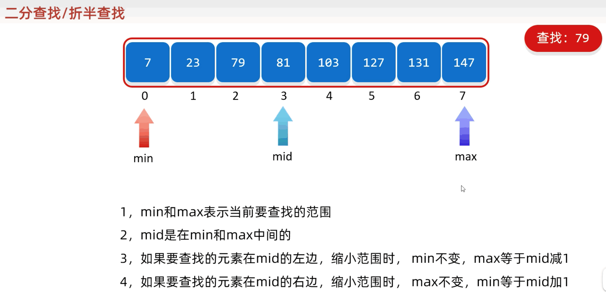
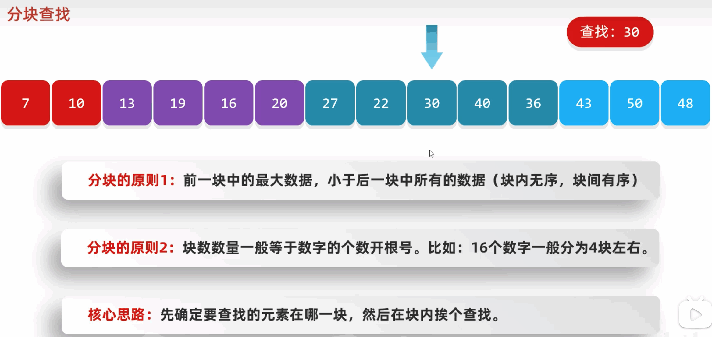
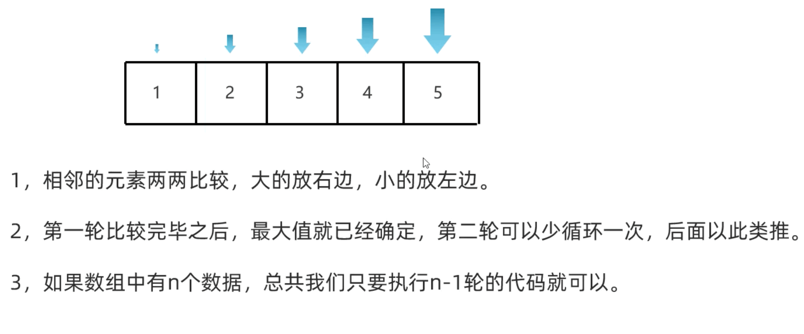

# 12.常见的算法

## 12.1.查找算法

基本查找(顺序查找)、二分查找(折半查找)、分块查找、插值查找、斐波那契查找、树表查找、哈希查找

### 12.1.1.二分查找

前提条件:  数组中的数据必须是有序的

核心思想: 每次排除一半的查找范围

min max mid 都表示下标



### 12.1.2.差值查找

数据分布比较均匀


### 12.1.3.二分查找、插值查找、斐波那契额查找各自特点

* 相同点

都是通过不断的缩小范围来查找对应的数据

* 不通电

计算 mid 的方式不一样

  - * 二分查找 每次指向范围的中间位置
  - * 插值查找 mid 尽可能靠近查找数据， 但要求数据尽可能分布均匀
  - * 斐波那契额查找 根据黄金分割点来计算 mid 指向的位置

### 12.1.3.分块查找



你这个是这么分块的？？？ 手动分块么？

### 12.1.4.哈希查找

### 12.1.5.树表查找

## 12.2.排序算法

## 12.2.1.冒泡排序

相邻的数据两两比较， 小的放前面， 大的放后面



### 12.2.2.选择排序

从 0 索引开始依次比较， 小的放前面，打的放后边 

### 12.2.3.插入排序

将 0 索引的元素到 N 索引的元素看做是有序的， 把 n + 1 的元素到最后看成是无序的。遍历无序的数组， 将遍历的元素插入有序序列中适当的位置， 如遇相同数据， 插到后边

### 12.2.4.递归

方法内部再次调用方法的时候， 参数必须更加靠近出口

### 12.2.4.快速排序

* 将排序范围中第一个数字作为基准数， 在定义两个变量 start end
* start 从前往后找比基准数大的， end 从后往前找比基准数小的
* 找到之后交换 start 和 end 指向的元素， 并循环这一过程， 知道 start 和 end 处于同一个位置， 该位置是基准数插入的位置，再让基数归位
* 归位后的效果，基准数左边的比基准数小， 基准数右边的比基准数大

```java
package src.sortdemo1;

public class sortTest {
  public static void main(String[] args) {
    int[] arr = {3, 1, 5, 6, 7, 4, 8, 9};

    // 冒泡排序
    int[] newArr = bubbleSort(arr);
    // println(newArr);

    // 选择排序
    int[] newArr2 = chooseSort(arr);
    // println(newArr2);

    // 插入排序
    int[] newArr3 = insertSort(arr);
    // println(newArr3);

    // 递归
    int sum = getSum(100);
    // System.out.println(sum);

    quickSort(arr, 0, arr.length - 1);
    // println(arr);

    System.out.println(Arrays.toString(arr));;

  }

  // private static int[] quickSort(int[] arr) {
  //   // int[] _arr = copyArr(arr); 
  //   if (arr.length <= 1) {
  //     return arr;
  //   } 

  //   int start = arr[0];
  //   // int[] minArr = new int[]

  //   return arr;
  // }

  private static void quickSort(int[] arr, int i, int j) {

    int startI = i;
    int endY = j;

    if (startI > endY) return;

    int baseNumber = arr[startI];
    
    while (startI != endY) {

      // while (true) {
      //   if (arr[startI] > baseNumber || startI >= endY) {
      //     break;
      //   }
      //   startI++;
      // }
      // while (true) {
      //   if (arr[endY] < baseNumber || startI >= endY) {
      //     break;
      //   }
      //   endY--;
      // }

      // -- 和 ++ 还不能颠倒顺序，否则排序有问题
      // 原因： 因为拿的是开始值当 基准， 所以最后要移动的一定得是小的数， 所以 end 要先比较， 否则 当 startI == endY  时，可能会是一个大数
      while (true) {
        if (endY <= startI || arr[endY] < baseNumber) {
          break;
        }
        endY--;
      }
      while (true) {
        if (endY <= startI || arr[startI] > baseNumber) {
          break;
        }
        startI++;
      }

      int tem = arr[startI];
      arr[startI] = arr[endY];
      arr[endY] = tem;
    }

    int tem = arr[startI];
    arr[startI] = arr[i];
    arr[i] = tem;

    quickSort(arr, i, startI - 1);
    quickSort(arr, startI + 1, j);
  }

  private static int getSum(int num) {
    if (num == 1) {
      return num;
    }
    return num + getSum(num - 1);
  }

  private static int[] insertSort(int[] arr) {
    // int[] _arr = new int[arr.length];
    // _arr[0] = arr[0];
    // for (int i = 1; i < arr.length; i++) {
      //   for (int j = _arr.length - 1; j < 0; j++) {
        //     if (arr[i] > _arr[j]) {
          //       _arr.
          //     }
          //   }
          // }
    
    int[] _arr = copyArr(arr);  
    int startIndex = 1;
    for (int i = 0; i < _arr.length - 1; i++) {
      if (_arr[i] > _arr[i + 1]) {
        startIndex = i + 1;
        break;
      }
    }

    for (int i = startIndex; i < _arr.length; i++) {
      int j = i;

      while (j > 0 && _arr[j] < _arr[j - 1]) {
        int tem = _arr[j];
        _arr[j] = _arr[j-1];
        _arr[j-1] = tem;
        j--;
      }
    }

    return _arr;
  }

  private static int[] chooseSort(int[] arr) {
    int[] _arr = copyArr(arr);
    for (int i = 0; i < arr.length - 1; i++) {
      for (int j = i + 1; j < arr.length; j++) {
        if (arr[i] > arr[j]) {
          int tem = _arr[j];
          _arr[j] = _arr[j-1];
          _arr[j-1] = tem;
        }
      }
    }
    return _arr;
  }

  private static int[] copyArr(int[] arr) {
    int[] _arr = new int[arr.length];
    for (int i = 0; i < arr.length; i++) {
      _arr[i] = arr[i];
    }
    return _arr;
  }

  private static void println(int[] arr) {
    for (int i = 0; i < arr.length; i++) {
      System.out.println(arr[i]);
    }
  }


  private static int[] bubbleSort(int[] arr) {
    int[] _arr = copyArr(arr);
    for (int i = 0; i < _arr.length - 1; i++) {
      for (int j = 0; j < _arr.length - i - 1; j++) {
        if (_arr[j] > _arr[j + 1]) {
          int tem = _arr[j];
          _arr[j] = _arr[j+1];
          _arr[j+1] = tem;
        }
      }
    }
    return _arr;
  }
}
```


## 12.3.Arrays

操作数据的工具类

方法名 | 说明
-- | --
public static String toString(数组) | 把数组拼接成一个字符串
public static int binarySearch(数组, 查找的元素) | 二分查找法查找元素 (数组中的元素必须是升序的)
public static int[] copyOf(原数组, 新数组长度) | 拷贝数组
public static int[] copyOfRange(原数组, 起始索引, 结束索引) | 拷贝数组(指定范围)
public static void fill(数组, 元素) | 填充数组
public static void sort(数组) | 按照默认方式进行数组排序
public static void sort(数组, 排序规则) | 按照指定的规则排序

### 12.3.1.binarySearch

数组中的元素必须是升序的

如果要查找的元素是存在的，那返回真实的索引

如果查找的元素不存在， 返回 -插入点 - 1 (我的理解： 如果返回不存在的插入点是 0， 返回 -0 会和 0 有歧义, 所以-插入点 - 1)

### 12.3.2.copyOf

方法的底层会根据第二个参数创建新的数组

如果新数组的长度是小于老数组的长度， 会部分拷贝 <br />
如果新数组的长度是等于老数组的长度， 会完全拷贝 <br />
如果新数组的长度是大于老数组的长度， 会默认不上初始值 <br />

### 12.3.3.copyOfRange

包头不包尾

### 12.3.4.sort

只能给引用数据类型进行排序， 如果数组是基本能数据类型， 需要变成对应的包装类

```java
Integer[] arr = {1, 2, 3, 4};
```

第二个参数是一个接口， 所以我们在调用方法的时候， 需要传递这个接口的实现类对象， 作为排序的规则。但是这个实现类，只使用一次，所以没必要单独写一个类， 直接采取匿名内部类的方式就可以了

* 底层原理

利用插入排序和二分查找的方式进行排序。默认把 0 当做有序的， 1 索引到最后默认是无序的，遍历无序的序列每个元素，假设当前遍历的是 A 元素， 把 A 元素往有序的插，在插入的时候， 是利用 二分查找 确定 A 元素的插入点。拿着 A 元素， 和插入点的元素进行比较，比较的规则就是 compare 方法体。如果方法的返回值是负数，拿着 A 继续跟前面的数据进行比较， 如果方法的返回值是正数，拿着 A 继续跟后面的数据进行比较， 如果方法的返回值是 0，拿着 A 继续跟后面的数据进行比较， 知道确定 A 的位置

* compare 方法的形式参数

  - 参数1 o1： 表示在无序序列中， 遍历得到每一个元素
  - 参数2 o2： 有序序列中的元素

* 返回值

  - 负数： 表示当前插入的元素是小的， 放在前面
  - 正数： 表示当前插入的元素是大的， 放在后面
  - 0 表示当前要插入的元素跟现在的元素比是一样的也会放在后面

```java
// o1 - o2 升序排序
// o2 - o1 降序排序
// 注意： arr 里面的类型应该是引用数据类型 Integer[]
Arrays.sort(arr, new Comparator<Integer>() {
  @Override
  public int compare(Integer o1, Integer o2) {
    System.out.println(o1);
    System.out.println(o2);
    return o1 - o2;
  }
});
// Arrays.sort(arr);
```

## 12.4.Lambad 表达式

Lambad 表达式是 JDk8 开始后的一种新语法形式

* 注意点
  - Lambad 表示式可以用来简化匿名内部类的书写
  - Lambad 表示式只能简化函数式接口匿名内部类的写法
  - 函数式接口： 有且只有一个抽象方法的接口叫做函数式接口， 接口上方可以加 @FunctionalInterface 注释

* Lambad 省略规则
  - 参数类型可以省略不写
  - 如果只有一个参数， 参数类型可以省略， 同时 () 也可以省略
  - 如果 Lambad 表达式只有一行， 大括号， 分号， return 可以省略不写， 需要同事省略

```java
Arrays.sort(arr2, (Integer o1, Integer o2) -> {
    return o1 - o2;
  }
);

Arrays.sort(arr2, (o1, o2) -> o1 - o2);
```

```java
package src.lambaddemo01;

public class LambadTest {
  public static void main(String[] args) {
    method(() -> {
      System.out.println("youyong");
    });
  }

  private static void method(Swim s) {
    s.swimming();
  }
}
```

```java
package src.lambaddemo01;

@FunctionalInterface
public abstract interface Swim {
  public abstract void swimming();
}
```

