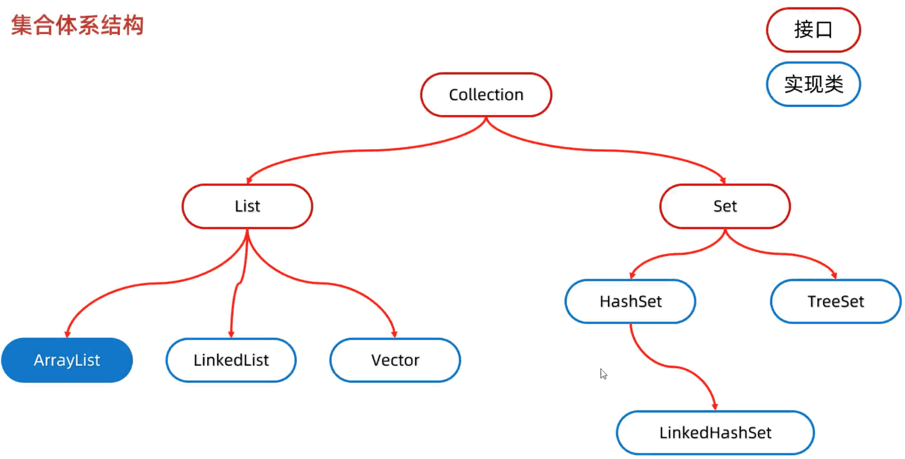
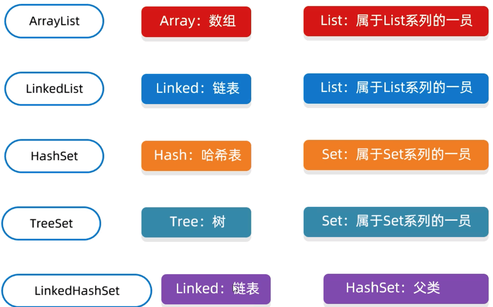
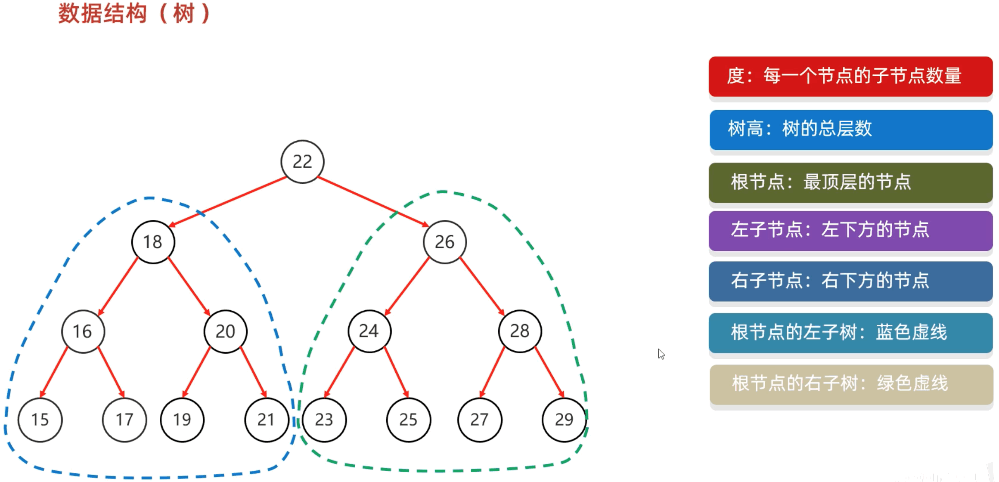
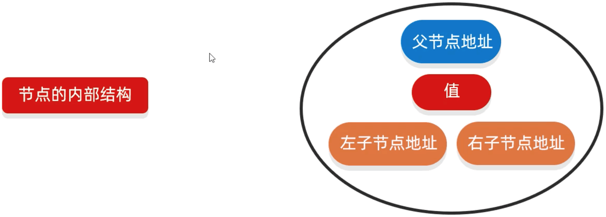
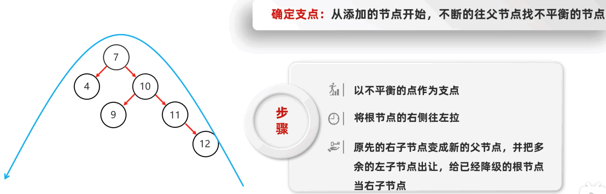
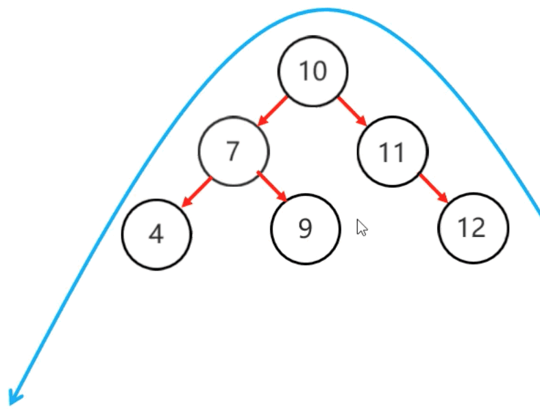
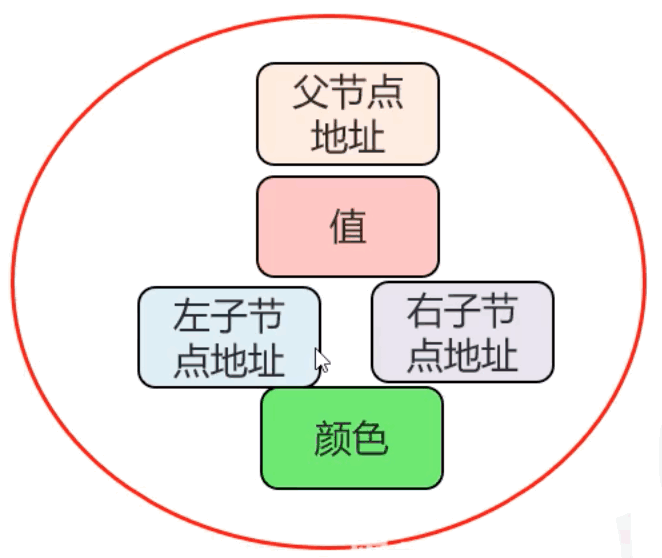
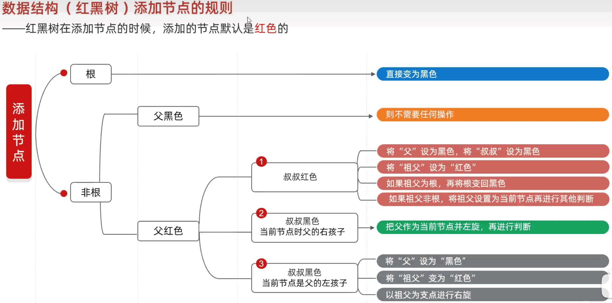

# 13.集合进阶

## 13.1.集合体系结构

分为两种 Collection 和 Map

## 13.2.Collection (单列集合)

Collection 是单列集合的祖宗接口， 它的功能是全部单列集合都可以继承使用

* List 系列集合: 添加元素是有 ***序的，可重复，有索引*** (有序： 存和取的顺序是一致的)
* Set 系列集合: 添加元素是 ***无序的，不重复，无索引***





### 13.2.1.Collection 方法

方法名称 | 说明
-- | --
public boolean add(E e) | 把给定的集合给到当前集合中
public void clear() | 清空集合中所有元素
public boolean remove(E e) | 把给定对象在当前集合中删除
public boolean contains(Ojbect obj) | 判断集合中是否包含给定对象
public boolean isEmpty() | 判断当前集合是否为空
public int size() | 返回集合中元素的个数/集合的长度

> Collection 是一个接口， 不能直接创建他的对象，所以只能创建他的实现类对象

* add 

  - 如果往 List 系列中添加数据， 那么永远返回 true， 因为 List 系列是允许元素重复的
  - 如果往 Set 系列中添加数据， 如果当前添加的元素不存在，如返回 true， 添加成功， 如果添加元素已经存在，如返回false，添加失败， 因为 Set 系列集合不允许重复

```java
public class CollectionTest {
  public static void main(String[] args) {

    Collection<String> coll = new ArrayList<>();
    coll.add("aaa");
    coll.add("aaa");

    coll.remove("add");
  }
}
```

* remove

因为 Collection 里面是共性的方法， 所以不能通过索引进行删除， 只能通过元素对象进行删除

返回布尔值，删除成功返回 true ， 失败 false ， 删除不存在的元素返回 false

* contains

底层是依赖 equals 方法进行判断是否存在。 要判断集合存储的自定义对象， 
也想通过 contains 方法进行判断， 那么在 javabean 类中， 要重写 equals

如果没有重写 equals 方法， 那么默认使用 Object 类中的 equals 方法进行判断， Object 中 equals 方法，比较的是地址值

```java
Collection<Student> stus = new ArrayList<>();
Student s1 = new Student("zs", 18);
Student s2 = new Student("ls", 19);
Student s3 = new Student("ww", 19);
Student s4 = new Student("zs", 18);

stus.add(s1);
stus.add(s2);
stus.add(s3);

System.out.println(stus.contains(s4)); // true
```

```java
package src.collectiondemo01;

public class Student {
  private String name;
  private int age;
  
  public Student() {
  }
  public Student(String name, int age) {
    this.name = name;
    this.age = age;
  }
  public String getName() {
    return name;
  }
  public void setName(String name) {
    this.name = name;
  }
  public int getAge() {
    return age;
  }
  public void setAge(int age) {
    this.age = age;
  }
  @Override
  public boolean equals(Object obj) {
    if (this == obj)
      return true;
    if (obj == null)
      return false;
    if (getClass() != obj.getClass())
      return false;
    Student other = (Student) obj;
    if (name == null) {
      if (other.name != null)
        return false;
    } else if (!name.equals(other.name))
      return false;
    if (age != other.age)
      return false;
    return true;
  }
}
```

### 13.2.2.Collection 的遍历方式

迭代器遍历、 增强 for 遍历、 Lambda 表达式遍历

* 迭代器遍历

迭代器在 Java 中的类是 Iterator， 迭代器是集合专用的遍历方式

&nbsp;&nbsp; 1. Collection 集合获取迭代器


方法名称 | 说明
-- | --
Iterator<\E> iterator() | 返回迭代器对象， 默认指向当前集合的 0 索引

> \ 只是为了不报错 应该没有这个 \

&nbsp;&nbsp; 2. Iterator 中常用的方法

方法名称 | 说明
-- | --
boolean hasNext() | 判断当前位置是否有元素，有返回 true， 没有返回 false
E next() | 获取当前位置的元素， 并将迭代器对象移向下一个位置


```java
package src.iteratordemo01;

import java.util.ArrayList;
import java.util.Collection;
import java.util.Iterator;

public class IteratorTest {
  public static void main(String[] args) {

    // 创建集合并添加元素
    Collection<String> coll = new ArrayList<>();
    coll.add("aaa");
    coll.add("bbb");
    coll.add("ccc");
    coll.add("ddd");

    // 获取迭代器对象
    Iterator<String> it = coll.iterator();
    // 利用循环不断去获取元素中的每一个元素
    while (it.hasNext()) {
      System.out.println(it.next());
    }

    // it.next() // 会报 NoSuchElementException
  }
}
```

* Collection 遍历细节注意点

1. 多调用 next()  会报错 NoSuchElementException
2. 迭代遍历完毕，指针不会复位, 想要再次遍历需要重新获取，才能 遍历
3. 迭代器遍历时， 不能使用集合的方式进行增加或者删除， 如果要删除要使用迭代器提供的方法 it.remove(), 如果要添加没有办法

```java
// 获取迭代器对象
Iterator<String> it = coll.iterator();
// 利用循环不断去获取元素中的每一个元素
while (it.hasNext()) {
  String s = it.next();
  if (s == "aaa") {
    it.remove();
  }
  System.out.println(s);
}
```

* 增加 for 遍历

  - 增强 for 遍历底层就是迭代器， 为了简化迭代器的代码书写的
  - 它是 JDK5 之后出现的， 其内部原理就是一个 Iterator 迭代器
  - 所有单列集合和数组才能用增强 for 循环遍历

&nbsp;&nbsp; 1. 格式

```java
for(元素的数据类型 变量名 : 数组或集合) {
  
}
for(String s : list) {

}

Collection<String> coll = new ArrayList<>();
coll.add("aaa");
coll.add("bbb");
coll.add("ccc");
coll.add("ddd");

for(String s : coll) {
  System.out.println(s);
}
for(String s : coll) {
  // System.out.println(s);
  s = "qqq" // 不能更改
}
```

&nbsp;&nbsp; 2. 细节

修改增强 for 中的变量， 不会改变集合中原本的数据 (例子中的 s 仅仅是第三方变量)

* Lambda 表达式遍历

底层原理： fori 遍历， 依次得到每一个元素， 把得到的每一个 accept 元素， 传递给下面的 accept 方法

```java
coll.forEach(new Consumer<String>() {
  @Override
  public void accept(String s) {
    System.out.println(s);
  }
});

coll.forEach(s -> System.out.println(s));
```


## 13.3.List 集合

### 13.3.1.List 集合的特点

* 有序： 存和取元素顺序一致
* 有索引： 可以通过索引操作元素
* 可重复： 存储的元素可以重复

### 13.3.2.List 集合的特有方法

* Collection 的方法 List 都继承了

* List 集合因为有索引， 所以多了很多索引操作的方法

方法名称 | 说明
-- | --
void add(int index, E element) | 在此集合中在指定位置插入指定元素
E remove(int index) | 删除指定索引的元素，返回被删除元素
E set(int index, E element) | 修改指定索引的元素，返回被修改元素
E get(int index) | 获取指定索引的元素

* 删除元素的问题

remove(1) 是删除元素还是删除 1 索引上的元素呢

在调用方法的时候， 如果方法出现重载，优先调用实参和形参类型一致的那个方法

```java
List<Integer> list2 = new ArrayList<>();
list2.add(1);
list2.add(2);
list2.add(3);
list2.remove(2);

// 手动封箱， 手动把基本数据类型 1 ， 变成 Integer 类型
Integer i = Integer.valueOf(1);
list2.remove(i);

```

### 13.3.3.List 集合的遍历方式

迭代器遍历、 列表迭代器遍历、 增强 for 循环、 Lambda表达式遍历、 普通 for 循环(因为List集合存在索引)

迭代器遍历、 增强 for 循环、 Lambda表达式遍历 同上

* 普通 for 循环

size 方法和get方法循环结合的方式， 利用所用获取， 到集合中的每一个元素

```java
for (int j = 0; j < list2.size(); j++) {
  int a = list2.get(j);
  // Integer a = list2.get(j);
  System.out.println(a);
}
```

* 列表迭代器

获取一个列表迭代器对象， 里面的指针默认指向 0 索引的

> 额外添加了一个方法 add ，在遍历的时候，可以 添加元素

```java
ListIterator<String> it = list.listIterator();
while (it.hasNext()) {
  String s = it.next();
  if (s == "aaa") {
  // if ("aaa".equals(s)) {
    it.add("eee");
  }
  System.out.println(s);
} 
System.out.println(list);
```

* 五种遍历方式对比

  - 迭代器遍历： 在遍历过程需要删除元素， 请使用迭代器
  - 列表迭代器： 在遍历过程中需要添加元素， 请使用列表迭代器
  - 增强 for 遍历， lambda 表达式： 仅仅想遍历， 不需要操作
  - 普通 for 遍历， 如果遍历的时候想要操作索引， 可以用普通 for


## 13.4.数据结构

数据结构是计算机底层存储， 组织数据的方式。是指数据相互之间是以什么方式排列在一起的。

数据结构是为了更加方便的管理和使用数据， 需要结合具体的业务场景来进行选择。

一般情况下， 精心选择的数据结构可以带来更高的运行或存储效率

### 13.4.1.对数据结构应用的思考：

* 每种数据结构长什么样子
* 如何添加数据
* 如何删除数据

### 13.4.2.常见的数据结构

栈、 队列、 数组、 链表、 二叉树、 二叉查找树、 平衡二叉树、 红黑树

* 栈

栈的特点： 后进先出， 先进后出

* 队列

先进先出， 后进后出

* 数组 <br>
  数组是一种查询快、 增删慢的类型
  - 查询速度快: 查询数据通过地址值和索引定位， 查询任意数据耗时相同。 (元素在内存中是连续存储的)
  - 删除效率低: 要将原始数据删除， 同时后边每个元素前移
  - 添加效率极低: 添加位置后的每个元素后移， 再添加元素

* 链表 
  - 链表中的节点是独立的对象， 在内存中是不连续的， 每个结点包含数据值和下一个结点的地址值
  - 链表查询速度慢，无论查找哪个数据都要从头开始找
  - 链表增删相对快

## 13.5.ArrayList

### 13.5.1.ArrayList集合底层原理  

* 利用空参创建的集合， 在底层创建一个默认长度为 0 的数组
* 添加第一个元素时， 底层会创建一个新的长度为 10 的数组
* 存满时， 会扩容 1.5 倍
* 如果一次添加多个元素， 1.5倍还放不下， 则新创建的数组长度以实际为准

## 13.6.LinkedList 集合

底层数据结构是双链表， 查询慢， 增删快， 但是如果操作的是首位元素， 速度也是极快的

### 13.6.1.LinkedList 集合方法

底层数据结构是双链表， 查询慢， 首位操作的速度是极快的， 所以多了很多首尾操作的特有 API

特有方法 | 说明
-- | --
public void addFirst(E e) | 在该列表开头插入指定元素
public void addLast(E e) | 将指定元素追加到此列表的末尾
public E getFirst() | 返回此列表中的第一个元素
public E getLast() | 返回此列表中的最后一个元素
public E removeFirst() | 此列表中删除并返回第一个元素
public E removeLast() | 此列表中删除并返回第最后一个元素

* 并发修改异常底层原理

modCount: 表示集合变化次数， 每 add 或 remove 一次这个变量都会自增， 当我们创建迭代器对象的时候， 就会把这个次数告诉迭代器。
当前集合中最新变化次数跟一开始记录次数是否相同，如果相同， 证明当前集合没有变化， 如果不一样， 证明在迭代器遍历集合过程中， 使用了集合的删除或添加方法


## 13.7.Map (双列集合)

下一章讲

## 13.8.泛型

是 JDK5 引入的新特性， 可以在编译阶段约束的操作类型， 并进行检查

> 泛型只支持引用数据类型

> Java 中的泛型是 伪泛型

### 13.8.1.泛型的格式

```java
<数据类型>

ArrayList<String> list = new ArrayList<>();
```

### 13.8.2.泛型的好处

* 统一数据类型
* 把运行时期的问题提前到编译期间， 避免了强制类型转换可能出现异常， 因为在编译阶段类型就能确定下来
* 如果不写泛型，类型默认是 Object

### 13.8.3.泛型类

使用场景： 当一个类中，某一个变量的数据类型是不确定的， 就可以定义带有泛型的类。 所有方法都能用

* 格式

```java
修饰符 class 类名<类型> {}

// 举例 此处的 E 可以理解为变量， 但不是用来记录数据的， 而是用来记录数据类型的， 可以写成 T E K V 等
public class ListArray<E> {}
```

```java
package src.myarraylistdemo01;

import java.util.Arrays;

public class MyArrayList<E> {
  Object[] arr = new Object[10];
  int size;

  public void add(E e) {
    arr[size] = e;
    size++;
  }

  public E get(int i) {
    return (E)arr[i];
  }

  public String toString() {
    return Arrays.toString(arr);
  }
}
```

```java
package src.myarraylistdemo01;

public class MyArrayTest {
  public static void main(String[] args) {
    MyArrayList<String> alist1 = new MyArrayList<>();

    alist1.add("aaa");
    alist1.add("bbb");

    System.out.println(alist1.toString());

    MyArrayList<Integer> alist2 = new MyArrayList<>();
    alist2.add(1);
    alist2.add(2);

    System.out.println(alist2.toString());
  }
}
```

### 13.8.4.泛型方法

方法中形参类型不确定时， 可以使用类型后面的定义泛型 < E>， 只有在本方法才能用

* 格式

```java
修饰符 <类型> 返回方法类型 方法名(类型 变量名) {}

public <T> void show(T t) {}
```

```java
package src.myarraylistdemo01;

import java.util.ArrayList;

public class Demo01 {
  private Demo01() {}
  public static<E> void addAll(ArrayList<E> list, E e1, E e2) {
    list.add(e1);
    list.add(e2);
  }
  public static<E> void addAll(ArrayList<E> list, E...e) {
    for (int i = 0; i < e.length; i++) {
      list.add(e[i]);
    }
  }
}
```

```java
ArrayList<String> aList3 = new ArrayList<>();
Demo01.addAll(aList3, "aaa", "bbb");
Demo01.addAll(aList3, "aaa", "bbb", "ccc");
System.out.println(aList3);
```

### 13.8.5.泛型接口

实现类给出具体类型； 实现类延续泛型，创建实现类对象时再创建类型

* 格式

```java
修饰符 interface 接口名<类型> {}

public interface List<E> {}
```

### 13.8.6.泛型的继承和通配符

泛型不具备继承性， 但是数据具备继承性

```java
package src.myarraylistdemo01;
public class Ye {}
```

```java
package src.myarraylistdemo01;
public class Fu extends Ye {}
```

```java
package src.myarraylistdemo01;

import java.util.ArrayList;

public class GenericsDemo {
  public static void main(String[] args) {
    ArrayList<Ye> aList1 = new ArrayList<>();
    ArrayList<Fu> aList2 = new ArrayList<>();

    method(aList1);
    // 这个会报错，所以说泛型不具备继承性
    method(aList2); // 问题： The method method(ArrayList<Ye>) in the type GenericsDemo is not applicable for the arguments (ArrayList<Fu>)
  
    // 数据具有继承性， 可以添加 fu 的实例， 因为 fu 是继承 ye 的
    aList1.add(new Ye());
    aList1.add(new Fu());
  }

  public static void method(ArrayList<Ye> list) {

  }
}
```

* 泛型通配符 ?

利用泛型是有一个小弊端， 此时他可以接受任意的数据类型。

希望： 在方法虽然不确定类型， 但是希望只能传递 Ye Fu Su。

解决方式： 利用泛型的通配符

? 也表示不确定类型， 他可以进行类型限定。 

```
? extends E  表示可以传递 E 或者 E 所有的子类类型
? super E 表示可以传递 E 或者 E 所有的父类类型
```

```java
package src.myarraylistdemo01;

import java.util.ArrayList;

public class GenericsDemo {
  public static void main(String[] args) {
    ArrayList<Ye> aList1 = new ArrayList<>();
    ArrayList<Fu> aList2 = new ArrayList<>();

    method(aList1);
    // method(aList2); // 问题： The method method(ArrayList<Ye>) in the type GenericsDemo is not applicable for the arguments (ArrayList<Fu>)

    aList1.add(new Ye());
    aList1.add(new Fu());
  }

  // ? 可以单独使用， 不用再前面定义
  public static void method1(ArrayList<?> list) {}
  public static void method(ArrayList<? extends Ye> list) {}
  public static void method(ArrayList<? extends Ye> list) {}
  public static void method3(ArrayList<? super Su> list) {}
}
```

### 13.8.7.应用场景

* 如果在定义类、 方法、 接口的时候， 如果类型不确定， 就可以定义泛型类、 泛型方法、 泛型接口
* 如果类型不确定， 但是能知道以后只能传递某个继承体系中， 就可以用泛型通配符


## 13.9.数据结构 - 二叉树

二叉树中， 任意节点的度 <= 2



### 13.9.1.二叉树的内部结构



### 13.9.2.普通二叉树

内部数据没有规律

### 13.9.3.二叉查找树

二叉查找树， 又称二叉排序树或者二叉搜索树

* 特点
  - 每个节点上最多有两个子节点
  - 任意节点左子树上的值都小于当前节点
  - 任意节点右子树上的值都大于当前节点

* 二叉查找树的规则
  - 小的存左边
  - 打的存右边
  - 一样的不存

* 二叉查找树的遍历
  - 前序遍历
  - 中序遍历
  - 后序遍历
  - 层序遍历

* 前序遍历

从根节点开始， 然后按照当前节点， 左子节点、 右子节点的顺序遍历

* 中序遍历 - 最常用 (拿到的数据是从小到大)

从最左边的子节点开始， 然后按照左子节点， 当前节点、 右子节点的顺序遍历

* 后序遍历

从最左边的子节点开始， 然后按照左子节点， 右子节点， 当前节点的顺序遍历

* 层序遍历

从根节点开始 一层一层的遍历

## 13.10.数据结构 - 平衡查找树

### 13.10.1.规则： (前三点和二叉查找树相同)

* 每个节点上最多有两个子节点
* 任意节点左子树上的值都小于当前节点
* 任意节点右子树上的值都大于当前节点
* 任意节点左右子树高度差不超过 1

### 13.10.2.平衡二叉树的旋转机制

* 左旋
* 右旋
* 触发时机: 当添加一个节点之后，该树不再是一个平衡二叉树

### 13.10.3.确定支点

从添加节点开始， 不断的往父节点找不平衡的节点

### 13.10.4.旋转步骤

* 以不平衡的点作为支点
* 把支点左旋降级， 变成左子节点
* 晋升原来的右子节点

### 13.10.5.左旋的一种复杂的情况

* 旋转前



* 旋转后



* 动态图


右旋同理

### 13.10.6.平衡二叉树需要旋转的四种情况

* 左左

一次右旋

* 左右

先局部左旋 (整理成左左的情况)， 再整体右旋

* 右右

一次左旋

* 右左

先局部右旋 (整理成右右的情况)， 再整体左旋

## 13.11.数据结构 - 红黑树

* 红黑是一自平衡的二叉查找树， 是计算机科学中用到的一种数据结构
* 1972年出现， 当时被称之为 平衡二B树， 后来， 1978年被修改为 红黑树
* 它是一种特殊的 二叉查找树， 红黑树的每个节点上都有存储位表示节点的颜色
* 每个节点可以是红或者黑， 红黑树不是高度平衡的， 它的平衡是通过 “红黑规则” 来实现的

增删改查性能都能很好

### 13.11.1.红黑树特点

* 是一个二叉查找树
* 但是不是高度平衡的
* 条件： 特有的红黑规则

### 13.11.2.红黑规则

* 每个节点或是红色或是黑色
* 根节点必须是黑色的
* 如果一个节点没有子节点或者父节点， 则该节点相应的指针属性属性值为 Nil 视为叶节点， 每个叶节点 (Nil) 是黑色的
* 如果某一个节点是红色的， 那么他的子节点必须是黑色的 (不能出现两个红色节点相连的情况)
* 对每一个节点， 从该节点到其所有后代叶节点的简单路径上， 均包含相同数目的黑色节点

### 13.11.3.红黑树节点结构



### 13.11.4.红黑树添加节点的规则

* 默认节点： 添加的节点默认是红色的 (效率高)



## 13.12.Set 系列集合

添加元素是无序的，不重复，无索引

Set 接口上的方法基本上与 Collection 的 API 一致

* 无序: 存取顺序不一致
* 不重复: 可以去除重复
* 无索引: 没有大索引的方法， 所以不能通过普通 for 循环遍历， 也不能通过索引来获取元素

### 13.12.1.Set 集合的实现类

* HashSet: 无序，不重复，无索引
* LinkedHashSet: 有序，不重复，无索引
* TreeSet: 可排序，不重复，无索引

```java
package src.setdemo01;

import java.util.HashSet;
import java.util.Iterator;
import java.util.Set;

public class SetTest {
  public static void main(String[] args) {
    Set<String> s = new HashSet<>();
    
    boolean b1 = s.add("张三"); // true
    boolean b2 = s.add("张三"); // false
    s.add("李四"); // false
    s.add("王五"); // false

    // 迭代器遍历
    Iterator<String> it = s.iterator();
    while (it.hasNext()) {
      String str = it.next();
    }

    // 增强 for 遍历
    for (String str : s) {
      System.out.println(str);
    }

    // Lambda 表达式
    s.forEach(str -> System.out.println(str));
  }
}
```

## 13.13.HashSet

### 13.13.1.HashSet 底层原理

* HashSet 集合底层采取 哈希表 存储数据
* 哈希表 是对于增删改查数据性能都较好的结构

### 13.13.2.哈希表的组成

* JDK 8 之前: 数组 + 链表
* JDK 8 开始: 数组 + 链表 + 红黑树

### 13.13.3.哈希值

对象的整数表现形式

* 哈希值的计算
  - 根据 hashCode 方法算出来的 int 类型的整数
  - 该方法定义在 Object 类中， 所有对象都可以调用， ***默认使用地址值进行计算***
  - 一般情况下， 会重写 hashCode 方法， 利用对象内部的属性值计算哈希值

* 对象哈希值的特点
  - 如果没有重写 hashCode 方法， 不同对象计算出的哈希值是不同的
  - 如果已经重写 hashCode 方法， 不同对象只要属性值相同， 计算出的哈希值是一样的
  - 在小部分情况， 不同的属性值或者不同的地址值计算出来的哈希值也有可能一样 (哈希碰撞)

```java
package src.setdemo01;

public class HashCodeTest {
  public static void main(String[] args) {
    Student s1 = new Student("zs", 18);
    Student s2 = new Student("zs", 18);

    // 重写 hashCode
    System.out.println(s1.hashCode() == s2.hashCode()); // true

    // 哈希碰撞
    System.out.println("abc".hashCode()); // 96354
    System.out.println("acD".hashCode()); // 96354
  }
}
```

### 13.13.4.HashSet 底层原理

* 创建一个默认长度 16, 默认加载因子 0.75 的数组， 数组名 table
* 根据元素的哈希值跟数组的长度计算出应存入的位置
* 判断当前位置是否为 null， 如果是 null 直接存入
* 如果位置不为 null， 如果有元素， 则调用 *** equals *** 方法比较属性值
* 一样: 不存 ;  不一样: 存入数组， 形成链表
  - JDK8 以前: 新元素存入数组， 老元素挂在新元素下面
  - JDK8 以后: 新元素直接挂在老元素下面

> JDK8 以后， 当链表长度超过 8 ， 而且数组长度大于等于 64 时， 自动转为红黑树 (红黑树的存储也会导致存取的位置不一样，先存储也不一定会先打印)

> 如果集合中存储的是自定义对象， 必须要重写 hashCode 和 equals 方法
> 自定义的类， 不允许添加相同的属性的对象， 需要自定义 equals 和 hashCode 方法

> 存储的是 String Integer， 这两个类已经重写好了 equals 和 hashCode

> hashCode 和 equals方法: 哈希表有关才会重写

```java
package src.setdemo01;

public class Student {
  private String name;
  private int age;

  public Student() {
  }
  
  public Student(String name, int age) {
    this.name = name;
    this.age = age;
  }

  public String getName() {
    return name;
  }
  public void setName(String name) {
    this.name = name;
  }
  public int getAge() {
    return age;
  }
  public void setAge(int age) {
    this.age = age;
  }

  @Override
  public int hashCode() {
    final int prime = 31;
    int result = 1;
    result = prime * result + ((name == null) ? 0 : name.hashCode());
    result = prime * result + age;
    return result;
  }

  @Override
  public boolean equals(Object obj) {
    if (this == obj)
      return true;
    if (obj == null)
      return false;
    if (getClass() != obj.getClass())
      return false;
    Student other = (Student) obj;
    if (name == null) {
      if (other.name != null)
        return false;
    } else if (!name.equals(other.name))
      return false;
    if (age != other.age)
      return false;
    return true;
  }
  @Override
  public String toString() {
    return "Student [name=" + name + ", age=" + age + "]";
  }
}
```

```java
package src.setdemo01;

import java.util.HashSet;

public class HashCodeTest {
  public static void main(String[] args) {
    Student s1 = new Student("zs", 18);
    Student s2 = new Student("zs", 18);

    // 重写 hashCode
    System.out.println(s1.hashCode() == s2.hashCode()); // true

    // 哈希碰撞
    System.out.println("abc".hashCode()); // 96354
    System.out.println("acD".hashCode()); // 96354

    HashSet<Student> hs = new HashSet<>();
    hs.add(s1);
    hs.add(s2); // false

    System.out.println(hs); // [Student [name=zs, age=18]]
  }
}
```

## 13.14.LinkedHashSet

* 有序、 不重复、 无索引

* 有序： 保证存储和取出的元素顺序一致

* 原理： 底层数据结构依旧是 ***哈希表*** ， 只是每个元素又额外的多了一个双链表的机制记录存储的顺序

## 13.15.TreeSet

* 不重复、 无索引、 可排序

* 可排序: 按照元素的默认规则 (从小到大) 排序

* TreeSet 集合底层基于 ***红黑树*** 的数据结构实现排序的， 增删改查性能都较好

> TreeSet 中 添加实例必须在 类中指定比较方式， 否则会报错

### 13.15.1.TreeSet 集合默认规则

* 对于数值类型: Integer, Double 默认按照从小到大的顺序进行排序
* 对于字符、 字符串类型: 按照 ASCLL 码表中的数字升序进行排序 (字符、 字符串长度大于 1， 一位一位进行比较， 只要当前位能比较出大小， 后边的不再进行比较了)

### 13.15.2.TreeSet 两种比较方式

> 默认使用第一种比较规则, 如果第一种不能满足当前需求, 就使用第二种

* 方式一

默认排序/自然排序: javabean 类实现 Comparable 接口指定比较规则

> 重写 compareTo 方法. this, 表示当前要添加的元素, o, 表示已经在红黑树存在的元素。返回值, 负数, 认为要添加的元素是小的, 存左边。 正数, 认为要添加的元素是大的, 存右边. 0, 认为要添加的元素已经存在舍弃

> hashCode 和 equals方法: 底层是哈希表有关才会重写， 这里不用重写

* 方式二

比较器排序: 创建 TreeSet 对象的时候, 传递比较器 Comparator 指定规则

```java
package src.treesetdemo01;

public class Student implements Comparable<Student> {
  private int age;
  private String name;
  public Student() {
  }
  public Student(int age, String name) {
    this.age = age;
    this.name = name;
  }
  public int getAge() {
    return age;
  }
  public void setAge(int age) {
    this.age = age;
  }
  public String getName() {
    return name;
  }
  public void setName(String name) {
    this.name = name;
  }

  @Override
  public int compareTo(Student o) {
    return this.getAge() - o.getAge();
  }
  @Override
  public String toString() {
    return "Student [age=" + age + ", name=" + name + "]";
  }  
}
```

```java
package src.treesetdemo01;

import java.util.Comparator;
import java.util.TreeSet;

public class TreeSetTest {
  public static void main(String[] args) {
    Student s1 = new Student(18, "zs");
    Student s2 = new Student(18, "ls");
    Student s3 = new Student(16, "ww");

    TreeSet<Student> ts = new TreeSet<>();
    ts.add(s1);
    ts.add(s2);
    ts.add(s3);

    System.out.println(ts);

    // TreeSet<String> ts2 = new TreeSet<>((o1, o2) -> {
    //   int i = o1.length() - o2.length();
    //   // 如果长度为 0, 就按照默认的规则比较字母进行排序
    //   return i == 0 ? o1.compareTo(o2) : i;
    // });
    TreeSet<String> ts2 = new TreeSet<>(new Comparator<String>() {
      @Override
      public int compare(String o1, String o2) {
        int i = o1.length() - o2.length();
        // 如果长度为 0, 就按照默认的规则比较字母进行排序
        return i == 0 ? o1.compareTo(o2) : i;
      }
    });
    ts2.add("d");
    ts2.add("acd");
    ts2.add("b");
    ts2.add("ba");
    ts2.add("a");
    System.out.println(ts2);
  }
}
```

## 13.6.几种集合的总结

* 如果想要几种的元素可重复

用 ArrayList 集合, 基于数组的. (用的最多)

* 如果想要集合中的元素可重复， 而且当前的 增删 操作明显多用于查询

用 LinkedList 集合, 基于链表的.

* 如果想要对集合中的元素进行去重

用 HashSet 集合， 基于哈希表的. (用的最多)

* 如果想要对集合中元素去重, 而且保证存取顺序

用 LinkedHashList 集合, 基于哈希表和双链表, 效率低于 HashSet.

* 如果相对集合中的元素进行排序

用 TreeSet 集合, 基于红黑树. 后续也可以用 List 集合实现排序


