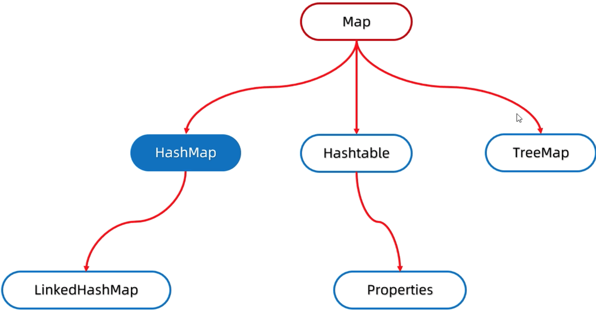
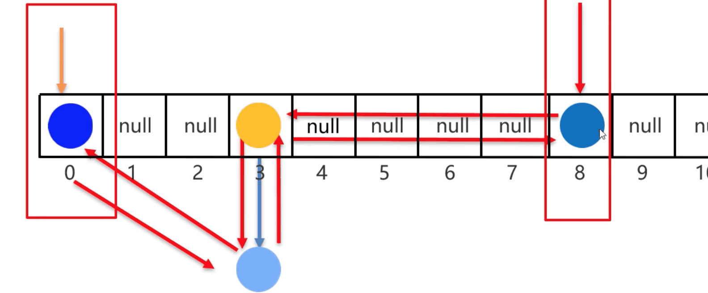

# 14.双列集合

## 14.1.双列集合的特点

* 双列集合一次需要存一对数据, 分别为键和值
* 键不能重复, 值可以重复
* 键和值是一一对应的, 每一个键只能找到自己对应的值
* 键 + 值这个整体, 称之为 "键值对" 或者 "键值对对象", 在 Java 中叫做 "Entry对象"



## 14.2.Map

Map 是双列集合的顶层接口, 他的功能是双列集合都可以继承使用的

### 14.2.1.方法

方法名称 | 说明
-- | --
V put(K key, V value) | 添加元素
V remove(Object key) | 根据键删除键值对元素
void clear() | 移除所有除键值对元素
boolean containsKey(Object key) | 判断是否包含指定的键
boolean containsValue(Object value) | 判断是否包含指定的值
boolean isEmpty() | 判断集合是否为空
int size() | 集合长度, 也就是集合中键值对的个数
V get(K key) | 根据 key 获取 value

* put

再添加元素的时候, 如果键不存在, 那么直接把键值对对象添加到 map 集合当中;
如果键值对存在, 那么会把元素的键值对对象覆盖, 再把被覆盖的值返回.

### 14.2.2.Map的遍历方式

* 键找值
* 键值对
* Lambda 表达式

```java
package src.mapdemo01;

import java.util.HashMap;
import java.util.Map;
// 使用 Entry 也可以在这导包
import java.util.Map.Entry;
import java.util.function.BiConsumer;
import java.util.Set;

public class MapTest {
  public static void main(String[] args) {
    // 创建 Map 集合的对象
    Map<String, String> m = new HashMap<>();

    // 添加键值对
    m.put("齐天大圣", "孙悟空");
    m.put("平天大圣", "牛魔王");
    m.put("二郎神", "杨戬");

    // 获取所有键, 并把这些键放到一个单例集合中
    Set<String> keys = m.keySet();

    // 遍历单列集合, 得到每一个键
    for(String k: keys) {
      // System.out.println(k);
      // System.out.println(m.get(k));
    }

    // idea中 ctrl alt v 自动生成左边代码
    // Set<Entry<String, String>> entries = m.entrySet(); // 使用 Entry 也可以在上面导包
    Set<Map.Entry<String, String>> entries = m.entrySet();
    // 遍历 entries 这个集合, 去获得里面每一个键值对对象
    for(Map.Entry<String, String> entry: entries) {
      System.out.println(entry.getKey());
      System.out.println(entry.getValue());
    }

    // m.forEach(new BiConsumer<String,String>() {
    //   @Override
    //   public void accept(String k, String v) {
    //     System.out.println("key: " + k);
    //     System.out.println("value: " + v);
    //   }
    // });
    m.forEach((k, v) -> System.out.println(k + " " + v));
  }
}
```

## 14.3.HashMap

方法名 | 说明
-- | --
Set< T > keySet() | 获取键名的 Set 集合
Set< Map.entry< T, K > > entrySet() | 获取 Map.entry (包含键值对) 类型 的 Set 集合

### 14.3.1.HashMap 的原理

* HashMap 是 Map 里面的一个实现类
* 没有额外的需要学习的特有方法, 直接使用 Map 里面的方法就可以
* 特点都是由键决定的: 无序、 不重复、 无索引
* HashMap 和 HashSet 底层原理是一模一样的, 都是 哈希表结构

### 14.3.2.HashMap 的特点

* HashMap 底层是 ***哈希表*** 结构的
* 依赖 hashCode 方法 和 equals 方法保存键的唯一
* 如果键存储的是自定义对象, 需要重写 hashCode 和 equals 方法; 如果值存储的是自定义对象, 不需要重写 hashCode 和 equals 方法

```java
package src.mapdemo01;

import java.util.HashMap;

public class MatTest2 {
  public static void main(String[] args) {
    HashMap<Student, String> hm = new HashMap<>();
    Student s1 = new Student("zs", 10);
    Student s2 = new Student("ls", 11);
    Student s3 = new Student("ww", 12);
    Student s4 = new Student("ww", 12);
    hm.put(s1, "北京");
    hm.put(s2, "辽宁");
    hm.put(s3, "河北");
    hm.put(s4, "河北1");
    // hm.put(s1, "北京1");

    hm.forEach((s, v) -> System.out.println(s + " " + v));
  }
}
```

## 14.4.LinkedHashMap

### 14.4.1.特点

由键决定: ***有序、 不重复、 无索引***

有序: 保证存储取出的元素顺序一致

### 14.4.2.原理

底层数据结构依然是哈希表, 只是每个键值对元素又额外的多了一个双链表的机制记录存储的顺序

哈希表组成
* JDK 8 之前: 数组 + 链表
* JDK 8 开始: 数组 + 链表 + 红黑树



## 14.5.TreeMap

### 14.5.1.TreeMap 特点

* TreeMap 和 TreeSet 底层原理一样, 都是红黑树结构的
* 由键决定特性: ***不重复、 无索引、 可排序***
* 可排序: 对键进行排序

> 注意: 默认按照键的 ***从小到大*** 进行 ***排序***, 也可以按照 ***自己定的规则进行排序***

> Tnteger Double 默认情况都是按照升序排序; String 是按照 Ascll 码表

> 自定义对象需要指定排序规则

<!-- 如果键存储的是自定义对象, 需要重写 hashCode 和 equals 方法; 如果值存储的是自定义对象, 不需要重写 hashCode 和 equals 方法 -->

### 14.5.2.TreeMap 排序规则

* 实现 Comparable 接口, 指定比较规则
* 创建集合时, 传递 Comparator 比较器对象, 指定比较规则

```java
package src.mapdemo01;

import java.util.Comparator;
import java.util.TreeMap;

public class TreeMapTest {
  public static void main(String[] args) {
    // TreeMap<Integer, String> tm = new TreeMap<>();
    // TreeMap<Integer, String> tm = new TreeMap<>(new Comparator<Integer>() {
    //   @Override
    //   public int compare(Integer o1, Integer o2) {
    //     return o2 - o1;
    //   }
    // });
    TreeMap<Integer, String> tm = new TreeMap<>((o1, o2) -> o2 - o1);
    tm.put(2, "薯片");
    tm.put(1, "辣条");
    tm.put(4, "火腿肠");
    tm.put(3, "方便面");
    System.out.println(tm);

    Student1 s1 = new Student1("zs", 10);
    Student1 s2 = new Student1("zs", 10);
    Student1 s3 = new Student1("zs", 10);
    TreeMap<Student1, String> mp2 = new TreeMap<>();
    mp2.put(s1, "北京");
    mp2.put(s2, "北京1");
    mp2.put(s3, "北京2");
    System.out.println(mp2); // {Student1 [name=zs, age=10]=北京2}
  }
}
```

```java
package src.mapdemo01;

public class Student1 implements Comparable<Student1> {
  private String name;
  private int age;
  public Student1() {
  }
  public Student1(String name, int age) {
    this.name = name;
    this.age = age;
  }
  public String getName() {
    return name;
  }
  public void setName(String name) {
    this.name = name;
  }
  public int getAge() {
    return age;
  }
  public void setAge(int age) {
    this.age = age;
  }
  @Override
  public int compareTo(Student1 o) {
    /**
     * this 表示当前要添加元素
     * o 表示当前已经在红黑树存在的元素
     * 
     * 返回值
     * 负数: 表示当前要添加的元素是小的, 存左边
     * 正数: 表示当前要添加的元素是大的, 存右边
     * 0: 表示当前要添加的元素已经存在, 舍弃 (在这里应该是覆盖键值)
     * 
     * compareTo 是根据 Ascll 表中排序
     */
    int i = this.getAge() - o.getAge();
    return i == 0 ? this.getName().compareTo(o.getName()) : i;
  }
}
```

## 14.6.HashMap 和 TreeMap 源码讲解

14 - 19 HashMap 和 TreeMap 源码讲解, 需要在来看看

## 14.7.可变参数 (JDK5)

方法的形参个数可以是变化的, 本质上是一个 ***数组***

> 也可以直接传入一个数组 ？？？

### 14.7.1.格式

```
属性类型...名字

int...args
```

```java
package src.argsdemo01;

public class ArgsTest {
  public static void main(String[] args) {
    System.out.println(getSum(1, 2, 3, 4));
  }

  private static int getSum(int...args) {
    int sum = 0;
    for(int a: args) {
      sum += a;
    }
    return sum;
  }
}
```

### 14.7.2.细节

* 在方法中形参最多只能写一个可变参数
* 在方法中可变参数必须放在形参的最后面

## 14.8.集合工具类 Collections

* java.util.Collections 是集合工具类
* Collections 不是集合, 而是集合的工具类

### 14.8.1.Collections 常用 API

方法名 | 说明
-- | --
public static < T > boolean addAll(Collection< T > c, T...elements) | 批量添加
public static void shuffle(List<?> list) | 打乱 List 集合元素的顺序
public static < T > void sort(List< T > list) | 排序
public static < T > void sort(List< T > list, Comparator< T > c) | 根据制定规则进行排序
public static < T > int binarySearch(List< T > list, T key) | 以二分法查找元素
public static < T > void copy(List< T > dest, List< T > src) | 拷贝集合中的元素
public static < T > int fill(List< T > list, T obj) | 使用指定的元素填充集合
public static < T > void max/min(Collection< T > coll) | 根据默认的自然排序获得最 大/小 值
public static < T > void swap(List<?> list, int i, int j) | 交互集合中指定位置的元素

```java
package src.collectionsdemo01;

import java.util.ArrayList;
import java.util.Collections;

public class CollectionsTest {
  public static void main(String[] args) {
    ArrayList<String> aList = new ArrayList<>();

    // 批量添加元素
    Collections.addAll(aList, "a", "abc", "a");

    System.out.println(aList);

    // 打乱
    Collections.shuffle(aList);
    System.out.println(aList);

  }
  public static void practice() {
    HashMap<String, ArrayList<String>> hm = new HashMap<>();
    ArrayList<String> aListBeijing = new ArrayList<>();
    Collections.addAll(aListBeijing, "朝阳区", "海淀区", "顺义区");
    ArrayList<String> aListLiaoNing = new ArrayList<>();
    Collections.addAll(aListLiaoNing, "丹东市", "阜新市", "葫芦岛市");
    ArrayList<String> aListJiLin = new ArrayList<>();
    Collections.addAll(aListJiLin, "通化");
    hm.put("北京", aListBeijing);
    hm.put("辽宁", aListLiaoNing);
    hm.put("吉林", aListJiLin);
    System.out.println(hm);
    // Set<Map.Entry<String, ArrayList<String>>> entries = hm.entrySet();
    StringBuilder str = new StringBuilder();
    hm.forEach((sheng, citys) -> {
      str.append(sheng);
      str.append("=");
      citys.forEach(ctry -> {
        str.append(ctry);
        str.append(",");
      });
    });
    System.out.println(str);
  }
}
```

p27 - p33 游戏练习 回头再看 p27 - p29 看了 其他的回头需要看一下


