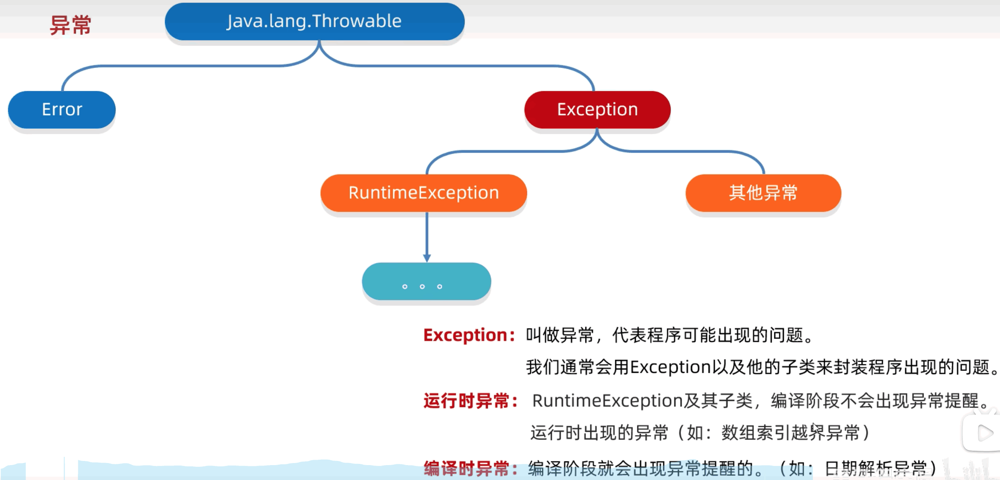

# 18.异常

代表程序出现的问题

## 18.1.异常介绍 

主要学习 Exception



## 18.2.Exception

### 18.2.1.异常体系中最上层的父类是谁

父类: Exception

### 18.2.2.Exception 的分类

* 编译时异常
* 运行时异常

### 18.2.3.编译时异常和运行时异常的区别

* 编译时异常

没有继承 RuntimeExcpetion 的异常, 直接继承于 Exception. 编译阶段就会错误提示

* 运行时异常

RuntimeExcpetion 本身和子类. 编译阶段没有错误提示, 运行时出现

## 18.3.异常的作用

* 异常是用来查询 bug 的关键参考信息
* 异常可以作为方法内部的一种特殊返回值, 以便通知调用者底层的执行情况

## 18.4.异常的处理方式

* JVM 默认的处理方式
  - 把异常的名称, 异常的原因及异常出现的位置等信息输出在控制台
  - 程序停止执行, 下面的代码不会再执行了
* 自己处理
* 抛出异常

### 18.4.1.自己处理异常

```
try {
  可能出现异常的代码
} catch(异常类型 变量名) {
  异常处理代码
}
```

### 18.4.1.自己处理异常的问题

* 如果 try 中没有遇到问题, 怎么执行
  - 把 try 中所有的代码执行完毕, 不执行 catch 中的代码
* 如果 try 中可能遇到多个问题, 怎么执行
  - 如果 try 中可能会遇到多个问题, 可以写多个 catch 与之对应
  - 如果捕获多个异常, 这些异常中如果存在父子关系, 那么父类一定要写下面, 写在上面下面的子类不会执行到
  - 碰到第一个错误就不在执行 try 里面的代码了
* 如果 try 中遇到的问题没有被捕获, 怎么执行
  - 相当于 try...catch 的代码白写了, 还是会交给虚拟机进行处理
* 如果 try 中遇到了问题, 那么 try 下面的其他代码还会执行么
  - 下面的代码就不会执行了, 直接跳转到对应的 catch 中, 执行 catch 里面语句体, 如果没有对应的 catch, 会交给虚拟机进行处理

在 JDK7 之后, 我们可以在catch中同时捕获多个异常, 中间用 | (只能是一个 |) 进行隔开. 如果出现A异常或者B异常, 采取同一种处理方案

```java
package src.exceptiondemo01;

public class ExceptionTest1 {
  public static void main(String[] args) {
    int[] arr = {1, 2, 3, 4, 5};
    try {
      System.out.println(arr[10]);
    // } catch (Exception e) {
    } catch (ArrayIndexOutOfBoundsException e) {
      System.out.println("索引越界");
    }
    try {
      System.out.println(arr[10]);
    // } catch (Exception e) {
    } catch (ArrayIndexOutOfBoundsException | ArithmeticException e) {
      System.out.println("索引越界");
    }
    System.out.println("我执行了");
  }
}
```

写多个也就会执行一个报错
```java
package src.exceptiondemo01;

public class ExceptionTest1 {
  public static void main(String[] args) {
    int[] arr = {1, 2, 3, 4, 5};
    try {
      System.out.println(arr[10]);
      System.out.println(2/0);
      String str = null;
      System.out.println(str.equals("str"));
    } 
    catch (ArrayIndexOutOfBoundsException e) {
      System.out.println("索引越界");
    } catch (ArithmeticException e) {
      System.out.println("除数不能为0");
    } 
    // catch (NullPointerException e) {
    //   System.out.println("空指针异常");
    // } 
    catch (Exception e) {
      System.out.println("Exception");
    }
    System.out.println("我执行了2");
  }
}
```

## 18.5.Throwable 的成员方法

方法名称 | 说明
-- | --
public String getMessage() | 返回此 throwable 的详细消息字符串
public String toString() | 返回此可抛出的简短描述
public void printStackTrace() | 把异常的错误信息输出在控制台 

* printStackTrace 常用

细节: 仅仅是打印错误信息, 不会停止错误运行)

底层是利用 System.err.println 进行输出, 把异常的错误信息以红色字体输出在控制台中

```java
package src.exceptiondemo01;

public class ExceptionTest2 {
  public static void main(String[] args) {
    int[] arr = {1, 2, 3, 4, 5};

    try {
      int num = arr[10];
    // } catch (Exception e) { // 这么写我自己试也行
    } catch (IndexOutOfBoundsException e) {
      String msg = e.getMessage();
      System.out.println(msg);
      String err = e.toString();
      System.out.println(err);
      e.printStackTrace();
    }
    System.out.println("到我这了");
  }
}
```

## 18.6.抛出异常

* throws

写在方法的定义处, 表示表明一个异常, 告诉调用者, 本方法体可能会出现哪些异常

```java
public void 方法() throws 异常类名1, 异常类名2...{
  ...
}
```

> 编译时异常: **必须要写**
> 运行时异常: 可以不写

* throw

写在方法体内, 结束方法. 手动抛出异常对象, 交给调用者. 方法中下面的代码不会再执行

```java
public void 方法() {
  throw new  NullPointerException();
}
```

> NullPointerException 我用这个在vscode会报错, 以后再看

```java
package src.exceptiondemo01;

public class ExceptionTest3 {
  public static void main(String[] args) {
    int[] arr = {};
    try {
      getMax(arr);
    } catch (IndexOutOfBoundsException e) {
      // TODO: handle exception
    }
    try {
      getMax(null);
    } catch (Exception e) {
      e.printStackTrace();
    }
    System.out.println("到我这了");

  }
  public static int getMax(int[] arr) throws IndexOutOfBoundsException {
    // if (arr == null) {
    //   throw new NullPointerException();
    // }
    if (arr.length == 0) {
      throw new IndexOutOfBoundsException();
    }
    int max = arr[0];

    for (int i = 1; i < arr.length; i++) {
      if (max < arr[i]) {
        max = arr[i];
      }
    }
    return max;
  }
}
```

```java
package src.exceptiondemo01;

public class People {
  private String name;
  private int age;
  public People() {
  }
  public People(String name, int age) {
    this.name = name;
    this.age = age;
  }
  public String getName() {
    return name;
  }
  public void setName(String name) {
    if (name.length() < 3 || name.length() > 8) {
      throw new RuntimeException();
    }
    this.name = name;
  }
  public int getAge() {
    return age;
  }
  public void setAge(int age) {
    if (age < 18 || age > 40) {
      throw new RuntimeException();
    }
    this.age = age;
  }
}
```

```java
package src.exceptiondemo01;

import java.util.Scanner;

public class ExceptionTest4 {
  public static void main(String[] args) {
    Scanner sc = new Scanner(System.in);
    People p = new People();

    while (true) {
      try {
        System.out.println("请输入名字");
        String name = sc.nextLine();
        p.setName(name);
        System.out.println("请输入年龄");
        String ageStr = sc.nextLine();
        int age = Integer.parseInt(ageStr);
        p.setAge(age);
        break;
      } catch (NumberFormatException e) {
        System.out.println("NumberFormatException");
      } catch (RuntimeException e) {
        System.out.println("名字或者年龄不符合要求");
      }
    }
  }
}
```

## 18.7.自定义异常

为了让控制台的报错信息更加见名知意

### 18.7.1.自定义异常的步骤

* 定义异常类
* 写继承关系
* 空参构造
* 带参构造

```java
package src.exceptiondemo01;

import java.util.Scanner;

public class ExceptionTest4 {
  public static void main(String[] args) {
    Scanner sc = new Scanner(System.in);
    People p = new People();

    while (true) {
      try {
        System.out.println("请输入名字");
        String name = sc.nextLine();
        p.setName(name);
        System.out.println("请输入年龄");
        String ageStr = sc.nextLine();
        int age = Integer.parseInt(ageStr);
        p.setAge(age);
        break;
      } catch (NumberFormatException e) {
        e.printStackTrace();
      } catch (RuntimeException e) {
        e.printStackTrace();
      }
    }
  }
}
```

```java
package src.exceptiondemo01;

public class People {
  private String name;
  private int age;
  public People() {
  }
  public People(String name, int age) {
    this.name = name;
    this.age = age;
  }
  public String getName() {
    return name;
  }
  public void setName(String name) {
    if (name.length() < 3 || name.length() > 8) {
      throw new NameFormatException("长度有误, 名字长度在3-10之间");
    }
    this.name = name;
  }
  public int getAge() {
    return age;
  }
  public void setAge(int age) {
    if (age < 18 || age > 40) {
      throw new AgeOutofBoundException("年龄范围在18-40之间");
    }
    this.age = age;
  }
  
}
```

```java
package src.exceptiondemo01;

public class NameFormatException extends RuntimeException {
  public static void main(String[] args) {
    // 技巧
    // NameFormat 当前异常的名字, 表示姓名格式化的问题
    // Exception 表示当前类是一个异常类

    // 继承
    // 运行时 RuntimeException 核心: 运行时参数有问题
    // 编译时 Exception 核心: 书写时提醒
    
  }

  public NameFormatException() {
  }

  public NameFormatException(String message) {
    super(message);
  }
  
}
```

```java
package src.exceptiondemo01;

public class AgeOutofBoundException extends RuntimeException {

  public AgeOutofBoundException() {
  }

  public AgeOutofBoundException(String message) {
    super(message);
  }
  
}
```


