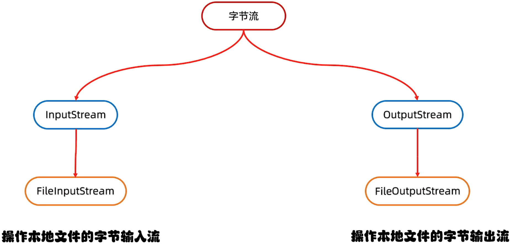
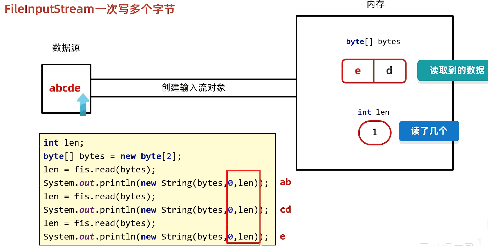
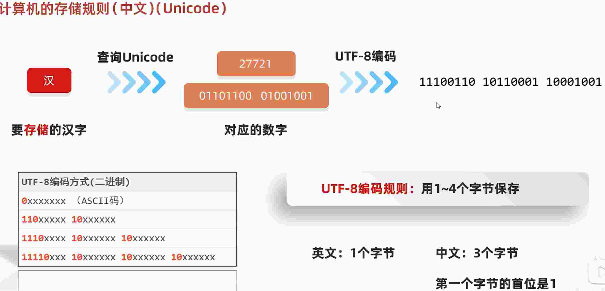
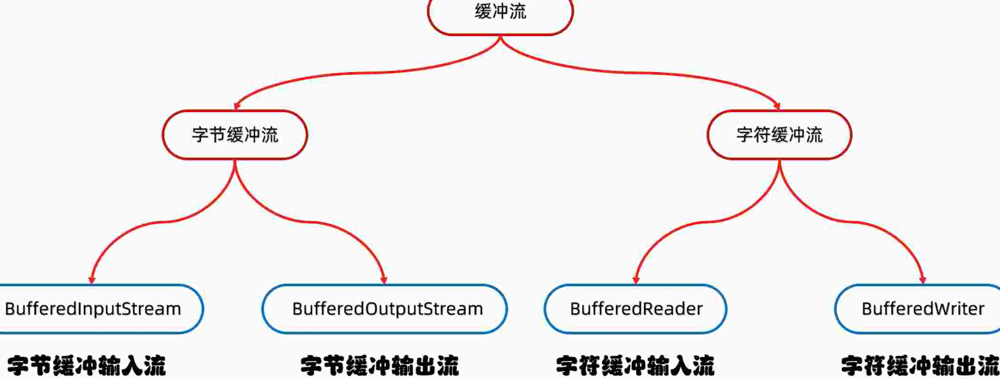
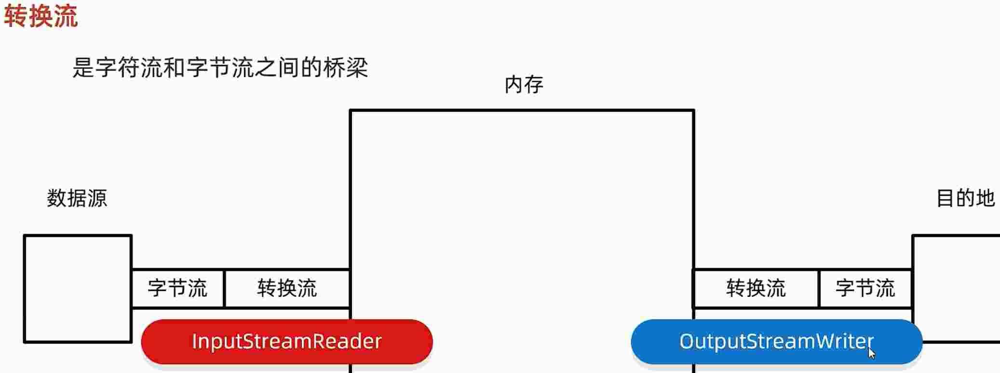

# 20.IO流

应该随用随创建 （以免文件被清空）, 什么时候不用就关闭

## 20.1.IO流说明

存储和读取数据的解决方案

I: input  O: output 流: 像水流一样传输数据



## 20.2.IO流作用

用于读写文件中的数据 (可以读写文件, 或网络中的数据...)

## 20.3.IO 流的分类

### 20.3.1.流的方向

* 输入流 (读取)
* 输出流 (写出)

### 20.3.2.操作文件类型

* 字节流 (可以操作所有类型的文件)
* 字符流 (只能操作纯文本文件)

> 纯文本文件: Windows 自带的记事本打开能读懂 (txt, md, xml, lrc 文件等)

## 20.4.字节输出流 - FileOutputStream 类

操作本地文件的字节输出流, 可以把程序中的数据写入到本地文件中

### 20.4.1.书写步骤

* 创建字节输出流对象

  - 参数是字符串表示的路径或者是 File 对象都是可以的
  - 如果文件不存在会创建文件, 但保证父级路径是存在的
  - 如果文件已经存在, 则清空文件

* 写数据

  - write 方法的参数是整数, 但是实际上写到本地文件中的是整数 Ascll 上对应的字符

* 释放资源

  - 每次使用完流之后都要释放资源

```java
package src.iodemo01;

import java.io.FileNotFoundException;
import java.io.FileOutputStream;
import java.io.IOException;

public class FileoutputstreamTest01 {
  public static void main(String[] args) throws IOException {
    // 写相对路径是以 src 为标准的 可能是和包名有关系 ???
    FileOutputStream fos = new FileOutputStream("src/a.txt");
    fos.write(100);
    fos.close();
  }
}
```

### 20.4.2.FileOutputStream 写数据的三种方式

方法名称 | 说明
-- | --
void write(int b) | 一次写一个字节数据
void write(byte[] b) | 一次写一个字节数组数据
void write(byte[] b, int off, int len) | 一次写一个字节数组的部分数据

> 数组数据建议使用 1024 的倍数 1024 * 1024 * 5


### 20.4.3.FileOutputStream 写数据的两个问题

* 换行

换行写, windows: \r\n linux: \n mac: \r

在 Windows 系统中, java 对回车换行进行了优化. 虽然完整的是 \r\n, 但是写其中之一 \r 或 \n 都是可以的, java 会自动补全 (建议是写全, 不要简写)

* 续写

如果想要续写, 打开续写开关即可. 开关位置, 创建对象的第二个参数, 默认是 false(不追加), 设置为 true, 表示打开续写, 此时创建创建对象不会清空文件

```java
package src.iodemo01;

import java.io.FileNotFoundException;
import java.io.FileOutputStream;
import java.io.IOException;

public class FileoutputstreamTest02 {
  public static void main(String[] args) throws IOException {
    String str = "abc";
    byte[] byteArr = str.getBytes();
    FileOutputStream fos = new FileOutputStream("src/aaa.txt", true);
    fos.write(byteArr);
    fos.close();
    
    String str2 = "sunwukong\n\r666";
    byte[] byteArr2 = str2.getBytes();
    FileOutputStream fos2 = new FileOutputStream("src/bbb.txt");
    fos2.write(byteArr2);
    fos2.close();
  }
}
```

## 20.5.字节输入流 - FileInputStream 类

操作本地文件的字节输入流, 可以把本地文件中的数据读取到程序中来.

### 20.5.1.FileInputStream 类书写步骤

* 创建字节输入流对象
  - 如果文件不存在就直接报错
* 读数据
  - 一次读一个字节, 读出来的是数据在 ASCll 行对应的数字
  - 文件读到末尾, rend 方法返回 -1
* 释放资源
  - 每次使用完之后要释放资源

> 多个IO流, 先开的后关闭

```java
package src.iodemo01;

import java.io.FileInputStream;
import java.io.IOException;

public class FileinputstreamTest01 {
  public static void main(String[] args) throws IOException {
    FileInputStream fis = new FileInputStream("src/aaa.txt");
    while (true) {
      int b = fis.read(); // 每次打印一个字母
      if(b == -1) {
        break;
      }
      System.out.println((char) b);
    }
    fis.close();
  }
}
```


### 20.5.2.FileInputStream 方法

方法名称 | 说明
-- | --
public int read() | 一次读一个字节数据
public int read(byte[] buffer) | 一次读一个字节数组数据

> 一次读取一个字节数组的数据, 每次读取尽可能把数组装满

### 20.5.3.FileInputStream 循环读取

```java
package src.iodemo01;

import java.io.FileInputStream;
import java.io.IOException;

public class FileinputstreamTest01 {
  public static void main(String[] args) throws IOException {
    FileInputStream fis = new FileInputStream("src/aaa.txt");
    int b;
    while ((b = fis.read()) != -1) {
      System.out.println((char) b);
    }
    fis.close();
  }
}
```

### 20.5.4.FileInputStream 一次读多个数据



```java
package src.iodemo01;

import java.io.FileInputStream;
import java.io.IOException;

public class FileinputstreamTest03 {
  public static void main(String[] args) throws IOException {
    // aaa.txt 内容 abcde
    FileInputStream fis = new FileInputStream("src/aaa.txt");
    byte[] bArr = new byte[2];
    int len = fis.read(bArr);
    System.out.println(len);
    // bArr 要转换的数组, 0 索引起始位置, len 读几个
    System.out.println(new String(bArr, 0, len));
    int len1 = fis.read(bArr);
    System.out.println(len1);
    // bArr 要转换的数组, 0 索引起始位置, len 读几个
    System.out.println(new String(bArr, 0, len1));

    int len2 = fis.read(bArr);
    System.out.println(len2);
    // bArr 要转换的数组, 0 索引起始位置, len 读几个
    // 如果不写 len2, 打印 是 ed, 因为只有最后一个 e 了, c 的位置覆盖, d 保留了
    System.out.println(new String(bArr, 0, len2)); 
  }

  public static void copyFile() throws IOException {
    long startTime = System.currentTimeMillis();
    FileInputStream fis = new FileInputStream("src/aaa.txt");
    FileOutputStream fos = new FileOutputStream("src/aaaCopy.txt");

    int len;
    byte[] streamArr = new byte[1024 * 1024 * 5];
    if ((len = fis.read(streamArr)) != -1) {
      fos.write(streamArr, 0, len);
    }
    fos.close();
    fis.close();
    long endTime = System.currentTimeMillis();
    System.out.println(endTime - startTime);
  }
}
```

## 20.6.拷贝 

* 小文件 (大文件上面那个例子里)

```java
package src.iodemo01;

import java.io.FileInputStream;
import java.io.FileOutputStream;
import java.io.IOException;

public class FileinputstreamTest02 {
  public static void main(String[] args) throws IOException {
    FileInputStream fis = new FileInputStream("src/aaa.txt");
    FileOutputStream fos = new FileOutputStream("src/copy.txt");
    int b;
    while ((b = fis.read()) != -1) {
      fos.write(b);
    }
    // 先开的后关闭
    fos.close();
    fis.close();
  }
}
```

## 20.7.try catch 处理异常 

### 20.7.1.基本用法

手动释放

```java
package src.iodemo01;

import java.io.FileInputStream;
import java.io.FileOutputStream;
import java.io.IOException;

public class TrycatchTest {
  public static void main(String[] args) {
    FileInputStream fis = null;
    FileOutputStream fos = null;

    try {
      fis = new FileInputStream("src/aaa.txt");
      fos = new FileOutputStream("src/aaacopy2.txt");
      int len;
      byte[] streamArr = new byte[1024 * 1024 * 5];
      while ((len = fis.read(streamArr)) != -1) {
        fos.write(streamArr, 0, len);
      }
    } catch (IOException e) {
      e.printStackTrace();
    } finally {
      if (fis != null) {
        try {
          fis.close();
        } catch (IOException e) {
          e.printStackTrace();
        }
      }
      if (fos != null) {
        try {
          fos.close();
        } catch (IOException e) {
          e.printStackTrace();
        }
      }
    }
  }
}
```

### 20.7.2.JDK7 方案

资源用完之后自动释放

try 后面的小括号中写创建对象的代码

> 只有实现了 autoCloseable 接口的类, 才能在小括号中创建对象

```java
try(创建流对象1; 创建流对象2) {
  可能出现异常的代码
} catch(异常类名 变量名) {
  异常的处理代码
}
```

### 20.7.3.JDK9 方案

资源用完之后自动释放

```java
创建流对象1;
创建流对象2;
try(创建流对象1; 创建流对象2) {
  可能出现异常的代码
} catch(异常类名 变量名) {
  异常的处理代码
}
```

## 20.8.字符集详解

* 核心
  - GBK中, 一个英文字母代表一个字节, 二进制第一位是 0
  - GBK中, 一个中文汉字代表二个字节, 二进制第一位是 1

* 总结
  - 在计算机中, 任意数据都是以二进制的形式来存储的
  - 计算机中最小的存储单位是一个字节
  - ASCLL 字符集中, 一个英文占一个子节
  - 简体中文版 Windows , 默认使用 GBK 字符集
  - GBK 字符集完全兼容 ASCLL 字符集

### 20.8.1.ASCLL 字符集

用一个字节表示, 一个字节是 八位 表示, 每一位称之为一个 bit 

一个字节 能表示 256 个 (也就使用了一半)

### 20.8.2.计算机存储规则(英文)(GBK)


### 20.8.3.计算机存储规则(汉字)(GBK)


### 20.8.4.Unicode (万国码)

UTF (Unicode Transfer Format)

* UTF
  - UTF-16 编码规则: 用 2 - 4 个字节保存
  - UTF-32 编码规则: 固定用 4 个字节保存
  - UTF-8 编码规则: 用 1 - 4 个字节保存 (常用)

* UTF-8 
  - ASCLL  一个字节
  - 简体中文  三个字节
  - 不是一个字符集, 是 Unicode 的一种编码方式



> ***红色的是固定值, 汉字的其余位数 是用 两个字节 (GBK 编码) 来填补***

* UTF-8 
  - 一个英文占一个字节, 二进制第一位是 0 , 转成十进制是正数
  - 一个中文占三个字节, 二进制第一位是 1 , 第一个子节转成十进制是负数

### 20.8.5.乱码产生原因

* 读取数据时未读完整的整个汉字
* 编码和解码时的方式不统一

### 20.8.6.乱码解决方式

* 不要用字节流读取文本文件
* 编码和解码时, 使用同一个码表, 同一个编码方式

## 20.9.java 中的编解码

idea 的默认编解码方式在 idea 的右下角

### 20.9.1.java 中编码的方式

String 类中的方法 | 说明
-- | --
public byte[] getBytes() | 使用默认方式进行编码
public byte[] getBytes(String charsetName) | 使用指定方式进行编码

### 20.9.2.java 中解码的方式

String 类中的方法 | 说明
-- | --
String(byte[] bytes) | 使用默认方式进行解码
String(byte[] bytes, String charsetName) | 使用指定方式进行解码

```java
package src.unicodedemo01;

import java.io.UnsupportedEncodingException;
import java.util.Arrays;

public class UnicodeTest1 {
  public static void main(String[] args) throws UnsupportedEncodingException {
    String str = "ai智能";

    byte[] arr1 = str.getBytes();
    System.out.println(Arrays.toString(arr1));
    String str1 = new String(arr1);
    System.out.println(str1);
    
    byte[] arr2 = str.getBytes("GBK");
    System.out.println(Arrays.toString(arr2));
    String str2 = new String(arr2, "GBK");
    System.out.println(str2);
  }
}
```

## 20.10.字符流

字符流的底层其实就是字节流

字符流 = 字节流 + 字符集

* 特点
  - 输入流: 一次读一个子节, 当遇到中文时, 一次读多个字节
  - 输出流: 底层会把数据按照指定的编码方式进行编码, 变成字节写到文件中

* 使用场景
对于纯文本文件进行读写操作

## 20.11.FileReader 输入流 (字符流)

* 创建字符输入流对象

构造方法 | 说明
-- | --
public FileReader(File file) | 创建字符输入流关联本地文件
public FileReader(String pathname) | 创建字符输入流关联本地文件

* 读取数据

  - 按字节进行读取, 遇到中文, 一次读多个字节, 读取后解码, 返回一个整数
  - 读到文件末尾, read 方法返回 -1

成员方法 | 说明
-- | --
public int read() | 读取数据, 读到末尾返回 -1
public int read(char[] buffer) | 读取多个数据, 读到末尾返回 -1

* 释放资源

成员方法 | 说明
-- | --
public int close() | 释放资源/关流 

### 20.11.1.read 方法

* read 方法空参
  - read 方法默认也是一个字节一个字节的读取, 如果遇到中文就读取多个
  - 在读取之后, 方法底层还会进行解码, 转成十进制, 最终把这个十进制返回, 这个十进制的数据也表示在字符集上的数字

* read 方法有参
  读取数据, 解码, 强转合并了, 把强转之后的字符方法数组中

```java
package src.unicodedemo01;

import java.io.FileReader;
import java.io.IOException;

public class UnicodeTest2 {
  public static void main(String[] args) throws IOException {
    // 一次读取一个
    FileReader fr = new FileReader("src/test.txt");
    int file;
    while((file = fr.read()) != -1) {
      // System.out.println((char)file);
    }
    fr.close();

    // 一次读取多个
    FileReader fr2 = new FileReader("src/test.txt");
    char[] charArr = new char[2];
    int len;
    while ((len = fr2.read(charArr)) != -1) {
      System.out.print(charArr); // 直接打印汉字了呀 ???
      // System.out.print(new String(charArr, 0, len)); // 和上面打印的一样
    }
    fr2.close();
  }
}
```

## 20.12.FileWriter 输出流 (字符流)

### 20.12.1.FileWriter 构造方法

构造方法 | 说明
-- | --
public FileWriter(File file) | 创建字符输出流关联本地文件
public FileWriter(String pathname) | 创建字符输出流关联本地文件
public FileWriter(File file, boolean append) | 创建字符输出流关联本地文件, 续写
public FileWriter(String pathname, boolean append) | 创建字符输出流关联本地文件, 续写

### 20.12.2.FileWriter 成员方法

成员方法 | 说明
-- | --
void write(int c) | 写出一个字符
void write(String Str) | 写出一个字符串
void write(String Str, int off, int len) | 写出一个字符串
void write(Char[] cbuf) | 写出一个字符数组
void write(Char[] cbuf, int off, int len) | 写出一个字符数组的一部分

* 创建字符输出流对象
  - 参数是字符串表示的路径或者 File 对象都是可以的
  - 如果文件不存在会创建一个新的文件, 但是保证父级路径是存在的
  - 如果文件已经存在, 则会清空文件, 如果不想清空可以打开续写开关

* 写数据
  - 如果 write 方法的参数是整数, 但是实际上写到本地文件中的是整数在字符集上对应的字符

* 释放资源
  - 每次使用流之后都要释放资源

### 20.12.3.字符流原理解析

* 创建字符输入流对象底层
  - 关联文件, 并创建缓冲区(长度为8192的字节数组)

* 读取数据底层(有参和空参这个步骤是一样的):
  - 判断缓冲区是否有数据可以读取
  - 缓冲区没有数据, 就从文件中获取数据, 装到缓冲区, 每次尽可能装满缓冲区, 如果文件没有数据, 返回 -1; 缓冲区有数据就从缓冲区读取

* 写入数据底层
  - 也和读取数据一样, 同样有一个缓冲区, 超过缓冲区才将内容放到文件中, flush主动将内容放到文件

```java
package src.unicodedemo01;

import java.io.FileNotFoundException;
import java.io.FileReader;
import java.io.FileWriter;
import java.io.IOException;

public class UnicodeTest4 {
  public static void main(String[] args) throws IOException {
    FileReader fr = new FileReader("src/long.txt"); // 这个文件有 8192 个字节
    fr.read(); // 会把文件放到缓冲区
    // 清空文件
    FileWriter fw = new FileWriter("src/long.txt");

    /**
     * 问题: 如果再次使用 fr 进行读取, 会读到数据么
     * 
     * 正确答案: 会把缓冲区中的文件全部读完, 也只能读缓冲区的文件, 文件中剩余的数据无法再次读取
     */
    int ch;
    while((ch = fr.read()) != -1) {
      System.out.println((char) ch);
    }
    // 用 for 循环打印到指定位置, 看缓冲区数据变化, 体会底层文件读取
    // for (int i = 0; i < 8192; i++) {
    //   fr.read();
    // }
    // 在这打断可以看到缓冲区再次读取的存储内容, 在 bb 字段里
    // fr.read();
    fw.close();
    fr.close();
  }
}
```

方法名称 | 说明
-- | --
public void flush() | 将缓冲区的数据刷新到本地文件中 (刷新之后还可以往文件中添加数据)
public void close() | 释放资源/关流

```java
package src.unicodedemo01;

import java.io.FileReader;
import java.io.FileWriter;
import java.io.IOException;
import java.lang.reflect.Array;
import java.util.ArrayList;
import java.util.Arrays;
import java.util.Collection;
import java.util.List;
import java.util.StringJoiner;
import java.util.stream.Collector;
import java.util.stream.Collectors;

public class UnicodeTest5 {
  public static void main(String[] args) throws IOException {
    String path = "src/unicodetest4.txt";
    FileWriter fw1 = new FileWriter(path);
    fw1.write("2-5-9-6-3-8");
    fw1.close();

    FileReader fr1 = new FileReader(path);
    FileWriter fw2 = new FileWriter("src/copyunicodetest4.txt");
    ArrayList<String> aList1 = new ArrayList<>();
    StringBuilder sb = new StringBuilder();
    int ch;
    while ((ch = fr1.read()) != -1) {
      // System.out.println(ch);
      sb.append((char) ch);
      // System.out.println((char) ch);
      aList1.add(Character.toString((char) ch));
    }
    // System.out.println(aList1);
    // System.out.println(aList1.stream().filter(s -> !"-".equals(s)).collect(Collectors.toList()));
    // List<Integer> list = aList1.stream().filter(s -> !"-".equals(s)).map(s -> Integer.parseInt(s)).collect(Collectors.toList());
    // Integer[] arr = list.toArray(s -> new Integer[6]);
    Integer[] arr = aList1.stream().filter(s -> !"-".equals(s)).map(s -> Integer.parseInt(s)).toArray(s -> new Integer[6]);
    // arr.sort(); 这个不能用类型是 Integer
    Arrays.sort(arr);
    // System.out.println(Arrays.toString(arr.sort((a: int, b:int) -> a - b)));
    // System.out.println(arr);
    for (int i = 0; i < arr.length; i++) {
      fw2.write(arr[i].toString());
      if (i < arr.length - 1) {
        fw2.write("-");
      }
    }
    fr1.close();
    fw2.close();
  }
}
```

* 练习

给文件内容进行排序
```java
package src.unicodedemo01;

import java.io.FileReader;
import java.io.FileWriter;
import java.io.IOException;
import java.lang.reflect.Array;
import java.util.ArrayList;
import java.util.Arrays;
import java.util.Collection;
import java.util.List;
import java.util.StringJoiner;
import java.util.stream.Collector;
import java.util.stream.Collectors;

public class UnicodeTest5 {
  public static void main(String[] args) throws IOException {
    String path = "src/unicodetest4.txt";
    FileWriter fw1 = new FileWriter(path);
    fw1.write("2-5-9-6-3-8");
    fw1.close();

    FileReader fr1 = new FileReader(path);
    FileWriter fw2 = new FileWriter("src/copyunicodetest4.txt");
    ArrayList<String> aList1 = new ArrayList<>();
    StringBuilder sb = new StringBuilder();
    int ch;
    while ((ch = fr1.read()) != -1) {
      // System.out.println(ch);
      sb.append((char) ch);
      // System.out.println((char) ch);
      aList1.add(Character.toString((char) ch));
    }
    // System.out.println(aList1);
    // System.out.println(aList1.stream().filter(s -> !"-".equals(s)).collect(Collectors.toList()));
    // List<Integer> list = aList1.stream().filter(s -> !"-".equals(s)).map(s -> Integer.parseInt(s)).collect(Collectors.toList());
    // Integer[] arr = list.toArray(s -> new Integer[6]);
    /*
     * 1
     */
    // Integer[] arr = aList1.stream().filter(s -> !"-".equals(s)).map(s -> Integer.parseInt(s)).toArray(s -> new Integer[6]);
    // Arrays.sort(arr);

    /*
     * 2
     */
    Integer[] arr = aList1.stream().filter(s -> !"-".equals(s)).map(Integer::parseInt).sorted().toArray(Integer[]::new);
    // arr.sort(); 这个不能用类型是 Integer
    // System.out.println(Arrays.toString(arr.sort((a: int, b:int) -> a - b)));
    // System.out.println(arr);
    /*
     * 1
     */
    // for (int i = 0; i < arr.length; i++) {
    //   fw2.write(arr[i].toString());
    //   if (i < arr.length - 1) {
    //     fw2.write("-");
    //   }
    // }
    /*
     * 2 这块使用 substring 也行, 截取字符串 截掉 [ 或 ]
     */
    String writeString = Arrays.toString(arr).replace(", ", "-").replaceAll("(\\[|\\])", "");
    fw2.write(writeString);
    fr1.close();
    fw2.close();
  }
}
```


## 20.13.高级流 - 缓冲流

底层自带长度为 8192 的缓冲区提高性能



## 20.14.字节缓冲流

构造方法 | 说明
-- | --
public BufferedInputStream(InputStream is) | 把基本流包装秤高级流, 提高读取数据的性能 
public BufferedOutputStream(OutputStream os) | 把基本流包装秤高级流, 提高写出数据的性能 

> 也可以一次读多个字节, 参考上面写的一次读多个字节

```java
package src.iodemo01;

import java.io.BufferedInputStream;
import java.io.BufferedOutputStream;
import java.io.FileInputStream;
import java.io.FileNotFoundException;
import java.io.FileOutputStream;
import java.io.IOException;

public class BufferedStreamTest {
  public static void main(String[] args) throws IOException {
    BufferedInputStream bis = new BufferedInputStream(new FileInputStream("src/aaa.txt"));
    BufferedOutputStream bos = new BufferedOutputStream(new FileOutputStream("src/copy2.txt"));

    int by;
    while ((by = bis.read()) != -1) {
      bos.write(by);
    }

    bis.close();
    bos.close();
  }
}
```

## 20.15.字符缓冲流

底层自带长度为 8192 的缓冲区

构造方法 | 说明
-- | --
public BufferedReader(Reader r) | 把基本流变成高级流
public BufferedWriter(Writer r) | 把基本流变成高级流

```java
package src.iodemo01;

import java.io.BufferedInputStream;
import java.io.BufferedOutputStream;
import java.io.BufferedReader;
import java.io.BufferedWriter;
import java.io.FileInputStream;
import java.io.FileNotFoundException;
import java.io.FileOutputStream;
import java.io.FileReader;
import java.io.FileWriter;
import java.io.IOException;

public class BufferedStreamTest02 {
  public static void main(String[] args) throws IOException {
    BufferedReader br = new BufferedReader(new FileReader("src/test.txt"));
    BufferedWriter bw = new BufferedWriter(new FileWriter("src/testcopy.txt"));

    int ch;
    while ((ch = br.read()) != -1) {
      System.out.println(ch);
      bw.write(ch);
    }

    bw.close();
    br.close();
  }
}
```

## 20.16.字符缓冲流特有方法

字符缓冲输入流特有方法 | 说明
-- | --
public String readline() | 读取一行数据, 如果没有可读的就返回 null

字符缓冲输出流特有方法 | 说明
-- | --
public void newline() | 跨平台的换行

```java
package src.iodemo01;

import java.io.BufferedInputStream;
import java.io.BufferedOutputStream;
import java.io.BufferedReader;
import java.io.BufferedWriter;
import java.io.FileInputStream;
import java.io.FileNotFoundException;
import java.io.FileOutputStream;
import java.io.FileReader;
import java.io.FileWriter;
import java.io.IOException;

public class BufferedStreamTest02 {
  public static void main(String[] args) throws IOException {
    BufferedReader br = new BufferedReader(new FileReader("src/test.txt"));
    BufferedWriter bw = new BufferedWriter(new FileWriter("src/testcopy.txt"));
    // 续写应该在 FileWriter 上开启
    // BufferedWriter bw = new BufferedWriter(new FileWriter("src/testcopy.txt", true));

    String str;
    while ((str = br.readLine()) != null) {
      System.out.println(str);
      bw.write(str); 
      bw.newLine();
    }

    bw.close();
    br.close();
  }
}
```

## 20.17.缓冲流总结

### 20.17.1.缓冲流种类

* 字节缓冲输入流: BufferedInputStream
* 字节缓冲输出流: BufferedOutputStream
* 字符缓冲输入流: BufferedReader
* 字符缓冲输出流: BufferedWriter

### 20.17.2.缓冲流提高性能的原因

* 缓冲流自带长度 8192 的缓冲区 
  - 字节流是 8k, 字符就是 16k, 源码 new char[sz], java中 char 代表 2 个字节
* 可以显著提高字节流的读写性能
* 对于字符流提升不是很明显, 对于字符流关键点是提供两个特有方法

### 20.17.3.两个特有方法

readline 和 newline

* 练习 - 排序

```
3.床前明月光
6.低头思故乡
2.  李白
1.静夜思
5.举头望明月
4.疑是地上霜
```

```java
package src.iodemo01;

import java.io.BufferedReader;
import java.io.BufferedWriter;
import java.io.FileNotFoundException;
import java.io.FileReader;
import java.io.FileWriter;
import java.io.IOException;
import java.util.ArrayList;
import java.util.Collection;
import java.util.Collections;
import java.util.Comparator;
import java.util.Map;
import java.util.Map.Entry;
import java.util.Set;
import java.util.TreeMap;
import java.util.TreeSet;

public class BufferedStreamTest03 {
  public static void main(String[] args) throws IOException {
    BufferedReader br = new BufferedReader(new FileReader("src/file/sortGuShi.txt"));
    BufferedWriter bw = new BufferedWriter(new FileWriter("src/file/newSortGuShi.txt"));
    String str;
    // 一种
    TreeSet<String> ts = new TreeSet<>((o1, o2) -> Integer.parseInt(o1.split("\\.")[0]) - Integer.parseInt(o2.split("\\.")[0]));
    // 两种
    TreeMap<Integer, String> tm = new TreeMap<>((o1, o2) -> o1 - o2);
    // 三种
    ArrayList<String> al = new ArrayList<>();

    while ((str = br.readLine()) != null) {
      ts.add(str);
      String[] arr = str.split("\\.");
      tm.put(Integer.parseInt(arr[0]), str);
      al.add(str);
    }
    // 一种
    // for (String s : ts) {
    //   bw.write(s);
    //   bw.newLine();
    // }
    // 两种
    // Set<Map.Entry<Integer, String>> entries = tm.entrySet();
    // for (Entry<Integer,String> entry : entries) {
    //   bw.write(entry.getValue());
    //   bw.newLine();
    // }
    // 三种
    Collections.sort(al, (o1, o2) -> Integer.parseInt(o1.split("\\.")[0]) - Integer.parseInt(o2.split("\\.")[0]));
    for(String oneAl: al) {
      bw.write(oneAl);
      bw.newLine();
    }

    bw.close();
    br.close();
  }
}
```

## 20.18.转换流 - 字节流转换成字符流

是字符流和字节流之间的桥梁

ANSI 表示使用平台默认的, 简体中文默认使用 GBK

构造方法 | 说明
-- | --
InputStreamReader | 将字节输入流转换成字符流
OutputStreamWriter | 将字节输出流转换成字符流



* 作用
  - 指定字符集读写 (淘汰了)
  - 字节想要使用字符流中的方法

* 练习 - 指定字符编码进行读取

```java
package src.iodemo01;

import java.io.FileInputStream;
import java.io.FileNotFoundException;
import java.io.FileReader;
import java.io.IOException;
import java.io.InputStreamReader;
import java.io.UnsupportedEncodingException;
import java.nio.charset.Charset;

public class BufferedStreamTest04 {
  public static void main(String[] args) throws IOException {
    /**
     * 这种方式不需要掌握, 因为在 JDK11 时候, 已经被替代
     */
    // newSortGuShi 我在 vscode 中使用 GBK 进行保存的, 需要使用 GBK 进行读取
    // InputStreamReader isr = new InputStreamReader(new FileInputStream("src/file/newSortGuShi.txt"), "UTF-8");
    InputStreamReader isr = new InputStreamReader(new FileInputStream("src/file/newSortGuShi.txt"), "GBK");
    int ch;
    while((ch = isr.read()) != -1) {
      // System.out.print((char) ch);
    }
    isr.close();

    /**
     * 替代方案
     */
    FileReader fr = new FileReader("src/file/newSortGuShi.txt", Charset.forName("GBK"));
    int ch2;
    while((ch2 = fr.read()) != -1) {
      System.out.print((char) ch2);
    }
    fr.close();
  }
}
```

* 练习 - 通过指定编码写入

```java
package src.iodemo01;

import java.io.FileOutputStream;
import java.io.FileWriter;
import java.io.IOException;
import java.io.OutputStreamWriter;
import java.nio.charset.Charset;

public class FileWriterTest01 {
  public static void main(String[] args) throws IOException {
    // 这种指定指定字符集读文件方式 JDK11 之后已经淘汰
    OutputStreamWriter osw = new OutputStreamWriter(new FileOutputStream("src/file/filewritertest01.txt"), Charset.forName("GBK"));
    // 新方案 FileWriter
    FileWriter fw = new FileWriter("src/file/filewritertest01.txt", Charset.forName("GBK"));
    String str = "你好啊啊啊hellowworld";
    // fw.write(str);
    osw.write(str + 2);
    fw.close();
    osw.close();
  }
}
```

```java
package src.iodemo01;

import java.io.BufferedInputStream;
import java.io.BufferedReader;
import java.io.FileInputStream;
import java.io.FileReader;
import java.io.IOException;
import java.io.InputStreamReader;

public class ReadPractice {
  public static void main(String[] args) throws IOException {
    /*
     * 题目: 用字节流读中文, 不能出现乱码, 读一行
     */
    // 创建字节流
    FileInputStream fis = new FileInputStream("src/file/sortGuShi.txt");
    // 字节流读中文会出现乱码, 所以需要转换成 字符流. 使用转换流进行转换
    InputStreamReader fr = new InputStreamReader(fis);
    // 读一行只能是高级流, 创建高级流
    BufferedReader bis = new BufferedReader(fr);
    System.out.println(bis.readLine());
  }
}
```

## 20.19.高级流 - 序列化流 (对象操作输出流)

把 java 中的对象写到文件中

构造方法 | 说明
-- | --
public ObjectOutputStream(OutputStream out) | 把基本流包装成高级流

成员方法 | 说明
-- | --
public final void writeObject(Object obj) | 把对象序列化(写出)到文件中

> 需要被标记才能序列化, 否则会报错

* Serializable

Serializable 接口里面是没有抽象方法的, 成为标记型接口. 一旦实现了这个接口, 就表示当前的 Student 类可以被序列化

## 20.19.高级流 - 反序列化流 (对象操作输入流)

可以把序列化到本地文件中的对象, 读取到程序中来

构造方法 | 说明
-- | -- 
public ObjectInputStream(InputStream in) | 把基本流变成高级流

成员方法 | 说明
-- | --
public Object readObject(Object obj) | 把序列化到本地文件中的对象, 读取到程序中来

```java
package src.iodemo01;

import java.io.Serializable;

public class Student implements Serializable {
  private static final long serialVersionUID = 1L;

  private String name;
  private int age;
  public Student() {
  }
  public Student(String name, int age) {
    this.name = name;
    this.age = age;
  }
  public String getName() {
    return name;
  }
  public void setName(String name) {
    this.name = name;
  }
  public int getAge() {
    return age;
  }
  public void setAge(int age) {
    this.age = age;
  }
  @Override
  public String toString() {
    return "Student [name=" + name + ", age=" + age + "]";
  }
}
```

```java
package src.iodemo01;

import java.io.FileInputStream;
import java.io.FileOutputStream;
import java.io.IOException;
import java.io.ObjectInputStream;
import java.io.ObjectOutputStream;

public class ObjectOutputStreamTest01 {
  public static void main(String[] args) throws IOException, ClassNotFoundException {
    String path = "src/ObjectOutputStreamtest01.txt";
    Student s1 = new Student("zs", 18);
    ObjectOutputStream oos = new ObjectOutputStream(new FileOutputStream(path));
    oos.writeObject(s1);
    oos.close();

    ObjectInputStream ois = new ObjectInputStream(new FileInputStream(path));
    Student readS = (Student) ois.readObject();
    System.out.println(readS);
    ois.close();
  }
}
```

* 多序列化文件读取

写出
```java
package src.iodemo01;

import java.io.FileOutputStream;
import java.io.IOException;
import java.io.ObjectOutputStream;
import java.util.ArrayList;
import java.util.Collections;

public class ObjectOutputStreamTest02 {
  public static void main(String[] args) throws IOException {
    ObjectOutputStream oos = new ObjectOutputStream(new FileOutputStream("src/file/ObjectOutputStreamTest02.txt"));
    Student s1 = new Student("zs", 18);
    Student s2 = new Student("ls", 19);
    Student s3 = new Student("王五", 20);
    ArrayList<Student> al = new ArrayList<>();
    Collections.addAll(al, s1, s2, s3);
    oos.writeObject(al);
    oos.close();
  }
}
```

写入
```java
package src.iodemo01;

import java.io.FileInputStream;
import java.io.IOException;
import java.io.ObjectInputStream;
import java.util.ArrayList;

public class ObjectInputStreamTest02 {
  public static void main(String[] args) throws IOException, ClassNotFoundException {
    ObjectInputStream ois = new ObjectInputStream(new FileInputStream("src/file/ObjectOutputStreamTest02.txt"));
    ArrayList<Student> al = (ArrayList<Student>) ois.readObject();
    System.out.println(al);
    ois.close();
  }
}
```

## 20.20.序列化流/反序列化流细节

* 使用序列化流将对象写到文件中, 需要到 Javabean 类实现Serializable

* 要序列化对象需要添加版本号, 因为文件更改文件的版本号就会更改, 读取的序列化文件版本不同时会报错, 所以需要手动固定版本号(idea 可以设置自动生成, vscode 没查)

```
private static final long serialVersionUID = 1L;
```

## 20.21.打印流

一般指 PrintStream、 PrintWriter 两个类 (字节打印流, 字符打印流)

### 20.21.1.打印流特点

* 打印流只操作文件目的地, 不操作数据源
* 特有写出方法可以实现, 数据原样写出. 例如: 打印 97, 文件中 97
* 特有的写出方法, 可以实现自动刷新, 自动换行. 打印一次数据 = 写出 + 换行 + 刷新

## 20.22.字节打印流 - PrintStream

构造方法 | 说明
-- | --
public PrintStream(OutputStram/File/String) | 关联字节输出流/文件/文件路径
public PrintStream(String fileName, Charset charset) | 指定字符编码
public PrintStream(OutputStram out, boolean autoFlush) | 自动刷新
public PrintStream(OutputStram out, boolean autoFlush, String encoding) | 指定字符编码且自动刷新

> 字节打印流没有缓冲区, 开不开自动刷新都一样

成员方法 | 说明
-- | --
pubic void write(int b) | 常规方法: 规则和之前一样, 将指定的字节写出
pubic void println(Xxx xx) | 特有方法: 打印任意数据, 自动刷新, 自动换行
pubic void print(Xxx xx) | 特有方法: 打印任意数据, 不换行
pubic void printf(String format, Object ...args) | 特有方法: 带有占位符的打印语句, 不换行

> printf 有很多占位符

```java
package src.iodemo01;

import java.io.FileOutputStream;
import java.io.IOException;
import java.io.PrintStream;

public class PrintStreamTest01 {
  public static void main(String[] args) throws IOException {
    PrintStream ps = new PrintStream(new FileOutputStream("src/file/printStreamTest01.txt"), true, "UTF-8");
    ps.write(110); // n
    ps.println();
    ps.println(110);
    ps.print(true);
    ps.println();
    ps.printf("%s三打%s", "孙悟空", "白骨精");
    ps.close();
  }
}
```

## 20.22.字符打印流 - PrintWriter

构造方法 | 说明
-- | --
public PrintWriter(Write/File/String) | 关联字符输出流/文件/文件路径
public PrintWriter(String fileName, Charset charset) | 指定字符编码
public PrintWriter(Write w, boolean autoFlush) | 自动刷新
public PrintWriter(OutputStram out, boolean autoFlush, Charset charset) | 指定字符编码且自动刷新

> 字节打印流有缓冲区, 想要自动刷新需要开启

成员方法 | 说明
-- | --
pubic void write(int b) | 常规方法: 规则和之前一样, 将指定的字节写出
pubic void println(Xxx xx) | 特有方法: 打印任意类型数据, 自动换行
pubic void print(Xxx xx) | 特有方法: 打印任意类型数据, 不换行
pubic void printf(String format, Object ...args) | 特有方法: 带有占位符的打印语句, 不换行

> printf 有很多占位符

```java
package src.iodemo01;

import java.io.FileWriter;
import java.io.IOException;
import java.io.PrintWriter;
import java.nio.charset.Charset;

public class PrintWriterTest01 {
  public static void main(String[] args) throws IOException {
    PrintWriter pw = new PrintWriter(new FileWriter("src/file/printWriterTest01.txt"), true);
    pw.write(100);
    pw.println();
    pw.println(100);
    pw.print(true);
    pw.println();
    pw.printf("%s三打%s", "孙悟空", "白骨精");
    pw.close();
  }
}
```

### 20.22.1.打印流的应用场景

获取打印流的对象, 此打印流在虚拟机启动的时候, 由虚拟机创建, 默认指向控制台

```java
// 特殊的打印流, 系统中标准的输出流. 系统中唯一的, 不要主动关闭, 否则关闭之后不能打印了
PrintStream ps = System.out
// 调用打印流中的方法 println
// 控制台写出数据, 自动换行, 自动刷新
ps.println(123);
// ps.close()
ps.println("hello world");
```

## 20.23.解压缩流/压缩流

```java
package src.iodemo01;

import java.io.File;
import java.io.FileInputStream;
import java.io.FileOutputStream;
import java.io.IOException;
import java.util.zip.ZipEntry;
import java.util.zip.ZipInputStream;
import java.util.zip.ZipOutputStream;

public class ZipInputStreamTest01 {
  public static void main(String[] args) throws IOException {
    File src = new File("src/file/zip/test.zip");
    File target = new File("src/file/zip/test2/");

    // unzip(src, target);

    // toZip(new File("src/file/zip/test2/test/aaa.txt"), new File("src/file/zip/test2"));

    ZipOutputStream zos = new ZipOutputStream(new FileOutputStream(new File("src/file/zip", "test2.zip")));
    File src3 = new File("src/file/zip/test2/test");
    toFileZip(src3, "", zos);
    zos.close();

  }
  public static void unzip(File src, File target) throws IOException {
    ZipInputStream zip = new ZipInputStream(new FileInputStream(src));
    // 表示当前压缩包中获取文件或者文件夹
    ZipEntry entry;
    while ((entry = zip.getNextEntry()) != null) {
      if (entry.getName().contains("DS_Store")) {
        continue;
      }
      System.out.println(entry.getName());
      System.out.println(entry);
      if (entry.isDirectory()) {
        File f = new File(target, entry.toString());
        f.mkdirs();
      } else {
        FileOutputStream fis = new FileOutputStream(new File(target, entry.toString()));
        int b;
        while ((b = zip.read()) != -1) {
          fis.write(b);
        }
        fis.close();
        // 表示在一个压缩包中一个文件处理完了
        entry.clone();
      }
    }
    zip.close();
  }
  public static void toZip(File src, File target) throws IOException {
    ZipOutputStream zos = new ZipOutputStream(new FileOutputStream(new File(target, "b.zip")));
    // ZipEntry 表示压缩包里面的路径
    ZipEntry ze = new ZipEntry("bbb/b.txt");
    zos.putNextEntry(ze);
    FileInputStream fis = new FileInputStream(src);
    int b;
    while ((b = fis.read()) != -1) {
      zos.write(b);
    }
    fis.close();
    zos.closeEntry();

    // 测试 ZipEntry 压缩路径
    // ZipEntry ze2 = new ZipEntry("ccc/c.txt");
    // zos.putNextEntry(ze2);
    // FileInputStream fis2 = new FileInputStream("src/file/zip/test2/test/bbb.js");
    // int b2;
    // while ((b2 = fis2.read()) != -1) {
    //   zos.write(b2);
    // }
    // fis2.close();
    // zos.closeEntry();

    zos.close();
  }
  public static void toFileZip(File src, String target, ZipOutputStream zos) throws IOException {    
    File[] files = src.listFiles();
    for(File file:files) {
      if (file.isDirectory()) {
        toFileZip(new File(src, file.getName()), target + file.getName() + "/", zos);
      } else {
        System.out.println(target + file.getName());
        ZipEntry ze = new ZipEntry(target + file.getName());
        zos.putNextEntry(ze);
        // System.out.println(file.getName());
        FileInputStream fis = new FileInputStream(file);
        int b;
        while ((b = fis.read()) != -1) {
          zos.write(b);
        }
        fis.close();
        zos.closeEntry();
      }
    }
  }
}
```

## 20.24.Commons-io

Commons-io 是 apache 开源基金组织提供的一组有关 io 操作的开源工具包

### 20.24.1.Commons-io 常用方法

FileUtils类 (文件/文件夹相关) | 说明
-- | --
static void copyFile(File srcFile, File destFile) | 复制文件
static void copyDirectory(File srcDir, File destDir) | 复制文件夹 (直接 copy 文件夹里面的内容)
static void copyDirectoryToDirectory(File srcDir, File destDir) | 复制文件夹 (会将要 copy 的文件夹 连文件夹复制 到目标文件夹下)
static void deleteDirectory(File directory) | 删除文件夹
static void cleanDirectory(File directory) | 清空文件夹
static void readFileToString(File file, Charset encoding) | 读取文件中的数据变成字符串
static void write(File file, CharSequence data, String encoding) | 写出数据

IOUtils类 (流相关) | 说明
-- | --
public static int copy(InputStream input, OutputStream output) | 复制文件
public static int copyLarge(Reader input, Writer output) | 复制大文件
public static String readLines(Reader input) | 读取数据
public static void write(String data, OutputStream output) | 写出数据

> 可以视频下方找资料里面有这些工具类的方法介绍

## 20.25.Hutool 工具包

https://doc.hutool.cn/

相关类 | 说明
-- | --
IoUtil | 流操作工具类
FileUtil | 文件读写和操作的工具类
FileTypeUtil | 文件类型判断工具类
WatchMonitor | 目录文件监听
ClassPathResource | 针对 ClassPath 中资源的访问封装
FileReader | 封装文件读取
FileWriter | 封装文件写入

### 20.25.1.FileUtil常用方法

方法 | 说明
-- | --
file | 根据参数创建一个 file 对象
touch | 根据参数创建文件
writeLines | 把集合的数据写到文件中, 覆盖模式
appendLines | 把集合的数据写到文件中, 续写模式
readLines | 指定字符集, 把文件中数据, 读到集合中
readUtf8Lines | 按照 UTF-8 的形式, 把文件中的数据, 读到集合中
copy | 拷贝文件或文件夹

> p117 看了一半没有 jar 包

* 综合练习 - 爬虫处理数据

```java
package src.iodemo01;

import java.io.FileInputStream;
import java.io.IOException;
import java.io.InputStreamReader;
import java.net.URL;
import java.net.URLConnection;
import java.util.ArrayList;
import java.util.regex.Matcher;
import java.util.regex.Pattern;

public class PaQuTest01 {
  public static void main(String[] args) throws IOException {
    String familyNameNet = "https://hanyu.baidu.com/s?wd=%E7%99%BE%E5%AE%B6%E5%A7%93&from=poem";
    String familNameStr = webCrawler(familyNameNet);

    System.out.println(getData(familNameStr, "(.{4})(，|。)", 1));
  }
  public static ArrayList<String> getData(String str, String regex, int index) {
    ArrayList<String> al = new ArrayList<>();
    Pattern pattern = Pattern.compile(regex);
    Matcher matcher = pattern.matcher(str);
    while (matcher.find()) {
      al.add(matcher.group(index));
    }
    return al;
  }
  public static String webCrawler(String net) throws IOException {
    StringBuilder sb = new StringBuilder();
    URL url = new URL(net);
    URLConnection conn = url.openConnection();
    InputStreamReader isr = new InputStreamReader(conn.getInputStream());
    int ch;
    while ((ch = isr.read()) != -1) {
      sb.append((char) ch);
    }
    isr.close();
    return sb.toString();
  }
}
```

* 权重点名练习

```java
package src.exercises;

import java.io.BufferedReader;
import java.io.BufferedWriter;
import java.io.FileReader;
import java.io.FileWriter;
import java.io.IOException;
import java.util.ArrayList;
import java.util.Arrays;
import java.util.Random;

public class WeightRandomExtract {
  public static void main(String[] args) throws IOException {
    String path = "src/exercises/student.txt";
    BufferedReader br = new BufferedReader(new FileReader(path));
    ArrayList<Student> aList = new ArrayList<>();
    String str;
    while ((str = br.readLine()) != null) {
      String[] arr = str.split("-");
      aList.add(new Student(arr[0], arr[1], Integer.parseInt(arr[2]), Double.parseDouble(arr[3])));
    }
    br.close();
    // 计算权重总和
    double weight = 0;
    for(Student s: aList) {
      weight += s.getWeight();
    }
    // 计算每个人的实际占比
    double[] fanwei = new double[aList.size()];
    fanwei[0] = aList.get(0).getWeight() / weight;
    for (int i = 1; i < fanwei.length; i++) {
      fanwei[i] = aList.get(i).getWeight() / weight + fanwei[i - 1];
    }
    System.out.println(Arrays.toString(fanwei));
    double number = Math.random();
    System.out.println(number);
    /*
     * binarySearch 
     * 二分查找, 方法返回: -插入点 - 1;
     */
    // 获取 number 这个数据在数组当中的插入点位置
    int index = -Arrays.binarySearch(fanwei, number) - 1;
    System.out.println(index);
    Student chooseStudent = aList.get(index);
    chooseStudent.setWeight(chooseStudent.getWeight() / 2);
    BufferedWriter bw = new BufferedWriter(new FileWriter(path));
    for(Student s: aList) {
      bw.write(s.toString());
      bw.newLine();
    }
    bw.close();
  }
}
```

```java
package src.exercises;

public class Student {
  private String name;
  private String sex;
  private int age;
  private double weight;
  public Student() {
  }
  public Student(String name, String sex, int age, double weight) {
    this.name = name;
    this.sex = sex;
    this.age = age;
    this.weight = weight;
  }
  public String getName() {
    return name;
  }
  public void setName(String name) {
    this.name = name;
  }
  public String getSex() {
    return sex;
  }
  public void setSex(String sex) {
    this.sex = sex;
  }
  public int getAge() {
    return age;
  }
  public void setAge(int age) {
    this.age = age;
  }
  public double getWeight() {
    return weight;
  }
  public void setWeight(double weight) {
    this.weight = weight;
  }
  @Override
  public String toString() {
    return name + "-" + sex + "-" + age + "-" + weight;
  }
}
```

> 拼图的练习没做 - 125 ~ 134


