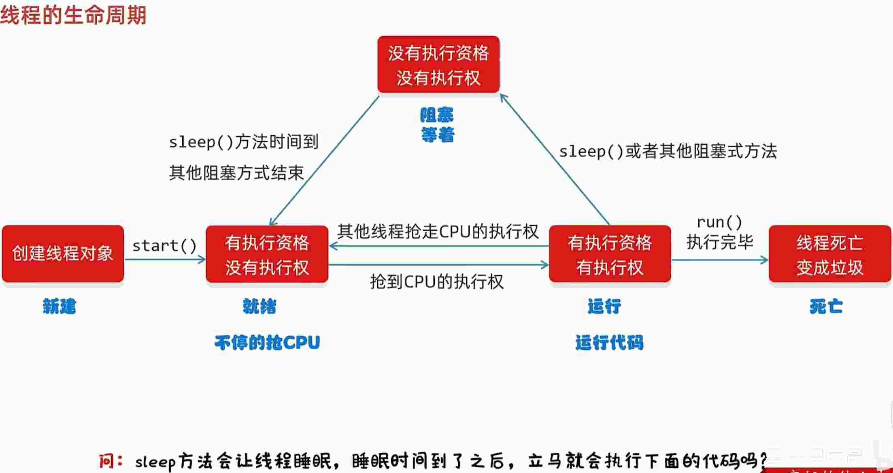
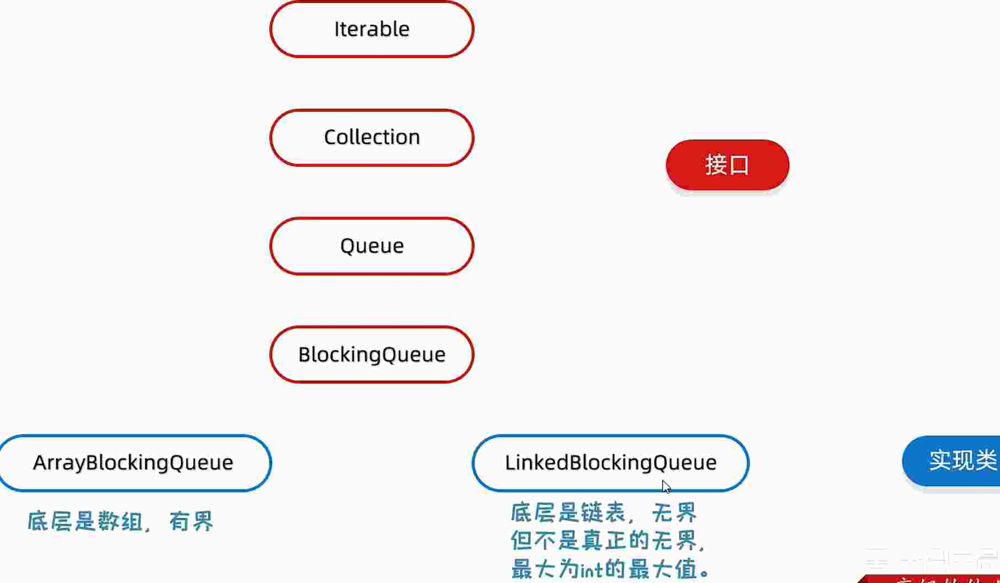
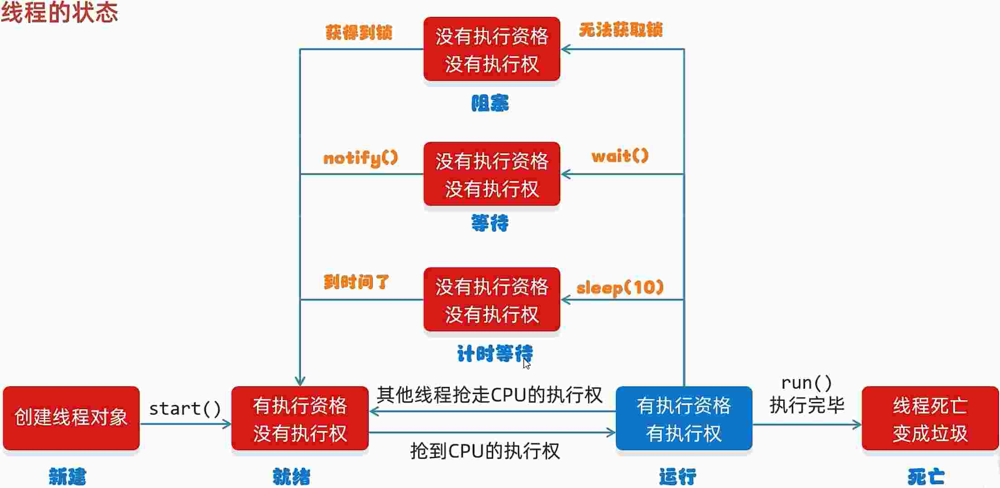

# 21.多线程

线程是操作系统能够进行运算调度的最小单位. 它被包含在进程之中, 是进程中的实际运作单位

## 21.1.并发和并行

* 并发: 在同一时刻, 有多个指令在单个CPU上交替执行
* 并行: 在同一时刻, 有多个指令在多个CPU上同时执行

## 21.2.多线程的实现方式

* 继承 Thread 类的方式进行实现
* 实现 Runnable 接口的方式进行实现
* 利用 Callback 接口和 Future 接口方式实现

> 多线程的运行方式是多种线程抢夺 cpu 的执行权, 每一行的代码运行完毕, 在不加锁的时候都可能被其他线程抢走执行权, ***每一行代码运行之前都要抢夺线程执行权***
> 线程的执行具有随机性

### 21.2.1.多线程的第一种启动方式

* 定义一个类继承 Thread
* 重写 run 方法
* 创建子类对象, 并启动线程

```java
// import java.lang.Thread;

public class MyThread extends Thread {
  public MyThread() {
  }

  public MyThread(String name) {
    super(name);
  }

  @Override
  public void run() {
    for (int i = 0; i < 1000; i++) {
      System.out.println(getName() + "-" + i);
    }
  }
}
```

```java
public class ThreadTest1 {
  public static void main(String[] args) {
    /**
     * 多线程的第一种启动方式
     */
    // MyThread t1 = new MyThread("线程1"); // 直接设置名字
    MyThread t1 = new MyThread();
    MyThread t2 = new MyThread();
    t1.setName("线程1");
    t2.setName("线程2");
    // start 开启线程
    t1.start();
    t2.start();
  }
}
```

### 21.2.2.多线程的第二种启动方式

* 自己定义一个类实现 Runnable 接口
* 重写里面的 run 方法
* 创建自己的类对象
* 创建一个 Thread 类的对象, 并开启线程

```java
package src.threaddemo02;

public class MyRun implements Runnable {

  @Override
  public void run() {
    for (int i = 0; i < 1000; i++) {
      // 获取当前线程方法
      Thread t = Thread.currentThread();
      System.out.println(t.getName() + "-" + "helloworld");
    }
  }
  
}
```

```java
package src.threaddemo02;

public class ThreadTest1 {
  public static void main(String[] args) {
    /**
     * 开启多线程的第二种方式
     */
    // 创建 MyRun 对象, 表示多线程要执行的任务
    MyRun mr = new MyRun();

    // 创建线程对象
    Thread t1 = new Thread(mr);
    Thread t2 = new Thread(mr);

    // 给线程设计名字
    t1.setName("t1");
    t2.setName("t2");

    // 开启线程
    t1.start();
    t2.start();
  }
}
```

### 21.2.3.多线程的第三种实现方式

特点: 可以获取到多线程运行的结果

* 创建类 MyCallable 实现 Callable 接口
* 重写 call (是有返回值的, 表示多线程运行的结果)
* 创建 MyCallable 的对象. (表示多线程要执行的任务)
* 创建 FutureTask 的对象. (作用管理多线程运行的结果)
* 创建 Thread 类的对象, 并启动. (表示线程)

```java
package src.threaddemo03;

import java.util.concurrent.Callable;

public class MyCallable implements Callable<Integer> {

  @Override
  public Integer call() throws Exception {
    int sum = 0;
    for (int i = 0; i < 1000; i++) {
      sum += i;
    }
    return sum;
  }
  
}
```

```java
package src.threaddemo03;

import java.util.concurrent.ExecutionException;
import java.util.concurrent.FutureTask;

public class ThreadTest3 {
  public static void main(String[] args) throws InterruptedException, ExecutionException {
    /**
     * 多线程的第三种实现方式
     */

    // 创建 MyCallable 的对象 (表示多线程要执行的任务)
    MyCallable mc = new MyCallable();
    // 创建 FutureTask 的对象. (作用管理多线程运行的结果)
    FutureTask<Integer> ft = new FutureTask<>(mc);
    // 创建线程的对象
    Thread t1 = new Thread(ft);
    // 启动线程
    t1.start();
    // 获取多线程的运行结果
    Integer res = ft.get();
    System.out.println(res);
  }
}
```

### 21.2.4.多线程的第三种实现方式对比

方式 | 优点 | 缺点
-- | -- | --
继承 Thread 类 | 编程比较简单, 可以直接使用 Thread 类中的方法 | 可扩展性较差, 不能在继承其他类
实现 Runnable 和 Callable 接口 | 扩展性强, 实现该接口的同时还可以继承其他类 | 编程相对复杂, 不能直接使用 Thread 类中的方法

## 21.3.常见的成员方法

方法名称 | 说明
-- | --
String getName() | 返回此线程的名字
void setName(String name) | 设置线程名字 (构造方法也可以设置名字)
static Thread currentThread() | 获取当前线程对象
static void sleep(long time) | 让线程休眠指定时间 (单位为毫秒)
setPriority(int newPriority) | 设定线程的优先级
final int getPriority() | 获取线程的优先级
final void setDaemon(boolean on) | 设置为守护线程
public static void yield() | 让出线程/礼让线程
public static void join() | 插入线程/插队线程

* getName setName 

  1. 如果没有给线程设置名字, 线程也有默认名字. 格式: Thread-X (X序号, 从 0 开始)
  2. 如果要给线程谁知名字, 可以使用 set 方法进行谁知, 也可以构造方法设置 (使用方式查看第一种使用线程的实现方式的例子)

* currentThread

当 JVM 虚拟机启动之后, 会自动启动多条线程, 其中有一条线程就叫 main 线程, 他的作用就是去调用 main 方法, 并执行所有的代码.

```java
package src.threaddemo03;

import java.util.concurrent.ExecutionException;
import java.util.concurrent.FutureTask;

public class ThreadTest3 {
  public static void main(String[] args) throws InterruptedException, ExecutionException {
    Thread t = Thread.currentThread();
    String name = t.getName();
    System.out.println(name); // main
  }
}
```

* sleep
  - 哪条线程执行到这个方法, 那么哪条线程就会在这里停留
  - 时间到了, 线程会自动醒来执行

```java
package src.threaddemo04;

public class ThreadMethodTest {
  public static void main(String[] args) throws InterruptedException {
    System.out.println(111);
    Thread.sleep(3000);
    System.out.println(2222);
  }
}
```

* setPriority

优先级范围是 1 - 10, 默认是 5

优先级越高只代表执行的概率更高, 不代表一定会优先执行

* setDaemon

当其他的非守护线程执行完毕之后, 守护线程会陆续结束

* yield

出让当前代码的执行权, 但是当前线程下一次执行还是会抢夺到执行权, 尽可能分布执行

```java
package src.threaddemo04;

public class Mythread1 extends Thread {
  
  public Mythread1() {
  }

  public Mythread1(String name) {
    super(name);
  }

  @Override
  public void run() {
    for (int i = 0; i < 10; i++) {
      System.out.println(getName() + "-" + i);
      Thread.yield();
    }
  }
}
```

```java
package src.threaddemo04;

public class Mythread2 extends Thread {

  public Mythread2() {
  }

  public Mythread2(String name) {
    super(name);
  }

  @Override
  public void run() {
    for (int i = 0; i < 1000; i++) {
      System.out.println(getName() + "-" + i);
    }
  }
}
```

```java
package src.threaddemo04;

public class ThreadMethodTest {
  public static void main(String[] args) throws InterruptedException {
    // System.out.println(111);
    // Thread.sleep(3000);
    // System.out.println(2222);

    // setDaemonTest();

    Mythread1 mt1 = new Mythread1("女神");
    mt1.start();
    // 把 女神这个线程插入到当前线程, 当前线程是 main 线程, 就是 女神线程执行完之后再开始执行 main 线程
    mt1.join();
    for (int i = 0; i < 10; i++) {
      System.out.println("在 main 线程执行");
    }
  }
  public static void setDaemonTest() {
    Mythread1 mt1 = new Mythread1("女神");
    Mythread2 mt2 = new Mythread2("备胎");
    mt2.setDaemon(true);
    mt1.start();
    mt2.start();
  }
}
```

## 21.4.线程的生命周期



图上的答案是不会, 因为 sleep 结束之后只是到了 就绪状态, 执行权需要抢夺

## 21.5.线程的安全问题

* 线程安全问题展示 - 三个窗口同时卖票
```java
package src.threaddemo04;

public class SafeTicketthread extends Thread {
  static int count = 100;
  static int currentCount = 0;

  @Override
  public void run() {
    while (currentCount <= count) {
      try {
        Thread.sleep(10);
      } catch (InterruptedException e) {
        e.printStackTrace();
      }
      currentCount++;
      System.out.println("正在卖第" + currentCount + "张票");
    }
  }
}
```

```java
package src.threaddemo04;

public class ThreadMethodTest {
  public static void main(String[] args) throws InterruptedException {
    safeTicketTest();
  }
  public static void safeTicketTest() {
    SafeTicketthread stt1 = new SafeTicketthread();
    SafeTicketthread stt2 = new SafeTicketthread();
    SafeTicketthread stt3 = new SafeTicketthread();

    stt1.start();
    stt2.start();
    stt3.start();

  }
}
```


## 21.6.线程的安全问题解决方式 - 同步代码块

把操作共享数据的代码锁起来

* 格式
```
synchronized(锁) {
  操作共享数据代码
}
```

* 特点
  - 锁默认打开, 有一个线程进去了, 锁自动关闭
  - 里面的代码全部执行完毕, 线程出来, 锁自动打开

```java
package src.threaddemo04;

public class SafeTicketthread extends Thread {
  static int count = 100;
  static int currentCount = 1;

  // 锁对象, 一定要是唯一的
  static Object obj = new Object();

  // @Override
  // public void run() {
  //   while (currentCount <= count) {
  //     synchronized (obj){
  //       try {
  //         Thread.sleep(10);
  //       } catch (InterruptedException e) {
  //         e.printStackTrace();
  //       }
  //       currentCount++; // 注意边界条件, 100 也会进来, 打印就有 101 张票
  //       System.out.println("正在卖第" + currentCount + "张票");
  //     }
  //   }
  // }

  @Override
  public void run() {
    while (true) {
      // synchronized (obj){
      synchronized (SafeTicketthread.class){ // 一般使用的是当前类的字节码文件对象
        if (currentCount <= count) {
          try {
            Thread.sleep(10);
          } catch (InterruptedException e) {
            e.printStackTrace();
          }
          System.out.println("正在卖第" + currentCount + "张票");
          currentCount++;
        } else {
          break;
        }
      }
    }
  }
}
```

## 21.7.线程的安全问题解决方式 - 同步方法

就是把 synchronized 关键字加到方法上

* 格式
```java
修饰符 synchronized 返回值类型 方法名(方法参数) {
  ...
}
```

* 特点
  - 同步方法是锁住方法里面的所有代码
  - 锁对象不能自己指定. 非静态: 就是 this; 静态当前类的字节码文件对象

```java
package src.threaddemo04;

public class SafeTicketMyRunnable implements Runnable {
  int count = 0;
  int ticketTotal = 100;

  @Override
  public void run() {
    while (true) {
      if (!this.safeTicket()) {
        break;
      }
    }
  }
  public synchronized boolean safeTicket() {
    boolean flag = true;
    if (count < ticketTotal) {
      try {
        Thread.sleep(10);
      } catch (InterruptedException e) {
        e.printStackTrace();
      }
      count++;
      System.out.println(Thread.currentThread().getName() + "正在卖第" + count + "张票");
    } else {
      flag = false;
    }
    return flag;
  }
}
```

```java
package src.threaddemo04;

public class ThreadMethodTest {
  public static void main(String[] args) throws InterruptedException {
    runnableSafeTicketTest();
  }

  public static void runnableSafeTicketTest() {
    SafeTicketMyRunnable st = new SafeTicketMyRunnable();

    Thread t1 = new Thread(st, "窗口1");
    Thread t2 = new Thread(st, "窗口2");
    Thread t3 = new Thread(st, "窗口3");

    t1.start();
    t2.start();
    t3.start();
  }
}
```

## 21.8.线程的安全问题解决方式 - Lock 锁

虽然理解了同步代码块和同步方法的锁对象问题, 但我们并没有直接看到在哪里加上了锁, 为了更清晰的表达如何加锁和释放锁, JDK5 之后提供了一个新的锁对象 Lock

Lock 实现提供比使用 synchronized 方法和语句可以获得更广泛的锁定操作

Lock 中提供了获得锁和释放锁的方法

```
// 手动上锁, 手动释放锁
void lock() 获得锁
void unlock() 释放锁
```

Lock 是接口不能直接实例化, 这里采用他的实现类 ReentrantLock 来实例化

构造方法 | 说明
ReentrantLock() | 创建一个 ReentrantLock 的实例

```java
package src.threaddemo04;

import java.util.concurrent.locks.Lock;
import java.util.concurrent.locks.ReentrantLock;

public class SafeTicketthread extends Thread {
  static int count = 100;
  static int currentCount = 1;
  static Lock lock = new ReentrantLock();
  static int runCount = 0;

  public SafeTicketthread() {
  }
  public SafeTicketthread(String name) {
    super(name);
  }

  @Override
  public void run() {
    while (true) {
      runCount++; // 代码里有锁, 锁着之后 while 循环也是不执行的 ???
      System.out.println(1111); // start 之后打印三次
      try {
        lock.lock();
        if (currentCount <= count) {
          try {
            Thread.sleep(10);
          } catch (InterruptedException e) {
            e.printStackTrace();
          }
          System.out.println(getName() +  ": 正在卖第" + currentCount + "张票");
          currentCount++;
        } else {
          break;
        }
      } catch (Exception e) {
        
      } finally {
        lock.unlock();
      }
    }
    System.out.println(runCount); // 103
  }
}
```

```java
package src.threaddemo04;

public class ThreadMethodTest {
  public static void main(String[] args) throws InterruptedException {
    safeTicketThreadTest();
  }
  public static void safeTicketThreadTest() {
    SafeTicketthread stt1 = new SafeTicketthread("窗口1");
    SafeTicketthread stt2 = new SafeTicketthread("窗口2");
    SafeTicketthread stt3 = new SafeTicketthread("窗口3");

    stt1.start();
    stt2.start();
    stt3.start();
  }
}
```

## 21.9.死锁

不要让两个锁嵌套起来就能避免

```java
package src.threaddemo04;

public class DieLock extends Thread {
  static Object obj1 = new Object();
  static Object obj2 = new Object();
  public DieLock() {
  }

  public DieLock(String name) {
    super(name);
  }

  @Override
  public void run() {
    if (getName().equals("线程一")) {
      synchronized(obj1) {
        System.out.println("我是线程一 - 1");
        synchronized(obj2) {
          System.out.println("我是线程一 - 2");
        }
      }
    } else {
      synchronized(obj2) {
        System.out.println("我是线程二 - 1");
        synchronized(obj1) {
          System.out.println("我是线程二 - 2");
        }
      }
    }
  }
}
```
```java
package src.threaddemo04;

public class ThreadMethodTest {
  public static void main(String[] args) throws InterruptedException {
    dieLock();
  }
  public static void dieLock() {
    DieLock dieLockThread1 = new DieLock("线程一");
    DieLock dieLockThread2 = new DieLock("线程二");

    dieLockThread1.start();
    dieLockThread2.start();
  }
}
```

## 21.10.生产者和消费者 (等待唤醒机制)

生产者和消费者是一个十分经典的多线程协作的模式

方法名称 | 说明
-- | --
void wait() | 当前线程等待, 知道被其他线程唤醒
void notify() | 随机唤醒单个线程
void notifyAll() | 唤醒所有线程

```java
package src.threaddemo04;

public class CookThead extends Thread {
  
  public CookThead() {
  }

  public CookThead(String name) {
    super(name);
  }

  @Override
  public void run() {
    while (true) {
      synchronized(DeskThead.lock) {
        if (DeskThead.count == DeskThead.eatTotal) {
          break;
        } else {
          if (DeskThead.theadFlag == 1) {
            try {
              DeskThead.lock.wait();
            } catch (InterruptedException e) {
              e.printStackTrace();
            }
          } else {
            DeskThead.count++;
            System.out.println("厨师正在做第" + DeskThead.count + "碗面条");
            DeskThead.lock.notifyAll();
            DeskThead.theadFlag = 1;
          }
        }
      }
    }
  }
}
```

```java
package src.threaddemo04;

public class FoodieThead extends Thread {
  
  public FoodieThead() {
  }

  public FoodieThead(String name) {
    super(name);
  }

  @Override
  public void run() {
    while(true) {
      synchronized(DeskThead.lock) {
          if (DeskThead.theadFlag == 1) {
            // DeskThead.count += 1;
            System.out.println("吃货正在吃" + DeskThead.count + "碗面条");
            DeskThead.lock.notifyAll();
            DeskThead.theadFlag = 0;

            if (DeskThead.count == DeskThead.eatTotal) {
              break;
            }
          } else {
            try {
              DeskThead.lock.wait(); // 用这个 wait , 然后用 all 唤醒 (理解差点意思 ???)
            } catch (InterruptedException e) {
              e.printStackTrace();
            }
          }
      }
    }
  }
}
```

```java
package src.threaddemo04;

public class DeskThead {
  static int count = 0;
  static final int eatTotal = 10;
  static int theadFlag = 0; // 0 代表无 1: 无
  static Object lock = new Object();
}
```

```java
package src.threaddemo04;

public class ThreadMethodTest {
  public static void main(String[] args) throws InterruptedException {
    producersAndConsumersTest();
  }

  static void producersAndConsumersTest() {
    CookThead ck = new CookThead("厨师");
    FoodieThead ft = new FoodieThead("吃货");

    ck.start();
    ft.start();
  }
}
```

## 21.11.等待唤醒机制 - 阻塞队列的实现方式


* 阻塞队列的继承结构



```java
package src.threaddemo04;

import java.util.concurrent.ArrayBlockingQueue;

public class Foodie2 extends Thread {
  public ArrayBlockingQueue<String> queue;

  public Foodie2(String name, ArrayBlockingQueue<String> queue) {
    super(name);
    this.queue = queue;
  }

  @Override
  public void run() {
    while (true) {
      try {
        String food = queue.take();
        System.out.println(food);
      } catch (InterruptedException e) {
        e.printStackTrace();
      }
    }
  }
}
```

```java
package src.threaddemo04;

import java.util.concurrent.ArrayBlockingQueue;

public class Cook2 extends Thread {
  public ArrayBlockingQueue<String> queue;

  public Cook2(String name, ArrayBlockingQueue<String> queue) {
    super(name);
    this.queue = queue;
  }
  
  @Override
  public void run() {
    while (true) {
      try {
        queue.put("面条");
        System.out.println(getName());
      } catch (InterruptedException e) {
        // TODO Auto-generated catch block
        e.printStackTrace();
      }
    }
  }
}
```

```java
static void producersAndConsumersTest2() {
  ArrayBlockingQueue<String> queue = new ArrayBlockingQueue<>(1);
  Cook2 ck = new Cook2("厨师", queue);
  Foodie2 ft = new Foodie2("吃货", queue);

  ck.start();
  ft.start();
}
```

> 上面代码执行的打印是有问题的, 因为没有在锁里, 打印顺序不对
> put 和 take 方法里面是自带锁的, 所以不能锁嵌套

## 21.12.线程的状态

```
新建状态 (NEW) - 创建线程对象
就绪装填 (RUNNABLE) - start 方法
阻塞状态 (BLOCKED) - 无法获得锁对象
等待状态 (WAITING) - wait 方法
计时等待 (TIME_WAITING) - sleep 方法
结束状态 (TERMINATED) - 全部代码运行完毕
```



> 线程中是没有运行状态的, 只是为了方便理解, 因为执行权已经交出去了, 所以就没定这个状态

```java
package src.threaddemo04.threadPractice.practice2;

import java.math.BigDecimal;
import java.math.RoundingMode;
import java.util.Random;

public class MyThread2 extends Thread {
  public static BigDecimal totalMoney = BigDecimal.valueOf(100);
  public static int count = 3;
  public static BigDecimal MIN_PRICE = BigDecimal.valueOf(0.01);
  
  public MyThread2(String name) {
    super(name);
  }

  @Override
  public void run() {
    synchronized(MyThread2.class) {
      if (count == 0) {
        System.out.println(getName() + "没有抢到红包");
      } else {
        BigDecimal price;
        if (count == 1) {
          price = totalMoney;
        } else {
          double bounds = totalMoney.subtract(BigDecimal.valueOf(count - 1).multiply(MIN_PRICE)).doubleValue();
          Random r = new Random();
          price = BigDecimal.valueOf(r.nextDouble(bounds)).setScale(2, RoundingMode.HALF_UP);
          if (price.compareTo(MIN_PRICE) < 0) {
            price = MIN_PRICE;
          }
        }
        System.out.println(getName() + "中了" + price + "元");
        count--;
        totalMoney = totalMoney.subtract(price);
      }
    }
  }
}
```

> 每一个线程都有自己的栈

## 21.13.线程池

* 创建一个池子, 池子是空的
* 提交任务时, 池子会创建新的线程对象, 任务执行完毕, 线程归还给池子, 下回在提交任务时, 不需要创建新的线程, 直接复用已有的线程就行 (池子中创建的线程是可以设置上限的)
* 提交任务时, 没有空闲的线程, 也无法创建新的线程, 任务则会排队等待

## 21.14.线程池代码实现 - Executors

线程池的工具类通过调用方法返回不同类型的线程池对象

```java
package src.threadpoll;

public class MyRunnable implements Runnable {
  @Override
  public void run() {
    for (int i = 1; i <= 100; i++) {
      System.out.println(Thread.currentThread().getName() + ": 正在打印" + i);
    }
  }
}
```

方法名称 | 说明
-- | --
public static ExecutorService newCachedThreadPool() | 创建一个没有上限的线程池
public static ExecutorService newFixedCachedThreadPool(int nThreads) | 创建有上限的线程池

```java
package src.threadpoll;

import java.util.concurrent.ExecutionException;
import java.util.concurrent.Executor;
import java.util.concurrent.ExecutorService;
import java.util.concurrent.Executors;

public class ThreadPollTest01 {
  public static void main(String[] args) throws InterruptedException {
    // pollTest1();
    pollTest2();
  }
  public static void pollTest2() throws InterruptedException  {
    ExecutorService pool1 = Executors.newFixedThreadPool(3);

    pool1.submit(new MyRunnable());
    pool1.submit(new MyRunnable());
    pool1.submit(new MyRunnable());
    pool1.submit(new MyRunnable());
    pool1.submit(new MyRunnable());
    pool1.submit(new MyRunnable());
    pool1.submit(new MyRunnable());
    pool1.shutdown();
  }
  public static void pollTest1() throws InterruptedException  {
    MyRunnable mr = new MyRunnable();
    // Thread t = new Thread(mr, "线程一");
    ExecutorService pool1 = Executors.newCachedThreadPool();

    pool1.submit(new MyRunnable());
    Thread.sleep(1000);
    System.out.println("----");
    pool1.submit(new MyRunnable());
    pool1.shutdown();
  }
}
```

## 21.15.自定义线程池 - ThreadPoolExecutor

### 21.15.1.ThreadPoolExecutor 的参数

  - 参数一: 核心线程数量 (不能小于 0)
  - 参数二: 最大的线程数 (不能小于等于 0, 最大数量 >= 核心线程数量)
  - 参数三: 空闲线程最大存活时间 (不能小于 0)
  - 参数四: 时间单位 (用 TimeUnit 指定)
  - 参数五: 任务队列 (不能为 null)
  - 参数六: 创建线程工厂 (不能为 null)
  - 参数七: 任务的拒绝策略 (不能为 null)


### 21.15.2.自定义线程 - 任务拒绝策略

任务拒绝策略 | 说明
-- | --
ThreadPoolExecutor.AbortPolicy | (默认策略) 丢弃任务并抛出 RejectedExecutionException 异常
ThreadPoolExecutor.DiscardPolicy | 丢弃任务, 但是不抛出异常 (这是不推荐的做法)
ThreadPoolExecutor.DiscardOldestPolicy | 抛弃队列中等待最久的任务, 然后把当前任务加入队列中
ThreadPoolExecutor.CallerRunsPolicy | 调用任务的 run() 方法绕过线程池直接执行

### 21.15.3.自定义线程池小结

* 创建过程
  1. 创建一个空的池子
  2. 有任务提交时, 线程池会创建线程去执行任务, 执行完毕归还线程

* 不断提交任务, 会有以下三个临界点
  1. 当核心线程满时, 在提交任务就会排队
  2. 当核心线程满时, 排队队伍也满, 会创建临时线程
  3. 和核心线程满时, 排队队伍满, 临时线程满, 会触发任务拒绝策略

### 21.15.4.线程池设置大小判断

* 获取当前计算机的 java 可使用的线程数

```java
public static void getRunProcess() {
  int count = Runtime.getRuntime().availableProcessors();
  System.out.println(count);
}
```

* CPU 密集型运算

最大并行数 + 1

使用场景: 计算比较多, 读取数据库或者本地文件比较少

* I/O 密集型运算


使用场景: 计算比较少, 读取数据库或者本地文件比较多

> 现在一般都是这种
> CPU 等待时间越长, 就可以设置更多线程


> 计算时间和等待时间使用工具进行测算: Thread dump


## 21.16.多线程额外扩展内容

找课程文档 (平常开发用不到, 面试可能用)


