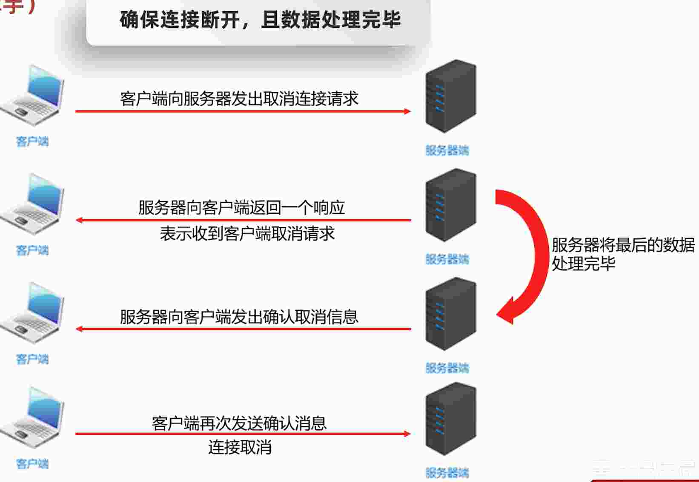

# 22.网络编程

## 22.1.什么是网络编程

在网络通讯的协议下, 不同计算机上运行的程序, 进行数据传输

创建的软件架构: BS / CS

## 22.2.网络编程三要素

IP、 端口号、 协议

* IP
设备在网络中的地址, 是唯一标识

* 端口号
应用程序在设备中唯一标识

* 协议
数据在网络传输中的规则, 常见协议有 UDP、 TCP、 http、 https、 ftp

## 22.3.IP

全程 Internet protocol, 是互联网协议地址, 也称 ip 地址, 是分配给上网设备的数字标签

* 常见 IP 分类: IPv4, IPv6

### 22.3.1.IPv4

全称: Internet protocol version 4, 互联网通讯协议第四版

最多只有 2^32 次方个 ip, 目前已经用完

采用 32 位地址长度, 分成 4 组


> 没有负数一说 最大 255

### 22.3.2.IPv6

全称: Internet protocol version 6, 互联网通讯协议第六版

最多有 2^128 次方个 ip, 为了 ipv4 不够用出现的

## 22.4.IPv4 地址分类形式

* 公网地址(万维网使用) 和 私有地址(局域网使用)
* 192.168. 开头就是私有地址, 范围即为 192.168.0.0 - 192.168.255.255 专门为组织机构内部使用, 以此节省 ip

### 22.4.1.特殊地址

127.0.0.1 可以是 localhost: 是回送地址也称本地回环地址, 也称本地 ip, 永远只会寻找当前所在本机

## 22.5.InetAddress

方法名称 | 说明
-- | --
static InetAddress getByName(String host) | 确定主机名称的 ip 地址. 主机名称可以是机器名称, 也可以是 ip 地址
String getHostName() | 获取此ip地址的本机名
String getHostAdderss() | 返回文本显示中的 IP 地址字符串

## 22.6.端口号

应用程序在设备中的唯一标识

端口号: 由两个字节表示的整数, 取值范围: 0 - 65535

其中 0 ~ 1023 之间的端口号用于一些知名的网络服务或者应用, 咱们使用 1024 以上的端口号就可以

> 一个端口号只能被一个应用程序使用

## 22.7.协议

计算机网络中, 连接和通信的规则被称为网络通信协议

* OSI 参考模式: 世界互联协议标准, 全球通信范围, 单模型过于理想化, 未能在因特网上进行广泛推广
* TCP/IP 参考模式 (或 TCP/IP 协议): 事实上的国际标准


## 22.8.UDP 协议

* 用户数据报协议 (User Datagram Protocol)
* UDP 是 ***面向无连接*** 通信协议 (不管是否连接成功)
  - 速度快, 有大小限制一次最多发送 64k, 数据不安全, 易丢失数据

### 22.8.1.UDP 通信程序 - 发送数据

* 创建发送端的 DatagramSocket 对象
* 数据打包 (DatagramPacket)
* 发送数据
* 释放资源

```java
package src.internet;

import java.io.IOException;
import java.net.DatagramPacket;
import java.net.DatagramSocket;
import java.net.InetAddress;
import java.net.SocketException;
import java.net.UnknownHostException;

public class UDPTest01 {
  public static void main(String[] args) throws IOException {
    /**
     * 1. 创建 DatagramSocket 对象
     * 细节: 无参 所有可用的端口随便使用一个
     *       有参 指定端口号进行绑定
     */
    DatagramSocket ds = new DatagramSocket();

    /**
     * 2. 打包数据
     */
    String str = "你好啊!!!";
    byte[] bytes = str.getBytes();
    InetAddress address = InetAddress.getByName("127.0.0.1");
    int port = 10086;
    DatagramPacket dp = new DatagramPacket(bytes, bytes.length, address, port);

    /**
     * 3. 发送数据
     */
    ds.send(dp);

    /**
     * 4. 释放资源
     */
    ds.close();
  }
}
```

### 22.8.2.UDP 通信程序 - 接收数据

```java
package src.internet;

import java.io.IOException;
import java.net.DatagramPacket;
import java.net.DatagramSocket;
import java.net.InetAddress;

public class UDPReceiveTest01 {
  public static void main(String[] args) throws IOException {
    /**
     * 1. 创建 DatagramSocket 对象
     * 细节: 在接收时一定要绑定端口号, 并且要和发送端保持一致
     */
    int port = 10086;
    DatagramSocket ds = new DatagramSocket(port);

    /**
     * 2. 接收数据包
     */
    byte[] bytes = new byte[1024];
    DatagramPacket dp = new DatagramPacket(bytes, bytes.length);
    // 该方法是阻塞的, 程序执行到这一个步, 会死等发送端发送数据
    ds.receive(dp);

    /**
     * 3. 解析数据包
     */
    byte[] data = dp.getData();
    int len = dp.getLength();
    InetAddress address = dp.getAddress();
    System.out.println("接收到的数据是: " + new String(data, 0, len));
    // System.out.println("ip是:" + address.getHostAddress());
    System.out.println("ip是:" + address);
    System.out.println("名字是:" + address.getHostName());
    System.out.println("端口是:" + dp.getPort());

    /**
     * 4. 释放资源
     */
    ds.close();
  }
}
```

### 22.8.3.UDP 三种通信方式

单播、 组播、 广播

组播地址: 244.0.0.0 ~ 239.255.255.255, 其中 244.0.0.0 ~ 224.0.0.255 为预留的组播地址

广播地址: 255.255.255.255

* 广播

就是把 单播的ip 改为 255.255.255.255

* 组播
```java
package src.internet;

import java.io.IOException;
import java.net.DatagramPacket;
import java.net.InetAddress;
import java.net.MulticastSocket;

public class UDPGroupReceive01 {
  public static void main(String[] args) throws IOException {
    // 创建 MulticastSocket 对象
    MulticastSocket ms = new MulticastSocket(10000);

    // 2. 将当前本机添加到 224.0.0.1 这一组当中
    InetAddress address = InetAddress.getByName("224.0.0.1");
    ms.joinGroup(address);

    // 3. 创建 
    byte[] bytes = new byte[1024];
    DatagramPacket dp = new DatagramPacket(bytes, bytes.length);

    ms.receive(dp);

    byte[] data = dp.getData();
    int len = dp.getLength();
    InetAddress addr = dp.getAddress();
    System.out.println("接收到的数据是: " + new String(data, 0, len));
    // System.out.println("ip是:" + addr.getHostAddress());
    System.out.println("ip是:" + addr);
    System.out.println("名字是:" + addr.getHostName());
    System.out.println("端口是:" + dp.getPort());

    ms.close();
  }
}
```

```java
package src.internet;

import java.io.IOException;
import java.net.DatagramPacket;
import java.net.InetAddress;
import java.net.MulticastSocket;

public class UDPGroupReceive02 {
  public static void main(String[] args) throws IOException {
    // 创建 MulticastSocket 对象
    MulticastSocket ms = new MulticastSocket(10000);

    // 2. 将当前本机添加到 224.0.0.1 这一组当中
    InetAddress address = InetAddress.getByName("224.0.0.1");
    ms.joinGroup(address);

    // 3. 创建 
    byte[] bytes = new byte[1024];
    DatagramPacket dp = new DatagramPacket(bytes, bytes.length);

    ms.receive(dp);

    byte[] data = dp.getData();
    int len = dp.getLength();
    InetAddress addr = dp.getAddress();
    System.out.println("接收到的数据是: " + new String(data, 0, len));
    // System.out.println("ip是:" + addr.getHostAddress());
    System.out.println("ip是:" + addr);
    System.out.println("名字是:" + addr.getHostName());
    System.out.println("端口是:" + dp.getPort());

    ms.close();
  }
}
```

```java
package src.internet;

import java.io.IOException;
import java.net.DatagramPacket;
import java.net.InetAddress;
import java.net.MulticastSocket;

public class UDPGroupSend {
  public static void main(String[] args) throws IOException {
    MulticastSocket ms = new MulticastSocket();

    String str = "你好啊!!!";
    byte[] bytes = str.getBytes();
    // 发送组播时, 需要设置组播地址
    InetAddress address = InetAddress.getByName("224.0.0.1");
    int port = 10000;
    DatagramPacket dp = new DatagramPacket(bytes, bytes.length, address, port);
    ms.send(dp);
    ms.close();
  }
}
```


## 22.9.TCP 协议

TCP 协议是一种可靠的网络协议, 它在通信的两端各建立一个 Socket 对象, 通过 Socket 产生 IO 流来进行网络通信

* 传输控制协议 TCP (Transmission Control Protocol)
* TCP 协议是 ***面向连接*** 的通信协议
  - 速度慢, 没有大小限制, 数据安全


> read 方法从通道连接中读取数据, 但是需要有一个结束标记, 此处的循环才会停止, 否则程序会一直停止在 read 方法这里, 等待读取数据. 结束标记 socket.shutdownOutput(); 程序不是真正停止, 只是告诉接收方这条数据发完了

```java
package src.internet;

import java.io.BufferedReader;
import java.io.IOException;
import java.io.InputStream;
import java.io.InputStreamReader;
import java.net.ServerSocket;
import java.net.Socket;

public class TCPServer {
  public static void main(String[] args) throws IOException {
    // TCP 协议 接收数据

    /**
     * 1. 创建对象 ServerSocker
     */
    ServerSocket server = new ServerSocket(10000);

    /**
     * 2. 监听客户端连接
     */
    Socket socket = server.accept();

    /**
     * 3. 从通道中获取输入流读取数据
     */
    InputStream is = socket.getInputStream();
    // 转换流
    InputStreamReader isr = new InputStreamReader(is);
    // 缓冲流
    BufferedReader br = new BufferedReader(isr);
    int b;
    // while ((b = isr.read()) != -1) {
    while ((b = br.read()) != -1) {
      System.out.println((char) b);
    }

    is.close();
    server.close();
  }
}
```


* 发送多条数据
```java
package src.internet;

import java.io.IOException;
import java.io.OutputStream;
import java.net.Socket;

public class TCPClient {
  public static void main(String[] args) throws IOException, InterruptedException {
    // TCP 协议, 发送数据

    /**
     * 1. 创建 Socket 对象
     * 细节: 在创建对象的同时会连接服务端, 如果连接不上, 代码会报错
     */
    Socket socket = new Socket("127.0.0.1", 10000);

    /**
     * 2. 从连接通道获取输出流
     */
    OutputStream os = socket.getOutputStream();

    int count = 0;
    // 写出数据
    // os.write("aaa".getBytes());
    while (true) {
      if (count >= 3) {
        break;
      }
      os.write("你好啊！！！".getBytes());
      count++;
      Thread.sleep(3000);
    }

    /**
     * 3. 释放资源
     */
    os.close();
    socket.close();
  }
}
```

```java
package src.internet;

import java.io.IOException;
import java.io.OutputStream;
import java.net.Socket;

public class TCPClient {
  public static void main(String[] args) throws IOException {
    // TCP 协议, 发送数据

    /**
     * 1. 创建 Socket 对象
     * 细节: 在创建对象的同时会连接服务端, 如果连接不上, 代码会报错
     */
    Socket socket = new Socket("127.0.0.1", 10000);

    /**
     * 2. 从连接通道获取输出流
     */
    OutputStream os = socket.getOutputStream();
    // 写出数据
    // os.write("aaa".getBytes());
    os.write("你好啊！！！".getBytes());

    /**
     * 3. 释放资源
     */
    os.close();
    socket.close();
  }
}
```

## 22.10.TCP 通信程序 - 三次握手


## 22.11.TCP 通信程序 - 四次挥手



## 22.12.练习

* 练习一

```java
package src.internet.practice1;

import java.io.IOException;
import java.io.InputStream;
import java.io.InputStreamReader;
import java.io.OutputStream;
import java.net.ServerSocket;
import java.net.Socket;

public class Server {
  public static void main(String[] args) throws IOException {
    ServerSocket server = new ServerSocket(10000);

    Socket socket = server.accept();

    InputStream is = socket.getInputStream();
    InputStreamReader isr = new InputStreamReader(is);

    int b;
    while ((b = isr.read()) != -1) {
      System.out.println((char) b);
    }

    // 回写数据
    OutputStream os = socket.getOutputStream();
    os.write("你也好呀".getBytes());;

    server.close();
  }
}
```

```java
package src.internet.practice1;

import java.io.IOException;
import java.io.InputStream;
import java.io.InputStreamReader;
import java.io.OutputStream;
import java.net.Socket;

public class Client {
  public static void main(String[] args) throws IOException {
    Socket socket = new Socket("127.0.0.1", 10000);

    String str = "你好啊";

    OutputStream os = socket.getOutputStream();
    os.write(str.getBytes());
    socket.shutdownOutput();

    InputStream is = socket.getInputStream();
    InputStreamReader isr = new InputStreamReader(is);

    int b;
    while ((b = isr.read()) != -1) {
      System.out.println((char) b);
    }

    socket.close();
  }
}
```

* 练习二 - 接收文件

```java
package src.internet.practice2;

import java.io.BufferedOutputStream;
import java.io.BufferedWriter;
import java.io.FileOutputStream;
import java.io.IOException;
import java.io.InputStream;
import java.io.OutputStream;
import java.io.OutputStreamWriter;
import java.net.ServerSocket;
import java.net.Socket;

public class Server {
  public static void main(String[] args) throws IOException {
    ServerSocket server = new ServerSocket(10000);
    Socket socket = server.accept();
    BufferedOutputStream bos = new BufferedOutputStream(new FileOutputStream("src/file/server.jpg"));
    InputStream is = socket.getInputStream();
    int b;
    while ((b = is.read()) != -1) {
      bos.write(b);
    }
    bos.flush();
    bos.close();

    // OutputStream os = socket.getOutputStream();
    BufferedWriter bw = new BufferedWriter(new OutputStreamWriter(socket.getOutputStream()));
    bw.write("上传成功");
    // bw.newLine();
    bw.close();

    socket.close();
    server.close();
  }
}
```

```java
package src.internet.practice2;

import java.io.BufferedInputStream;
import java.io.BufferedReader;
import java.io.FileInputStream;
import java.io.IOException;
import java.io.InputStreamReader;
import java.io.OutputStream;
import java.net.Socket;

public class Client {
  public static void main(String[] args) throws IOException {
    Socket socket = new Socket("127.0.0.1", 10000);

    BufferedInputStream bis = new BufferedInputStream(new FileInputStream("src/file/22.6.jpg"));
    OutputStream os = socket.getOutputStream();

    int b;
    while ((b = bis.read()) != -1) {
      os.write(b);
    }
    socket.shutdownOutput();

    BufferedReader br = new BufferedReader(new InputStreamReader(socket.getInputStream()));
    String msg = br.readLine();
    System.out.println(msg);

    br.close();
    socket.close();
  }
}
```

* UUID

```java
package src.internet.practice2;

import java.util.UUID;

public class Uuid {
  public static void main(String[] args) {
    String str = UUID.randomUUID().toString();
    System.out.println(str);
  }
}
```

* 练习三 - 服务器不停

while 循环会不停止 服务 ？？？
```java
while (true) {
  Socket socket = server.accept();

  InputStream is = socket.getInputStream();
  InputStreamReader isr = new InputStreamReader(is);

  int b;
  while ((b = isr.read()) != -1) {
    System.out.println((char) b);
  }

  OutputStream os = socket.getOutputStream();
  os.write("你也好呀".getBytes());
}
```


