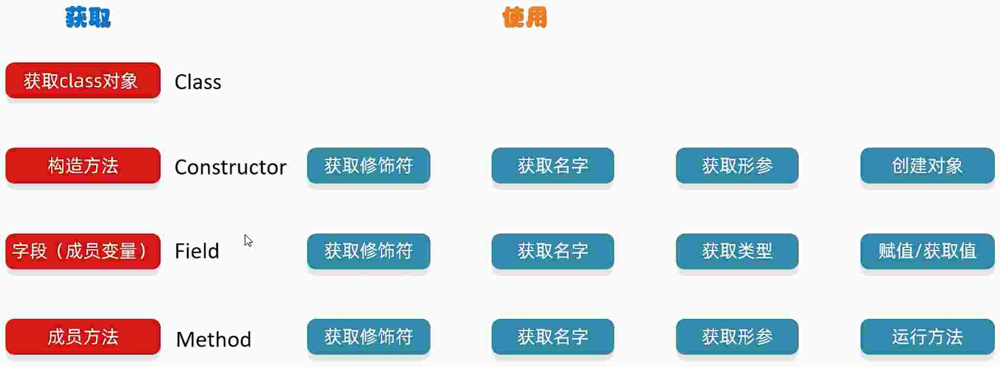
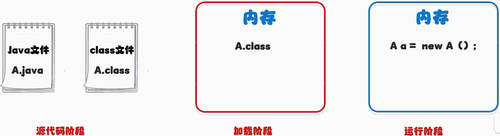

# 23.反射

反射允许对封装类的字段, 方法和构造函数的信息进行编程访问



* 反射的作用
  - 获取一个类中所有的信息, 获取到之后, 再执行其他业务逻辑
  - 结合配置文件, 动态创建对象并调用方法


* 下边用的 Student 类
```java
package src.refectdemo;

import java.io.IOException;

public class Student {
  private String name;
  private int age;
  private int sex;
  public int test;
  public Student() {
  }
  public Student(String name, int age, int sex) {
    this.name = name;
    this.age = age;
    this.sex = sex;
  }
  private Student(String name, int age) {
    this.name = name;
    this.age = age;
  }
  protected Student(String name) {
    this.name = name;
  }
  
  public String getName() {
    return name;
  }
  public void setName(String name) {
    this.name = name;
  }
  public int getAge() {
    return age;
  }
  public void setAge(int age) {
    this.age = age;
  }
  public int getSex() {
    return sex;
  }
  public void setSex(int sex) {
    this.sex = sex;
  }
  public void sleep() {
    System.out.println(getName() + "正在睡觉");
  }
  private void eat(String food) throws IOException, NullPointerException {
    System.out.println("吃" + food);
  }
  private String run(String distance) {
    System.out.println("跑" + distance + "米");
    return "跑完了";
  }
  @Override
  public String toString() {
    return "Student [name=" + name + ", age=" + age + ", sex=" + sex + "]";
  }
}
```

## 23.1.获取 class 对象的三种方式

* Class.forName("全类名")
* 类名.class
* 对象.getClass()

这三种方式对应 java 三个阶段来使用



> idea 中 右键可以复制 完整类名, 复制到代码里只会展示类名

```java
package src.refectdemo;

public class refectGetClass {
  public static void main(String[] args) throws ClassNotFoundException {
    // 第一种方式
    // 全类名: 包名 + 类名
    // 最为常用
    Class class1 = Class.forName("src.refectdemo.Student");

    // 第二种方式
    // 一般是当成参数传递
    Class class2 = Student.class;

    // 第三种方式
    // 当我们有了这个类的对象时, 才可以使用
    Student s = new Student("张三", 18, 1);
    Class class3 = s.getClass();

    System.out.println(class1 == class2);
    System.out.println(class3 == class2);
  }
}
```

## 23.2.利用反射获取构造方法

* Class 类中用于获取 ***构造方法*** 的方法

方法名 | 说明
Constructor<?>[] getConstructors() | 返回所有公共构造方法对象的数组
Constructor<?>[] getDeclaredConstructors() | 返回所有构造方法对象的数组
Constructor< T > getConstructor(Class<?>...parameterTypes) | 返回单个公共构造方法对象
Constructor< T> getDeclaredConstructor(Class<?>...parameterTypes) | 返回单个构造方法对象

```java
package src.refectdemo;

import java.lang.reflect.Constructor;

public class RefectMethodTest {
  public static void main(String[] args) throws ClassNotFoundException, NoSuchMethodException, SecurityException {
    // 获取 class 字节码文件对象
    Class clazz = Class.forName("src.refectdemo.Student");
    
    // 获取构造方法
    // Constructor[] cons = clazz.getConstructors();
    // for (Constructor con : cons) {
    //   System.out.println(con);
    // }

    // Constructor[] cons2 = clazz.getDeclaredConstructors();
    // for (Constructor con : cons2) {
    //   System.out.println(con);
    // }

    Constructor con1 = clazz.getDeclaredConstructor();
    System.out.println(con1);

    Constructor con2 = clazz.getDeclaredConstructor(String.class, int.class, int.class);
    System.out.println(con2);

    Constructor con3 = clazz.getDeclaredConstructor(String.class);
    System.out.println(con3);

    Constructor con4 = clazz.getDeclaredConstructor(String.class, int.class);
    System.out.println(con4);
  }
}
```

* Constructor 类中用于创建对象的方法

方法名 | 说明
-- | --
T newInstance(Object...initargs) | 根据指定的构造方法创建对象
setAccessible(boolean flag) | 设置为 true, 表示取消访问检查

```java
package src.refectdemo;

import java.lang.reflect.Constructor;
import java.lang.reflect.InvocationTargetException;
import java.lang.reflect.Parameter;

public class RefectMethodTest {
  public static void main(String[] args) throws ClassNotFoundException, NoSuchMethodException, SecurityException, InstantiationException, IllegalAccessException, IllegalArgumentException, InvocationTargetException {
    // 获取 class 字节码文件对象
    Class clazz = Class.forName("src.refectdemo.Student");
    
    // 获取构造方法
    // Constructor[] cons = clazz.getConstructors();
    // for (Constructor con : cons) {
    //   System.out.println(con);
    // }

    // Constructor[] cons2 = clazz.getDeclaredConstructors();
    // for (Constructor con : cons2) {
    //   System.out.println(con);
    // }

    Constructor con1 = clazz.getDeclaredConstructor();
    // System.out.println(con1);

    Constructor con2 = clazz.getDeclaredConstructor(String.class, int.class, int.class);
    // System.out.println(con2);

    Constructor con3 = clazz.getDeclaredConstructor(String.class);
    // System.out.println(con3);

    Constructor con4 = clazz.getDeclaredConstructor(String.class, int.class);
    // System.out.println(con4);


    int modifiers = con4.getModifiers();
    // System.out.println(modifiers);

    Parameter[] parameter = con4.getParameters();
    // for (Parameter p : parameter) {
    //   System.out.println(p);
    // }

    // 暴力反射: 表示临时取消权限校验
    con4.setAccessible(true);
    Student stu = (Student) con4.newInstance("张三", 18); // 设置获取会报错, 因为修饰是 private, 可以通过 setAccessible 临时改变权限
    System.out.println(stu);
  }
}
```

## 23.3.利用反射获取成员变量

* Class 类中用于获取成员变量的方法

方法名 | 说明
Field[] getFields() | 返回所有公共成员变量对象的数组
Field[] getDeclaredFields() | 返回所有成员变量对象的数组
Field[] getField(String name) | 返回单个公共成员变量对象
Field[] getDeclaredField(String name) | 返回单个成员变量对象

* Field 类中用于创建对象的方法

方法名 | 说明
-- | --
void set(Object obj, Object value) | 赋值
Object get(Object obj) | 获取值


```java
package src.refectdemo;

import java.lang.reflect.Field;
import java.lang.reflect.Modifier;

public class RefectMehtodTest02 {
  public static void main(String[] args) throws ClassNotFoundException, NoSuchFieldException, SecurityException, IllegalArgumentException, IllegalAccessException {
    Class clazz = Class.forName("src.refectdemo.Student");
    
    // 获取所有成员变量
    Field[] fields = clazz.getDeclaredFields();
    for (Field f : fields) {
      System.out.println(f);
    }

    // 获取单个公共成员变量
    Field test = clazz.getField("test");
    System.out.println(test);

    // 获取单个成员变量  (可以获取私有的)
    Field name = clazz.getDeclaredField("name");
    System.out.println(name);

    // 获取权限修饰符
    int modifier = name.getModifiers();
    System.out.println(modifier);

    // 获取成员变量名
    String n = name.getName();
    System.out.println(n);

    // 获取成员变量类型
    Class<?> type = name.getType();
    System.out.println(type);

    // 获取成员变量的值 (private 需要修改临时权限)
    Student student = new Student("张三", 18, 1);
    name.setAccessible(true);
    // Object value = name.get(student);
    String value = (String) name.get(student);
    System.out.println(value);

    // 修改对象里面记录的值
    name.set(student, "李四");
    System.out.println(student);
  }
}
```

## 23.4.利用反射获取成员方法

* Class 类中用于获取成员方法的方法

方法名 | 说明
-- | --
Method[] getMethods() | 返回所有公共成员方法对象的数组, 包括继承的
Method[] getDeclaredMethods() | 返回所有成员方法对象的数组, 不包括继承的
Method getMethod(String name, Class<?>...parameterTypes) | 返回单个公共成员方法对象
Method getDeclaredMethod(String name, Class<?>...parameterTypes) | 返回单个成员方法对象

* Method 类中用于创建对象的方法

方法名 | 说明
-- | --
Object invoke(Object obj, Object...args) | 运行方法

```
参数一: 用 obj 对象调用该方法
参数二: 调用方法的传递的参数 (如果没有就不写)
返回值: 方法的返回值 (如果没有就不写)
```

```java
package src.refectdemo;

import java.lang.reflect.InvocationTargetException;
import java.lang.reflect.Method;
import java.lang.reflect.Modifier;
import java.lang.reflect.Parameter;

public class RefectMethodTest03 {
  public static void main(String[] args) throws ClassNotFoundException, NoSuchMethodException, SecurityException, IllegalAccessException, IllegalArgumentException, InvocationTargetException {
    Class clazz = Class.forName("src.refectdemo.Student");

    // 返回所有公共成员方法对象, 包括父类所有公共方法
    Method[] methods = clazz.getMethods();
    for (Method m : methods) {
      // System.out.println(m);
    }

    Method[] methods2 = clazz.getDeclaredMethods();
    for (Method m : methods2) {
      // System.out.println(m);
    }

    // 获取指定的单一方法
    Method sleepMethod = clazz.getMethod("sleep");
    // System.out.println(sleepMethod);
    Method eatMethod = clazz.getDeclaredMethod("eat", String.class);
    // System.out.println(eatMethod);

    // 获取方法修饰符
    int modifiers = eatMethod.getModifiers();
    // System.out.println(modifiers);

    // 获取方法的名字
    String name = eatMethod.getName();
    // System.out.println(name);

    // 获取方法的形参
    Parameter[] parameters = eatMethod.getParameters();
    for(Parameter p: parameters) {
      // System.out.println(p);
    }

    // 获取方法的异常
    Class[] exceptionType = eatMethod.getExceptionTypes();
    for (Class e : exceptionType) {
      // System.out.println(e);
    }

    Student s = new Student("张三", 18, 1);
    eatMethod.setAccessible(true);
    eatMethod.invoke(s, "鸡腿");

    Method runMethod = clazz.getDeclaredMethod("run", String.class);
    runMethod.setAccessible(true);
    // Object res = runMethod.invoke(s, "10000");
    String res = (String) runMethod.invoke(s, "10000");
    System.out.println(res);
  }
}
```

## 23.5.练习

```java
package src.refectdemo;

import java.lang.reflect.Field;
import java.lang.reflect.InvocationTargetException;
import java.lang.reflect.Method;
import java.lang.reflect.Modifier;
import java.lang.reflect.Parameter;

public class RefectMethodTest03 {
  public static void main(String[] args) throws ClassNotFoundException, NoSuchMethodException, SecurityException, IllegalAccessException, IllegalArgumentException, InvocationTargetException {
    Student s = new Student("张三", 18, 1);

    saveObj(s);
  }

  // 把对象里面所有的成员变量和值保存在本地中
  public static void saveObj(Object obj) throws IllegalArgumentException, IllegalAccessException {
    // 获取字节码文件对象
    Class clazz = obj.getClass();

    // 获取所有成员方法
    Field[] fields = clazz.getDeclaredFields();
    for (Field f : fields) {
      f.setAccessible(true);
      // 获取成员变量名字
      String name = f.getName();
      // 获取成员变量的值
      Object value = f.get(obj);
      System.out.println(name + ":" + value);
    }
  }
}
```

> p133 讲过配置文件
> p197 没学

## 23.6.动态代理

无侵入式的给代码增加额外的功能


### 23.6.1.代理长什么样

代理里面就是对象要被代理的方法

### 23.6.2.Java 通过什么保证代理的样子

通过接口保证, 后面的对象和代理需要实现同一个接口. 接口中就是被代理的所有方法

## 23.7.代理的类 - java.lang.reflect.Proxy

java.lang.reflect.Proxy 类: 提供了为对象产生代理对象的方法

```
public static Object newProxyInstance(ClassLoader loader, Class<?>[] interfaces, InvocationHandler h)

参数一: 用于指定用哪个类加载器, 去加载生成的代理类
参数二: 指定接口, 这些接口用于指定的生成代理有哪些方法
参数三: 用来指定生成的代理对象要干什么事情
```

* 练习

```java
package src.refectdemo;

public interface Star {
  public abstract void dance();
  public abstract String sing(String song);
}
```

```java
package src.refectdemo;

public class BigStar implements Star {
  private String name;

  
  public BigStar(String name) {
    this.name = name;
  }

  @Override
  public void dance() {
    System.out.println(this.name + "跳舞");
  }
  @Override
  public String sing(String song) {
    System.out.println(this.name + "唱" + song);
    return "谢谢";
  }

  public String getName() {
    return name;
  }

  public void setName(String name) {
    this.name = name;
  }
  
}
```

```java
package src.refectdemo;

import java.lang.reflect.InvocationHandler;
import java.lang.reflect.Method;
import java.lang.reflect.Proxy;

public class ProxyUtil {
  // 方法的作用, 给明星的对象创造一个代理
  // 形参: 被代理的明星对象
  // 返回值: 给明星创建代理
  public static Star createProxy(BigStar bigStar) {
    /**
     * 参数一: 用于指定用哪个类加载器, 去加载生成的代理类 (去加载第二个参数类)
     * 参数二: 指定接口, 这些接口用于指定的生成代理有哪些方法
     * 参数三: 用来指定生成的代理对象要干什么事情
     */
    Star star = (Star) Proxy.newProxyInstance(ProxyUtil.class.getClassLoader(), new Class[]{Star.class}, new InvocationHandler() {
        @Override
        public Object invoke(Object proxy, Method method, Object[] args) throws Throwable {
          /**
           * 参数一: 代理的方法
           * 参数二: 要运行的方法 sing
           * 参数三: 调用 sing 方法时, 传递的参数
           */
          if ("sing".equals(method.getName())) {
            System.out.println("准备话筒");
          } else if ("dance".equals(method.getName())) {
            System.out.println("准备场地");
          }
          return method.invoke(bigStar, args);
        }
      }
    );
    return star;
  }
}
```

```java
package src.refectdemo;

public class ProxyTest {
  public static void main(String[] args) {
    BigStar bigStar = new BigStar("某某哥");
    Star proxy = ProxyUtil.createProxy(bigStar);

    proxy.dance();
    String res = proxy.sing("xxxx");
    System.out.println(res);
  }
}
```
