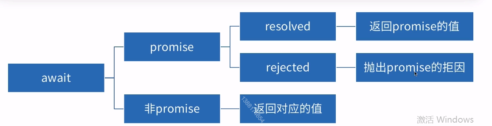

# 2.async和await 

* Generator的语法糖

## async 函数

* async位于函数字面量或函数表达式的前面(普通函数，立即执行函数，箭头函数均可)，被修饰函数的返回一个Promise对象
* 一个语法糖 使异步操作更简单
* 返回值 返回值是一个 promise 对象
	* return 的值是promise resolved 时候的value
	* Throw 的值是promise rejected时候的reason

```js
async function test() {
	return 1;
}

let p = test();

console.log('p', p); // p, promise 实例 resolved 状态
p.then(function(data) {
	console.log(data); // 1
})
```

```js
async function test() {
	throw new Error();
}

let p = test();

console.log('p', p); // p, promise 实例 rejected 状态
p.catch(function(data) {
	console.log(data); // error
})
```

### await 

* 只能出现在 async 函数内或最外层
* 等待一个 promise 对象的值
* await 的 promise 状态为 rejected ，后续执行中断

* await一定要位于async函数内部
* await一般位于Promise对象之前，所以一般位于async函数执行的前面，但若是返回值为Promise对象的普通函数也可
* await会拿到该对象的结果，也就是then中resolve或reject的参数。如果不是Promise对象，则直接返回对应的值
* 若await后方不是Promise对象，则会将其用Promise.resolve包装后执行
* await的执行会被强制等待至拿到结果，后续函数体内的代码执行被阻塞，函数本身不会阻塞整体代码


> await 其实 是 yield的语法糖， yield 其实  也有 return的意思。



```js
async function async1() {
	console.log('async1 start');
	await async2();
	console.log('async1 end');
}

async function async2() {
	return Promise.resolve().then(_ => {
		console.log('async2 promise');
	});
}

async1();
```

```js
async function f() {
	await Promise.reject('error');  // 后续代码不会执行
	console.log(1);
	await 100;
}

async function f() {
	await Promise.reject('error').catch(err => {
		// 处理异常
	});  // 后续代码不会执行
	console.log(1);
	await 100;
}

async function f() {
	try {
		await Promise.reject('error');
	} catch (e) {
		// 处理异常
	} finally {

	}
	console.log(1);
	await 100;
}


```

```js
async function chloe() {
    console.log("chloe");
    return 20;
}

async function taran() {
    const age = await chloe(); chloe函数执行返回出一个Promise对象，await拿到该对象resolve的参数20，赋值给age
    console.log("taran" + age);
}

taran(); chloe taran20
```

```js
async function chloe() {
    console.log("chloe");
    throw 18;
}

async function taran() {
    try {
        const age = await chloe(); chloe函数执行返回出一个Promise对象，await拿到该对象reject的参数18
        console.log("taran" + age); 不再执行
    } catch (error) {
        console.log("taran" + error); 捕获到错误信息18
    }
}

taran(); chloe taran18
```

## async 实现原理

Generator + 自动执行器

```js
async function example() {

}

// 相当于

function example() {
	return spawn (function* () {

	})
}
```