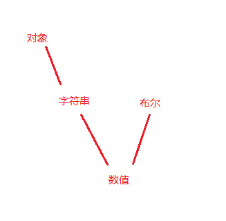

# 隐式转换

## 基本类型

总结： 当加号运算时， 字符串与任何值相加，任何值都转换成字符串；其他类型的值相加，都转换成 number， null => 0, undefined => NaN; NaN与任何值（除了字符串）相加都得 NaN;
其他运算符时， 基本类型都转换为 Number，String类型的带有字符的比如： '1a' ,'a1' 转化为 NaN 与undefined 一样。

number（） 与 parseInt（） 都可以将对象转化为Number类型，Number函数要比parseInt函数严格很多。基本上，只要有一个字符无法转成数值，整个字符串就会被转为NaN。

```js
console.log(Number('2a'), parseInt('a4'), parseInt('3ab4'));
// NaN  NaN  3
```

## Object 类型

object 基本类型运算

```js
var obj = {
    toString: function(){
        return 6;
    },
    valueOf: function(){
        return 5;
    }
};
 
var obj1 = {
    valueOf: function(){
        return 'a';
    },
    toString: function(){
        return 'b';
    }
};

// 当对 obj,obj1 用Number()和String()换转时
console.log(Number(obj), Number(obj1), String(obj), String(obj1));
// 5 NaN 6 b
```

Obj与Number运算时，会先调用valueOf方法；
Obj与String运算时，会先调用valueOf方法；
Obj与null运算时，会先调用valueOf方法；

总结： Number类型会先调用valueOf(), String类型会先调用toString(),  如果结果是原始值，则返回原始值，否则继续用toString 或 valueOf(),继续计算，如果结果还不是原始值，则抛出一个类型错误;　

```js
// 为什么 {} + [] = 0 ?  因为 javascript在运行时, 将 第一次{} 认为是空的代码块，所以就相当于 +[] = 0, 还有 {} + 5 = 5, 同理。
{} + [] // 0 
[] + {} // "[object Object]"
[] + [] // ""
{} + {} // "[object Object][object Object]"
```

## ==号比较

### null == 0 结果为false

这时候两边的类型也不同，但是却没有做类型转换，why？因为这时候二者都已经是基本数据类型了，没有办法在进行转换了，所以二者的类型都不可能相同，结果自然为false

### 为什么null == undefined 结果为true

这是一种规定   <br>
if x is null and y is undefined, return true   <br>
if y is null and x is undefined, return true

### 为什么 [] == false ?

类型不同比较时，需要先做类型转换，==比较时有布尔值参与时，需要比较双方均转为数字，[ ]是非原值，需要转换为原值二者才能进行比较，大部分对象转换为原值最后都是调用的toString方法，[] --> toString() —> ''，当字符串和数字比较时，会把字符串转换为数字，而空字符串转换为数字结果是0，而 0 == 0，所以结果为true

;

参考：https://www.cnblogs.com/ihboy/p/6700059.html


== 比较 <br>
对象 => 字符串 => 数字 <br>
字符串 => 数字 <br>
布尔值 => 数字

