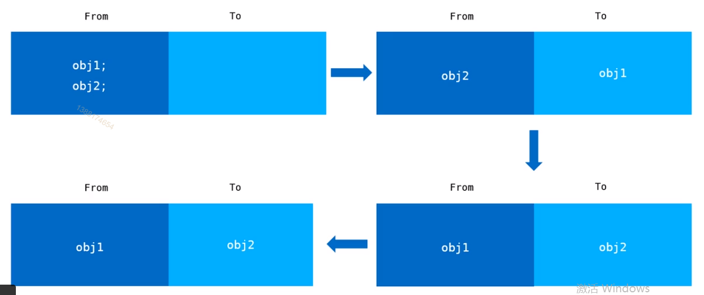
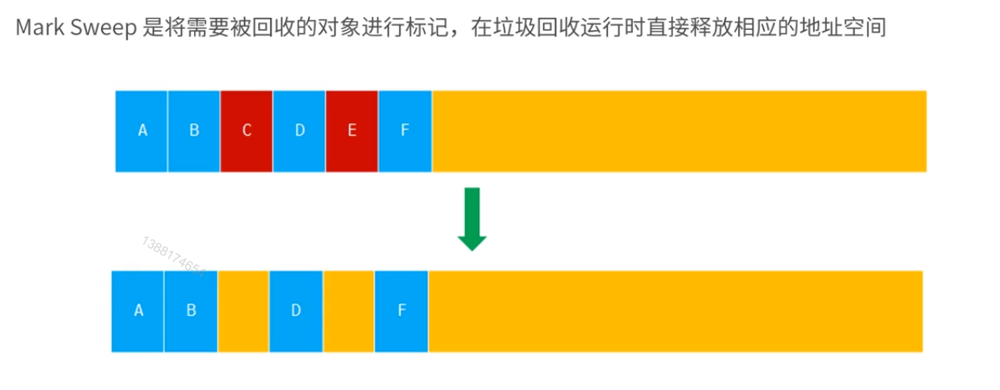
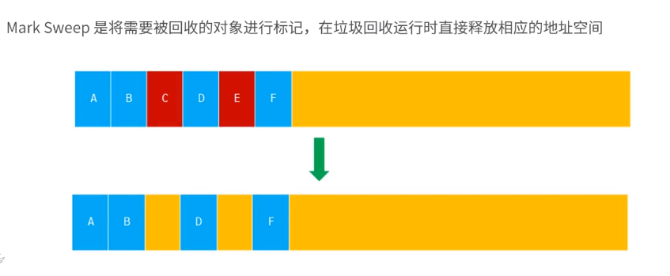
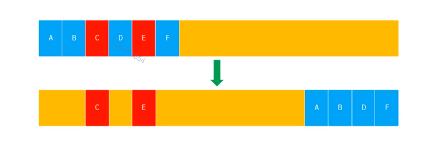

# 1 JavaScript中内存管理

## 数据类型
* 原始数据类型
字符串 （String）、数字 （Number）、 布尔 （Boolean）、 空对象 （Null）、 未定义 （Undefined）、Symbol （表示独一无二的值）
* 引用数据类型
Object
* 内存空间
栈内存 （stack） 、 堆内存（heap）

## JavaScript 的垃圾回收机制
* 垃圾回收
找出那些不在继续使用的变量，然后释放其所占用的内存， 垃圾回收器会按照固定的事件间隔周期性地执行这一操作

* JavaScript 使用垃圾回收机制来自动管理内存， 垃圾回收是一把双刃剑
优势： 可以大幅简化程序地内存管理代码， 减低程序员地负担， 减少因长时间运转而带来地内存泄漏问题
不足：意味着程序员将无法掌控内存。JavaScript没有暴漏任何序内存的 api。我们无法强迫其进行垃圾回收， 更无法干预内存管理。

## 垃圾回收机制

### 引用计数 （reference counting）
跟踪记录每个值被引用的次数， 如果一个值引用次数是0， 就表示这个值不在用到了，因此可以将这块内存释放。
* 原理
每次引用加一， 被释放时减一， 当这个值得引用次数变成 0 时， 就可以将其内存空间回收
> 使用这种方式得bug ， 循环引用

### 标记清除
标记清除指的是当变量进入环境时， 这个变量标记为 “进入环境”；而当变量离开环境时，则将其标记为 “离开环境” ， 最后， 垃圾回收器完成内存清除工作， 销毁那些带标记的值并回收它们所占用得内存空间

环境指的是执行环境

* 执行环境
执行环境定义了变量或函数有权访问得其他数据，决定了他们各自得行为。每个执行环境都有一个与之关联得变量对象 （variable object）， 环境中定义得所有变量和函数都保存在这个对象中

* 全局执行环境
	* 最外围得一个执行环境
	* 根据宿主环境不同表示执行环境得对象也不一样。在浏览器中， 全局执行环境被认为是 window 对象， 在 node 中 全局执行环境是 globel
	* 全局变量和函数都是作为 window 对象得属性和方法创建的
	* 某个执行环境中的所有代码执行完毕后， 该环境被销毁，保存在其中的所有变量和函数定义页随之销毁
* 环境栈 （局部）
	每个函数都有自己的执行环境。当执行流进入一个函数时， 函数的环境就会被推入一个环境栈中。而在函数执行之后，栈将其环境弹出， 把控制权返回给之前的执行环境。ECMAScript 程序中执行流正是由这个方便的机制控制着

## V8 内存管理机制

### 限制内存的原因
* V8 最初为浏览器而设计， 不太可能遇到大量内存的使用场景
* 防止因为垃圾回收所导致的线程暂停执行的时间过长

### V8 的回收策略

回收策略
* V8 采用了一种分代回收的策略， 将内存分为两个生代： 新生代 和 老生代。
* V8 分别对新生代和老生代使用不同的垃圾回收算法来提升垃圾回收的效率。

新生代的内存结构
;
> from 和 to 组成 Semispace
> 现在 from 中进行分配
> from 空间中存放不需要回收的对象， to 空间中存放不需要回收的对象

新生代对象的晋升
* 在新生代垃圾回收的过程中， 当一个对象经过多次赋值后依然存活， 它将会被认为是生命周期较长的对象， 随后会被移动到老生代中， 采用新的算法进行管理
* 在 from 空间和 to 空间进行反转的过程中， 如果 to 空间中的使用量已经超过了 25% , 那么From 中的对象直接晋升到老生代内存空间中

老生代的内存结构
老生代的内存结构是一个连续的结构分为： 标记清除 （mark sweep） 和 标记合并 （Mark Compact）
;
* 标记清除 （mark sweep）
Mark Sweep 是将需要被回收的对象进行标记， 在垃圾回收运行时直接释放响应的地址空间
> 红色部分为清除部分
;
> 产生问题： 产生了内存不连续的现象
* 标记合并 （Mark Compact）
Mark Compact 将存活的对象移动到一边， 将需要被回收的对象移动到另一边， 然后对需要被回收的对象区域进行整体的垃圾回收
> 蓝色部分为清除部分
;
