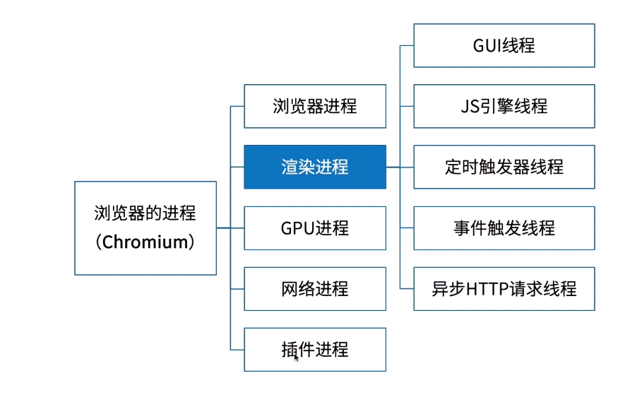
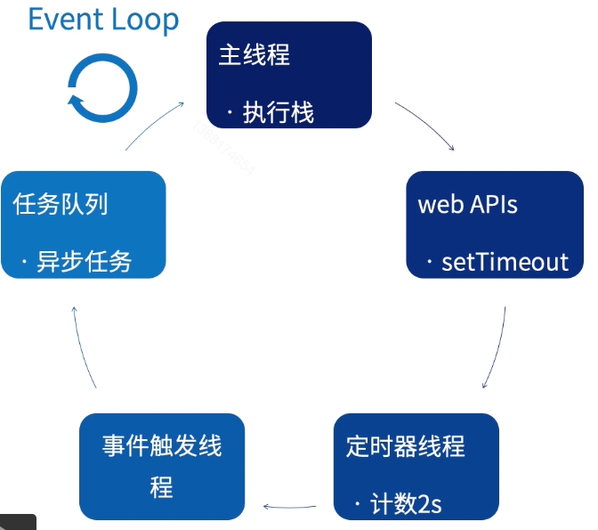
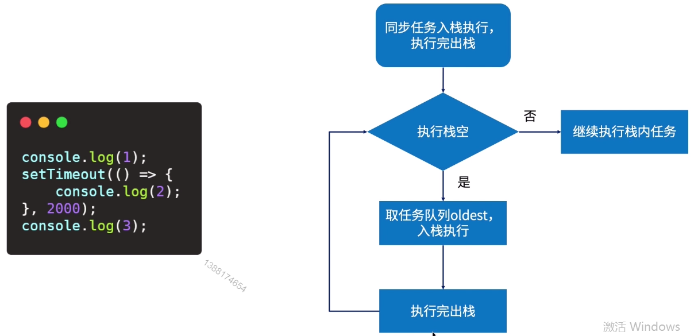

# 1.理解异步

## 同步和异步

```js
const test = () => {
	let t = +new Date();
	while(true) {
		if(+new Date() - t >= 2000) {
			break;
		}
	}
}
console.log(1);
test();
console.log(2);
console.log(3);
```

```js
console.log(1);
setTimeout(() => {
	console.log(2);
}, 2000)
console.log(3);
```

### 进程

* 程序运行实例
* 同一个程序可以产生多个进程
* 一个进程产生多个线程或一个线程

linux 中查看进程的常用命令 ps （process status）， top（table of processes）

### 线程

* 操作系统能够进行运算调度得最小单位
* 一次只执行一个任务
* 有自己得调用栈，寄存器环境
* 同一进程的线程共享进程资源

## JavaScript单线程

js是怎么实现异步： 通过浏览器内核多线程实现异步

;

### GUI线程

* 渲染布局

### Js 引擎线程

* 解析，执行 Js 
* 与 GUI 互斥线程

### 定时器触发线程

* setTimeout
* setInterval

### 事件触发线程

* 将满足触发条件的事件放入任务队列

### 异步HTTP请求进程

* XHR 所在进程

### 异步场景

* 定时器

;

1. 调用 webAPI 
2. 定时器线程计数 2s
3. 事件触发进程将定时器放入任务队列
4. 主线程通过 Event Loop 遍历任务队列	

;

* 定时器存在问题

1. 定时任务可能不会按时执行
2. 定时器嵌套五次之后最小间隔不能低于 4ms

```js
const test () => {
	let = +new Date();
	while(true) {
		if(+new Data() - t >= 5000) {
			break;
		}
	}
}
setTimeout(()  => {
	console.log(2);
}, 2000);
test();
```

* 定时器应用常见

1. 防抖
2. 节流
3. 倒计时
4. 动画
	requestAnimationFrame实现动画比定时器有哪些优势	

```js
for(var i = 1; i <= 10; i++) {
	setTimeout(function(){
		console.log(i);
	}, 1000*i)
}
for(var i = 1; i <= 10; i++) {
	(function(i){
		setTimeout(function(){
			console.log(i);
		}, 1000*i)
	})(i)
}
```

* 网络请求

* 事件绑定

* promise 

## 定时器