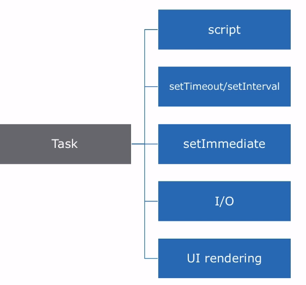
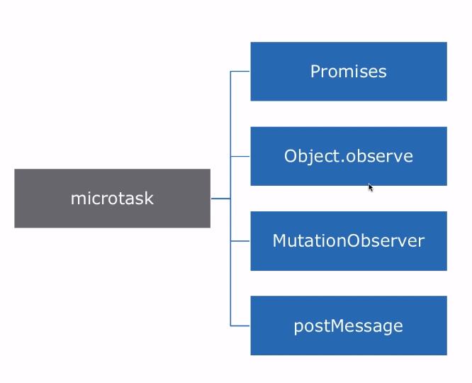
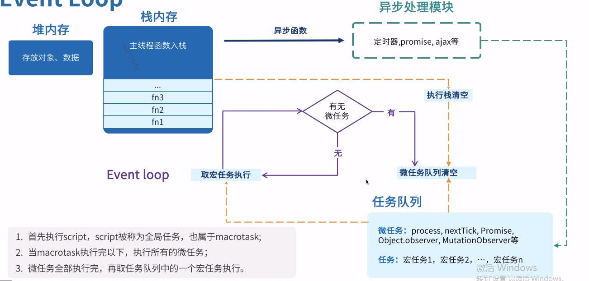
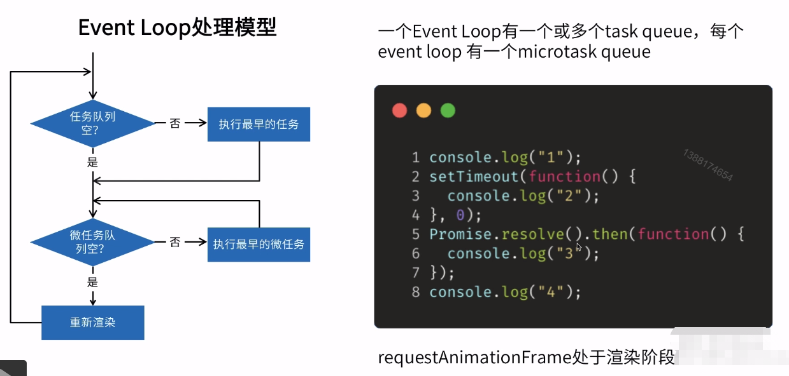
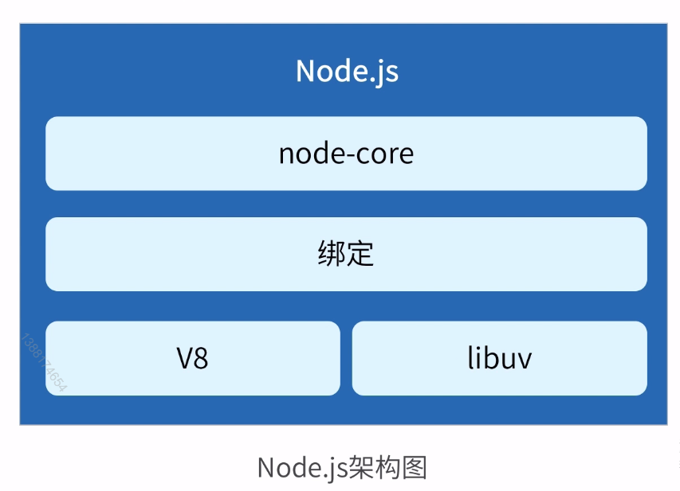
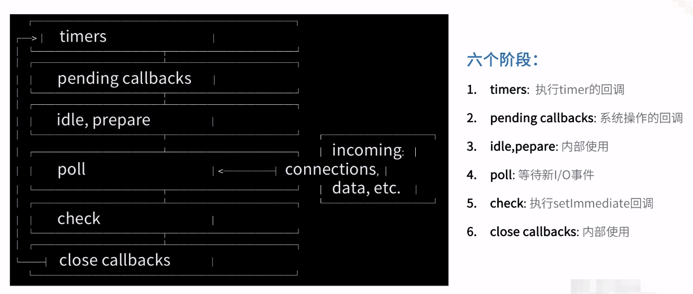
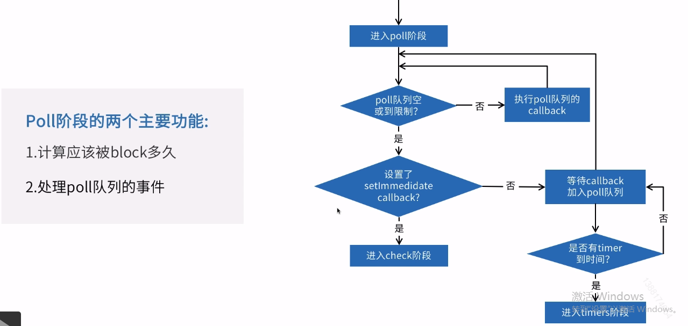
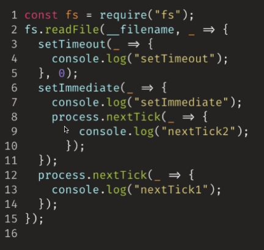

# 2.Event Loop机制

## 浏览器的 Event Loop

### 异步实现

* 宏观： 浏览器的多线程



> setImmediate 是node中的方法

* 微观： Event Loop , 事件循环



> Object.observe 监听对象变化的api <br>
> MutationObserver 监听DOM变化的 api
> poseMessage window对象之间用来通信的方法

```js
console.log(1);
setTimeout(() => {
	console.log(2);
})

// new Promise(resolve => {
// 	console.log(3);
// 	resolve();
// }).then(res => {
// 	console.log(4);
// })
Promise.resolve().then(res => {
	console.log(3)
})
console.log(4);
```



### Event Loop 处理模型



### 例子

```js
console.log(start);  // 1

setTimeout(() => {
	console.log('setTimeout');  // 4
	new Promise(resolve => {
		console.log('promise inner1'); // 5
		resolve();
	}).then(res => {
		console.log('promise then1'); // 6
	})
})

new Promise(resolve => {
	console.log('promise inner2'); // 2
	resolve();
}).then(res => {
	console.log('promise then2'); // 3
})

```

```js
async function async1() {
	console.log('async1 start'); // 2
	await async2();
	console.log('asunc1 end');
}

async function async2() {
	return Promise.resolve().then(res => {
		console.log('async2 promise'); // 4
	})
}

console.log('start');  // 1

setTimeout(function() {
	console.log('setTimeout'); //6 
}, 0);

async1();

new Promise(function(resolve) {
	console.log('promise1'); // 3
	resolve();
}).then(res => {
	console.log('promise2'); // 5
})
```

## Node.js 的 Event Loop





每个阶段都有一个 callbacks 的先进先出的队列需要执行。当 event loop 运行到一个指定阶段时， 该阶段的 fifo 队列将会被执行，当队列 callback 执行完或者执行的 callbacks 数量超过该阶段上线时， evnet loop 回转入下一个阶段。

### Poll 阶段


```js
const fs = require('fs');

function 	someAsyncOperation (callback) {
	fs.readFile(__dirname, callback);
}

const timeoutScheduled = Date.now();

setTimeout(() => {
	const delay = Date.new() - timeoutScheduled;
	console.log(`${delay}`)  // someAsyncOperation 执行完 才会打印
}, 100)

someAsyncOperation(() => {
	const startCallback = Date.now();
	while(Date.now() - startCallback < 200>) {

	}
})
```

```js
const fs = require('fs');
fs.readFile(__filename, _ => {
	setTimeout(_ => {
		console.log('setTimeout'); // 2
	}, 0);
	setImmediate(_ => {
		console.log('setImmediate'); // 1
	})
})
```

## process.nextTick()

是一个异步的 node API ，但不属于event loop 的阶段

> 调用这个方法， event loop 会停下来，先执行 process.nextTick()



4 2 3 1 


