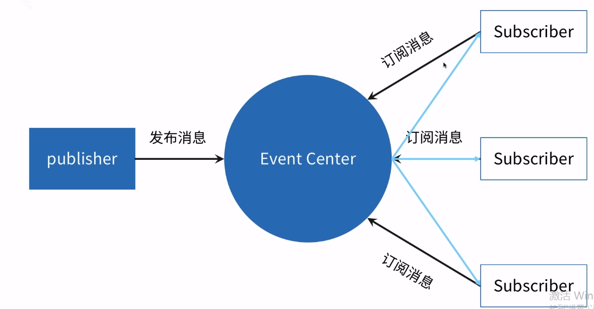
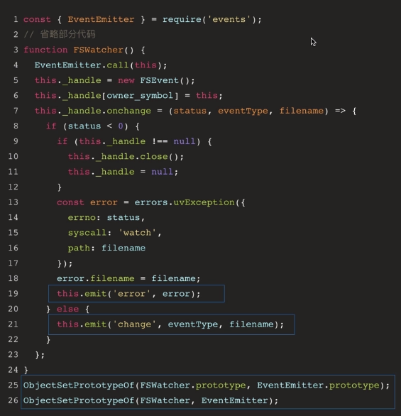

# 3.异步编程方法-发布和订阅

## 理解发布订阅

### 异步编程的方法

* 回调函数
* 事件发布/订阅
* Promise
* Generator 函数
* async 函数

### 代码理解

```js
function ajax(url, callback) {

}

ajax('./test1.json', function(data) {
	console.log(data);
	ajax('./test12.json', function(data) {
		console.log(data);
		ajax('./test3.json', function(data) {
			console.log(data);
		})
	})
})
```
```js
const pbb = PubSub();
ajax.('./test1.json', function() {
	pbb.publish('test1Success', data);
})
pbb.subscribe('test1Success', function(data){
	console.log(data);
	ajax.('./test2.json', function() {
		pbb.publish('test2Success', data);
	})
})
pbb.subscribe('test2Success', function(data){
	console.log(data);
	ajax.('./test3.json', function() {
		pbb.publish('test3Success', data);
	})
})
pbb.subscribe('test2Success', function(data){
	console.log(data);
})
```

图例


<!-- > 订阅者触发消息 -->

## 实现发布订阅

### 代码

```js
class PubSub{
	constructor() {
		this.events = {}
	}
	publish(eventName, data) {
		if(this.events[eventName]){
			this.events[eventName].foreach(cb => {
				cb.apply(this, data);
			})
		}
	}
	subsrcibe(eventName, callback) {
		if(this.events[eventName]) {
			this.events[eventName].push(callback);
		} else {
			this.events[eventName] = [callback];
		}
	}
	unSubsrcibe(eventName, callback) {
		if(this.events[eventName]) {
			this.events[eventName] = this.events[eventName].filter(
				cb => cb !== callback
			)
		}
	}
}
```

### 发布订阅优缺点

* 优点
	* 松耦合
	* 灵活

* 缺点
	* 无法确保消息被触发，或者触发几次

## Node.js 中的发布订阅

```js
const fs = require('fs');

fs.readFile('/Users/Kitty/test1.json, 'utf8', function(err, data) {

})

// readFile 是 异步方法， 同步方法是 readFileSync
// 回调函数置尾
// 错误优先暴漏
```

### EventEmitter

* 是事件触发与事件监听器功能的封装
* const { EventEmitter } = require('events');
* 产生事件的对象都是 event.EventEmitter 的实例
* 继承方式使用
* emit on once addListener removeListener

```js
EventEmitter.prototype.emit = function(type, ...args) {
	let doError = 'error';
	const events = this._events;
	if(events !== undefined) {
		if(doError && events[KErrorMonitor] !== undefined) {
			this.emit(KErrorMonitor, ...args);
			doError = doError && events.error === undefined;
		} else if(!doError) return false;
	} 
	
	if(doError) {
		let er;
		if(args.length > 0) {
			er = args[0];
		}

		if(er instanceof Error) {
			try {
				const capture = {};
				Error.captureStackTrace(capture, EventEmitter.prototype.emit);
				ObjectDefineProperty(er, kEnhanceStackBeforeInspector, {
					value: enhaceStackTrace.bind(this, er, capture),
					configurable: true
				}) 
			} catch{}
			throw err;
		}
		let stringifiedEr;
		const { inspect } = require('internal/util/inspect');
		try {
			stringifiedEr = er;
		} catch {
			stringifiedEr = er;
		}
		const err = new ERR_UNHANDLED_ERROR(stringifiedEr);
		err.context = er;
		throw err;
	}

	const handler = event[type];
	if(handler === undefined) reture false;

	if(typeof handler === 'function') {
		const result = ReflectApply(handler, this, args);
		if(result !== undefined && result !== null) {
			addCatch(this, result, type, args);
		}
	} else {
		const len = args.length;
		const listeners = arrayClone(handler, len);
		for(let i = 0; i < len; ++i) {
			const result = RefectApply(listeners[i], this, args);
			if(result !== undefined && result !== null) {
				addCatch(this, result, type, args);
			}
		}
	}
	
	return true;
}

```


