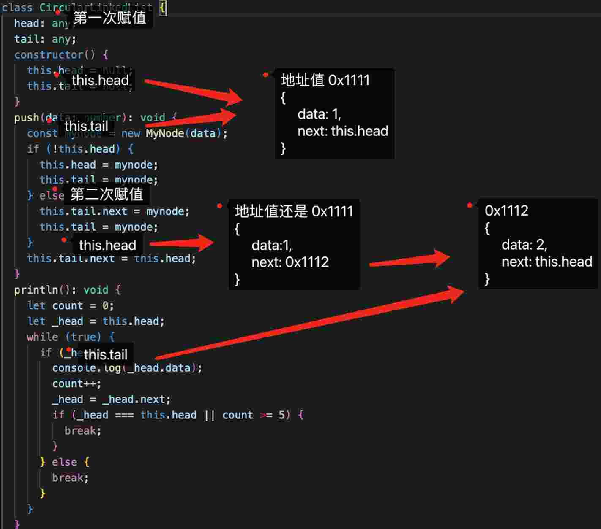

# 2.js 循环链表

循环链表是一种特殊的链表数据结构，其中最后一个节点指向链表的头节点，形成一个循环的环状结构。与普通链表不同，循环链表没有明确的结束点，可以通过任意节点开始遍历整个链表。

## 2.1.循环链表的概念

循环链表是一种链表的变体，其中链表中的最后一个节点指向链表的头节点，形成一个循环或环状结构。

与普通链表不同，循环链表没有明确的结束点。它提供了一种便捷的方式来遍历整个链表，因为可以从任何节点开始，沿着 next 指针遍历到原始出发节点就可以完成整个循环链表的遍历。

在循环链表中，每个节点仍然包含一个数据元素和一个指向下一个节点的指针。但是，在链接节点时需要特别注意将最后一个节点的指针指向第一个节点，以形成循环的闭合。

循环链表的应用场景包括游戏开发中的循环列表、轮播图展示、约瑟夫环问题等。

在 JavaScript 中，我们可以使用对象或类来表示循环链表。创建链表节点对象，通过赋值和指针操作来构建循环链表，并确保最后一个节点的指针指向头节点，形成循环。

## 2.2.循环链表具有以下几个特点：

循环性：循环链表是通过将最后一个节点指向头节点来形成循环的闭合结构。这意味着链表中没有明确的结束点，可以从任何节点开始遍历整个链表，直到回到原始出发节点。

灵活性：由于循环链表是循环的，因此可以在任意位置插入或删除节点，而无需修改其他节点的指针。这使得循环链表在某些场景下更加灵活和高效，例如实现循环列表、轮播图等。

场景应用：循环链表常用于需要循环遍历的场景。例如，在游戏开发中，可以使用循环链表来实现循环列表，遍历玩家角色队列；在轮播图或循环播放的场景中，可以使用循环链表来管理展示内容的顺序。

需要额外指针：与普通链表相比，循环链表需要额外的指针来记录链表的尾节点（即最后一个节点）或提供便捷访问的起点节点。这样可以更方便地进行插入、删除、遍历等操作。

注意环形链表的处理：循环链表在操作时需要特别注意处理环形情况，以避免出现无限循环或死循环的情况。在编程实现中，需要确保正确设置最后一个节点的指针指向头节点。

这些特点使循环链表成为一种灵活而强大的数据结构，在某些场景下能够提供便利且高效的操作方式。当然，在使用循环链表时也需要注意处理循环性和终止条件，以避免出现意外行为。

## 2.3.实现一个循环列表

在 JavaScript 中，循环链表是一种特殊的链表结构，其中最后一个节点指向头节点，形成一个循环。这种数据结构可以用于处理需要连续循环遍历的场景。

以下是一个用 JavaScript 实现循环链表的示例代码：

```ts
class MyNode {
  data: number;
  next: any;
  constructor(data: number) {
    this.data = data;
    this.next = null;
  }
}

class CircularLinkedList {
  head: any;
  tail: any;
  constructor() {
    this.head = null;
    this.tail = null;
  }
  push(data: number): void {
    const mynode = new MyNode(data);
    if (!this.head) {
      this.head = mynode;
      this.tail = mynode;
    } else {
      this.tail.next = mynode;
      this.tail = mynode;
    }
    this.tail.next = this.head;
  }
  println(): void {
    let count = 0;
    let _head = this.head;
    while (true) {
      if (_head) {
        console.log(_head.data);
        count++;
        _head = _head.next;
        if (_head === this.head || count >= 5) {
          break;
        }
      } else {
        break;
      }
    }
  }
}

const testCircularLinkedList = () => {
  const list = new CircularLinkedList();

  list.push(1);
  list.push(2);
  list.push(4);

  console.log(list);
  

  list.println();
}

export default testCircularLinkedList
```



原文链接：https://blog.csdn.net/weixin_48998573/article/details/131320767