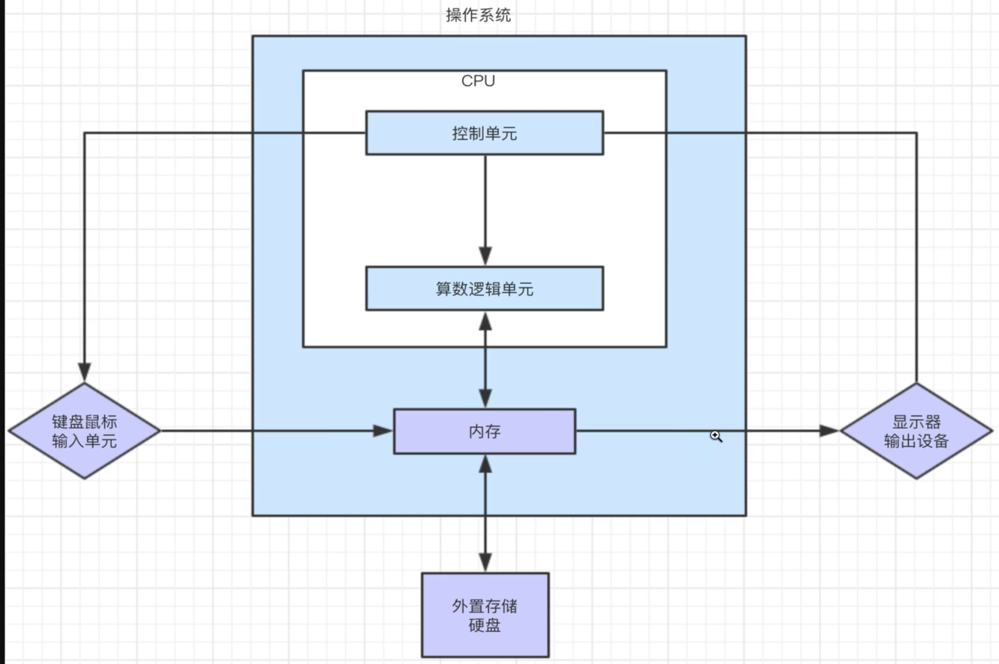
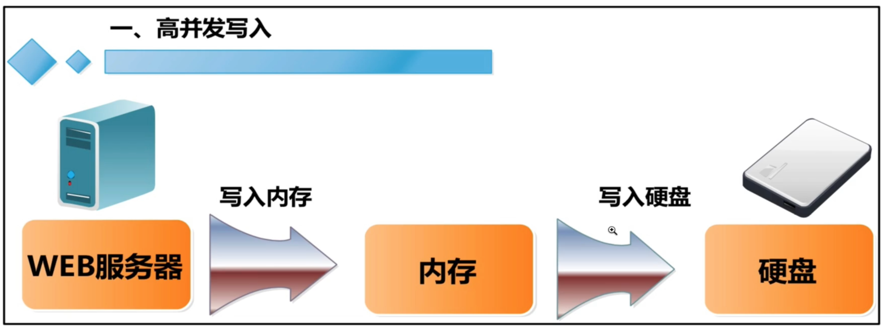
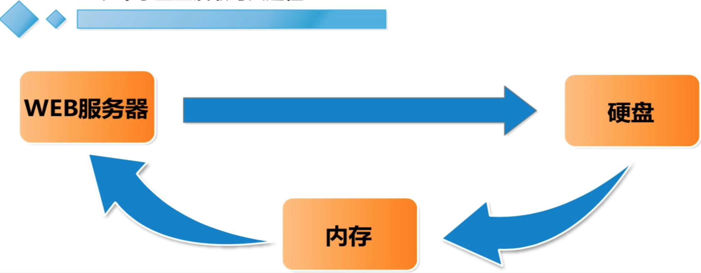
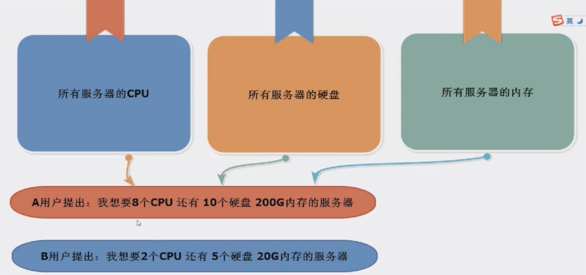

# 1.计算机基础

## 1.1.计算机硬件

CPU  相当于人类的大脑， 进行逻辑运算，调度其他设备工作

内存条  人体临时记忆， 计算机把数据加载到内存中，然后和 CPU 调度工作，把计算机的磁盘数据，临时放在了内存中去处理

显卡 相当于人的眼睛，将各种影像呈现出来（处理图形相关的工作），但是是由 cpu 导出来的

硬盘  人的永久记忆

主板  人体的骨骼，主板将人体的硬件集中到一起工作

计算机最重要的是cpu 和 内存, cpu 处理的数据来自于内存

## 1.2.计算机的存储单位

常用的单位换算

```
Bit 一位
Byte 一字节  1Byte = 8Bits 8位等于一字节
Kilobyte (KB) 一千字节 1KB = 1024byte
Megabyte (MB) 一兆字节 1MB = 1024KB
Gigabyte (GB) 一千兆字节 1GB = 1024MB

1024GB = 1TB
```

## 1.3.CPU介绍

服务器的CPU一般在2-4颗，单颗的CPU是4核，服务器的内存总量一般在 16G-256G 左右

一般用作虚拟化的服务器配置会更高一些，CPU一个在 4-8 颗， 内存总量一般在 48G-128G左右



## 1.4.内存相关

内存是计算机中最重要的核心部件之一，它可以理解为计算机处理的一个中间件，内存解决的是 CPU 和 磁盘之间速度不平等，因为 CPU 的处理是在太快了，磁盘的速度太慢，内存是 CPU 和硬盘数据中间的一个交互桥梁

默认情况下，CPU都是从内存中读写数据，内存从硬盘中获取数据

内存的加速，多通道设计

### 1.4.1.内存的发展

DDR DDR2 DDR3 DDR4

如果内存升级，需要关注下内存的版本号

## 1.5.程序、进程、守护三个名词的解释

程序： js 开发语言，编程语言编写的代码文件，存在在磁盘一些静态数据，代码文件在运行后，就是一个程序了，比如 QQ

进程： 已经执行的程序，已经加载在内存中，这就被称之为进程的概念，qq已经在电脑上运行了，运行了一个 qq 的进程

守护进程： daemon 伴随着主进程挂掉而挂掉

## 1.6.利用内存提升访问效率

高并发场景下，内存的搭配优化

网站进入流量，写入的数据，优先加载到内存中，利用内存高速的读写特性，然后当数据打到一定的数量后，一次性写到磁盘中

优点： 数据优先写入到内存，适合高并发，高性能的网站应用，微博，秒杀活动

缺点： 当特殊情况下，断电、程序崩溃，如果数据没有来得及写入到磁盘，内存数据会丢失

解决方式: 使用 UPS 不间断电源，防止断电






## 1.7.服务器

服务器就是一台计算机而已，他的 CPU、 内存、主板、磁盘、网卡等硬件设备，性能更高，安全性更高，更稳定

服务器通常指的是，在计算机网络中，一个管理资源且能为用户提供服务的计算机

### 1.7.1.分类

* 文件服务器

图片， 网页文件， 视屏文件的展示 

* 数据库服务器

提供数据读写的机器

* 应用程序服务器

开发应用程序的运行机器

## 1.8.云服务器




