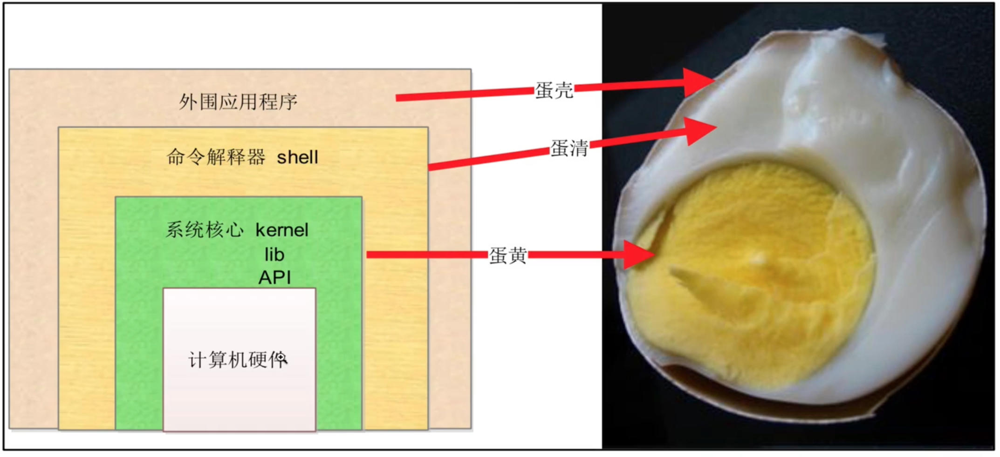
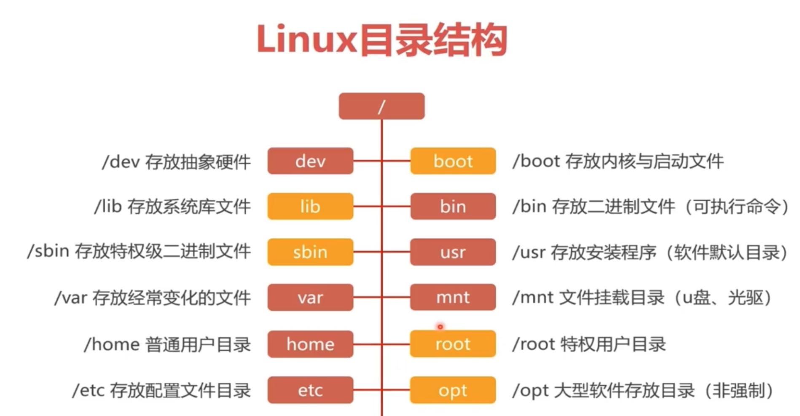

# 2.linux的入门学习

## 2.1.操作系统(operating system 简称 os)

就是人与计算机硬件交互的中介。发送指令给操作系统，操作系统进行翻译，告诉机器硬件，人的指令要干啥

在电脑上输入 ls cd 等指令 - 这些指令计算机是不认识的，所以需要翻译就是 shell bash

用户输入linux的指令， 发送给翻译官(shell bash), 翻译官 shell 壳把用户输入的 ls 翻译成机器码，计算机硬件识别机器码，执行动作，输入结果在屏幕上给用户看见结果



* 目前最常见的计算机系统

Window Linux DOS Unix(? linux 的上一代系统)

## 2.2.linux介绍

他是一套开发源代码（在互联网上可以找到 linux 系统的源代码，c语言写的软件）, 可以自由传播（系统免费使用）支持多用户同时操作系统，多任务(同时运行多个程序)，支持多 CPU，多线程的操作系统

* linux特点

1. 开放源代码的程序软件，可以自由修改，且传播
2. Unix 系统兼容，linux 有其所有的优点
3. linux 几乎没有商业化的版权限制，Unix 系统使用收费，且商业化严重
4. linux 移植性很高，适用于各种架构的计算机，个人 PC、 服务器、树莓派、嵌入式等环境

## 2.2.1.linux的发行版

* redhat 红帽操作系统，redhat 提供收费的技术支持，提供了证书资格认证 RHCSA RHCE RHCA
* centos 系统，基于 红帽子 系统的分支，提供一模一样的系统使用命令接口
* ubuntu 桌面 lunux， 物联网嵌入式领域也很优秀
* suse 系统，在数据领域做的很好

## 2.3.vmware 虚拟机

需要回头再看

## 2.4.linux 远程连接

* xshell 连接

1. 确保 linux 机器正确配置 ip 

通过 ip addr show 查看 linux 的网络 ip 信息

2. 使用 xshell 连接

* ssh 连接

```
# ssh 是 linux 远程登录的命令
# root 用户
# ssh 登录用户名@主机ip地址
ssh root@192.168.**.**
```

## 2.5.linux 命令行

命令 | 空格 | 参数(可写可不写) | 空格 | 文件/文件夹(可写可不写)
--- | --- | --- | --- | ---
ls 列出文件夹中所有文件 | | | | /opt 根目录下的opt文件夹
ls 列出文件夹中所有文件 | | -a - all显示所有文件 | | /opt 根目录下的opt文件夹

```
whoami 我是谁 显示当前登录用户
hostname 显示当前机器的主机名
pwd 显示当前工作目录绝对路径
```

```
[root@VM-0-4-centos ~]# whoami
root
[root@VM-0-4-centos ~]# hostname
VM-0-4-centos
[root@VM-0-4-centos ~]# pwd
/root
[root@VM-0-4-centos ~]# 
```

## 2.6.目录

window 路径分隔符是 \ (反斜杠)
linux 路径分隔符是 /

### 2.6.1.linux目录结构

```
/dev 插硬盘之类的
/home /home/zs 普通用于
/root root是老板 /root 是老板的办公室
/bin binary 二进制的缩写含义，只要发现目录中有 bin 相关的字，说明这个文件存放可执行文件
```



* /etc 初始化系统重要文件

1. /etc/sysconfig/network-scripts/ifcfg-eth0: 网卡配置文件

2. /etc/resolv.conf: Linux 系统 DNS 客户端配置文件

3. /etc/hostname (CentOS7) /etc/sysconfig/network(CentOS6): 主机名配置文件 VM-0-4-centos

4. /etc/hosts: 系统本地的 DNS 解析文件

5. /etc/fstab : 配置开机设备自动挂载的文件

6. /etc/inittab: 系统启动设定运行级别等配置的文件

7. /etc/profile 及 /etc/bashrc: 配置系统的环境变量／别名等的文件

8. /etc/profile.d: 用户登录后执行的脚本所在的目录

9. /etc/issue 和 etc/issue.net: 配置在用户登录终端前显示信息的文件

10. /etc/init.d: 软件启动程序所在的目录（ centos 6)

11. /usr/lib/systemd/system: 软件启动程序所在的目录（ centos 7)

12. /etc/motd: 配置用户登录系统之后显示提示内容的文件

13. /etc/redhat-release: 声明 RedHat 版本号和名称信息的文件

14. /etc/sysctl.conf: Linux 内核参数设置文件

15. /etc/rc.local: 存放开机自启动程序命令的文件

16. /etc/os-release: 版本信息
```
[root@VM-0-4-centos etc]# cat os-release 
NAME="CentOS Linux"
VERSION="7 (Core)"
ID="centos"
ID_LIKE="rhel fedora"
VERSION_ID="7"
PRETTY_NAME="CentOS Linux 7 (Core)"
ANSI_COLOR="0;31"
CPE_NAME="cpe:/o:centos:centos:7"
HOME_URL="https://www.centos.org/"
BUG_REPORT_URL="https://bugs.centos.org/"

CENTOS_MANTISBT_PROJECT="CentOS-7"
CENTOS_MANTISBT_PROJECT_VERSION="7"
REDHAT_SUPPORT_PRODUCT="centos"
REDHAT_SUPPORT_PRODUCT_VERSION="7"
```

* /proc

1. /proc/cpuinfo 
存放处理器( cpu )的信息，如 cpu 的类型、制造商、型号和性能等。 

2. /proc/loadavg 

系统负载信息，uptime 的结果

3. /proc/meminfo 

各种存储器使用信息，包括物理内存和交换分区( swap )。

4. /proc/mounts 

已加载文件系统列表。

5. /proc/uptime 
系统启动的时间长度


* /var 目录

/var 包含系统一般运行时要改变的数据。通常这些数据所在的目录的大小是要经常变化或扩充的。原来 /var目录中有些内容是在 /usr 中的，但为了保持 /usr 目录的相对稳定，就把那些需要经常改变的目录放到 /var 中了。每个系统是特定的，即不通过网络与其他计算机共享。 

下面列出一些重要的目录(一些不太重要的目录省略了)。 

1. /var/catman 

包括了格式化过的帮助(man)页。帮助页的源文件一般存在 /usr/man/man 中；有些 man 页 
可能有预格式化的版本，存在 /usr/man/cat 中。而其他的 man 页在第一次看时都需要格式化， 
格式化完的版本存在/var/man 中，这样其他人再看相同的页时就无须等待格式化了。 

(/var/catman 经常被清除，就像清除临时目录一样。) 

2. /var/lib 

存放系统正常运行时要改变的文件。 

3. /var/local 

存放/usr/local 中安装的程序的可变数据(即系统管理员安装的程序)。注意，如果必要， 即使本地安装的程序也会使用其他/var 目录，例如/var/lock 。 

4. /var/lock 

锁定文件。许多程序遵循在/var/lock 中产生一个锁定文件的约定，以用来支持他们正在 
使用某个特定的设备或文件。其他程序注意到这个锁定文件时，就不会再使用这个设备或文 
件。 

5. /var/log 

各种程序的日志(log)文件，尤其是login (/var/log/wtmp log纪录所有到系统的登录和注销) 和 syslog (/var/log/messages 纪录存储所有核心和系统程序信息)。/var/log 里的文件经常不确定地增长，应该定期清除。 

* /var/log/message 系统级别日志文件
* /var/log/secure 用户登录信息日志文件
* /var/log/secure 用户登录信息日志文件
* /var/log/dmesg 记录硬件信息加载情况的日志文件

6. /var/run 

保存在下一次系统引导前有效的关于系统的信息文件。例如， /var/run/utmp 包含当前登 
录的用户的信息。

7. /var/spool 

放置“假脱机( spool )”程序的目录，如m ail、news、打印队列和其他队列工作的目录。每个不同的 spool 在 /var/spool 下有自己的子目录，例如，用户的邮箱就存放在/var/spool/mail 中。 

8. /var/tmp 

比/tmp 允许更大的或需要存在较长时间的临时文件。 注意系统管理员可能不允许 /var/tmp 有很旧的文件。 
