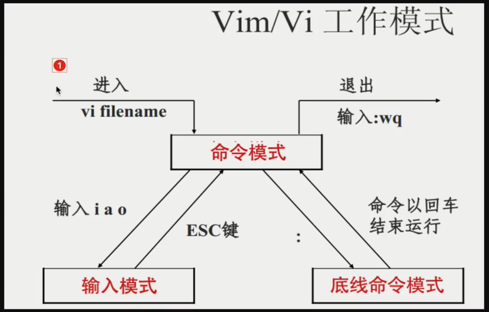

# 3.linux命令

> linux 命令可以简写

```bash
ls -l -h
# 简写
ls -lh
ls -hl
```

## 3.1.cd

change directory 的缩写: 更改目录的意思

```
cd 可选参数 文件夹
```

```
# 几个特殊的目录
.  当前目录
..  上一级目录
-  上一次工作目录
~  当前系统登录的用户目录
```

## 3.2.ls

list 缩写: 列出文件夹中内容

```
ls 可选参数 文件夹

# 可选参数
-a 显示所有文件
-l 详细显示文件夹中内容
-h 以人类可阅读方式输出文件大小
--full-time 已完整的时间格式输出
-t 根据最后修改的时间排序文件
-F 在不同的文件结尾，输出不同的特殊符号
    以 / 结尾就是文件夹
    以 * 结尾就是可执行文件
    以 @ 结果就是软连接，快捷方式
    普通文件结尾什么都没有
-d 显示文件夹本身信息，不输出其中内容
-r 逆转排序 (reverse)
-S 根据文件大写进行排序 （大写的S）默认是从大到小
-i 显示文件inode信息（文件的身份证号，存储文件的元信息，文件大小，位置，权限等）
```

## 3.3.pwd

print work directory 打印工作目录, 输出当前所处的一个绝对路径

## 3.4.su

切换用户

```
su - 用户名  # 完全的环境变量切换用户
```

## 3.5.mkdir

make directory 创建文件夹

```
mkdir 文件夹名称

mkdir {zs,ls,ww} # 会同时创建 zs ls ww 这三个文件夹
mkdir -p ./zs/zschild/zschildchild/ 
mkdir chaoge{1..100} # 创建 chaoge1,chaoge2...chaoge100 这100个文件夹

# 参数
-p 递归创建文件夹
```

## 3.6.touch

* 创建普通文件
* 修改文件时间

```
touch [选项] 文件名

touch 1.txt 2.js 3.css
touch chaoge{1..100} # 创建 chaoge1,chaoge2...chaoge100 这100个文件
touch chaoge{a..z} # 创建 chaogea,chaogeb...chaogez 多个文件

# 参数 
-t 修改时间
    touch 1.txt 文件时间就会变
    touch -t 10240606 1.txt # 10月26号6点6分
```

## 3.7.cp

> 默认系统做了 alias 别名功能，让我们输入 cp 时候，其实是 cp -i

```
cp [选项] 源文件 目录

# 参数
-r 递推式复制目录，即复制目录下所有层级的子目录及文件。 
-p 复制的时候，保持属性不变 （ ls 时看到的属性 ）
-d 拷贝软连接时候，保持连接属性不变
-i 覆盖前提示

# 案例
# 复制普通文件
cp 1.txt ./oldbody/
# 复制普通文件且改名
cp 1.txt ./oldbody/1.1.txt
# 一次性复制多个文件
cp 1.txt 2.txt ./oldbody/
# 复制整个文件夹
cp -r mjj mjj2
# -p
cp -p 1.txt 2.txt
```

## 3.8.mv

> 默认系统做了 alias 别名功能，让我们输入 mv 时候，其实是 mv -i

```
mv 源文件 目标文件

mv luffy* ./oldbody  将 luffy 为前缀的文件都复制到 oldbody 文件夹下

mv 1.txt 2.txt.txt  重命名用法

-i 覆盖询问
```

## 3.9.rm

> 默认系统做了 alias 别名功能，让我们输入 rm 时候，其实是 rm -i

```
rm [选项] 文件名

#选项
-i 询问是否删除
-f --force 强制删除，忽略不存在文件，不提示确认
-I 删除超过3个文件或者递归删除前要求确认
-d --dir 删除空目录
-r -R --recursive 递归删除目录及其内容
-v --verbose 详细显示进行的步骤


rm 1.txt 删除会提示，删除文件
rm 1.txt 2.txt 一次性删除多个文件
rm -r mjj 删除mjj文件夹及其中的内容
rm -f mjj* 强制删除 mjj 开头的文件，文件夹无法删除
rm -f -r mjj* 强制删除 mjj 开头的文件和文件夹，以及文件夹的内容
rm -f -r ./* 强制删除当前目录所有内容 
rm -rfv ./* 强制删除当前目录所有内容, 并显示过程
```

## 3.10.linux帮助命令

### 3.10.1.man

```
man 命令

man rm 

回车往下看
```

### 3.10.2.--help

```
命令 --help
```

### 3.10.3.info

```
info 命令

info rm 
```

## 3.11.linux开关机 - shutdown

重启或关机

* 重启

```
shutdown -r参数 -r --reboot 

shutdown -r 10  # 十分钟后重启
shutdown -r 0  # 立即重启
shutdown -r now  # 立即重启
```

* 关机

```
shutdown -h --halt 停止的含义 

shutdown -h 10  # 十分钟后停止
shutdown -h 0  # 立即停止
shutdown -h now  # 立即停止
```

halt poweroff reboot 命令关机与重启

```
reboot  重启
poweroff
reboot  关节
```


## 3.12.linux命令行常用快捷键

```
ctrl + c  cancel取消当前操作
ctrl + l  清空屏幕内容
ctrl + d  退出当前用户
ctrl + a  光标移到首行
ctrl + e  光标移到行尾
ctrl + u  删除光标到首行的内容
```

## 3.13.linux环境变量

windows 下的环境变量（PATH）， 系统会按照 PATH 的设定， 去定义每个 PATH 定义的目录下搜索可执行文件

PATH 是由一堆目录组成， linux : 分割， window ; 分割

查看 linux  下的 PATH 环境变量

```
echo $PATH
```

## 3.14.vi/vim

vi/vim 分为三种模式， 分别是命令模式(Command mode), 输入模式 (insert mode) 和底线命令模式 (Last line mode) 

### 3.14.1.作用

* 命令模式： 进入 vim 的默认模式
* 编辑模式： 按 i 进入，aio 也可以进入
* 底线模式： 按 : 之后进入的模式



### 3.14.2.安装 vim

> 当 vim 打开不存在文件时，默认会创建文件

```
yum install vim -y # 通过yum软件管理工具下载 vim， -y 是默认是 yes
```

```
输入o， 在光标的下一行进行编辑
wq! 强制写入文件并推出
q! 不保存退出
```

### 3.14.3.vim快捷键

* vim提供的上下左右

```
h 向左
l 向右
j 向下
k 向上
```

* 移动光标的快捷键

```
w 移动到下一个单词
b 移动到上一个单词

数字0 移动到行首
数字$ 移动到行尾

g 移动到文章的开头
G 移动到文章的结尾

H 移动到屏幕的开头
L 移动到屏幕的结尾
M 移动到屏幕的中间
```

* 命令模式的查找

```
向下查找  /你要找的内容    按下 n 跳到下一个单词
  /echo 查找echo

向上查找  ?你要找的内容    按下 n 跳到下一个单词
  ?echo 查找echo
```

* 命令模式下的删除，复制，粘贴

```
yy  复制光标所在行
4yy  复制光标所在行及以下4行
p   打印粘贴的内容

dd  删除光标所在行
D   删除光标当前位置到结尾的内容
x   删除光标当前字节， 向后删除
X   删除光标当前字节， 向前删除

u   撤销上一步操作
```

* 快捷操作

```
C 删除光标所在位置，到行尾的内容，且进入编辑模式
o 当前光标的下一行开始编辑
O 当前光标的上一行开始编辑
A 快速进入光标的行尾开始编辑
ZZ 快速的保存并退出
```

* 快捷批量操作

```
# 删除多行
1. 输入 ctrl + v 进入可视块模式
2. 用上下左右命令，选择你要操作的块
3. 选中块后，输入d 删除块内容

# 快捷插入多行
1. 输入 ctrl + v 进入可视块模式
2. 用上下左右命令，选择你要操作的块
3. 选中块后，输入I 
4. 按下 esc 两次，会自动生成多行代码
```

### 3.14.4.vim交换文件的解决办法

多个用户要同时操作一个文件，或者上次操作文件不保存退出了

目录中会存在一个 .swp 的隐藏文件，将之前内容恢复，删除隐藏文件就好

## 3.15.重定向符号

重定向的意思是将数据传到其它地方

符号 | 解释
--- | ---
> | 输入覆盖重定向
>> | 输入追加重定向
<或<< | 标准输入重定向

### 3.15.1.重定向案例

```
cat 1.txt  > ./2.txt # 覆盖原文件内容
cat 1.txt  >> ./2.txt # 追加原文件内容末尾
cat <  1.txt 重定向写入 把 1.txt 内容给 cat
xargs -n 3 < 1.txt # 把文本拆多行输出

cat >> gushi.txt <<EOF ???
```

```
[root@VM-0-4-centos test_scripts]# xargs -n 3 < 1.sh 
1 2 3
4 5 6
7 8 9
```


## 3.16.cat (concatenate)

用于查看纯文本文件(常用于内容较少)。可以连接多个文件打印到屏幕，或重定向到文件中

```
cat [参数] 文件路径|文件名

# 参数
-n  显示每一行的行号
```

### 3.16.1.cat功能

功能 | 说明
--- | ---
查看文件内容 | cat file.txt
多个文件合并写入到新的文件中 | cat file.txt file1.txt > file2.txt
非交互式编辑或追加内容 | cat >> file.txt <<EOF \n hello world \n EOF
清空文件内容 | cat /dev/null > file.txt (/dev/null 是linux系统的黑洞文件)


* 参数

```bash
# 对非空行显示行号
cat -b 1.txt

# 对所有行显示行号
cat -n 1.txt

# 在每行末尾显示 $ 符号
cat -n -E 1.txt

# 减少空格行，多个空格行减为一个
cat -s 1.txt
```

* cat 合并合并多个文件

```bash
# 读 这两个文件的内容
cat file.txt file1.txt

cat file.txt file1.txt > file2.txt
```


* cat 非交互式写入文件内容信息

```
[root@VM-0-4-centos test_scripts]# cat >>  1.txt <<EOF
> 床前明月光
> 疑是地上霜
> EOF
[root@VM-0-4-centos test_scripts]# cat 1.txt
床前明月光
疑是地上霜
```

* 清空文件

```
1. 清空文件但是留下一个空格
echo > 1.txt

2. 直接清空文件
> 1.txt

3. 利用 cat 读黑洞文件，然后清空其他文本
cat /dev/null > 1.txt
```

## 3.17.tac 

和 cat 一样，显示内容倒转

## 3.18.管道符


### 3.18.1.管道符用法

* 对字符串进行二次过滤

```
# 查看 1.txt 文本， 对内容进行过滤，找出 有 hello 的行
cat 1.txt | grep hello
```

## 3.19.grep

过滤字符串信息命令

## 3.20.more 命令 和 less 命令

分屏查看文本内容的命令

```
more 文件名 # 分屏显示文件内容

按下 enter 回车是下一行
空格是向下滚动一个屏大小
=显示当前行号
按下q是退出more
```


## 3.21.head 命令 和 tail 命令

* head 

用于查看文件开头 n 行

```
head -n 文件名

head 文件名 # 默认显示10行

head -c 文件名

-c 指定字符数量，显示字符数
```

* tail 

用于查看文件末尾 n 行

```
tail -n 文件名

tail 文件名 # 默认显示10行

tail -f 文件名

-f 实时刷新文件内容
-F 可以监听不存在的文件，当文件被创建和写入时，可以看到变化
```

## 3.22.cut 命令


```bash
cut -c 4 1.txt # 截取 1.txt 每一行第四个字符

cut -c 4-7 1.txt # 截取 1.txt 每一行第 4-7 的字符

cut -c 4,6 1.txt # 截取 1.txt 每一行第 4 和 6 的字符

cut -c -6 1.txt # 截取 1.txt 每一行 从头到 6 的字符

cut -c 6- 1.txt # 截取 1.txt 每一行 从 6 到 最后 的字符

# 指定分割符号进行截取
cut -d ":" -f 截取范围 1.txt

# 指定分割符号进行截取, 找到第三个区域的内容
cut -d ":" -f 3 1.txt

# 指定分割符号进行截取, 从开头到第三个区域的内容
cut -d ":" -f -3 1.txt
# 指定分割符号进行截取, 从开头到第三个区域的内容给到管道符，取出前五行
cut -d ":" -f -3 1.txt | head 5 

```

```
[root@VM-0-4-centos test_scripts]# cat 1.txt 
床前明月光
疑是地上霜
 
举头望明月 


 低头思故乡
[root@VM-0-4-centos test_scripts]# cut -c 4 1.txt
月
上

明


思
[root@VM-0-4-centos test_scripts]# cut -c 4-5 1.txt
月光
上霜

明月


思故
[root@VM-0-4-centos test_scripts]# 
```

```

[root@VM-0-4-centos test_scripts]# cut -d ":" -f 1 1.txt
床前
疑是
 
举头


低头
[root@VM-0-4-centos test_scripts]# cut -d ":" -f 2 1.txt
明月光
地上霜
 
望明月 


思故乡
[root@VM-0-4-centos test_scripts]# 
```

## 3.23.sort

将输入的文件的内容按照规则排序，然后输出结果


```
1. 对文件第一个子节进行排序，默认从小到大
sort -n 1.txt

2. 对排序结果进行反转 -r
sort -n -r 1.txt

3. 对排序结果去重 -u
sort -u 1.txt

4. 指定分割符，指定区域进行排序
sort -n  -t "." -k 4 ip.txt # 把 ip 分割进行排序，从小到大排序
```

* 可以把读取的内容通过管道符交给 sort
```
[root@VM-0-4-centos test_scripts]# echo -e  "3 \n  5 \n 1 \n 5 \n 8" |   sort -n
 1 
3 
  5 
 5 
 8
[root@VM-0-4-centos test_scripts]# 
[root@VM-0-4-centos test_scripts]# cat 1.txt | sort -n


 
1举头:望明月 
2床前:明月光
3低头:思故乡
4疑是:地上霜
```

## 3.24.uniq

uniq 命令可以输出或者忽略文件中重复行，常与sort排序结合使用


```
1. 去除连续重复行
uniq 1.txt

2. 与sort结合使用， 去重更精准
sort -n 1.txt | uniq

3. -c 统计每一行的重复次数，次数显示在 开头
sort -n 1.txt | uniq -c

4. -d 只输出重复的行
sort -n 1.txt | uniq -d -c

4. -u 只输出不重复的行
sort -n 1.txt | uniq -u -c
```

## 3.24.wc

用于统计文件的行数、单词、字节数


```
1. 统计文件行数
wc -l 1.txt

2. 统计单词的数量
echo "zs ls ww " | wc -w

3. -m 统计字符数量
[root@VM-0-4-centos test_scripts]# echo "123456" |wc -m
7
为什么是 7 个字符，因为字符串结尾有一个$, echo "123456" | cat -E 进行验证猜想


4. -L 输出最长的字符数
cat 1.txt | wc -L

5. 统计登录人数
who | wc -l
```

## 3.24.tr

从标准输入中替换，缩减或删除字符，将结果写入到标准输出


```
1. 替换标准输入的大小写
echo "my name is zs" | tr '[a-z]' '[A-Z]'

2. 使用 -d 删除参数
[root@VM-0-4-centos ~]#  echo "my name is zs and i am 18 years old" | tr -d "a"
my nme is zs nd i m 18 yers old
[root@VM-0-4-centos ~]#  echo "my name is zs and i am 18 years old" | tr -d "0-9"
my name is zs and i am  years old
[root@VM-0-4-centos ~]# 

3. 把文件作为标注输入进行替换
[root@VM-0-4-centos ~]# tr 'a' "A" < alex.txt 
my nAme is Alex.
i like leArning linux.
[root@VM-0-4-centos ~]# cat alex.txt 
my name is alex.
i like learning linux.

4. -s 删除连续字符
[root@VM-0-4-centos ~]# echo '111122223333444 555' | tr -s '12345'
1234 5
```

## 3.25.who 和 w

显示当前登录用户

## 3.26.stat

显示文件的状态信息。stat命令的输出信息比ls命令的输出信息更详细

```
stat [选项] [参数]
```


## 3.26.find

用来指定目录下查找文件。任何位于参数之前的字符串都被视为欲查找的目录名

如果使用该命令时不设置任何参数，则 find 命令将在当前目录下查找子目录与文件，并且将查找到的子目录和文件全部进行显示

```
# maxdepth 层级
[root@VM-0-4-centos ~]# find /shell_program/test_scripts/ -maxdepth 1 -name "*.txt"
/shell_program/test_scripts/messages.txt
/shell_program/test_scripts/jen_message.txt
/shell_program/test_scripts/1.txt
[root@VM-0-4-centos ~]# 

# -name 名字开头是数字的文件
[root@VM-0-4-centos ~]# find /shell_program/test_scripts/  -name   "[0-9]*"
/shell_program/test_scripts/1.sh
/shell_program/test_scripts/1.txt

# -type 限制文件类型
[root@VM-0-4-centos ~]# find /shell_program/test_scripts/ -type f  -name   "[0-9]*"

# -delete 删除符合的文件
[root@VM-0-4-centos ~]# find /shell_program/test_scripts/ -type f  -name   "[0-9]*" -delete

# 找到两天以内被访问的文件
[root@VM-0-4-centos test_scripts]# find . -atime -2
.
./check_jen.sh
./1.txt
./compare_1

# 找除了文件夹之外的类型
[root@VM-0-4-centos test_scripts]# find . -maxdepth 1 ! -type d

# 根据文件大小进行搜索
find . -type f -size +200M

# 排除目录进行搜索
find . -path "./test_find" -prune -o -name "*.txt"-print

# -ok  询问
[root@VM-0-4-centos test_scripts]# find . -type f -name "*.txt" -ok rm {} \;
< rm ... ./messages.txt > ? n
< rm ... ./jen_message.txt > ? n
< rm ... ./1.txt > ? n
```

## 3.27.xargs

又称管道命令，构造参数等

是给命令传递参数的一个过滤器， 也是组合多个命令的一个工具它把一个数据分割为一些足够小的块，以方便过滤器和命令进行处理

简单就是说，把其他命令给它的数据，传递给它后面的命令作为参数


```
[root@VM-0-4-centos test_scripts]# cat 1.sh 
1 2
3 4
5 6
7 8
9

# 从定向
[root@VM-0-4-centos test_scripts]# xargs < 1.sh 
1 2 3 4 5 6 7 8 9

# -n 限制输出个数
[root@VM-0-4-centos test_scripts]# xargs -n 4 < 1.sh 
1 2 3 4
5 6 7 8
9

# -d 指定分隔符号
[root@VM-0-4-centos test_scripts]# echo "zs,ls,ww" | xargs -d ","
zs ls ww

# -i {} 替换传输的数据
find . -name "*.js" | xargs -i mv {} alljs/

# -I 用字符串替换数据 
find . -name "*.js" | xargs -I alljs mv alljs ./
```


