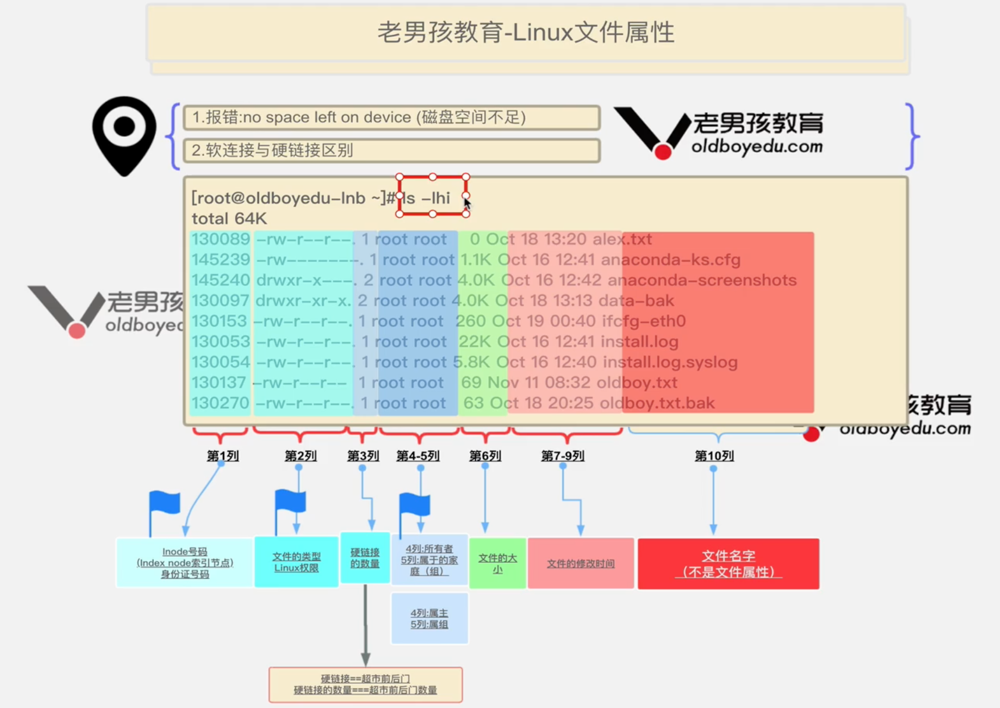
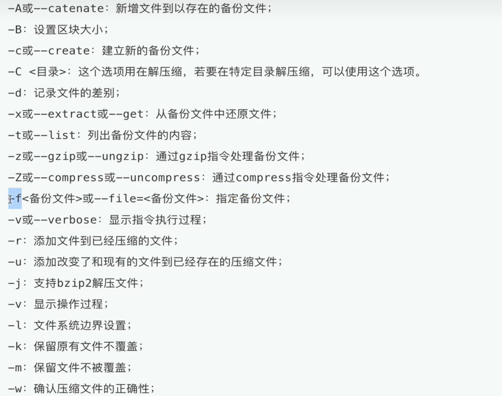
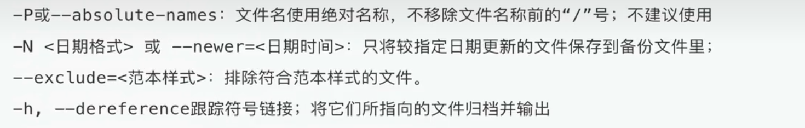
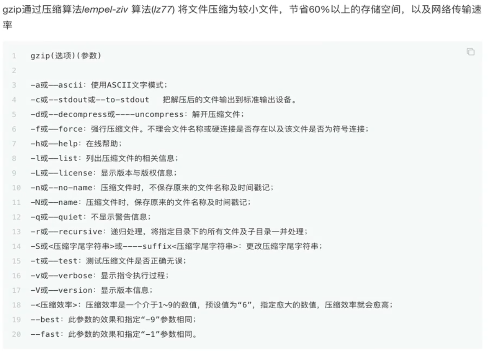

# 4.linux文件属性和管理

文件和目录主要包括
* 索引节点 inode
* 文件类型
* 文件权限
* 硬链接个数
* 归属的用户和用户组
* 最新修改时间

查看命令
```
ls -lhi /opt
```



## 4.1.扩展名

Linux 文件扩展名只是阅读方便，对文件类型不影响

* Linux 通过文件属性区分文件类型

```
.txt 文本类型
.conf .cfg .configure 配置文件
.sh .bash 脚本文件
.py 脚本文件
.rpm 红帽系统二进制软件包名
.tar .gz .zip 压缩后缀
```

## 4.2.文件类型

可以通过 ls -F 给文件结尾加上特殊标识

* ls -l 看第一个字符
格式 | 类型
--- | ---
- | 普通文件 regular file (二进制，图片，日志，txt等)
d | 文件夹 directory
b | 块设备文件 /dev/sda1 硬盘，光驱
c | 设备文件 终端/dev/tty1 网络串口文件
s | 套接字文件，进程间通信(socket)文件
p | 管道文件(pipe)
l | 链接文件，link类型 快捷方式

```
# 建立软连接
ln -s 文件 文件
```

软连接文件存储的是指向那个文件

```
linkread kx.txt # 查看软连接文件
```

## 4.3.file

查看文件类型

```
file 文件名
```

## 4.4.which

查看命令位置

## 4.5.whereis

查看命令信息

```
[root@VM-0-4-centos ~]# whereis ls
ls: /usr/bin/ls /usr/share/man/man1/ls.1.gz
```

## 4.6.tar

在 linux 中， 可以实现多个文件进行压缩打包解压





```
1. 对当前所有内容进行打包，并显示过程，生成 alltmp.tar 文件 (-v 显示过程)
[root@VM-0-4-centos test_scripts]# tar -cvf alltar.tar ./*
./1.sh
./1.txt
./alljs/
./check_jen.sh
./check_url_func.sh
./compare_1
./free_1.sh
./fun3.sh
./jen_message.txt
./learn_func
./lnmpOrlampInstall.sh
./messages.txt
./my_func.sh
./rsync_cc
./testjs.js

2. 解压 
tar -xvf ../alltar.tar .

3. 打包且压缩 
tar -czvf allfile.tar.gz ./*

4. 解压压缩文件
tar -xzvf allfile.tar.gz ./tarDir/

5. 列出压缩文件中的内容
tar -ztvf allfile.tar.gz 

6. 只解压某个文件
tar -zxvf allfile.tar.gz ./1.sh

7. -C 解压到指定目录
tar -xzvf allfile.tar.gz -C ./tarDir/

8. --exclude 排除某个文件解压
tar -zxvf allfile.tar.gz --exclude 1.sh

9. -t 软连接直接压缩软连接的文件
tar -ztvf kx.tar.gz
```

## 4.7.gzip

> gzip 无法压缩文件夹，必须先tar对文件夹打包后， 才可以 gzip 压缩

```
# 压缩当前文件夹下的 .txt 文件
gzip ./*.txt

# 显示压缩的文件
gzip -l alex.txt.gz
```



## 4.8.zip

是一个应用广泛的跨平台压缩工具， 压缩文件的后缀为 .zip 文件，还可以压缩文件夹


```
# 压缩
zip allfile.zip ./*

# 解压
unzip allfile.zip
```

## 4.9.linux 常识

### 4.9.1.更改主机名

```
hostnamectl set-hostname 新的主机名字

hostnamectl set-hostname bkyyou
```

### 4.9.2.~

代表当前用户家目录

### 4.9.3.身份提示符

```
这个 # 代表超级用户的提示符
[root@bkyyou ~]#

这个 $ 代表普通用户的提示符
[root@bkyyou ~]$
```

### 4.9.4.用户

* 查看用户
```
tail /etc/passwd
```

* 新增用户
```
useadd zs
```

### 4.9.5.树状结构显示目录

```
tree /opt
```


