# 5.用户管理

当你的身份证号为 0 时， linux 系统的超级用户， uid 为 0， 称为 root。

普通用户由 root 创建， uid 号码从 1000 开始

系统中虚拟用户， uid 是 1~999， 直接用

## 5.1.常用的命令解释器

```
/bin/sh 默认
/bin/bash 默认
/sbin/nologin 虚拟用户
/dash ubuntu
csh unix
tsh unix
```

## 5.2.用户的配置文件


```
/etc/passwd  新创建的用户信息，会追加到这个文件结尾
```

* 查看用户

```
tail /etc/passwd

tail -5 /etc/passwd  # 查看后五行
```

## 5.3.创建普通用户

### 5.3.1.创建用户

使用 useradd 创建的账号，实际上是保存在 /etc/passwd 文本文件中

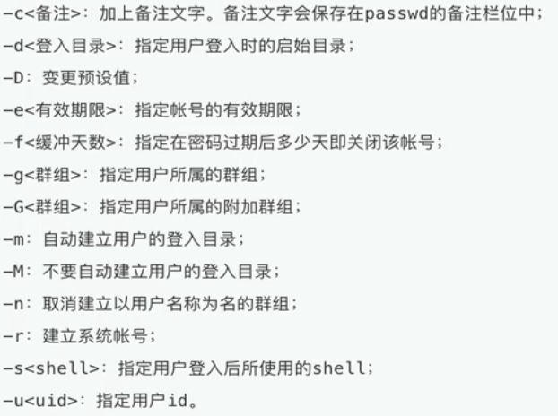

```
# 创建普通用户，创建普通用户的同时，会创建一样的用户组， 生成用户家目录 /home/用户名称
useradd 用户名称  

/etc/shadow  存放用户加密后的密码
/etc/group  存放用户组的信息
用户指定了 /bin/bash 解释器， 代表用户可以登录， 进行命令翻译
/sbin/nologin 不允许登录
```

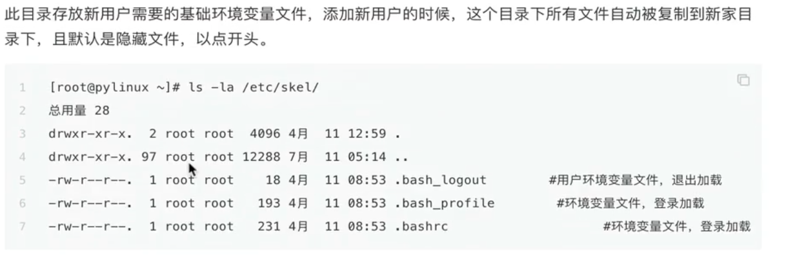

### 5.3.2.更改用户密码

```
passwd 用户名
```

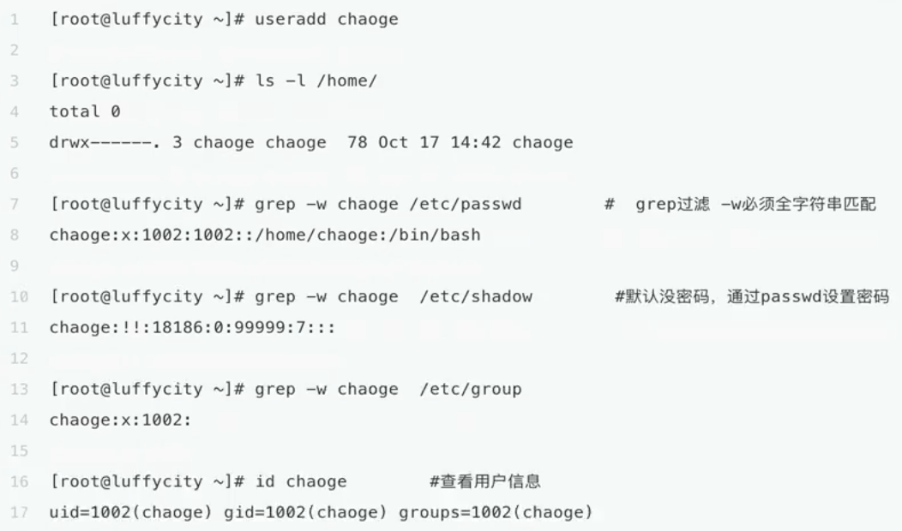


### 5.3.3.用户组

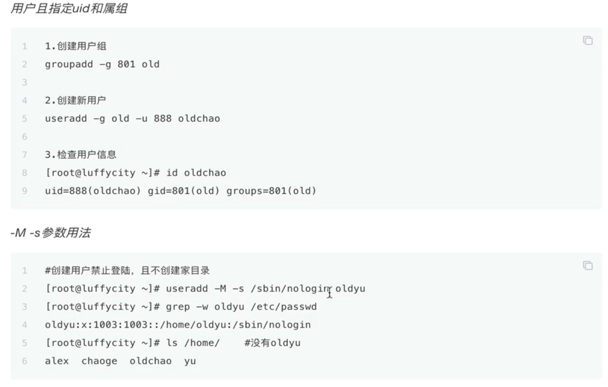


## 5.4.查看目录家文件

```
[root@bkyyou ~]# ls -a  /home/zs/ 
.  ..  .bash_history  .bash_logout  .bash_profile  .bashrc  .cache  .config
[root@bkyyou ~]# 

.bash_profile  # 用户个人的配置文件
```

* 用户目录家不存在解决办法

```
# 假设 zs 用户的 文件夹丢失
cp /etc/skel/.bash* /home/zs/
```

## 5.5.创建用户流程

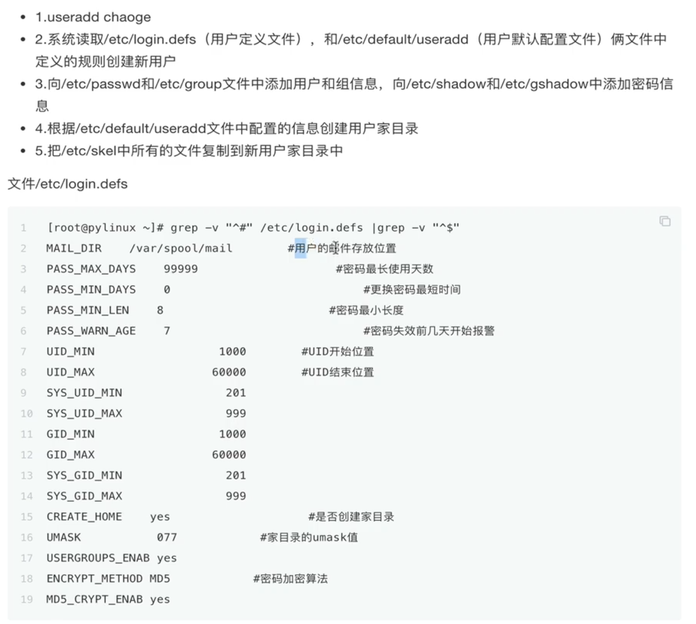

* 文件 /etc/default/useradd

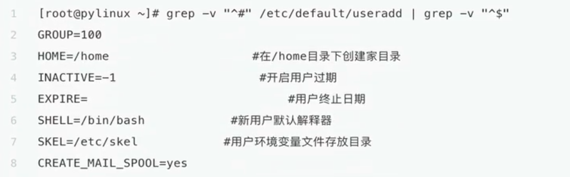

## 5.6.创建用户有关的目录 /etc/skel


## 5.7.usermode 命令

usermode 用于修改已存在的用户信息，只能修改未使用中的用户

```
usermode -u 1500 -s /bin/bash -c changeUser -G old -e "2020/10/10" -f 10 -d /home/luffychao zs
```

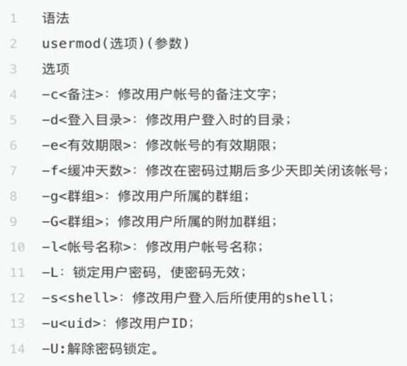

## 5.8.userdel 命令

删除用户与相关文件

> 建议注释 /etc/passwd 用户信息而非直接删除用户

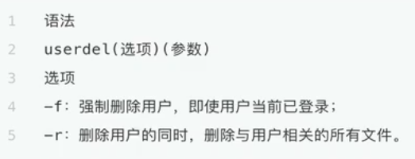

* 案例

```
userdel oldyu  # 保留家目录
userdel -rf oldyu  # 强制删除用户与家目录
```

## 5.9.批量更新密码命令

```
1. 查看当前机器的用户信息
tail passwd

2. 批量修改密码， ctrl + d 结束输入
chpasswd
```

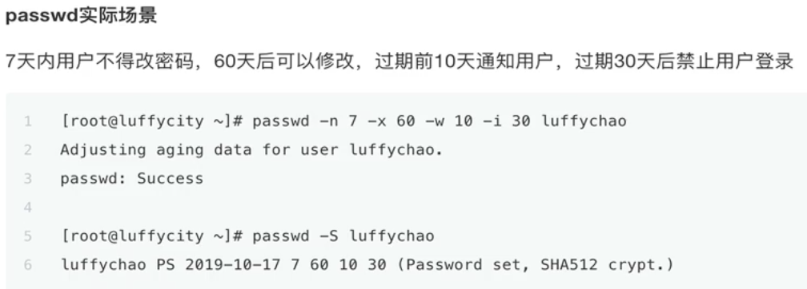

## 5.10.查看登录的基本信息

### 5.10.1.whoami

显示当前登录用户， 我是谁

### 5.10.2.w

显示当前已登录用户

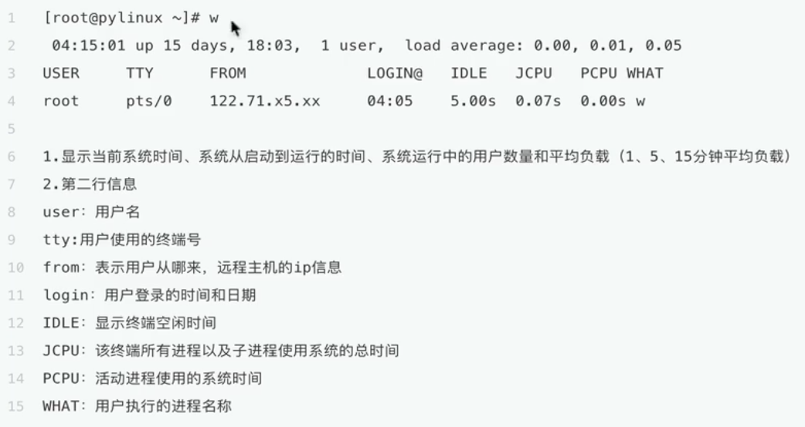

### 5.10.3.last lastout 查看用户详细的登录信息

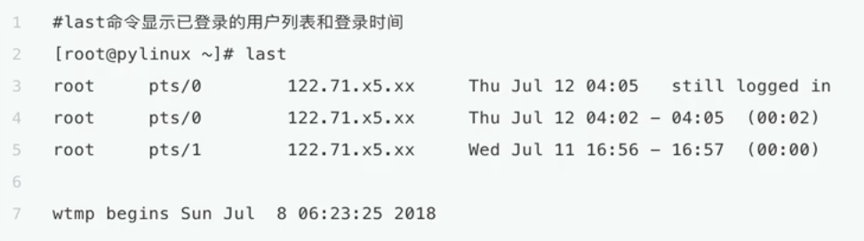

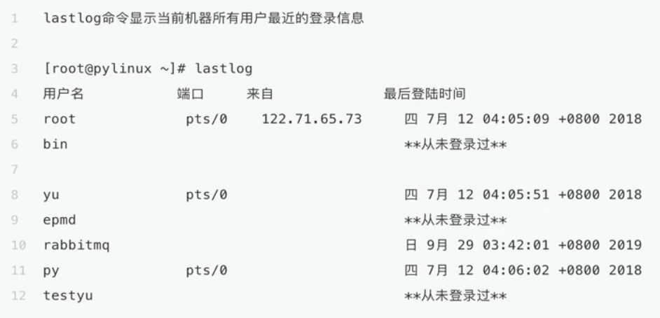

## 5.11.Linux用户身份切换命令-su

> root 用不切换其他用户，无需密码

```
su - 用户名称
```

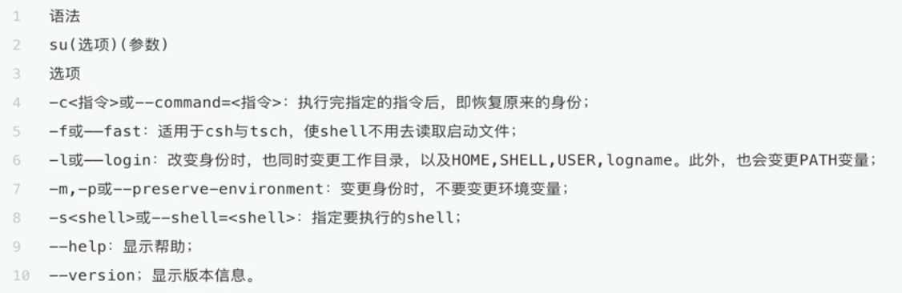

## 5.11.sudo 命令

sudo 命令用来以其他身份来执行命令，预设身份是 root。在 /etc/sudoers 中设置了可执行 sudo 指令的用户

* visudo 命令

修改 /etc/sudoers 文件

操作，复制root这一行一行改一个用户名

```
root	ALL=(ALL) 	ALL
zs	ALL=(ALL) 	ALL
```


