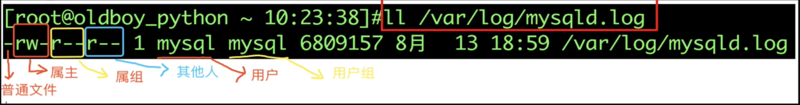
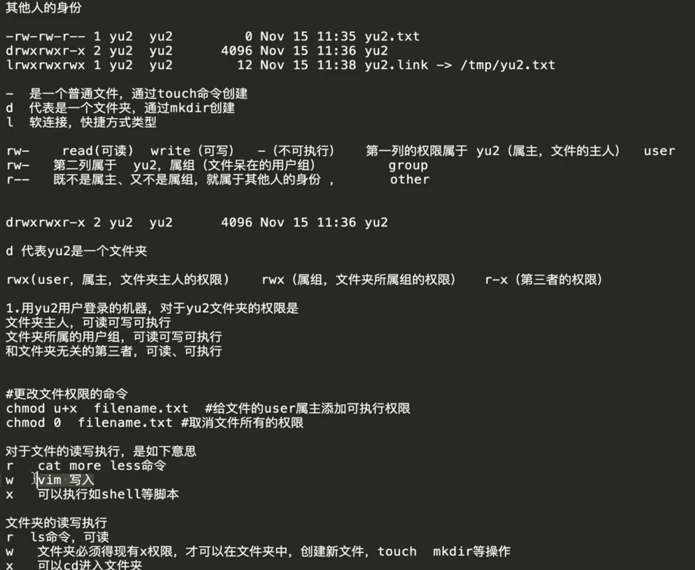
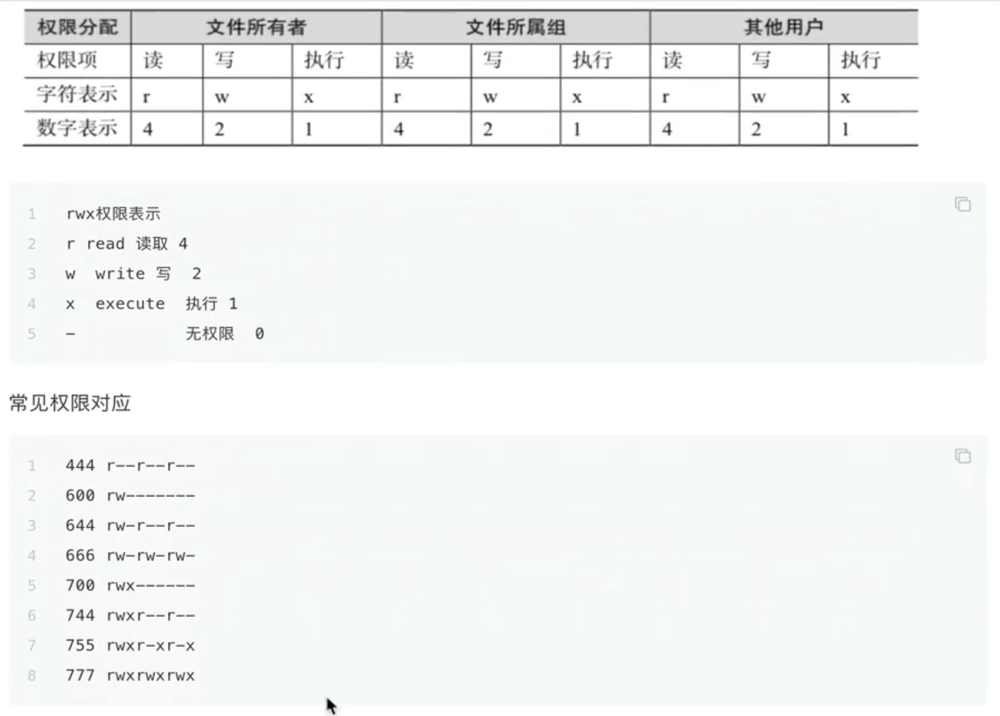
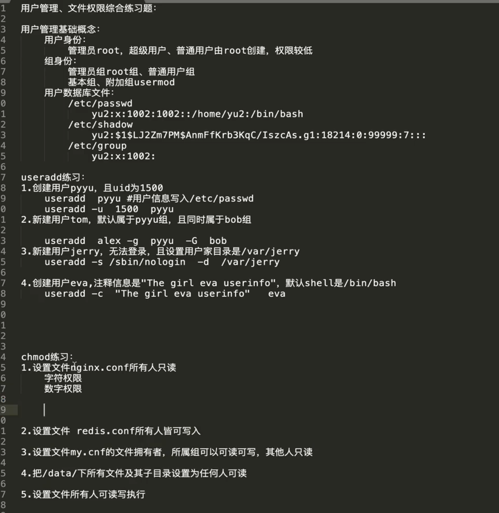
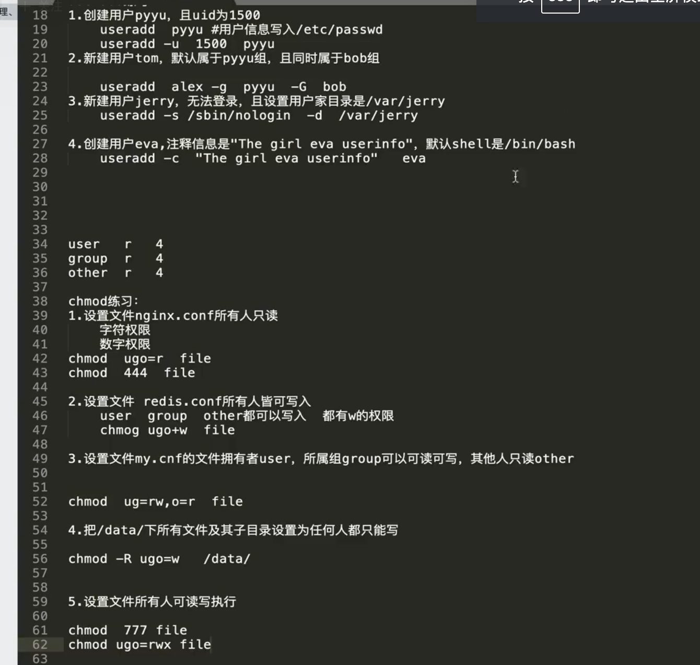

# 6.文件权限

属主， 这个文件属于谁

属组， 这个文件属于哪个组


## 6.1.权限



### 6.1.1.文件类型区分

* 通过开头第一个字母进行区分
```
d 开头是一个文件夹
- 开头是一个文件
l 开头是一个软连接，快捷方式等类型
```

* 创建软连接 ln

```
[root@bkyyou test_scripts]# ln -s 1.sh 1.link
[root@bkyyou test_scripts]# ll
total 68
lrwxrwxrwx 1 root root    4 May 19 17:13 1.link -> 1.sh
-rw-r--r-- 1 root root   18 May 17 15:08 1.sh
-rw-r--r-- 1 root root   77 May 17 11:12 1.txt
drwxr-xr-x 2 root root 4096 May 17 15:20 alljs
```

* 文件权限解读

```
-rw-r--r-- 1 root root   18 May 17 15:08 1.sh

第一个代表文件类型，后边每三个一组
第一组  read 可读  write 可写  - 不可执行, 第一组权限属于 root (属主， 文件的主人)  user
第二组  第二组属于 root ，属组(文件待在用户组)  group
第三组  既不不是属主，又不是属组，就属于其他人   other

drwxr-xr-x 2 root root 4096 May 17 15:20 alljs
d 代表root的一个文件夹
rwx user，属主，代表文件夹主人权限
r-x group, 属组，代表文件夹所属组的权限
r-x 其他人的权限
```

* 文件的读写执行
```
r read 可读 (可以使用 cat、more、less、head、tail等命令查看文件内容)
w write 可写 (可以用 vim， 重定向符号等，向文件写入内容)
x executable 可执行 (文件是可执行的)
- 没有权限
```

* 文件夹的读写执行
```
r read 可读 (ls命令)
x 可以进入的权限 (cd)
w write 可写 (文件夹必须的现有x权限，才能在文件夹中创建文件，touch mkdir 等 操作)
- 没有权限
```



## 6.2.更改文件权限的命令

```
chmod u+w
chmod g+r
chmod u-x
chmod u=wr
```

* 更改属主权限

```
# 给文件 user 属主添加可执行权限
chmod u+x hello.sh

# 取消文件所有权限
chmod 0 hello.sh

# 给文件属主添加可读权限
chmod u+r hello.sh

# 给文件减一个权限
chmod u-r hello.sh
```

* 更改属组权限

```
# 修改文件的属组权限，删除属组可读权限
chmod g-r
```



### 6.2.1.练习文件权限的数字与字母转化

* 权限代表数字
```
r read 4
w write 2
x exec 1
-      0
```

* 最大权限
```
user 最大的权限  rwx 4+2+1=7

r-x 4+0+1=5
-w- 0+2+0=2
```

* 文件权限所属
```
- 普通文件
此时有一个文件权限如下
- rwx(user) -w-(group) --x(other) chao.txt
```

```
# 第一题 修改chao.txt文件权限，属主只能读， 属组和其他人没有权限

# 使用字母需改权限
chmod g+w chao.txt # 给 属组添加可写权限
chmod o=x chao.txt # 给 其他人只设置可执行权限

#使用数字修改权限
chmod 400 chao.txt

# 第二题 chao.txt 权限是，属组只读，属主只写，其他人只读

# 字母修改方式
chmod u=w,g=r,o=r chao.txt

# 数字表示形式
chmod 244 chao.txt

# 第三题， 修改权限为 755， 用字母表示该权限

chmod u=rwx,g=rx,o=rx chao.txt
```

## 6.3.权限范围

```
操作对象
u 文件属主权限
g 同组用户权限
u 其他用户权限
u 所有用户(包括以上三种)
```

```
# 文件属性修改
chmod a=r file.txt # 一次性修改 user group other 权限为 r 只读
# 相当于 444
chmod 444 file.txt
```

## 6.4.chown

修改文件属主，属组信息

* 语法

```
chown zs test.txt  # 文件属于zs
chown :组 test.txt  # 修改文件属组
chown 用户:组 test.txt  # 修改

# 参数
-R --recursive 递归处理所有文件及子目录
-v --berbose 为处理所有信息显示诊断信息
```

* 案例

```
chown zs:zs nginx.conf # 将 nginx.conf 所属用户和组改为 zs
chown -R zs:zs data # 将 data 目录下所有内容属组和属主 改为 zs
chown :zs test.txt # test.txt 的属组改为 zs

chown -R root:root yu2 # 强制抢走 yu2 内容，改为 root 属主，属组
```

## 6.6.setfacl

给用户，用户组添加 rwx 权限

```
# 给 -R 文件夹递归 -m 更改文件访问控制列表 u 代表用户 zs 用户
setfacl -R -m u:zs:rwx shell_program # 给 zs 用户添加 shell_program 这个文件夹 rwx 权限

# 添加之前
[zs@bkyyou /]$ getfacl shell_program/
# file: shell_program/
# owner: root
# group: root
user::rwx
group::r-x
other::r-x

# 添加之后
[root@bkyyou /]# getfacl  shell_program
# file: shell_program
# owner: root
# group: root
user::rwx
user:zs:rwx
group::r-x
mask::rwx
other::r-x
```

https://blog.csdn.net/weixin_38920945/article/details/118762592

## 6.5.umask

用来限制新文件权限掩码，也称之为遮罩码，防止文件创建的时候权限过大

当文件创建时， 其最初的权限由文件创建掩码决定

用户每次注册进入系统时， umask 命令都被执行了， 并自动设置掩码改变默认值，新的权限将会把就得覆盖

umask 默认配置在 /etc/prefile 61-64 行

文件、文件夹的最大权限是 777

linux 默认设置创建文件的最大权限是 666， 文件夹的权限最大是 777

* 通过root查看新创建文件权限

```
[root@bkyyou test_scripts]# umask
0022

文件权限 = 666 - 022 = 644
文件夹权限 = 777 - 022 = 755
```

* 通过普通用户查看新创建文件权限

```
[zs@bkyyou test_scripts]# umask
0022

文件权限 = 666 - 022 = 644
文件夹权限 = 777 - 002 = 775
```

## 6.6.chattr 命令

chattr 命令用于更改文件的扩展属性， 比 chmod 更改 rwx 权限更底层 

```
# 参数
a 只能向文件添加数据，不能删除
-R 递归更改目录属性
-V 显示命令执行过程

模式
+ 增加参数
- 移除参数
= 指定参数
A 不让系统修改文件最后的访问时间
a 只能向文件添加数据，不能删除
i 文件不能删除、改名、修改内容
```

* 查看特殊权限

```
lsattr chaoge.txt
```

* 添加特殊权限

```
chattr +a chaoge.txt
```



