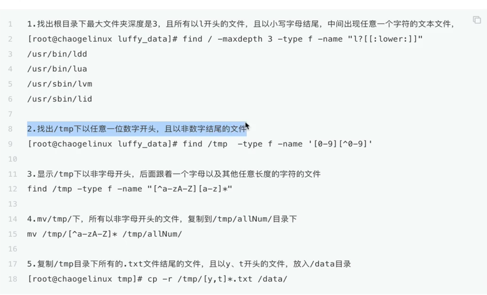
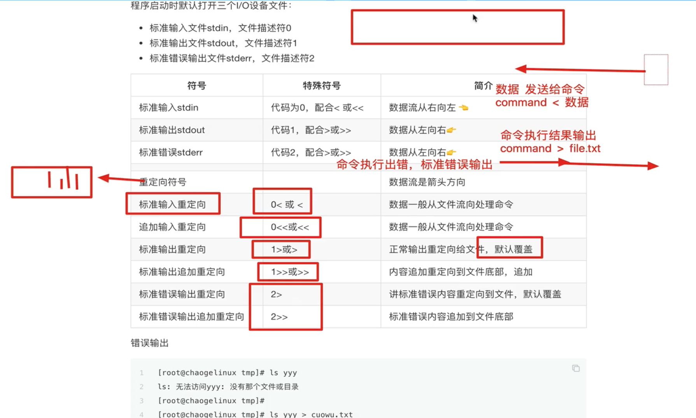
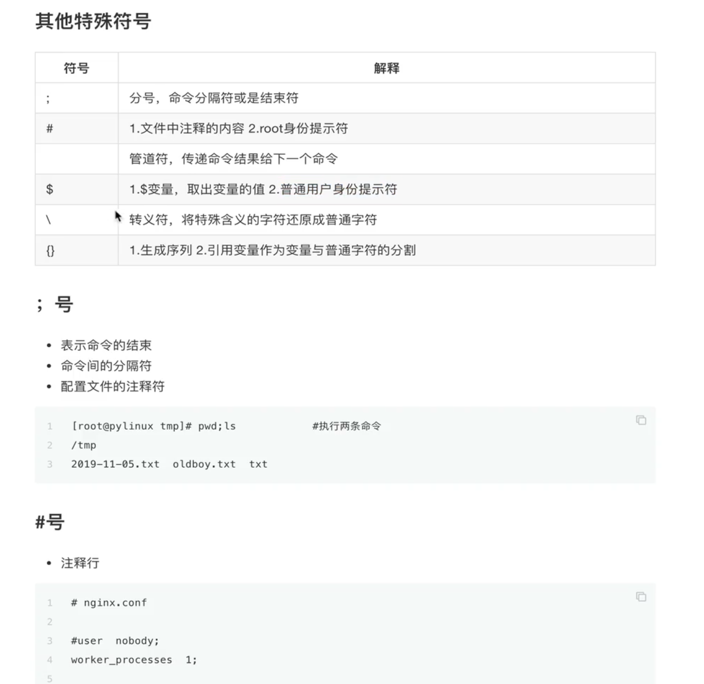

# 7.linux符号

## 7.1. 通配符

### 7.1.1.常见通配符

符号 | 作用
-- | --
* | 匹配任意 0 个， 或多个字符， 字符串
? | 匹配任意 1 个， 有且只有一个字符
符号集合 | 匹配一堆字符或文本
[acdf] | 匹配 acdf 任意一个字符
[a-z] | 匹配 a - z 任意一个字符
[!abcd] | 不匹配 [] 任意一个字符, 也可以写成 [!a-d]
[^abcd] | 同上 ! 可以换乘 ^

### 7.1.2.特殊通配符

符号 | 作用
-- | --
[[:upper:]] | 所有大写字母
[[:lower:]] | 所有小写字母
[[:alpha:]] | 所有字母
[[:digit:]] | 所有数字
[[:alnum:]] | 所有字母和数字
[[:space:]] | 所有空白字符
[[:punct:]] | 所有标点符号

* 案例



## 7.2.重定向符号

### 7.2.1.输出重定向特殊符号

输入设备: 键盘输入数据； 文件数据导入

输出设备: 显示器，屏幕终端； 文件

### 7.2.2.数据流

程序的数据流

* 输入流： <--- 标准输入 (stdin) , 键盘
* 输出流： --> 标准输出 (stdout) , 显示器、终端
* 错误输出流： --> 错误输出 (stderr) 

## 7.2.3.重定向符号

在 linux 系统中， 一切设备都可以看作文件

而每打开一个文件， 就有一个代表该打开文件的文件描述符



* 输出重定向

```
echo '文件描述符是1，就是输出重定向' 1>zs.txt

echo '文件描述符是1，就是输出重定向' 1>>zs.txt
```

* 输入重定向

```
cat < zs.txt

mysql -uroot -p # 登录数据库
mysql -uroot -p < 数据库备份文件 # 数据库恢复导入
mysql -uroot -p < db.sql # 数据库恢复导入

wc -l < zs.txt
```

* 错误重定向

```
ls qqq 2> cuowu.txt

ls qqq 2>> cuowu.txt
```

* 特殊重定向

```
# 把命令正确或错误的结果， 都写入黑洞文件中
ls /tmp > /dev/null 2>&1
```

## 7.3.其他特殊符号


